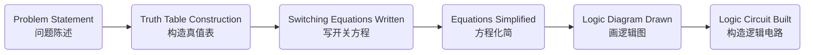

# Number System

### **1. Number System Conversion**

   - **N = A~n-1~ · r^n-1^ + A~n-2~ · r^n-2^ + ... + A~1~ · r + A~0~ · r^0^ + ... + A~-m~ · r^-m*^**

   ​		n -> Most Significant Bit (MSB)

   ​		m -> Least Sinificant Bit (LSB)

​			r -> radix

- Binary (r = 2)	

  Octal (r = 8)

  Decimal (r = 10)

  Hexadecimal (r = 16)

- Decimal to Binary Conversion

  > **E.g.** Convert 119(10) to binary
  >
  > 
  >
  >  **Solution:** 1110111(2)
  >
  > 
  >
  > **E.g.** Convert 0.75(10) to binary
  >
  > 
  >
  > **Solution** 0.110(2)

- Hexadecimal And Octal to Binary Conversion

  > **E.g.** 3 A (16)= 0011 1010 (2)
  >
  > **E.g.** 2 7 (8) = 010 111 (2)


### 2. Binary Codes

- Signed Number Binary 

  |      Decimal       |  3   |  2   |  1   |  0   |  -1  |  -2  |  -3  |
  | :----------------: | :--: | :--: | :--: | :--: | :--: | :--: | :--: |
  | **Sign magnitude** | 0011 | 0010 | 0001 | 0000 | 1001 | 1010 | 1011 |
  | **2s complement**  | 0011 | 0010 | 0001 | 0000 | 1111 | 1110 | 1101 |
  | **1s complement**  | 0011 | 0010 | 0001 | 0000 | 1110 | 1101 | 1100 |

  MSB为符号位；			

  原码->反码(1s):除符号位外全部取反； 		

  反码->补码(2s):反码+1

- Gray code

  |  Decimal  |  0   |  1   |  2   |  3   |  4   |  5   |  6   |  7   |  8   |  9   |  10  |  11  |  12  |  13  |  14  |  15  |
  | :-------: | :--: | :--: | :--: | :--: | :--: | :--: | :--: | :--: | :--: | :--: | :--: | :--: | :--: | :--: | :--: | :--: |
  | **3-bit** | 000  | 001  | 011  | 010  | 110  | 111  | 101  | 100  |      |      |      |      |      |      |      |      |
  | **4-bit** | 0000 | 0001 | 0011 | 0010 | 0110 | 0111 | 0101 | 0100 | 1100 | 1101 | 1111 | 1110 | 1010 | 1011 | 1001 | 1000 |

  **二进制码→格雷码（编码）**：

  此方法从对应的n位二进制码字中直接得到n位格雷码码字，步骤如下：

  1. 对n位二进制的码字，从右到左，以0到n-1编号
  2. 如果二进制码字的第i位和i+1位相同，则对应的格雷码的第i位为0，否则为1（当i+1=n时，二进制码字的第n位被认为是0，即第n-1位不变）

- Parity Method

  - The parity method is a method of error detection for simple transmission errors involving one bit (or an odd number of bits). 

  - A parity bit is an “extra” bit attached to a group of bits to force the number of 1’s to be either even (even parity偶校验) or odd (odd parity奇校验).

    > Example: The ASCII character for “a” is 1100001 and for “A” is 1000001. What is the correct bit to append to make both of these have odd parity?
    >
    > The ASCII “a” has an odd number of bits that are equal to 1; therefore the parity bit is 0. The ASCII “A” has an even number of bits that are equal to 1; therefore the parity bit is 1. 


# Boolean Switching Algebra

### 1. Logic Gates

- Tree Pirmitive Logic Gates: AND、OR、NOT

  - AND

    

  - OR

    

    

  - NOT

    

    

- Derived Logic Gates: NAND 、NOR、EX-OR、EX-NOR

  - XOR:	s= x ⊕ y 

    **S = $\overline{\text{X}}$ Y + X $\overline{\text{Y}}$**

    

  - NXOR: s = (x ⊕ y )'

    **S = X Y +  $\overline{\text{XY}}$**


### 2. Switching Algebra Theorems

- Idempotency Property (幂等性):  $ X+X=X $  	 $ X·X=X$
- Absorption Property(吸收):   $X+X·Y=X$        $X·(X+Y)=X$		$X+\overline{X}·Y=X+Y 		$		$X·(\overline{X}+Y)=X·Y$
- De Morgan Properties(反演，狄·摩根):   $\overline{X+Y} = \overline{X} · \overline{Y}$ 		$\overline{X·Y} = \overline{X} + \overline{Y}$
- Adjacency Properties: $X·Y + X · \overline{Y} = X$ 		$(X+Y) ·(X+\overline{Y})=X$ 


### 3. Karnaugh Maps


- Simplification using K-map2、3、4 varibles

  卡诺图化简逻辑函数的基本原理，是依据关系式$A·B+A·\overline{B}=A$，即两个“与”项中，如果只有一个变量相反，其余变量均相同，则这两个“与”项可以合并成一项，消去其中互反的变量。

- 画卡诺圈所遵循的规则：

  - 必须包含所有的最小项；

  - 按照“从小到大”顺序，先圈孤立的“1”．再圈只能两个组合的，再圈四个组合的……

  - 圈的圈数要尽可能少(乘积项总数要少)；

  - 圈要尽可能大(乘积项中含的因子最少)。

> 
>
> 


# Combinational Circuit Design

### 1. Analysis of Combinational Logic

- Deriving Switching Equations
- Simplifying the switching equations
- Giving truth table
- Logic function conclussion

> 
>
> **Swtiching Equations: **
>
> $P_{1}=\overline{A·B·C}$ 
>
> $P_{2}=A·P_{1}$
>
> $P_{3}=B·P_{1}$
>
> $P_{4}=C·P_{1}$
>
> $F=\overline{P_{2}+P_{3}+P_{4}}=\overline{(A+B+C)·\overline{A·B·C}}$
>
> **Equations Simplified:**
>
> $F = \overline{A}·\overline{B}·\overline{C} + A·B·C$
>
> **Truth Table:**
>
> |  A   |  B   |  C   |  F   |
> | :--: | :--: | :--: | :--: |
> |  0   |  0   |  0   |  1   |
> | ...  | ...  | ...  |  0   |
> |  1   |  1   |  1   |  1   |
>
> **Logic Function:**
>
> agreement circuit


### 2.Combinational Circuit Design




### 3. Full Adder

- Combinational circuit that performs the additions of 3 bits (two bits and a carry-in bit) 

  

- A full adder can also be realized with two half adders and an OR gate

  


### 4. Binary Comparators

- Two-bit comparator

  >**True Table:**
  >
  >| A    | B    | F~A>B~ | F~A<B~ | F~A=B~ |
  >| ---- | ---- | ------ | ------ | ------ |
  >| 0    | 0    | 0      | 0      | 1      |
  >| 0    | 1    | 0      | 1      | 0      |
  >| 1    | 0    | 1      | 0      | 0      |
  >| 1    | 1    | 0      | 0      | 1      |
  >
  >$F_{A>B}=A·\overline{B}=A·\overline{AB}$
  >
  >$F_{A<B}=\overline{A}·B=B·\overline{AB}$
  >
  >$F_{A=B}=\overline{A}·\overline{B}+A·B=\overline{B·\overline{AB}+A·\overline{AB}}$
  >
  >

- Multiple-bit comparators

  

  

### 5. Decoders

- 2 to 4 Decoders

  

- 3 to 8 Decoders

  

- Implementing Boolean functions using decoders

  > Use the decoder (74LS138) to implement the function
  >
  > Y~1~=A’B’+AC+A’C’
  >
  > Y~2~=A’C+AC’
  >
  > Y~3~=B’C+BC’
  >
  > 
  >
  > Y1= A’B’+AC+A’C’ = m0+m1+m2+m5+m7 = ∑(0,1,2,5,7) = ∏(3,4,6) = m3’m4’m6’
  >
  > Y2= A’C+AC’ = m1+m3+m4+m6 = ∑(1,3,4,6) = ∏(0,2,5,7) = m0’m2’m5’m7’ 
  >
  > Y3= B’C+BC’ = m1+m2+m5+m6 = ∑(1,2,5,6) = ∏(0,3,4,7) = m0’m3’m4’m7’
  >
  > 


### 6. Endcoders

- MUX -> Multiplexers

- 8 to 1 MUX

  Y = C’B’A’D~0~ + C’B’AD~1~ + C’BA’D~2~ + C’BAD~3~ + CB’A’D~4~ + CB’AD~5~+ CBA’D~6~+ CBAD~7~ = $\sum^{2^{n}-1}_{i=0}$m~i~D~i~

  

- Implementing Boolean functions with Multiplexers

  > **Realize the Boolean function F=f(x,y,z)=∑(1,2,4,5,7)**
  >
  > - **Using 8 to 1 MUX**
  >
  >   
  >
  >   D~0~ = D~3~ = D~6~ = 0
  >
  >   D~1~ = D~2~ = D~4~ = D~5~ = D~7~ = 1
  >
  >   C = x, B = y, A = z
  >
  > - **Using 4 to 1 MUX**
  >
  >   
  >
  >   若A = Y, B = X, 则F = X’Y’D~0~ + X’YD~1~ + XY’D~2~ + XYD~3~
  >
  >   
  >
  >   其中，根据卡诺图可得，D~0~ = Z, D~1~ = Z', D~2~ = 1, D~3~ = Z

  


# Sequential Logic

### 1. Flip-Flops(FF)

- Type of FF:
  - SR
  - D
  - JK
- Type of Triggering
  - Untriggered (asynchronous 异步)
  - Level-triggered (C = 1)
  - Edge-triggered (rising or falling edge of C)

- SR latch

  - Characteristic Equation: Q^n+1^ = S + R' · Q^n^    &&     S·R = 0

  - True Table:

    

- D latch

  - Characteristic Equation: Q^n+1^ = D

  - True Table:

    

- JK latch

  - Characteristic Equation: Q^n+1^=JQ^n^’+K’Q^n^

  - True Table:

    


### 2. State Diagram

- Mealy model

  

  When at state s1 and apply input I, we get output O and proceed to state s2.

  

- Moore model

  

  When at state s1 with outputO1 and apply input I, we proceed to state s2 with Output O2.

  


### 3. Synchronous Sequential Circuit Analysis

- 1.Determine the system variables: input, state, and output

- 2.Determine  the flip-flop type. Write the characteristic equations

- 3.write the excitation equations

- 4.write the next state equations

- 5.Write the output variable equations

- 6.Construct a transition table

- 7.Assign symbols to the states and construct a table or state diagram

- 8.When possible, construct a timing diagram

- 9.Functionality analysis)

  > 
  >
  > **Analysis the following synchronous sequential circuit, suppose the present state is 00, the input sequence is 0000011111, give the timing diagram.**
  >
  > 
  >
  > - input = X
  >
  >   output = Z
  >
  >   state variables = Y~1~ and Y~2~
  >
  > - Y^n+1^ = JY^n^'+K'Y^n^
  >
  > - K~0~ = J~0~ = 1
  >
  >   K~1~ = J~1~ = X ⊕ Y~0~
  >
  > - Y~0~^n+1^ = Y~0~'
  >
  >   Y~1~^n+1^ = X’Y~1~’Y~0~ +X’Y~1~Y~0~’+XY~1~’Y~0~’+XY~1~Y~0~
  >
  > - Z = (XY~1~‘）’ = X' + Y~1~
  >
  > - 
  >
  >   Transition table:
  >
  >   
  >   
  > - - Q1 - 00
  >   - Q2 - 01
  >   - Q3 - 11
  >   - Q4 - 10
  >   
  >   
  >   
  > - 


### 4. Asynchronous Counters

- Three bit Asynchronous Counter

  

  

- Asynchronous Decade Counter(异步十进制计数器)

  This counter uses partial decoding to recycle the count sequence to zero after the 1001 state. 

  

  

- Quick design a asynchronous module-K counter: Counting from 0 to K

  1. Choose the type of flip-flops.
  2. Decide the number of flip-flops: 2^n-1^ < K ≤ 2^n^
  3. Let all the flip-flops recycle back to 0 after the K-1 state.


### 5. Synchronous Counters


- A 3-bit binary Synchronous Counters(三位同步计数器)

  

- A 4-bit Synchronous Binary Counter

  

- BCD Decade Counter

  

- Excitation Table and Equations

  

  > Example1: Use D-FFs to draw the logic diagram for sequence generator (counter) for: 0 -> 7 -> 6 -> 1 -> 0 (000 -> 111 -> 110 -> 001 -> 000)
  >
  > 
  >
  > 
  >
  > D~3~ = Q~3~' Q~1~' + Q~3~ Q~1~
  >
  > D~2~ = Q~3~' Q~1~' + Q~3~ Q~1~
  >
  > D~1~ = Q~1~'
  >
  > 
  >
  > 
  >
  > 
  >
  > 
  >
  > **Example2:Construct a Mealy state diagram that will detect a serial input sequence of 10110. The detection of the required bit pattern can occur in a longer data string and the correct pattern can overlap with another pattern. When the input pattern has been detected, cause an output z to be asserted high.**
  >
  > *For example, let the input string be*
  >
  > *x = 10110110110*
  >
  > *z = 00001001001*
  >
  > ```mermaid
  > graph LR;
  > A(A-Start) --1/0--> B(B-1)
  > A --0/0--> A
  > B --0/0--> C
  > B --1/0--> B
  > C(C-10) --1/0--> D(D-101)
  > C --0/0--> A
  > D --1/0--> E(E-1011)
  > D --0/0--> C
  > E --0/1--> C
  > E --0/0--> B
  > ```


### 6. Registers

- Serial-in/Serial-out Shift Register

  

- Shift Registers Counters

  - Johnson Register

    

  - Ring Register

    

