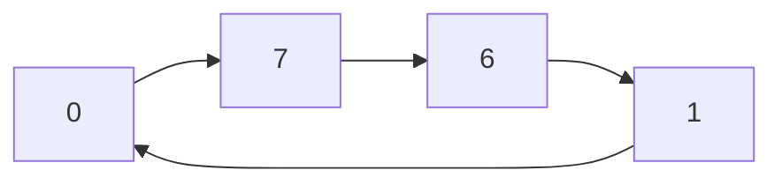

# 课程要求
平时成绩组成：
课后作业15 + 实验10 +考勤5
小测验20分

重点识记参考[[数字逻辑李辉重点]]

# 第一章 概念介绍

## 1.1 数字和模拟量
**连续(Continuous)和离散(Discrete)信号**

**模拟(Analog)和数字(Digital)信号**：
* 从模拟信号到数字信号的转换一定有误差
* **采样频率**指从连续的模拟信号中搜集离散信号的频率，每个采样点存储的bits数决定了存储信息的多少
* 数字信号转模拟信号**DAC**，模拟信号转数字信号**ADC**

> 理论上，一个模拟信号的周期通常采样两次，则保留信息频率为采样频率的$\frac{1}{2}$

## 1.2 二进制数字、逻辑电平和数字波形

表示数字0和1的电压是**逻辑电压(logic levels)**，高电压和低电压之间有**容限**。低电压可降低功耗，高电压则能增大容错率
![[Pasted image 20250226150428.png]]

**数字波形(digital waveforms)** 具有理论上和实际上的两种形状
![[Pasted image 20250226151239.png]]
![[Pasted image 20250226151252.png]]

> 单位大小：$k = 10^3$，$M = 10^6$，$G=10^9$(在频率和周期中，不同于内存单位)

**占空比(duty cycle**)：
$$
\text{Duty cycle} = \frac{t_w}{T} 100\%
$$
其中 $t_w$ 表示**脉冲宽度(pulse width)**，$T$ 表示**周期 (period)**

数字系统中的所有波形都与**时钟(clock)** 同步，时钟的每个周期表示*传输1bit*的时间。显示多个波形实际变化情况的图是**时序图(timing diagrams)**

## 1.3 基本逻辑功能

**逻辑门(logit gate)** 拥有一或两个输入和一个输出，基础的门分为：
* **非门(NOT)**：输出与输入相反
* **与门(AND)**：只要有0则输出0，否则输出1
* **或门(OR)**：只要有1就输出1，否则输出0
![[Pasted image 20250226155032.png]]

## 1.4 组合和顺序逻辑功能
逻辑门的组合可以实现：
1. **比较器(comparator)**，比较数字大小
2. **加法器(adder)**，实现加法；加法实现后同理实现其他四则运算
3. **编码器(code conversion function)** 和 **解码器(encoding function)**，实现信号和二进制数的转换
4. **计数器(counting function)**，对信号计数
5. **多路复用器(multiplexing)** 和 **解多路复用器(demultiplexing)**，将多路信号转换到一路信号和一路信号转换到多路信号
6. **存储器(Storage function)**，存储数据
7. **进程控制系统(process control system)**，对各种进程进行控制

# 第二章 数字系统，操作符和编码

## 2.1-2.3 十进制与二进制

重要概念：
* 十进制数和二进制数的**基数(base)** 分别是10和2
* 最右边和最左边的位分别叫**最低有效位(least significant bit, LSB)** 和 **最高有效位(most significant bit, MSB)**
* **八进制(Octal)**，**十六进制(Hexadecimal)** 和 **十进制(decimal)**

> 十进制转八进制、十六进制前再转换为二进制，二进制再转其他，按位数转。
> 补位时，要从远离小数点的地方补齐，不能改变原来的大小
### 二进制转十进制
按照基数+指数的方法直接转换
$$
\begin{aligned}
110_{(2)} &= 1 * 2^2 + 1* 2^1 + 0 * 2^0 \\
&= 4 + 2 \\
&= 6_{(10)}
\end{aligned}
$$
### 十进制转二进制
**整数部分**
减法：
1. 找到距离原十进制数最近的$2^x$数，减去
2. 对于剩余的被减数，重复此操作
3. 将得到的$2^x$数的指数位置摘出为1，其他为0
$$
\begin{aligned}
49_{(10)} &= 32 + 16 + 1 \\
&= 2^5 + 2^4 + 2^0 \\
&= 110001_{(2)}
\end{aligned}
$$
除二取余法：
1. 原数除以2取出余数放边上
2. 连续进行此操作，直到原数变为0
3. 将余数倒置
![[Pasted image 20250305141830.png]]
**小数部分**
乘二取整法：
1. 小数部分每次乘以2，留下整数
2. 重复此操作，直到小数点后面为0，或者*达到需求精度*
> 有可能无限循环，因为十进制转二进制留下误差

![[Pasted image 20250305142308.png]]

## 2.4-2.6 二进制运算，补码和符号数

重要概念
* **原码 (original code)** 符号位+二进制位
* **补数(complement)** 设一个 $r$ 进制的数 $N_{r}$，则它们补数 $[N_r] = r^n - N_r$，其中 $n$ 表示位数

设一个无符号数$N$，则它的：
1. 有符号正数$+N$，即在原来的数前加一个0，反码与之相同
2. 有符号负数$-N$，即在$+N$取补码(各位取反再加一)
> 我们用的有符号数为一个符号位加上数值，因此求反码必须转换为有符号数再做

注意：
1. “补码等于反码加一”仅针对负数
2. 负数的反码是正符号数的各位取反(包括符号位也取反，符号位本身是0)
3. **反码 (1's complement)** 与原码相同仅针对二进制正数
4. 补码与原码相同针对二进制正数，十进制正数补码和原码不同
5. 求补数和求补码不同。二进制正数的**补码(2's complement)** 和**补数(complement)** 不同，前者同原码，后者各位取反加一。补数的概念是基于数的"模"的
## 求反码的算法
负数的反码等于正数各位取反(正数是符号位为0+数值)

### 求补码的算法

定义法：
$$
[N_r] = r^n - N_r
$$
LSB-MSB算法：
1. 从LSB往MSB，若遇到0，则复制，直到遇到非0
2. 对第一个非0数，用$r$减去它，$r$表示进制
3. 后续的数，用$r-1$减去
减法：
1. 对于每一位的数，用$r-1$减去之
2. 对结果，加一
> 正数的补码和原码同样

特别地，求二进制数的补码：
1. 找到对应有符号正数
2. 包括符号位的所有位取反
3. 加一
> 流程完成后，使用两个数相加确定计算正确

## 2.7-2.9 有符号数的计算和其他进制

有符号数的加法，本质上是补码的加法和符号位的**溢出 (overflow)**。符号位的溢出可能出错，即超过有符号数位数的表示范围
二进制数的减法为加法与负数
> 计算时，先把位次对齐 (补零) 后再计算；其中正数直接补零，负数找补码时，先找对应正数补零，再求补码

二进制数的除法可用乘法优化：
* 对 $2$ 的整数幂，用移位的方法
* 对非 $2$ 的整数幂，改为乘以小数
* 对非常量 (如 `X / Y`)，对 `Y` 构造乘法表。需要一个较小范围的 `Y`

> 探测两个正数相加或两个负数相加的溢出，可检测符号位是否改变

## 2.10 二进制编码

^3deab2

**二进制表示的十进制码 (binary coded decimal, BCD)**，即对每一位的数字都用二进制表示，例如：
$$
11_{(10)} = 1011_{(2)} = 0001,0001_{(BCD)}
$$
这体现了二进制数和二进制编码的差异，常用于时钟显示等
> BCD 码分为**8421 BCD**和**84-2-1 BCD**等，表示 4 位二进制的表示的权重，即各位和

BCD 码的运算参见 [[2025年5月6日]], 重点是加六修正 (0110)，高位补零

**Gray码(Gray code)** 的特点:
1. 相邻位差异最小：Gray码中任意两个连续的数值仅有一位二进制位不同。例如，十进制的 `1` 和 `2` 在Gray码中分别表示为 `0001` 和 `0011`，只有第二位不同
2. 循环性：Gray码是一个循环码，即最后一个码字与第一个码字之间也只有一位不同。例如，对于3位Gray码，`000` 和 `100` 之间只有一位不同
3. 非权码：Gray码是一种无权码，每一位的值没有固定的权重，不像普通二进制码那样可以直接转换为十进制数

**奇偶校验 (parity method)** 用于信号传输过程中的检误。奇校验即保证传输数据的'1'的个数为奇数个，偶校验类似
> 奇偶校验只能检查一位错误；CRC 校验可以检测多位的错误

# 第三章门电路
## 3.1 非门
![[Pasted image 20250312155605.png]]
**非门(the Inverter/ NOT gate)** 将输入电平转换为相反的电平

下面是非门的**真值表 (truth table)**

| 输入 (A) | 输出 (NOT A) |
| ------ | ---------- |
| 0 | 1 |
| 1 | 0 |
## 3.2 与门
![[Pasted image 20250312155724.png]]
**与门 (AND gate)** 在输入中有 0 时输出 0，否则输出 1；把某些位设置为 0，只需要与一个这些对应位为 0，其余为 1 的数：
$$
1001 \& 1100 = 1000
$$
> 在 ASCII 码中，大写字母和小写字母仅有一位区别，可用与运算转换

| 输入 A | 输入 B | 输出 (A AND B) |
| ---- | ---- | ------------ |
| 0 | 0 | 0 |
| 0 | 1 | 0 |
| 1 | 0 | 0 |
| 1 | 1 | 1 |
在求波形图逻辑运算时，只要找到对应高电平留下，其余设置为低电平即可

逻辑与和二进制乘法按位运算的结果相同，记为 $X = AB$

## 3.3 或门
![[Pasted image 20250312161033.png]]
**或门 (OR gate)** 在输入中有 1 时输出 1，否则输出 0，记为 $X = A+B$

| 输入 A | 输入 B | 输出 (A OR B) |
| ---- | ---- | ----------- |
| 0 | 0 | 0 |
| 0 | 1 | 1 |
| 1 | 0 | 1 |
| 1 | 1 | 1 |

## 3.4-3.5 与非门和或非门
与或非门称为**基本门 (basic gate)**，用它们构成的与非和或非门是**通用门 (universal gate)**

与门后接非门为**与非门(NAND)**，表现为同高才低，否则为高。逻辑运算为 $X = \overline{AB}$，真值表：

| 输入A | 输入B | 输出（A NAND B） |
| --- | --- | ------------ |
| 0 | 0 | 1 |
| 0 | 1 | 1 |
| 1 | 0 | 1 |
| 1 | 1 | 0 |
**问题：** 用 NAND 构建 NOT
**解决：** 将 NAND 的一端接入高电平，则另一端输入时，最终输出相反

**问题：** 用 NAND 构建 OR
**解决：** 将两个输入端取反即得

实际上，NAND 和输入取非再取或的门 (Negative-OR) 等价，即摩根定律：
$$
\overline{AB} = \overline{A} + \overline{B}
$$
![[Pasted image 20250319145220.png]]

或门后接非门为**或非门 (NOR)**，表现为有高则低，否则为高，逻辑运算 $X = \overline{A+B}$，真值表：

| 输入A | 输入B | 输出（A NOR B） |
| --- | --- | ----------- |
| 0 | 0 | 1 |
| 0 | 1 | 0 |
| 1 | 0 | 0 |
| 1 | 1 | 0 |

**问题：** 用 NOR 构建 NOT
**解决：** 将 NOR 的一端接入低电平，则另一端输入时，输出为反

**问题：** 用 NOR 构建 AND
**解决**：输入端取反，原理即摩根定律

## 3.6 异或门和同或门
**异或门 (exclusive-OR gate, XOR)** 在两个输入不同时输出为 1，相同时输出为 0
![[Pasted image 20250319152322.png]]
异或的真值表为：

| 输入A | 输入B | 输出（A XOR B） |
| --- | --- | ----------- |
| 0 | 0 | 0 |
| 0 | 1 | 1 |
| 1 | 0 | 1 |
| 1 | 1 | 0 |

表达式为：
$$
X = A \oplus B =\overline A B + A \overline B
$$
异或门的特性：
* 只有一个输入反向，输出反向
* 两个输入反向，输出不变

在异或门后加上非门得到**同或门(XNOR)**，真值表为：

| 输入A | 输入B | 输出（A XNOR B） |
| --- | --- | ------------ |
| 0 | 0 | 1 |
| 0 | 1 | 0 |
| 1 | 0 | 0 |
| 1 | 1 | 1 |
表达式为：
$$
X = A \odot B = \overline A \overline B + A B
$$

# 第四章 布尔运算与逻辑简化
## 4.1-4.2 布尔运算的算符和表达式和规则
在布尔运算中，'+'表示**或(boolean addtion)** 运算，'\*'表示**与(boolean multiplication)** 运算
> 和式为 0，表示参数全为 0；乘式为 1，表示参数全为 1

布尔运算满足**交换律**：
$$
\begin{aligned}
&A + B = B + A \\
&AB = BA
\end{aligned}
$$
布尔运算满足**结合律**：
$$
\begin{align*}
&A + (B + C) = (A + B) + C \\
&A(BC) = (AB)C
\end{align*}
$$
布尔运算满足**分配率**：
$$
AB + AC = A(B + C)
$$

一些指的注意的运算规律：
* **补码律** $A+\overline A = 1, A \overline A = 0$
* **幂等律** $A+A=A$，$AA=A$
* **吸收律** $A + AX = A$，$A + \overline A X = A + X$
* 吸收律推广 $(A+B)(A+C) = A + BC$, $A(A+X)=A$
证明方法可以使用韦恩图或者真值表

吸收率的推广在化标准 POS 表达式时特别有用，即：
$$
(X + \overline A)(X +A) = X
$$
举例来说：
$$
\overline A + B = (\overline A + B)(C +\overline C) = (\overline A + B + C)(\overline A + B + \overline C)
$$
## 4.3 摩根定律

**摩根定律 (DeMorgan's Theorems)** 就是脱帽法，有以下两条：
$$
\begin{align*}
&\overline{XY} = \overline{X} + \overline{Y} \\
& \overline{X + Y} = \overline{X} \cdot \overline{Y}
\end{align*}
$$
摩根定律可以扩展到多个相乘或相加

常用摩根定律化简表达式，例如：
$$
\overline{(A+B+C)D} = \overline{A+B+C} + \overline{D} = \overline{A}
\cdot \overline{B} \cdot \overline{C} + \overline{D}
$$
此外，可用摩根定律化简式子后求一个电路的真值表

**注意**：双重否定律和摩根定律不能混淆：
* 摩根定律
$$
\overline{\overline A B} = A + \overline B
$$
* 双重否定律
$$
\overline{\overline{AB}} = AB
$$

## 4.4-4.5 用布尔表达式分析逻辑电路和表达式化简

用布尔表达式分析逻辑电路，可以方便的画出电路的真值表，步骤：
1. 找到电路的布尔表达式
2. 化简表达式，使用运算规律或者摩根定律
3. 在表达式中，找到输出值为 1 的情况
4. 其余情况输出为 0
需要注意的是，可用幂等性添项来消去其他项，即 $A = A+A=AA$

注意 $A\overline B + \overline A B$ 就是异或的表达式，$AB + \overline A \overline B$ 就是同或的表达式，二者互相取反可以得到
## 4.6 标准布尔表达式

标准表达式有两种形式**和的乘积 (product-of-sums, POS)** 或者 **乘积的和 (sum-of-products, SOP)**，并且要求所有的字母都要出现在标准表达式中

将一个普通表达式转换为标准表达式，可以通过添加项的方法实现，例如：
$$
A\overline{B}C=A\overline{B}C(D+\overline{D})=A\overline{B}CD+A\overline{B}C\overline{D}
$$
其中 $(X+\overline X)$ 是 1 因子，可添加到乘积项中
> SOP 和标准 SOP (standstard SOP) 不是一回事！后者需要包含所有的字母

## 4.7 布尔表达式和真值表
对于任意真值表，都可写出其 POS 和 SOP 表达式，且该两种表达式等价

**问题**：已知真值表，如何获得真值表的标准布尔表示？
**方法**：
1. 求 SOP 表达式，则先找输出等于 0 的组合。要使输出为 0，且表示为乘积的和，则各项乘积都为 0
2. 求 POS 表达式，则先找输出等于 1 的组合。要使输出为 1，且表示为和的乘积，则各项乘积都为 1

**问题**：已知标准布尔表达式，如何获得真值表？
**方法**：
1. 已知 SOP，则对和式的每一个因子，若该因子为 1，找到对应的字母数值，则真值表输出为 1；其余组合必为 0
2. 已知 POS，则对积式的每一个因子，若该因子为 0，找到对应的字母数值，则真值表输出为 0,；其余组合必为 1

在 SOP 中，每项称为**最小项(minterm)**，当最小项值为 1 时，SOP 整体输出为 1。用二进制表示最小项实现，则该二进制对应的十进制数 $i$ 作为下标，即 $m_{i}$ 表示最小项，该 SOP 可用最小项的和改写，例如： ^f3f5bf
$$
A \overline B C + \overline A B C \to 101 + 011 = m_5 + m_3
$$
在 POS 中，每项称为**最大项 (maxterm)**，当最大项为 0 时，POS 整体输出为 0,。用二进制表示最大项实现， 则该二进制对应的十进制数 $i$ 为下标，即 $M_i$ 表示最大项，该 POS 可用最大项的积改写，例如：
$$
(\overline A + B + C) (\overline A + \overline B + C) \to
100 \cdot 110 = M_4 \cdot M_6
$$
> 最小项要等于 1，最大项要等于 0

标准 SOP 和 POS 的最小项和最大项的和就是集合 ${0, 1, 2, 3, \dots, 2^n-1}$
## 4.8 卡洛图
**卡洛图 (the Karnaugh Map)** 是布尔表达式的图形表示，看起来是一个二维的图像，每个方格满足空间上和逻辑上相邻

三个变量的卡洛图：
![[Pasted image 20250402142845.png]]
读数时，按照 $A, B, C$ 的字母顺序。注意 $AB$ 的第三个格子是 11，这是为了满足两种相邻
> 卡洛图的每一行末尾与下一行的行头满足两种相邻

四个变量卡洛图：
![[Pasted image 20250402143046.png]]

将 SOP 映射到卡洛图，只需要将每一项为 1 的填入对应格子：
![[Pasted image 20250402143508.png]]
非标准形式首先需要转换为标准形式

使用卡洛图，可以化简布尔表达式。对于一个布尔表达式，我们首先填充它的卡洛图，然后根据 $2^n$ 个数相邻的 1，进行画圈，接着在被圈的范围内，对照行列中被修改的变量并消去，留下剩下的变量 (注意若该变量是 0 要取反)，最后相加
> 本节建议参考 [CSDN](https://blog.csdn.net/LI_XIAO_XING/article/details/120283287)

部分概念：
* **蕴含项(implicant)**，即卡诺图中的 1
* **质蕴含项 (prime implicant, PI)**，即卡诺图中可以圈出来的 1 的组合
* **必要质蕴涵项 (essential prime implicant, EPI)**，即卡诺图中可以圈出来 1 的组合，且该组合中至少有一个项不会被其他的 PI 圈到
化简表达式，本质上是找 EPI 的和

化简 POS 时，在卡诺图中画 0，再把变化变量消掉，剩下变量相加保证为 0 (不是 0 的需要控制取反)

含"Don't Care"项的卡诺图化简，即将不可能输入或不关心输出的项写作'X'，'X'可以随意指定值，故指定为 1 与已经存在的正常 1 进行化简
> 'Don't care'项是人为规定的；任意指定的 1 必须要至少带上一个正常 1 才能化简

关于卡诺图的应用，参见 [[2025年4月9日]]

# 第五章 组合逻辑电路

## 5.1-5.2 基本逻辑组合电路及使用

要掌握逻辑电路的组合使用，首先需要熟悉各种逻辑门的符号。参见第三章

逻辑电路的化简参见第四章

有如下替换：
1. 与非门 NAND 等价于 输入端取非的或门
2. 或非门 NOR 等价于 输入端取非的与门

因此，对于一个组合电路的电路图， 我们可以尽可能让*取非*的操作抵消

## 5.3-5.4 与非门与或非门的通用性及使用

**与非门(NAND)** 可以实现与门、或门和非门，甚至或非门的逻辑：
* 两个输入都是自身的与非门就是**非门**
* 在非门实现基础上，与非门的输入取非就是**与门**
* 在非门和与门实现基础上，先对两个输入 $A, B$ 取非，再与非就是**或门**
* 在前面三类门实现的基础上，对或门取非就是**或非门**
写成逻辑表达式如下：

| 原逻辑门 | 用与非门实现的逻辑表达式 |
| --------- | ----------------------------------------------------------------------- |
| 与门（AND） | $\overline{A \cdot A}$ |
| 或门（OR） | $\overline{A \cdot \overline{B}}$ |
| 非门（NOT） | $\overline{A \cdot \overline{A}}$（$A$为输入变量） |
| 异或门（XOR） | $\overline{A \cdot \overline{B}} \cdot \overline{\overline{A} \cdot B}$ |
| 同或门（XNOR） | $\overline{A \cdot B} \cdot \overline{\overline{A} \cdot \overline{B}}$ |
![[Pasted image 20250430105512.png]]

**或非门(NOR)** 可以实现与门、或门和非门，甚至与非门的逻辑：
* 两个输入都是自身的或非门就是**非门**
* 在非门实现基础上，或非门的输入取非就是**或门**
* 在非门和或门实现基础上，先对两个输入 $A, B$ 取非，再或非就是**或门**
* 在前面三类门实现的基础上，对与门取非就是**与非门**
写成逻辑表达式如下：

| 原逻辑门 | 用或非门实现的逻辑表达式 |
| ---------- | ------------------------------------------------ |
| 非门 (NOT) | $\overline{A + A}$ (其中 A 为输入变量) |
| 与门 (AND) | $\overline{A + B}$ |
| 或门 (OR) | $\overline{A + B}$ |
| 异或门 (XOR) | $\overline{A + A + B} + B + \overline{A + B}$ |
| 同或门 (XNOR) | $\overline{A + B} + \overline{A} + \overline{B}$ |
![[Pasted image 20250430105837.png]]

本质上看：
* 将与非门表达为其他门，就是将逻辑表达式化为只有与和非操作的式子
* 将或非门表达为其他门，就是将逻辑表达式化为只有或和非操作的式子

# 第六章 组合逻辑的功能

## 6.1-6.2 半加器和全加器与并行加法器

### 半加器
考虑 $1$ bit 加法：

|A|B|S（和）|Cout​（进位）|
|:-:|:-:|:-:|:-:|
|0|0|0|0|
|0|1|1|0|
|1|0|1|0|
|1|1|0|1|
注意到：
$$
\begin{align*}
& C = AB \\
& S = \overline AB + A \overline B = A \oplus B
\end{align*}
$$
据此，我们可以设计**半加器 (Half Adders)**。其中，$\Sigma$ 表示当前位求和表示，$C_{out}$ 表示进位表示
![[Pasted image 20250423151327.png]]
### 全加器

如果考虑了前一位的进位输入，我们有

| A | B | $C_{in}$ | S（和） | $C_{out}$（进位） |
| :-: | :-: | :------: | :--: | :-----------: |
| 0 | 0 | 0 | 0 | 0 |
| 0 | 0 | 1 | 1 | 0 |
| 0 | 1 | 0 | 1 | 0 |
| 0 | 1 | 1 | 0 | 1 |
| 1 | 0 | 0 | 1 | 0 |
| 1 | 0 | 1 | 0 | 1 |
| 1 | 1 | 0 | 0 | 1 |
| 1 | 1 | 1 | 1 | 1 |
注意到：
$$
\begin{align*}
&S = A \oplus B \oplus C_{in} \\
&C_{out} = AB +BC_{in} + AC_{in} = AB + (A \oplus B) C_{in}
\end{align*}
$$
在这里进位被分解为：
* 当 $A=B=1$ 时，必然进位
* 当 $C=1$，且 $A, B$ 中有 1 时，必然进位
记 $G = AB$，$P = A \oplus B$，则进位写成：
$$
C_{out} = G + P C_{in}
$$
> $C_{out}$ 的 PG 分解为超前进位加法器奠定了理论基础

据此，我们可以设计**全加器**：
![[Pasted image 20250423151456.png]]
## 6.3 行波进位加法器与超前进位加法器
![[Pasted image 20250423151121.png]]
将多个全加器串在一起即得**行波进位加法器 (Parallel Binary Adders)**。由于串联导致的门电路时间延迟导致这种加法器的延迟会累积得比较大

考虑之前分解过的：
$$
\begin{align*}
C_{out} &= AB + (A \oplus B) C_{in} \\
&= G + PC_{in}
\end{align*}
$$
如果我们提前算出 $G$ 和 $P$，它们仅取决于输入的 $A_i, B_i$，则代入：
$$
C_{i+1} = G_i + P_i(G_{i-1} + P_{i-1} (\dots))
$$
可以不依赖于前面的结果，直接算出每个地方的进位，这就得到**超前进位加法器 (Look-Ahead Carry Adders)**，可以发现这个加法器越靠后的加法器用到的逻辑门越来越多

![[Pasted image 20250423154815.png]]

二进制的加法器可以转换为 BCD 加法器，容易发现：
* 当二进制数的值 $< 10$ 时，BCD 码与二进制码相同
* 当二进制数的值 $\geq 10$ 时，BCD 码等于二进制码 $+6$

## 6.4 比较器

对 1 bit 进行比较，我们有如下三种情况：
* $A=B$，记为 $E$
* $A>B$，记为 $G$
* $A<B$，记为 $L$

对于这三种情况，我们可以分别用三种逻辑门表示：
* $E = A \odot B$，当结果为 1 时表示相等，为 0 时表示无效 (相异)，也即是同或门的性质
* $G = A \overline B$，当结果为 1 时表示大于，为 0 时表示无效
* $L = \overline A B$，当结果为 1 时表示小于，为 0 时表示无效

这样我们就得到了一个能比较 1 bit数字的**比较器 (comparator)**。将多个这样的比较器相连，我们就得到能够比较多位的比较器。上一位的结果依次传递到下一位：
$$
\begin{cases}
 & G=G_{high}+E_{high}\cdot(A_0\overline{B_0}) \\
 & L=L_{high}+E_{high}\cdot(\overline{A_0}B_0) \\
 & E=E_{high}\cdot(A_0\odot B_0)
\end{cases}
$$
最终的 G、L、E 就表示所有位的比较结果

当比较所有位次，得到 $A>B$ 的结果时，$A>B$ 将要输出 $1$ 的信号，其他两个输出 $0$ 的信号。以此类推
![[Pasted image 20250614110036.png]]

## 6.5 解码器

检测其输入上是否存在指定的位（代码）组合，并通过指定的输出电平指示该代码的存在的逻辑电路是**解码器 (Decoders)**。例如，对于某个输入组合 $X = A_3 A_2 A_1 A_0$，若 $X=1$，则解码器对应位置需要报告此输入，其他位置不发生变化
> 输入有 $n$ 个，输出则有 $2^n$ 个

以**4 位解码器 (4-bit Decoder)** 为例，其输出有 $2^4=16$ 个，真值表需要达到以下的功能：
![[Pasted image 20250505212852.png]]

BCD 码 (8421 码) 与十进制数字之间需要相互转换，我们可以考虑设置构造一个**BCD 到十进制解码器 (BCD-to-Decimal Decoder)**，它的真值表如下：
![[Pasted image 20250505213106.png]]
此外，对于控制七根光管的 BCD 转换也可以通过先绘制真值表的形式得到具体的逻辑电路

以 3-8 解码器为例。为了利用 3-8 解码器获得指定逻辑表达式如 $F(A, B, C) = AB + A \overline B + B \overline C$ 的输出，我们首先需要控制 $F (A, B, C)$ 为最小项和即 $\sum m (2, 3, 5, 6)$ 类似的输出，然后找到对应的输出引脚，最后求和
> 关于最小项的概念，参见[[#^f3f5bf|最小项]]

![[Pasted image 20250621222202.png]]

## 6.6 编码器

**编码器(Encoders)** 是一种组合逻辑电路，本质上执行“反向”解码器功能。编码器在其一个输入上接受表示数字（例如十进制或八进制数字）的有效电平，并将其转换为编码输出（例如 BCD 或二进制）。还可以设计编码器来对各种符号和字母字符进行编码

编码器实际上就是功能反向的解码器，有 $2^n$ 个输入和 $n$ 个输出。对于不需要的输入，以电平有效为例，应置位为 1。例如若对 10 进制编码器输入 $1111 1011$，则表示输入数字为 2 (最高输入数字 8)

**优先编码器 (priority encoder)** 的特点是，只考虑对输入最高位的数字编码，而忽略低位的数字

需要注意的是，对于不同的编码器，其有效输入可能是高电平有效也有可能是低电平有效。对于低电平有效，对于输入为 0 的位才是有效位，其余无效
> 课本中的 74H147 编码器是低位有效

## 6.7 编码转换器

用于不同编码之间转换的逻辑电路是**编码器转换器 (code converters)**。需要了解 BCD 码转换二进制数字的规则，参考第 2 章 [[#^3deab2|BCD码]]

## 6.8 多路复用器

**多路复用器 (Multiplexers, MUX)** 是一种设备，它允许将来自多个来源的数字信息路由到一条线路上，以便通过该线路传输到公共目的地。多路复用器又称为**数据选择器 (Data Selectors)**

一个 4 输入多路复用器示意图如下：
![[Pasted image 20250506150306.png]]
观察它的结构：
1. `Data Select` 共有 2 bit 的输入，不同的输入组合控制不同的数据选择
2. `Data Inputs` 共有 4 bit 的输入，受到 `Data Select` 的控制
3. `Data Output` 输出 1 bit 的数据

可以写出，$Y$ 的输出公式：
$$
Y = D_0 \overline S_1 \overline S_0 + D_1 \overline S_1 S_0 + D_2 S_1 \overline S_0 + D_3 S_1 S_0
$$

### 6.8.1 用多路复用器实现逻辑表达式
多路复用器可以用于构造函数值输出。与解码器不同，3 bit 输入可以用 4-1 多路复用器实现

**问题**：用 4-1 多路复用器实现函数 $F(x, y, z) = \sum m(1, 2, 6, 7)$
**解决**：`Data Select` 端用于表示 $x, y$，4 个 `Data Inputs` 用于表示 $z$。则
* 对于 $xy = 00$，当 $D_0$ 为 0 时，输出 0，当 $D_0$ 为 1 时输出 1。这与 $z$ 相同，故 $D_0 = z$
* 对于 $xy=01$，当 $D_1$ 为 0 时，输出 1，当 $D_1$ 为 1 时输出 0。这与 $\overline z$ 相同，故 $D_1 = \overline z$
* 对于 $xy=10$，当 $D_2$ 为 0 或 1 时，输出都为 0，故 $D_2 = 0$
* 对于 $xy=11$，当 $D_3$ 为 0 或 1 时，输出都为 1，故 $D_3$ =1
> 对 $xy=10/11$，实际上用到了多路复用器的性质，即输出口总数输出 $D_i$ 的数字；这实际上是找 $z$ 关于 $xy$ 的函数

事实上，3 bit 输入可以用 2-1 多路复用器加上其他逻辑门实现

**问题**：用 2-1 多路复用器和其他逻辑门实现函数 $F(x, y, z) = \sum m(0, 1, 4, 7)$
**解决**：画出卡诺图

| z $\diagdown$ xy | 00 | 01 | 11 | 10 |
| ---------------- | --- | --- | --- | --- |
| 0 | 1 | 0 | 0 | 1 |
| 1 | 1 | 0 | 1 | 0 |
观察卡诺图。当 $z$ 为 0 时，选择 $D_0$ 的输入，则：
$$
D_0 = \overline x \overline y + x \overline y = \overline y
$$
当 $z$ 为 1 时，选择 $D_1$ 的输入，则：
$$
D_1 = \overline x \overline y + xy
$$
根据表达式选择合适的逻辑门即可

### 6.8.2 用多路复用器实现通用门

对于拥有 $m$ 个输入变量的逻辑表达式 $F(a, b, \dots, m)$，可用 $2^m$ 选 1 多路复用器 (MUX) 来实现其表达式：
1. 把所有输入变量作为 MUX**选择信号**
2. 对于一种选择组合，找到对应的输入区，设定其输入信号

**问题**：用 2-1 MUX 实现 `AND` 和 `OR` 和 `NOR` 门
**解决**：2-1 MUX 的表达式
$$
Y = \overline S D_0 + S D_1
$$
对于与门，要使 $Y = AB$，先把 $A$ 放入 $S$，令 $D_0 = 0$, $D_1 = B$，得到与门
对于或门，令 $S=A$，$D_0=B$，$D_1 = 1$，得到或门
对于异或门，显然只要 $D_0=B$, $D_1=\overline B$ 即可
## 6.9 解多路复用器

**解多路复用器 (demultiplexer, DEMUX)** 的功能与多路复用器刚好相反。`Data Select` 控制输出位置，`Data Input` 的输入依据 `Data Select` 的编码输出到对应的 `Data Output Lines` 上

| **特性** | **多路复用器（MUX）** | **解多路复用器（DEMUX）** | **编码器（Encoder）** | **解码器（Decoder）** |
| ------- | -------------- | ----------------- | ---------------- | ---------------- |
| **功能** | 多对一数据选择 | 一对多数据分配 | 将输入信号编码为二进制 | 将二进制解码为多个输出 |
| **输入** | 多个输入 | 一个输入 | 多个输入 | 二进制输入 |
| **输出** | 一个输出 | 多个输出 | 二进制输出 | 多个输出 |
| **控制线** | 选择线决定传输的输入 | 选择线决定输出的通道 | 无 | 无 |
| **应用** | 数据选择、通信系统 | 数据分配、显示驱动器 | 数据压缩、键盘编码 | 地址解码、显示驱动器 |
## 6.10 奇偶校验/生成器

连续使用多个异或门 (exclusive-OR gate) 可以达奇偶校验的效果。例如，对于 2 bit 的数据，若 1 的个数为奇数，则异或门必然输出 1；否则输出 0。据此我们可以制作**奇偶校验生成器/检验器 (Parity Generators/Checkers)**
![[Pasted image 20250506152015.png]]

# 第七章 锁存器、触发器和计时器

## 7.1 锁存器

**锁存器(latch)** 是一种数字电路元件，用于存储一位二进制信息。它是一种双稳态设备，意味着它有两个稳定状态：设置（SET）和复位（RESET）
### 7.1.1 SR 锁存器

有 `set` 和 `reset` 两种稳态的锁存器是**SR 锁存器 (S-R latch)**。它可以用 NAND 和 NOR 两种门分别实现
![[Pasted image 20250514140553.png]]

| S (Set) | R (Reset) | Q (输出) | Q' (反向输出) | 描述 |
| ------- | --------- | ------ | --------- | ------- |
| 0 | 0 | 保持 | 保持 | 状态保持 |
| 0 | 1 | 0 | 1 | 复位 |
| 1 | 0 | 1 | 0 | 设置 |
| 1 | 1 | 不允许 | 不允许 | 不稳定/争用态 |
> 这个真值表是针对或非门版本的，与非门输入应为 $\overline{S}, \overline{R}$

设输出 $Q$ 的原始状态为 $Q_t$，当我们调用 `set` 和 `reset` 时，状态转换为 $Q_{t+1}$，则锁存器的输出表达式可以写为：
$$
\begin{cases}
Q_{t+1} = S + \overline R Q_t \\
\overline{S} + \overline{R} = 1, \quad \text{即S与R不能同时为1}
\end{cases}
$$
即 SR 锁存器的**特征方程 (Characteristic Equation)**。容易发现，当 $S=1, R=0$ 时，表示启动设置；当 $S=0, R=1$ 时，表示启动复位；二者不能同时为 1 (启动)，但可以同时为 0 (关闭)
> 约束也可写作 $SR=0$

SR 锁存器在元件中表示为：
![[Pasted image 20250514142330.png]]
即高位有效 (NOR 实现) SR 锁存器和低位有效 (NAND 实现) SR 锁存器

考虑加入一个时钟 $EN$，则得到**门控 SR 锁存器 (Gated S-R Latch)**：
![[Pasted image 20250514142925.png]]
在这个架构下：
* 当 $\text{EN} = 0$ 时，`set` 和 `reset` 都要输出 1，则表示为 `Hold` 状态，即 `set` 和 `reset` 无效
* 当 $EN=1$ 时，`set` 和 `reset` 的输出与本身相反，即为 NOR 实现的 SR 锁存器 (低位有效锁存器)，也即**门控使能**

### 7.1.2 D 锁存器

为了防止手残出现 $S$ 和 $R$ 同时为 1 的操作，可将 `set` 和 `reset` 放在一起，令 `reset` 为 `set` 的取反，得到**门控 D 锁存器 (Gated D Latch)**，电路如下
![[Pasted image 20250514144930.png]]
在 $EN=1$ 使能下，当 $D=1$ 时，表示 `set`，当 $D=0$ 时，表示 `reset`；$EN=0$ 充当了 `hold` 状态

### 7.1.3 JK 锁存器

**JK 锁存器 (J-K Latch)** 的 $J$ 相当于 `set`，$K$ 相当于 `reset`。在此基础上，$J = K = 1$ 表示使输出 $Q$ 反转，即从 $0$ 到 $1$ 或者从 $1$ 到 $0$，这被称为**翻转 (toggle)**

| J | K | Q (当前状态) | Q (下一个状态) | 描述 |
| --- | --- | -------- | --------- | ------ |
| 0 | 0 | 0 | 0 | 保持 |
| 0 | 0 | 1 | 1 | 保持 |
| 0 | 1 | 0 | 0 | 复位 |
| 0 | 1 | 1 | 0 | 复位 |
| 1 | 0 | 0 | 1 | 设定 |
| 1 | 0 | 1 | 1 | 设定 |
| 1 | 1 | 0 | 1 | **切换** |
| 1 | 1 | 1 | 0 | **切换** |

![[Pasted image 20250514145550.png]]
## 7.2 触发器

考虑下面的表达式：
$$
\overline A A = 0
$$
在实际上，因为门电路的延迟性，在 $A$ 的上升**边缘(edge)**，上式会输出 1 。如果将这个时钟用于控制 $D$ 锁存器，就得到**边缘触发器 (edge-triggered flip-flop)**。其中 `>` 表示上升沿，`o>` 表示下降沿

D 锁存器和 JK 锁存器都可以改造为 **D 触发器 (D filp-flop)** 和 **JK 触发器 (JK filp-flop)**，电路元件如下所示
![[Pasted image 20250514152618.png]]
> D 触发器的作用是在上升沿将 $D$ 的内容传到 $Q$

通过引入**异步预设和清除输入 (Asynchronous Preset and Clear Inputs)**，可以绕过时钟的触发立刻对输出 $Q$ 进行改变
> 注意这里是**异步 (Asynchronous)**，可在低电压下时钟保持有效 (而不是边缘触发)

![[Pasted image 20250514154541.png]]

若把 $J$ 和 $K$ 接入到同一个输入 $T$ 控制，则在 JK 触发器的基础上得到**T 触发器 (T Filp-Flop)**，它只保留翻转 `toggle` 和保持 `hold` 的功能

下表总结了四种触发器的功能

| 功能 | RS触发器 | JK触发器 | D触发器 | T触发器 |
| ---------- | ----- | ----- | ---- | ---- |
| 设置（Set） | √ | √ | √ | × |
| 复位（Reset） | √ | √ | √ | × |
| 保持（Hold） | √ | √ | × | √ |
| 翻转（Toggle） | × | √ | × | √ |

下面是四种触发器的特征方程(charateristic equation)汇总：
* RS 触发器，当 $S=1$ 时 $Q=1$，$R=1$ 时 $Q=0$，$S=Q=0$ 时 $Q$ 保持不变
$$
Q_{t+1} = S + \overline R Q_t
$$
* JK 触发器，当 $J=1, K=0$ 时 $Q=1$，当 $J=0, K=1$ 时 $Q=0$，当 $J=K=1$ 时 $Q$ 翻转，当 $J=K=0$ 时 $Q$ 不变
$$
Q_{t+1} = J \overline Q + \overline K Q
$$
* D 触发器，用于在时钟边缘传递 $D$ 的值
$$
Q_{t+1} = D
$$
* T 触发器，就是只有翻转功能的 JK 触发器，当 $T=1$ 时 $Q$ 翻转，$T=0$ 时 $Q$ 不变
$$
Q_{t+1} = T \overline Q + \overline T Q = T \oplus Q
$$

# 第八章 寄存器

**寄存器 (registers)** 在计算机中承担存储数据的功能，且速度最快。

## 8.1 移位寄存器

**移位寄存器(shift registers)** 是一种时序逻辑电路，通常由一系列的触发器（Flip-Flops）组成，这些触发器以某种方式连接在一起，用来实现数据的移位和存储功能

移位寄存器能够存储的 `1` 和 `0` 的数量代表它的**存储容量**，在硬件中表示为触发器的数量。移位寄存器的两个功能是**数据存储 (data storage)** 和 **数据转移 (data shifting)**

构造寄存器，只需要将 $D$ 触发器首尾相连即可

![[Pasted image 20250616211152.png]]
## 8.2 双向移位寄存器

**双向移位寄存器**（Bidirectional Shift Register）是指能够实现：

- **左移**（Left Shift）：数据向左移动
- **右移**（Right Shift）：数据向右移动
的寄存器

通过更改使能开关 $\text{Enable}$ 可以决定左移还是右移

# 第九章 计数器

![[Pasted image 20250521145608.png]]
这里的存储电路就是**触发器**
## 9.1 有限状态机

**有限状态机(state machine)** 是一种时序电路，具有按顺序出现的有限个数量的状态。它的两种基本类型分别是**Moore 机 (Moore machine)** 和 **Mealy 机 (Mealy machine)**。前者的输出 (output) 仅取决于当前的状态，而后者的输出不仅取决于当前的状态，而且受到当前输入的影响

为了表示一个有限状态机的状态转换过程，我们使用**状态转换图 (state diagram)** 和 **状态转换表 (state table)**

在状态转换图中，将会出现圆圈和箭头两类元素：
1. 圆圈中的字母/数字表示**状态 (state)**，若状态下用横线分割了数字，该数字就是输出 (output)，提示此状态转换图为 Moore 机
2. 箭头之间的字母/数字表示输入 (input)，若输入下面用横线分割了数字，该数字就是输出，提示此状态转换图为 Mealy 机

一张状态转换表可能是如下形状的：

| 当前状态 (PS) | 输入组合 (XY) | 下一状态 (NS) | 输出 (Z) |
| :-------: | :-------: | :-------: | :----: |
| A | 00 | A | 0 |
| A | 01 | A | 0 |
| ... | ... | ... | ... |
| B | 00 | B | 0 |
| ... | ... | ... | ... |

如果将状态的字母用数字表示 (如字母 ABCD 需要分配 2 bit 数字)，则得到**状态变量 (state variable)**。以四种状态举例，需要分配两个状态变量 $Q_A, Q_B$ 以表示所有状态

本章可能涉及给定状态转换图，需要完善状态转换表，再根据状态转换表选择合适的触发器，并根据触发器设计内部的组合电路。一张需要完善的状态转换表可能如下：
1. 用状态变量表示当前的状态 (二进制表示)，下图中为 $Q_A, Q_B$
2. 表示出次态，下图中为 $Q_A^+,Q_B^+$
3. 如有输入变量，表示出来，下图中为 $X, Y$
4. 如有输出变量，表示出来，下图中为 $Z$
5. 根据当前态与次态的转换关系，选择合适的触发器，并确定触发器的激励状态
	1. 一个状态变量对应一台触发器，如有 2 个状态变量，需要两台触发器
	2. 根据激励状态，补全激励信号，下图中表示为 $T_A$，$T_B$

| $Q_A$ | $Q_B$ | X | Y | \| | $Q^+_A$ | $Q_B^+$ | Z | $T_A$ | $T_B$ |
| ----- | ----- | --- | --- | --- | ------- | ------- | --- | ----- | ----- |
| . | . | . | . | \| | . | . | . | ? | ? |
其中 $.$ 表示*可通过状态转换图*获取的信息，$?$ 表示需要自己选择好触发器，然后根据该触发器的激励表得到的信息

在上面的状态转换表中：
1. 首先，根据 $Q_A, Q_B$ 到 $Q_A^+, Q_B^+$ 的转换关系，能够得到 $T_A$ 和 $T_B$ 在不同状态变量取值下的结果
2. 接着，将 $Q_A, A_B, X, Y$ 视为输入变量，分别将 $T_A$ 和 $T_B$ 视为输出变量，用卡诺图化简，即可得到 $T$ 关于 $Q, X, Y$ 的函数

***
为了设计时序逻辑电路，需要知道常见触发器的**激励表 (exciation table)**。要推导激励表，左边两列分别为当前状态和次态，右边列为激励信号，如 $J, K$ 或 $D$

S-R 触发器的激励表如下：

| 当前状态 Qn​ | 下一个状态 Qn+1​ | S（置位） | R（复位） |
| :------- | :---------- | :---- | :---- |
| 0 | 0 | 0 | X |
| 0 | 1 | 1 | 0 |
| 1 | 0 | 0 | 1 |
| 1 | 1 | X | 0 |
J-K 触发器的激励表如下：

| 当前状态 (QnQn​) | 下一个状态 (Qn+1Qn+1​) | J | K |
| ------------ | ----------------- | --- | --- |
| 0 | 0 | 0 | X |
| 0 | 1 | 1 | X |
| 1 | 0 | X | 1 |
| 1 | 1 | X | 0 |
D 触发器的激励表如下：

| 当前状态 (QnQn​) | 下一个状态 (Qn+1Qn+1​) | D |
| ------------ | ----------------- | --- |
| 0 | 0 | 0 |
| 0 | 1 | 1 |
| 1 | 0 | 0 |
| 1 | 1 | 1 |
***
有时候，我们只有 4 个状态，却需要 3 bits 状态变量表示，如：

这时候，以状态"2"举例，它的次态我们不考虑：

| $Q_2$ | $Q_1$ | $Q_0$ | $Q_2^+$ | $Q_1^+$ | $Q_0^+$ |
| ----- | ----- | ----- | ------- | ------- | ------- |
| 0 | 1 | 0 | d | d | d |
因此，我们也不能确定触发器激励变量的形态：

| $Q_2$ | $Q_1$ | $Q_0$ | $Q_2^+$ | $Q_1^+$ | $Q_0^+$ | $D_2$ |
| ----- | ----- | ----- | ------- | ------- | ------- | ----- |
| 0 | 1 | 0 | d | d | d | d |

为了确定 $010$ 的次态，我们需要先根据 0,1,6,7 的对 $D$ 的函数，然后将 $010$ 代入其中，从而确定次态
> 需要注意的是，未定的状态可能导致另一循环，导致机器故障。因此一定要重新画出确定后的状态转移图，确定无死循环

## 9.2 有限状态机的应用

有时候，题目可能给出一个复杂的计数器电路图，然后我们需要阅读电路逻辑，写出触发器的输入表达式，根据这个表达式，写出次态方程。最后根据次态方程绘制状态转移表，根据状态转移表得出状态转移图

**题目**：考虑一串任意序列 `100100101100111...`，我们希望检测其中是否存在一个子序列 `1011` (允许重叠，即最后一个 `1` 可以是下一个子序列的 `1`)，设计一个状态转换图，当检测成功时，输出逻辑 `1`
**解决**：
状态转换图设计如下，
![[62ea3e6fd56d10951d211eb67647277.jpg]]

**题目**：已知 $J_0, K_0$ 控制的 JK 触发器输出状态变量为 $Q_0$，$J_1, K_1$ 控制 $Q_1$，且有方程：
$$
\begin{cases}
J_0 = Y + X \overline Q_1 \\
K_0 = Y \overline Q_1 + \overline X Q_1 \\
J_1 = \overline X\overline Y \\
K_1 = Q_0 + XY
\end{cases}
$$
和输出方程：
$$
Z = Q_0 \overline Q_1 + \overline Q_0 \overline X
$$
画出状态转移表 (state table) 和状态转移图 (state diagram)
