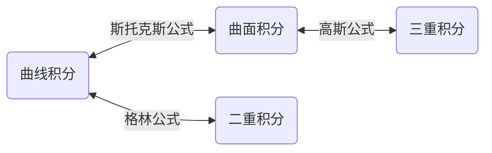

# 极限与连续性

- 收敛数列的判别法

  - 夹逼定理：

    $\begin{aligned}设有三个数列:\{x_{n}\},\{y_{n}\},\{z_{n}\}, 若满足条件(1).\exist N_{1} \in N^{+}, \forall n > N,有y_{n}\leq x_{n} \leq z_{n}\ \ \ (2).\lim\limits_{n \to \infty}y_{n} = A = \lim\limits_{n \to \infty}z_{n}\end{aligned}$

     $\begin{aligned}则\lim\limits_{n \to \infty}x_{n}=A\end{aligned}$

  - 单调、有界的数列必有极限

    $\begin{aligned}(1).设\{x_{n}\}单调增加，且有上界,\exist M, x_{n}\leq M (n=1,2,3...),则x_{n}收敛，\lim\limits_{n \to \infty}x_{n}=\beta = \sup\{x_{n}\}\end{aligned}$

    $\begin{aligned}(2).同理......\lim\limits_{n \to 0}x_{n}=\inf \{x_{n}\}\end{aligned}$

- 海涅定理： $\begin{aligned}\lim\limits_{x\to x_{0}}f(x)=A\Leftrightarrow \forall \{x_{n}\}:x_{n}\neq x_{0}. f(x)有定义，且x_{n}\to x_{0}(n\to \infty),有\lim\limits_{n\to \infty}f(x_{n})=A\end{aligned}$

  判断函数极限不存在：①找$\begin{aligned}x_{n},x_{n}\to \infty\end{aligned}$时，$\begin{aligned}\lim\limits_{n\to \infty}f(x_{n})\end{aligned}$不存在

  ​							   	   ②找$\begin{aligned}\{x_{n}\}、\{x_{n}'\}\to x_{0}\end{aligned}$，使$\begin{aligned}\lim\limits_{n\to \infty}f(x_{n})\neq \lim\limits_{n\to \infty}f(x_{n}')\end{aligned}$

  > **证明$\begin{aligned}f(x)=\sin{\frac{1}{x}},x\to 0\end{aligned}$时，无极限**
  >
  > 证明如下：
  >
  > $\begin{aligned}取x_{n}=\frac{1}{2n\pi},x_{n}'=\frac{1}{2n\pi + \frac{\pi}{2}}\end{aligned}$
  >
  > $\begin{aligned}\lim\limits_{n \to \infty}x_{n} = 0, \lim\limits_{n \to \infty}x_{n}' = 0\end{aligned}$
  >
  > $\begin{aligned}\lim\limits_{n \to 0}f(x_{n}) = 0 \neq\lim\limits_{n \to 0}f(x_{n}')=1\end{aligned}$

- 常用极限: $\begin{aligned}\lim\limits_{x \to 0}\frac{\sin x}{x} = 1\end{aligned}$			$\begin{aligned}\lim\limits_{x \to +\infty}(1+\frac{1}{x})^{x}=e\end{aligned}$

- 常见等价无穷小:

  $\begin{aligned}\sin x \sim x \ \ \ \ \ \ \ \arcsin x \sim x \ \ \ \ \ \ \ \tan x \sim x \ \ \ \ \ \ \ \arctan x\sim x\end{aligned}$

  $\begin{aligned}1-\cos x \sim \frac{1}{2}x^{2}\ \ \ \ \ \ \ \sqrt[n]{1+x}-1\sim \frac{1}{n}x\ \ \ \ \ \ \ e^{x}-1\sim x\ \ \ \ \ \ \  \ln(1+x)\sim x\end{aligned}$

  $\begin{aligned}\log_{a}(1+x) \sim \frac{x}{\ln a}\ \ \ \ \ \ \ a^{x}-1\sim x\ln a\ \ \ \ \ \ \  (x+1)^{n}-1\sim nx\end{aligned}$

- 高阶导数

  $\begin{aligned}(\sin x)^{(n)}=\sin (x + \frac{n\pi}{2})\end{aligned}$

  $\begin{aligned}(\cos x)^{(n)}=\cos (x + \frac{n\pi}{2})\end{aligned}$

  $\begin{aligned}设u=u(x)及v=v(x)\ \ n阶可导\end{aligned}$

  $\begin{aligned}(u\pm v)^{(n)}=u^{(n)}\pm v^{(n)} \end{aligned}$

  $\\$ $\begin{aligned}(Cu)^{(n)}=Cu^{(n)}\\\end{aligned}$

  $\begin{aligned}\ [f(ax+b)]^{(n)}=a^n·f^{(n)}(ax+b)\end{aligned}$

  $\begin{aligned}(uv)^{(n)}=\sum\limits_{k=0}^{n}C_{n}^{k}u^{(n-k)}v^{(k)}\end{aligned}$

- 一些导数：

  $\begin{aligned}(\arcsin x)'=\frac{1}{\sqrt{1-x^2}}\ \ \ \ \ \ \ (\arccos x)'=-\frac{1}{\sqrt{1-x^2}} \ \ \ \ \ \ \  (\tan x)'=\sec^2x\end{aligned}$

  $\begin{aligned}(\arctan x)'=\frac1{1+x^2}\ \ \ \ \ \ \  (\cot x)'=-\csc^2x\ \ \ \ \ \ \  (arccot\ x)'=-\frac1{1+x^2}\end{aligned}$

> $$
> \begin{align*}
> &求极限\lim\limits_{x\to1}\frac{x^x-x}{(x-1)^2}
> \\
> &解法1:
> \\
> &由洛必达法则,
> \\
> &原式=\lim\limits_{x\to1}\frac{x^x(\ln x+1)-1}{2(x-1)}=\lim\limits_{x\to1}\frac{x^x(\ln x+1)^2+x^{x-1}}{2}=1
> \\
> &解法2:
> \\
> &由等价无穷小量,
> \\
> &原式=\lim\limits_{x\to1}\frac{x(x^{x-1}-1)}{(x-1)^2}=\lim\limits_{x\to1}\frac{x(e^{(x-1)\ln x}-1)}{(x-1)^2}
> =\lim\limits_{x\to1}\frac{x(x-1)\ln x}{(x-1)^2}
> =\lim\limits_{x\to1}\frac{x\ln (1+x-1)}{x-1}
> =\lim\limits_{x\to1}\frac{x(x-1)}{x-1}=1
> \\
> 
> \\
> \\
> &-----------------------------------------------
> &
> \end{align*}
> $$

# 微分

- 罗尔定理：

  $\begin{aligned}若f(x)满足在[a,b]上连续，在(a,b)上可导，f(a)=f(b)\Rightarrow 在(a,b)内至少存在一点\xi (a<\xi <b),使f'(\xi)=0\end{aligned}$

- 拉格朗日中值定理:

  $\begin{aligned}若f(x)满足在[a,b]上连续,在(a,b)上可导 \Rightarrow 至少存在一点\xi \in (a,b),使f'(\xi)=\frac{f(b)-f(a)}{b-a}\end{aligned}$

- 柯西中值定理

  $\begin{aligned}若f(x)、g(x)满足在[a,b]上连续，在(a,b)上可导，对一切x\in (a,b),g'(x)\neq 0 \Rightarrow 至少存在一点\xi \in (a,b),使\frac{f(b)-f(a)}{g(b)-g(a)}=\frac{f'(\xi)}{g'(\xi)}\end{aligned}$

- 泰勒公式

  - 泰勒多项式

    $\begin{aligned}P_{n}(x)=f(x_{0})+\frac{f'(x_{0})}{1!}(x-x_{0})+\frac{f''(x_{0})}{2!}(x-x_{0})^2 +...+\frac{f^{(n)}(x_0)}{n!}(x-x_0)^n\end{aligned}$

    $\begin{aligned}其中,a_m = \frac{f^{(m)}(x_0)}{m!}\ \ \ (m=0,1,2...,n)为泰勒系数\end{aligned}$

  - 拉格朗日余项:

    $\begin{aligned}R_n(x)=\frac{f^{(n+1)}(\xi)}{(n+1)!}(x-x_0)^{(n+1)}\end{aligned}$

  - 皮亚诺余项:

    $\begin{aligned}R_n(x)=o((x-x_0)^n)\end{aligned}$

  - 两种余项的泰勒公式比较如下：

    （1）、拉格朗日余项要求$\begin{aligned}f(x)\end{aligned}$在一区间上$\begin{aligned}n+1\end{aligned}$阶可导，皮亚诺余项只要$\begin{aligned}f^{(n)}(x)\end{aligned}$在$\begin{aligned}x_0\end{aligned}$处存在；

    （2）、拉格朗日余项用于误差估计，皮亚诺余项用于求函数的极限；

    （3）、拉格朗日余项用在一固定区间，皮亚诺余项用在$x_0$的充分小邻域内。

  - 特别地，当$\begin{aligned}x_0=0\end{aligned}$时的泰勒公式称为麦克劳林公式

    $\begin{aligned}R_n(x)=\frac{f^{(n+1)}(\theta x)}{(n+1)!}x^{(n+1)}\ \ (0<\theta <1)\end{aligned}$为拉格朗日余项

    $\begin{aligned}R_n(x)=o(x^n)\end{aligned}$为皮亚诺余项

- 常见泰勒展开：

  （1）、$\begin{aligned}e^x=1+x+\frac{x^2}{2!}+...+\frac{x^n}{n!}+R_n(x)\end{aligned}$

  （2）、$\begin{aligned}\sin x = x-\frac{x^3}{3!}+\frac{x^5}{5!}-\frac{x^7}{7!}+...+\frac{(-1)^{n-1}x^{2n-1}}{(2n-1)!}+R_{2n}(x)\end{aligned}$

  （3）、$\begin{aligned}\cos x=1-\frac{x^2}{2!}+\frac{x^4}{4!}-\frac{x^6}{6!}+...+\frac{(-1)^nx^{2n}}{(2n)!}+R_{2n+1}(x)\end{aligned}$

  （4）、$\begin{aligned}(1+x)^\alpha = 1 + \alpha x + \frac{\alpha(\alpha -1)}{2!}x^2+...+\frac{\alpha(\alpha - 1)...(\alpha -n+1)}{n!}x^n+R_n(x)\end{aligned}$

  （5）、$\begin{aligned}\ln (1+x)=x-\frac{1}{2}x^2+\frac13x^3-...+(-1)^{(n-1)}\frac1nx^n+R_n(x)\end{aligned}$

- 函数的凹凸性

  - $\begin{aligned}设f(x)在区间I上连续，如果对I上任意两点x_1,x_2,恒有f(\frac{x_1+x_2}2)<\frac{f(x_1)+f(x_2)}2,那么称f(x)在I上的图形是凹的(上凹或下凸);\end{aligned}$

    $如果恒有f(\frac{x_1+x_2}2)>\frac{f(x_1)+f(x_2)}2,那么称f(x)在I上的图形是凸的(上凸或下凹)。$

  - $\begin{aligned}在(a,b)内若f''(x)<0,则f(x)在[a,b]上的图形是凹的，若f''(x)>0,则f(x)在[a,b]上的图形是凸的。\end{aligned}$

# 不定积分与定积分

- 基本积分公式

  

  

- 积分法

  - 第一换元法： $\begin{aligned}\int f[\phi(x)]'\phi'(x)dx=[\int f(u)du]_{u=\phi(x)}\end{aligned}$

  - 第二换元法： $\begin{aligned}\int f(x)dx=[\int f[\psi(t)]\psi'(t)]_{t=\overline{\psi}(x)}\end{aligned}$         ($其中，\overline\psi(x)是x=\psi(t)的反函数$)

    当被积函数中含有$\begin{aligned}\sqrt{a^2-x^2}\end{aligned}$，可令$x=a\sin t$；含有$\sqrt{a^2+x^2}$，可令$\begin{aligned}x=a\tan t\end{aligned}$；含有$\begin{aligned}\sqrt{x^2-a^2}\end{aligned}$，可令$\begin{aligned}x=a\sec t\end{aligned}$

  - 分部积分法： $\begin{aligned}\int uv'dx=uv-\int u'vdx\ \ \ \ \ \ \ \ \int udv=uv-\int vdu\end{aligned}$

- 特殊函数的积分

  - 有理函数的积分

    两个多项式之商称为有理函数.有理函数理论上一定是可积的，它的原函数是初等函数。

    可用待定系数法将真分式化为部分分式之和：

    > **例：$\begin{aligned}\frac{x+3}{x^2-5x+6}=\frac{x+3}{(x-2)(x-3)}=\frac A{x-2}+\frac B{x-3}\end{aligned}$**
    >
    > $\begin{aligned}因为x+3=A(x-3)+B(x-2)，所以\end{aligned}$
    >
    > $\begin{aligned}x+3=(A+B)x-(3A+2B)\Rightarrow \begin{cases}A+B=1 \\ -(3A+2B)=3\end{cases}\Rightarrow \begin{cases} A=-5 \\ B=6 \end{cases}\end{aligned}$
    >
    > $\begin{aligned}因此\frac{x+3}{x^2-5x+6}=\frac{-5}{x-2}+\frac{6}{x-3}\end{aligned}$

    将有理函数化为部分分式之和后，只出现三种情况：①多项式；②$\begin{aligned}\frac{A}{(x-a)^n}\end{aligned}$；③$\begin{aligned}\frac{Mx+N}{(x^2+px+q)^n}\end{aligned}$

    讨论积分$\begin{aligned}\int \frac{Mx+N}{(x^2+px+q)^n}dx\end{aligned}$，因为$\begin{aligned}x^2+px+q=(x+\frac p2)^2+q-\frac{p^2}{4}\end{aligned}$，令$x+\frac p2=t$，记$\begin{aligned}x^2+px+q=t^2+a^2, Mx+N=Mt+b\end{aligned}$，则$\begin{aligned}a^2=q-\frac{p^2}{4}，b=N-\frac{Mp}2\end{aligned}$，所以

    $\begin{aligned}\int \frac{Mx+N}{(x^2+px+q)^n}dx=\int \frac{Mt}{(t^2+a^2)^n}dt+\int \frac{b}{(t^2+a^2)^n}dt\end{aligned}$

    (1)$\begin{aligned}n=1,\int \frac{Mx+N}{x^2+px+q}dx=\frac M2\ln(x^2+px+q)+\frac ba\arctan{\frac{x+\frac p2}{a}}+C\end{aligned}$

    (2)$\begin{aligned}n>1,\int\frac{Mx+N}{(x^2+px+q)^n}dx=\frac M{2(n-1)(t^2+a^2)^{n-1}}+b\int\frac1{(t^2+a^2)^n}dt\end{aligned}$

    这三类积分均可积出，且原函数都是初等函数。

    

  - 三角函数有理式的积分

    万能置换公式：$\begin{aligned}令u=\tan \frac x2,x=2\arctan u\end{aligned}$

    $\begin{aligned}\sin x=\frac{2u}{1+u^2},\ \cos x=\frac{1-u^2}{1+u^2},\ dx=\frac 2{1+u^2}du\end{aligned}$

    > **例：求积分$\begin{aligned}\int \frac 1{\sin^4x}dx\end{aligned}$**
    >
    > 解法一：
    >
    > $\begin{aligned}u=\tan \frac x2,\sin x=\frac{2u}{1+u^2},dx=\frac{2}{1+u^2}du\int \frac 1x\sqrt{\frac{1+x}x}dx\end{aligned}$
    >
    > $\begin{aligned}\int\frac 1{\sin^4x}dx&=\int \frac{1+3u^2+3u^4+u^6}{8u^4}du\\&=-\frac{1}{24(\tan \frac x2)^3}-\frac 3{8\tan \frac x2}+\frac 38\tan \frac x2+\frac 1{24}(\tan \frac x2)^3+C\end{aligned}$
    >
    > 解法二：
    >
    > 修改万能置换公式，令$\begin{aligned}u=\tan x,\sin x=\frac{u}{\sqrt {1+u^2}},dx=\frac 1{1+u^2}du\end{aligned}$
    >
    > $\int\frac 1{\sin^4x}dx&=\int \frac 1{(\frac u{\sqrt{1+u^2}})^4}·\frac 1{1+u^2}du\\&=-\frac 13\cot^3x-\cot x+C$
    >
    > 解法三:
    >
    > 可以不用万能置换公式
    >
    > $\begin{aligned}\int \frac 1{\sin^4 x}dx&=\int \csc^2x(1+\cot^2x)dx\\&=\int csc^2xdx+\int \cot^2x\csc^2xdx\\&=\int\csc^2xdx-\int\cot^2xd(\cot x)\\&=-\cot x-\frac 13\cot^3x+C\end{aligned}$

    

  - 简单无理函数的积分

    有$\begin{aligned}R(x,\sqrt[n]{ax+b})、R(x,\sqrt[n]{\frac{ax+b}{cx+e}})\end{aligned}$两种类型，解决方法是作代换去掉根号

    > **例：求积分$\begin{aligned}\int \frac 1x\sqrt{\frac{1+x}x}dx\end{aligned}$**
    >
    > **解：**
    >
    > $\begin{aligned}令\sqrt{\frac{1+x}x}=t\Rightarrow\frac{1+x}x=t^2,x=\frac 1{t^2-1},dx=-\frac{2tdt}{(t^2-1)^2}\end{aligned}$
    >
    > $\begin{aligned}\int \frac 1x\sqrt{\frac{1+x}x}dx&=-\int(t^2-1)t\frac{2t}{(t^2-1)^2}dt\\ &=-2\int\frac{t^2dt}{t^2-1}\\&=-2\int(1+\frac 1{t^2-1})dt\\&=-2t-\ln\frac{t-1}{t+1}+C\\&=-2\sqrt{\frac{1+x}x}-\ln[x(\sqrt{\frac{1+x}x}-1)^2]+C\end{aligned}$

- 定积分定义：$\begin{aligned}\int^b_af(x)dx=I=\lim\limits_{\lambda\to0}\sum\limits_{i=1}^{n}f(\xi_i)\Delta x_i\end{aligned}$

- $\begin{aligned}F(x)=\int_{a(x)}^{b(x)}f(t)dt,则F'(x)=f[b(x)]b'(x)-f[a(x)]a'(x)\end{aligned}$

- $\begin{aligned}\Gamma函数:\Gamma(x)=\int_0^{+\infty}e^{-x}x^{s-1}dx\end{aligned}$

  $\begin{aligned}&①、\Gamma(s+1)=s\Gamma(s)\ \ (s>0)\\&②、当s\rightarrow+0时,\Gamma(s)\rightarrow+\infty\\&③、\Gamma(s)\Gamma(1-s)=\frac{\pi}{\sin\pi s}\ \ (0<s<1)\\&④、在\Gamma(s)中,作代换x=u^2,有\Gamma(s)=2\int_0^{+\infty}e^{-u^2}u^{2s-1}du\end{aligned}$

- 定积分的应用

  - 求面积

    - 直角坐标系
    - 极坐标系：$\begin{aligned}设由曲线r=\phi(\theta)及射线\theta=\alpha,\theta=\beta围成一曲边扇形，面积A=\int_\alpha^\beta\frac 12[\phi(\theta)]^2d\theta\end{aligned}$

  - 求体积

    - 旋转体体积

      $\begin{aligned}&由连续曲线y=f(x),直线x=a,x=b及x轴所围成的曲边梯形\\&绕x轴旋转:V_x=\int_a^b\pi[f(x)]^2dx\\&绕y轴旋转:V_y=2\pi\int_a^bx|f(x)|dx\end{aligned}$

    - 平行截面面积为已知的立体的体积：$\begin{aligned}A(x)为截面面积且A(x)为x的已知连续函数,V=\int_a^bA(x)dx\end{aligned}$

  - 弧长

    - 直角坐标系：$\begin{aligned}s=\int_a^b\sqrt{1+y'^2}dx\end{aligned}$
    - 参数方程：$\begin{aligned}\begin{cases}x=\phi(t)\\y=\psi(t)\end{cases},\alpha\leq t\leq\beta\ \ \ \ \ \ \ \ s=\int_\alpha^\beta\sqrt{\phi'^2(t)+\psi'^2(t)}dt\end{aligned}$
    - 极坐标：$\begin{aligned}曲线弧r=r(\theta)(\alpha\leq\theta\leq\beta),因为\begin{cases}x=r(\theta)\cos\theta\\y=r(\theta)\sin\theta\end{cases},所以s=\int_\alpha^\beta\sqrt{r^2(\theta)+r'^2(\theta)}d\theta\end{aligned}$

# 微分方程

- 可分离变量的微分方程

  - 可分离变量

    $\begin{aligned}\frac{dy}{dx}=F(x,y)\end{aligned}$

  - 一阶齐次微分方程

    $\begin{aligned}\frac{dy}{dx}=\phi(\frac yx)\end{aligned}$

    作代换$\begin{aligned}\frac yx=u,y=ux\end{aligned}$，方程两边对$x$求导

    $\begin{aligned}\frac {dy}{dx}=u+x\frac{du}{dx}=\phi(u)\end{aligned}$

    分离变量得，$\begin{aligned}\frac{du}{\phi(u)-u}=\frac{dx}{x}\end{aligned}$

    两边积分后，再用$\begin{aligned}\frac yx=u\end{aligned}$代换即可
    
    

- 一阶线性微分方程

  - 齐次

    $\begin{aligned}&y'+P(x)y=0\\ &分离变量后得通解y=Ce^{-\int P(x)dx}\end{aligned}$

  - 非齐次

    $\begin{aligned}&y'+P(x)y=Q(x)\\&通过常数变易法，得到方程通解为y=e^{-\int P(x)dx}[\int Q(x)e^{\int P(x)dx}dx+C_1]\end{aligned}$

    > 定理1：一阶非齐次线性方程的通解为它的任意一个特解加上与其相应的一阶齐次方程的通解
    >
    > 由定理1，可设想$\begin{aligned}&y'+P(x)y=Q(x)\end{aligned}$的解为$\begin{aligned}y=C(x)e^{-\int P(x)dx}\end{aligned}$
    >
    > 将其及其导数$\begin{aligned}y'=C'(x)e^{-\int P(x)dx}-C(x)P(x)e^{-\int P(x)dx}\end{aligned}$代入方程中，
    >
    > 可得$\begin{aligned}C'(x)=Q(x)e^{\int P(x)dx}\end{aligned}$
    >
    > 两端积分，得$\begin{aligned}C(x)=\int Q(x)e^{\int P(x)dx}dx+C_1\end{aligned}$

  - 伯努利方程

    $y'+P(x)y=Q(x)y^n$

    $\begin{aligned}&设y\neq0,以y^n除以方程两边，得到\\&(1-n)y^{-n}y'+(1-n)P(x)y^{1-n}=(1-n)Q(x)\\&令u=y^{1-n},代入得u'+(1-n)P(x)u=(1-n)Q(x)\\&这是关于新的未知函数u和u'的一阶非齐次线性方程，不难求出其解\end{aligned}$
    
    

- 特殊二阶微分方程

  - $y''=f(x)型$

    只要积分两次就可求出通解，通解中包含两个任意常数，可由初始条件确定这两个常数

  - $y''=f(x,y')型$

    作代换，令$y'=P(x)$，则$y''=P'(x)$，由此原方程可化为一阶微分方程进行求解

  - $y''=f(y,y')型$

    令$y'=P(y)$，则$\begin{aligned}y''=\frac{dP}{dy}\frac{dy}{dx}=\frac{dP}{dy}P\end{aligned}$，由此原方程可化为一阶微分方程进行求解
    
    

- 二阶常系数线性微分方程

  - 齐次：$y''+py'+qy=0$

    特征方程：$\lambda^2+p\lambda+q=0$，它的根为特征根

    | p^2^-4q | 特征根r~1~、r~2~             | 通解                                            |
    | ------- | ---------------------------- | ----------------------------------------------- |
    | >0      | 两个不相等的实根r~1~、r~2~   | $y=C_1e^{r_1x}+C_2e^{r_2x}$                     |
    | =0      | 两个相等实根r~1~、r~2~       | $y=(C_1+C_2x)e^{r_1x}$                          |
    | <0      | 一对共轭复根r~1、2~ = α ± iβ | $y=e^{\alpha x}(C_1\cos\beta x+C_2\sin\beta x)$ |

    欧拉公式：

    $e^{(\alpha\pm i\beta)x}=e^{\alpha x}(\cos\beta x\pm i\sin\beta x)$
  
  - 非齐次：$y''+py'+qy=f(x)$
  
    - ①、$\begin{aligned}f(x)=P_m(x)e^{rx}\end{aligned}$		$r$为实数,$P_m(x)$为m次多项式
    
      $\begin{aligned}&当实数r是特征方程的k重根时，可\ 设 \\&特解\ \ y^*=x^kQ_m(x)e^{rx}\ \ (k=0,1,2)\\&Q_m(x)为待定m次多项式，再将该式代入原方程，通过比较系数即可求出该特解\end{aligned}$
    
      > **例：**求方程$y''-5y'+6y=xe^{2x}$的通解
      >
      > **解：**
      >
      > $\begin{aligned}&特征方程为r^2-5r+6=0,\ \ r_1=2,r_2=3\\&对应齐次方程的通解为Y=C_1e^{2x}+C_2e^{3x}\\&r=r_1,设原方程的特解y^*=x(b_0x+b_1)e^{2x}&①\\&y^* {'} =(b_0x+b_1)e^{2x}+b_0xe^{2x}+2x(b_0x+b_1)e^{2x}&②\\&y^*{''}=2b_0e^{2x}+4(b_0x+b_1)e^{2x}+4b_0xe^{2x}+4x(b_0x+b_1)e^{2x}&③\\&将①②③代入原方程中,得-2b_0x-b_1+2b_0=x\\&比较系数，得\begin{cases}{-2b_0=1}\\{2b_0-b_1=0}\end{cases}\Rightarrow b_0=-\frac 12,b_1=-1\\&因此原方程的特解为\ \ y^*=x(-\frac 12x-1)e^{2x}\\&原方程的通解为\ \ y=C_1e^{2x}+C_2e^{3x}-(\frac 12x^2+x)e^{2x}\end{aligned}$
    
    - ②、$f(x)=e^{\alpha x}[P_l(x)\cos\beta x+P_n(x)\sin\beta x]$
    
      $\begin{aligned}&当\alpha+i\beta为特征方程的k重根(k=0,1),\\&则可设方程的特解为\\&y^*=x^ke^{\alpha x}[R_m^{(1)}(x)\cos\beta x+R_m^{(2)}(x)\sin\beta x]\\&其中,m=\max {(n,l)},R_m^{(1)}(x)、R_m^{(2)}(x)均为m次实系数多项式\end{aligned}$
    
      > **例：**求方程$y''+9y=18\cos 3x-30\sin 3x$的通解
      >
      > **解：**
      >
      > $\begin{aligned}&特征方程为r^2+9=0,r_{1、2}=\pm3i\\&对应齐次方程的通解为Y=C_1\cos3 x+C_2\sin3x\\&\alpha\pm i\beta=\pm3i为特征方程的单根，因此设原方程的特解y^*=x(a\cos3x+b\sin3x)\\&代入原方程中，得\ \ 6b\cos3x-6a\sin3x=18\cos3x-30\sin3x\\&比较系数，得\ \ a=5,b=3\\&因此原方程的特解为\ \ y^*=x(5\cos3x+3\sin3x)\\&原方程的通解为\ \ y=C_1\cos3x+C_2\sin3x+x(5\cos3x+3\sin3x)\end{aligned}$

# 多元函数

### 偏导和微分

- 偏导数存在$\nrightarrow$连续

  函数在某点可微分$\rightarrow$连续

  函数可微$\rightarrow$函数偏导存在（可微的必要条件）

  函数可微$\leftarrow$函数偏导连续（可微的充分条件）

- 定理：如果函数$z = f(x,y)$的两个混合偏导数在区域D内连续，那么在这个区域内这两个混合偏导必然相等
- 全微分的应用
  - 求近似值：$f(x+\Delta x,y+\Delta y) \approx f(x,y) + f_x(x, y)\Delta x + f_y(x,y)\Delta y$

- 链式法则：

  $\begin{aligned} &u=\phi(t),v=\psi(t)都在点t可导,z=f(u,v)在对应点(u,v)有连续偏导\Rightarrow复合函数z=f[\phi(t),\psi(t)]在对应点t可导,\\&且\frac{dz}{dt}=\frac{\partial z}{\partial u}\frac{du}{dt}+\frac{\partial z}{\partial v}\frac{dv}{dt}(其中\frac{dz}{dt}称为全导数)\\&也可以扩展到二元,u=\phi(x,y),v=\psi(x,y),\\&则\frac{\partial z}{\partial x}=\frac{\partial z}{\partial u}\frac{\part u}{\part x}+\frac{\partial z}{\partial v}\frac{\part v}{\part x},\frac{\partial z}{\partial y}=\frac{\partial z}{\partial u}\frac{\part u}{\part y}+\frac{\partial z}{\partial v}\frac{\part v}{\part y}\end{aligned}$

  

- 全微分形式不变性：

  $\begin{aligned}dz=\frac{\part z}{\part u}du+\frac{\part z}{\part v}dv = \frac{\part z}{\part x}dx + \frac{\part z}{\part y}dy\end{aligned}$ 

  > $$
  > \begin{aligned}
  > dz&=\frac{\part z}{\part x}dx + \frac{\part z}{\part y}dy
  > \\& = (\frac{\part z}{\part u}\frac{\part u}{\part x} + \frac{\part z}{\part v}\frac{\part v}{\part x})dx+(\frac{\part z}{\part u}\frac{\part u}{\part y} + \frac{\part z}{\part v}\frac{\part v}{\part y})dy
  > \\&=\frac{\part z}{\part u}(\frac{\part u}{\part x}dx + \frac{\part u}{\part y}dy)+\frac{\part z}{\part v}(\frac{\part v}{\part x}dx + \frac{\part v}{\part y}dy)
  > \\&=\frac{\part z}{\part u}du+\frac{\part z}{\part v}dv
  > \end{aligned}
  > $$

### 隐函数求导

- 隐函数求导

  - $F(x,y)=0$

    $\begin{aligned}&F(x,y)在点P(x_0,y_0)的某一邻域内有连续偏导，且F(x_0,y_0)=0,F_y(x_0,y_0)\neq0\\&\Rightarrow 一个单值连续且有连续导数的函数y=f(x),y_0=f(x_0),且\frac{dy}{dx}=-\frac{F_x}{F_y}\end{aligned}$

  - $F(x,y,z)=0$

    $\begin{aligned}同理 \Rightarrow z=f(x,y), z_0=f(x_0,y_0),且\frac{\part z}{\part x}=-\frac{F_x}{F_z},\frac{\part z}{\part y}=-\frac{F_y}{F_z}\end{aligned}$

  - $\begin{aligned}\begin{cases}F(x,y,u,v)=0\\G(x,y,u,v)=0\end{cases}\end{aligned}$

    $\begin{aligned}&在P(x_0,y_0,u_0,v_0)的某一邻域内有连续偏导，且偏导数组成的行列式(雅可比式)J=\frac{\part(F,G)}{\part(u,v)}=\begin{vmatrix}\frac{\part F}{\part u} &\frac{\part F}{\part v}\\\frac{\part G}{\part u} &\frac{\part G}{\part v}\end{vmatrix}在点P处不为0\\&\Rightarrow u=u(x,y),v=v(x,y),并有\\ &\frac{\part u}{\part x}=-\frac1J\frac{\part(F,G)}{\part(x,v)}=-\frac{\begin{vmatrix}F_x&F_v\\G_x&G_v\end{vmatrix}}{\begin{vmatrix}F_u&F_v\\G_u&G_v\end{vmatrix}}\\ &\frac{\part v}{\part x}=-\frac1J\frac{\part(F,G)}{\part(u,x)}=-\frac{\begin{vmatrix}F_u&F_x\\G_u&G_x\end{vmatrix}}{\begin{vmatrix}F_u&F_v\\G_u&G_v\end{vmatrix}}\\ &\frac{\part u}{\part y}=-\frac1J\frac{\part(F,G)}{\part(y,v)}=-\frac{\begin{vmatrix}F_y&F_v\\G_y&G_v\end{vmatrix}}{\begin{vmatrix}F_u&F_v\\G_u&G_v\end{vmatrix}}\\ &\frac{\part v}{\part y}=-\frac1J\frac{\part(F,G)}{\part(u,y)}=-\frac{\begin{vmatrix}F_u&F_y\\G_u&G_y\end{vmatrix}}{\begin{vmatrix}F_u&F_v\\G_u&G_v\end{vmatrix}} \end{aligned} $

### 几何上的应用

- 空间曲线的切线与法平面

  - $\begin{aligned}\begin{cases}x=\phi(t)\\y=\psi(t)\\z=\omega(t)\end{cases},设M(x_0,y_0,x_0)对应t=t_0\end{aligned}$

    切线方程：$\begin{aligned}\frac{x-x_0}{\phi'(t_0)}=\frac{y-y_0}{\psi'(t_0)}=\frac{z-z_0}{\omega'(t_0)}\end{aligned}$

    法平面：$\phi'(t_0)(x-x_0)+\psi'(t_0)(y-y_0)+\omega'(t_0)(z-z_0)=0$

  - $\begin{cases}y=\phi(x)\\z=\psi(x)\end{cases},设M(x_0,y_0,z_0)$

    切线方程：$\begin{aligned}\frac{x-x_0}{1}=\frac{y-y_0}{\phi'(x_0)}=\frac{z-z_0}{\psi'(x_0)}\end{aligned}$

    法平面：$(x-x_0)+\phi'(x_0)(y-y_0)+\psi'(x_0)(z-z_0)=0$

  - $\begin{cases}F(x,y,z)=0\\G(x,y,z)=0\end{cases}$

    切线方程：$\begin{aligned}\frac{x-x_0}{\begin{vmatrix}F_y&F_z\\G_y&G_z\end{vmatrix}_0}=\frac{y-y_0}{\begin{vmatrix}F_z&F_x\\G_z&G_x\end{vmatrix}_0}=\frac{z-z_0}{\begin{vmatrix}F_x&F_y\\G_x&G_y\end{vmatrix}_0}\end{aligned}$

    

    法平面：$\begin{vmatrix}F_y&F_z\\G_y&G_z\end{vmatrix}_0(x-x_0)+\begin{vmatrix}F_z&F_x\\G_z&G_x\end{vmatrix}_0(y-y_0)+\begin{vmatrix}F_x&F_y\\G_x&G_y\end{vmatrix}_0(z-z_0)=0$

- 曲面的切平面与法线

  - $F(x,y,z)=0,设M(x_0,y_0)$

    切平面：$F_x(x_0,y_0,z_0)(x-x_0)+F_y(x_0,y_0,z_0)(y-y_0)+F_z(x_0,y_0,z_0)(z-z_0)=0$

    法线：$\begin{aligned}\frac{x-x_0}{F_x(x_0,y_0,z_0)}=\frac{y-y_0}{F_y(x_0,y_0,z_0)}=\frac{z-z_0}{F_z(x_0,y_0,z_0)}\end{aligned}$

  - $z=f(x,y),令F(x,y,z)=f(x,y)-z,设M(x_0,y_0,z_0)$

    切平面：$z-z_0=f_x(x_0,y_0)(x-x_0)+f_y(x_0,y_0)(y-y_0),函数在点M的全微分表示切平面上的点的竖坐标的增量(z-z_0)$

    法线：$\begin{aligned}\frac{x-x_0}{f_x(x_0,y_0)}=\frac{y-y_0}{f_y(x_0,y_0)}=\frac{z-z_0}{-1}\end{aligned}$

    若$\alpha,\beta,\gamma$表示曲面的法向量的方向角，则法向量的方向余弦为：

    $\begin{aligned}\cos\alpha=\frac{-f_x}{\sqrt{1+f_x^2+f_y^2}}\end{aligned}$

    $\begin{aligned}\cos\beta=\frac{-f_y}{\sqrt{1+f_x^2+f_y^2}}\end{aligned}$

    $\begin{aligned}\cos\gamma=\frac{1}{\sqrt{1+f_x^2+f_y^2}}\end{aligned}$

### 方向导数和梯度

- 方向导数

  定义：$\begin{aligned}\frac{\part f}{\part l}=\lim_\limits{\rho\rightarrow0}\frac{f(x+\Delta x,y+\Delta y)-f(x,y)}{\rho},\rho=\sqrt{(\Delta x)^2+(\Delta y)^2}\end{aligned}$

  定理：

  $\begin{aligned}&当函数在此点可微时，那么函数在该点沿任意方向的方向导数都存在，\\&且有\frac{\part f}{\part \vec l}=\frac{\part f}{\part x}\cos\phi+\frac{\part f}{\part y}\sin\phi,其中\phi为x轴到方向L的转角\end{aligned}$

  推广到三元函数方向导数：

  $\begin{aligned}&设方向L的方向角为\alpha,\beta,\gamma,当函数在此点可微时，那么函数在该点沿任意方向的方向导数都存在,\\&且有\frac{\part f}{\part \vec l}=\frac{\part f}{\part x}\cos\alpha+\frac{\part f}{\part y}\cos\beta+\frac{\part f}{\part z}\cos\gamma\end{aligned}$

- 梯度：$grad f(x，y) = \nabla f(x,y)=(f_x,f_y)$

  几何意义：函数增长速度最快的方向
  
  因此，方向导数也可以表示为$\begin{aligned}\frac{\part f}{\part \vec l}=\nabla f(x,y)\cdot (\cos\alpha, \cos\beta) \end{aligned}$

### 极值

- 必要条件：极值$\Rightarrow$偏导均为0（偏导均为0的点称为驻点）

  充分条件：$\begin{aligned}&令f_{xx}=A,f_{xy}=B,f_{yy}=C\end{aligned}$

  ​                  $\begin{aligned}AC-B^2\begin{cases}>0,有极值,A<0\rightarrow极大值,A>0\rightarrow极小值\\<0,无极值\\=0不确定\end{cases}\end{aligned}$

  解题步骤：

  - $解方程组\begin{cases}f_x=0\\f_y=0\end{cases}\ 得到驻点;$
  - $对每个驻点求出二阶偏导，利用AC-B^2进行判别$

- 条件极值：拉格朗日乘数法

  $\begin{aligned}&要找z=f(x,y)在条件\phi(x,y)=0下可能的极值点，先构造函数F(x,y)=f(x,y)+\lambda\phi(x,y),\\&解方程组\begin{cases}F_x=0\\F_y=0\\\phi(x,y)=0\end{cases},解出x,y,\lambda,其中x,y就是可能的极值点坐标\end{aligned}$

  **扩展：**

  $\begin{aligned}&u=f(x,y,z,t)在条件\phi(x,y,z,t)=0,\psi(x,y,z,y)=0下的极值,\\&先构造函数F(x,y,z,y)=f(x,y,z,t)+\lambda_1\phi(x,y,z,y)+\lambda_2\psi(x,y,z,y),后略\end{aligned}$

  

# 重积分

### 二重积分

- 直角坐标系：X-型、Y-型
- 极坐标系：$\iint\limits_{D}f(x,y)dxdy=\iint\limits_Df(r\cos\theta,r\sin\theta)rdrd\theta$
- 换元法：$变换T:x=x(u,v),y=y(u,v),则\iint\limits_Df(x,y)dxdy=\iint\limits_{D'}f(x(u,v),y(u,v))|J(u,v)|dudv,(雅克比式J(u,v)\neq0)$

- 应用

  - 计算曲面面积：$A=\iint\limits_{D_{xy}}\sqrt{1+f_x^2+f_y^2}d\sigma$

  - 平面薄片重心：$\begin{aligned}\overline x=\frac{\iint\limits_Dx\rho(x,y)d\sigma}{\iint\limits_D\rho(x,y)d\sigma},\overline y=\frac{\iint\limits_Dy\rho(x,y)d\sigma}{\iint\limits_D\rho(x,y)d\sigma}\end{aligned}$

    当薄片是均匀的，重心称为形心，$A=\iint\limits_Dd\sigma,\overline x=\frac1A\iint\limits_D xd\sigma,\overline y=\frac1A\iint\limits_D yd\sigma$

### 三重积分

- 先一后二：$\begin{aligned}\iiint\limits_\Omega f(x,y,z)dv=\int_a^bdx\int_{y_1(x)}^{y_2(x)}dy\int_{z_1(x,y)}^{z_2(x,y)}f(x,y,z)dz\end{aligned}$

- 先二后一（截面法）：$\begin{aligned}先计算F(z)=\iint\limits_{D_z}f(x,y,z)dxdy,再计算\int_{c_1}^{c_2}F(z)dz\end{aligned}$

  

- 柱面坐标系：$\begin{aligned}\iiint\limits_\Omega f(x,y,z)dv=\iiint\limits_\Omega f(r\cos\theta,r\sin\theta,z)rdrd\theta dz\end{aligned}$
- 球面坐标系：$\begin{aligned}\iiint\limits_\Omega f(x,y,z)dv=\iiint\limits_\Omega f(r\sin\phi\cos\theta,r\sin\phi\sin\theta,r\cos\phi)r^2\sin\phi drd\phi d\theta\end{aligned}$

# 曲线积分与曲面积分

### 曲线积分

- 第一类曲线积分：$\int\limits_L f(x,y)ds$

  $\int\limits_L f(x,y)ds=\int_\alpha^\beta f(x(t),y(t))\sqrt{\phi'^2(t)+\psi'^2(t)}dt,(\alpha<\beta)$

- 第二类曲线积分：$\int\limits_L P(x,y)dx+Q(x,y)dy$

  $\int\limits_L P(x,y)dx+Q(x,y)dy=\int_\alpha^\beta [P(\phi(t),\psi(t))\phi'(t)+Q(\phi(t),\psi(t))\psi'(t)]dt$

- 两类曲线积分的联系：$\int\limits_L Pdx+Qdy=\int\limits_L (P\cos\alpha+Q\cos\beta)ds$

  $其中,\cos\alpha和\cos\beta为切向量的方向角$

### 格林公式

- 格林公式：$\begin{aligned}\iint\limits_D (\frac{\part Q}{\part x}-\frac{\part P}{\part y})dxdy=\oint\limits_L Pdx+Qdy\end{aligned}$

- 应用：简化曲线积分、简化二重积分、计算平面面积

- 在条件：在单连通区域D上P、Q具有连续偏导下

  曲线积分与路径无关 

  $\Leftrightarrow$ $\begin{aligned}\frac{\part P}{\part y}=\frac{\part Q}{\part x}\end{aligned}$

  $\Leftrightarrow$ $\exist U(x,y),使得dU=Pdx+Qdy$

  $\Leftrightarrow$ $\oint\limits_C Pdx+Qdy=0,闭曲线C$

​	

### 曲面积分

- 第一类：$\iint\limits_\Sigma f(x,y,z)dS$

  $\iint\limits_\Sigma f(x,y,z)dS=\iint\limits_{D_{xy}}f(x,y,z(x,y))\sqrt{1+z_x'+z_y'}dxdy$

- 第二类：$\iint\limits_\Sigma P(x,y,z)dydz+Q(x,y,z)dzdx+R(x,y,z)dxdy$

- 两类曲线积分的联系：$\iint\limits_\Sigma P(x,y,z)dydz+Q(x,y,z)dzdx+R(x,y,z)dxdy=\iint\limits_\Sigma (P\cos\alpha+Q\cos\beta+R\cos\gamma)dS$

### 高斯公式

- 高斯公式：$\begin{aligned}\iiint\limits_\Omega (\frac{\part P}{\part x}+\frac{\part Q}{\part y}+\frac{\part R}{\part z})dV=\oiint\limits_\Sigma Pdydz+Qdzdx+Rdxdy\end{aligned}$

- 设有向量场$\vec A(x,y,z)=P(x,y,z)\vec i+Q(x,y,z)\vec j+R(x,y,z)\vec k$，

  通量$\Phi=\iint\limits_\Sigma\vec A\cdot d\vec S=\iint\limits_\Sigma \vec A\cdot\vec n^0dS=\iint\limits_\Sigma Pdydz+Qdzdx+Rdxdy$

  散度$div\vec A=\frac{\part P}{\part x}+\frac{\part Q}{\part y}+\frac{\part R}{\part z}$

### 斯托克斯公式

- 斯托克斯公式：$\begin{aligned}\iint\limits_\Sigma(\frac{\part R}{\part y}-\frac{\part Q}{\part z})dydz+(\frac{\part P}{\part z}-\frac{\part R}{\part x})dzdx+(\frac{\part Q}{\part x}-\frac{\part P}{\part y})dxdy=\oint\limits_\Gamma Pdx+Qdy+Rdz\end{aligned}$

- 设有向量场$\vec A(x,y,z)=P(x,y,z)\vec i+Q(x,y,z)\vec j+R(x,y,z)\vec k$，

  环流量$\Gamma=\oint\limits_C \vec A\cdot d\vec S=\iint\limits_\Sigma\begin{vmatrix}\vec i&\vec j&\vec k\\\frac\part{\part x}&\frac\part{\part y}&\frac\part{\part z}\\P&Q&R\end{vmatrix}\cdot d\vec S$

   旋度$rot\vec A=\begin{vmatrix}\vec i&\vec j&\vec k\\\frac\part{\part x}&\frac\part{\part y}&\frac\part{\part z}\\P&Q&R\end{vmatrix}$

# 无穷级数

### 审敛法

- 正项级数

  - 比较审敛法：

    $对于正项级数\sum\limits_{n=1}^{\infin}u_n,\sum\limits_{n=1}^{\infin}v_n,且u_n\le v_n(n=1,2,\dots),若\sum\limits_{n=1}^{\infin}v_n收敛，则\sum\limits_{n=1}^{\infin}u_n收敛；反之，若\sum\limits_{n=1}^{\infin}u_n发散，则\sum\limits_{n=1}^{\infin}v_n发散$

  - 极限审敛法：

    $\begin{aligned}&设\sum\limits_{n=1}^{\infin}u_n为正项级数。\\&(1)若\lim\limits_{n\rightarrow\infin}nu_n=l>0或\lim\limits_{n\rightarrow \infin}nu_n=+\infin,则\sum\limits_{n=1}^{\infin}u_n发散.\\&(2)若\lim\limits_{n\rightarrow\infin}n^pu_n=l\ge0(p>1),则\sum\limits_{n=1}^{\infin}u_n收敛\end{aligned}$

- 交错项级数

  - 莱布尼茨审敛法：

    $\begin{aligned}&如果交错项级数\sum\limits_{n=1}^{\infin}(-1)^{n-1}u_n满足条件:\\&(1)u_n\ge u_{n+1}(n=1,2,\dots),\\&(2)\lim\limits_{n\rightarrow\infin}u_n=0,\\&则级数\sum\limits_{n=1}^{\infin}(-1)^{n-1}u_n收敛，且其和s\le u_1,其余项r_n的绝对值|r_n|\le u_{n+1}\end{aligned}$

- 任意项级数

  - 绝对收敛：$\sum\limits_{n=1}^{\infin}u_n和\sum\limits_{n=1}^{\infin}|u_n|均收敛$

    条件收敛：$\sum\limits_{n=1}^{\infin}u_n收敛,\sum\limits_{n=1}^{\infin}|u_n|发散$

  - 比值审敛法（达朗贝尔审敛法）

    $\begin{aligned}&对级数\sum\limits_{n=1}^{\infin}u_n，如果\lim\limits_{n\rightarrow \infin}|\frac{u_{n+1}}{u_n}|=\rho,则\\&(1)若\rho\lt 1,则\sum\limits_{n=1}^{\infin}u_n绝对收敛\\&(2)若\rho\gt 1或\lim\limits_{n\rightarrow \infin}|\frac{u_{n+1}}{u_n}|=+\infin,则\sum\limits_{n=1}^{\infin}u_n发散\end{aligned}$

  - 根值审敛法（柯西审敛法）

    $\begin{aligned}&对级数\sum\limits_{n=1}^{\infin}u_n，如果\sqrt[n]{|u_n|}=\rho,则\\&(1)若\rho\lt 1,则\sum\limits_{n=1}^{\infin}u_n绝对收敛\\&(2)若\rho\gt 1或\sqrt[n]{|u_n|}=+\infin,则\sum\limits_{n=1}^{\infin}u_n发散\end{aligned}$

### 幂级数

- 阿贝尔定理：

  $若幂级数\sum\limits_{n=0}^{\infin}a_nx^n在x_0处收敛,则当|x|\lt|x_0|时,幂级数绝对收敛;反之,若在x_0处发散,则当|x|\gt|x_0|时,幂级数发散。$

- 一般地，比值或根值审敛法常被用来确定幂级数的敛散性，进而得到其收敛半径，对于收敛区间端点$x=\pm R$处，使用其他审敛法来判断，进而得到收敛域

- 运算法则：

  - 加减运算：$\sum\limits_{n=0}^{\infin}a_nx^n \pm \sum\limits_{n=0}^{\infin}b_nx^n=\sum\limits_{n=0}^{\infin}(a_n+b_n)x^n$

  - 乘法运算（柯西乘积）：

    $(\sum\limits_{n=0}^{\infin}a_nx^n)\cdot(\sum\limits_{n=0}^{\infin}b_nx^n)=\sum\limits_{n=0}^{\infin}c_nx^n$

    $其中,c_n=a_0b_n+a_1b_{n-1}+\dots+a_{n-1}b_1+a_nb_0$

  - 商运算：

    $\begin{aligned}\frac{\sum\limits_{n=0}^{\infin}a_nx^n}{\sum\limits_{n=0}^{\infin}b_nx^n}=\sum\limits_{n=0}^{\infin}d_nx^n\end{aligned}$

    $满足\sum\limits_{n=0}^{\infin}a_nx^n=(\sum\limits_{n=0}^{\infin}b_nx^n)\cdot(\sum\limits_{n=0}^{\infin}d_nx^n),其中乘积为柯西乘积$

  - 求导：$s'(x)=(\sum\limits_{n=0}^{\infin}a_nx^n)'=\sum\limits_{n=0}^{\infin}(a_nx^n)'=\sum\limits_{n=0}^{\infin}na_nx^{n-1}$

  - 积分：$\int_0^xs(x)dx=\int_0^x[\sum\limits_{n=0}^{\infin}a_nx^n]dx=\sum\limits_{n=0}^{\infin}\int_0^xa_nx^ndx=\sum\limits_{n=0}^{\infin}\frac{a_n}{n+1}x^{n+1}$

- 泰勒级数

  - $\begin{aligned}R_n(x)为拉格朗日型余项，即R_n(x)=\frac{f^{(n+1)(\xi)}}{(n+1)!}(x-x_0)^{n+1}\end{aligned}$

  - $\begin{aligned}\sum\limits_{n=0}^\infin \frac{f^{(n)}(x_0)}{n!}(x-x_0)^n \Leftrightarrow \lim\limits_{n\rightarrow \infin} R_n(x)=0\end{aligned}$
  - 称$f(x)$在$x=0$处的泰勒级数为麦克劳林级数
  - 若$f(x)$能展开成$x$的幂级数，则展式唯一，即为$f(x)$的麦克劳林级数

  - 函数展开成幂级数：

    - 直接展开法

      $(1)求出f(x)在x=0处的各阶导数值f(0),f'(0),f''(0),\dots,f^{(n)}(0),\dots若某阶导数不存在就停止，该函数不能展开成为x的幂级数.$

      $(2)\begin{aligned}构造f(x)的麦克劳林级数\sum\limits_{n=0}^\infin \frac{f^{(n)}(0)}{n!}x^n,求出其收敛半径R.\end{aligned}$

      $\begin{aligned}(3)对x\in (-R,R)(亦可用于端点),考察是否有\lim\limits_{n\rightarrow\infin}R_n(x)=\lim\limits_{n\rightarrow\infin}\frac{f^{(n+1)(\xi)}}{(n+1)!}x^{n+1}=0\end{aligned}$

      $其中,\xi介于0与x之间.如果为0,则函数f(x)在(-R,R)内有幂级数展开式\\f(x)=\sum\limits_{n=0}^\infin \frac{f^{(n)}(0)}{n!}x^n\ \ \ \ \ \ (-R\lt x\lt R)$

    - 间接展开法

      利用幂级数的各种运算性质，利用已知的函数的幂级数展开式，得到所求函数的幂级数展开式。

      常用的已知展开式有：

      $\begin{aligned}\frac1{1-x}=\sum\limits_{n=0}^\infin x^n=1+x+x^2+\dots+x^n+···\ \ \ \ \ (-1\lt x\lt1)\end{aligned}$

      $\begin{aligned}\frac1{1+x}=\sum\limits_{n=0}^\infin (-1)^nx^n=1-x+x^2-x^3+\dots+(-1)^nx^n+··· \ \ \ \ \ (-1<x<1)\end{aligned}$

      $\begin{aligned}e^x=\sum\limits_{n=0}^\infin \frac1{n!}x^n=1+x+\frac1{2!}x^2+\dots+\frac1{n!}x^n+···\ \ \ \ \ (-\infin <x<+\infin)\end{aligned}$

      $\begin{aligned}\sin x=\sum\limits_{n=0}^\infin \frac{(-1)^{n-1}}{(2n-1)!}x^{2n-1}=x-\frac1{3!}x^3+\frac1{5!}x^5-\dots+\frac{(-1)^{n-1}}{(2n-1)!}x^{2n-1}+···\ \ \ \ \ (-\infin<x<+\infin)\end{aligned}$

### 傅里叶级数

- 傅里叶级数：$\begin{aligned}f(x)=\frac {a_0}2+\sum\limits_{n=1}^{\infin}(a_n\cos nx+b_n\sin nx)\end{aligned}$

- $\begin{aligned}a_n=\frac1\pi\int_{-\pi}^\pi f(x)\cos nxdx \ \ \ \ \ (n=0,1,2,···)\end{aligned}$

  $\begin{aligned}b_n=\frac1\pi\int_{-\pi}^\pi f(x)\sin nxdx \ \ \ \ \ (n=1,2,3,···)\end{aligned}$

