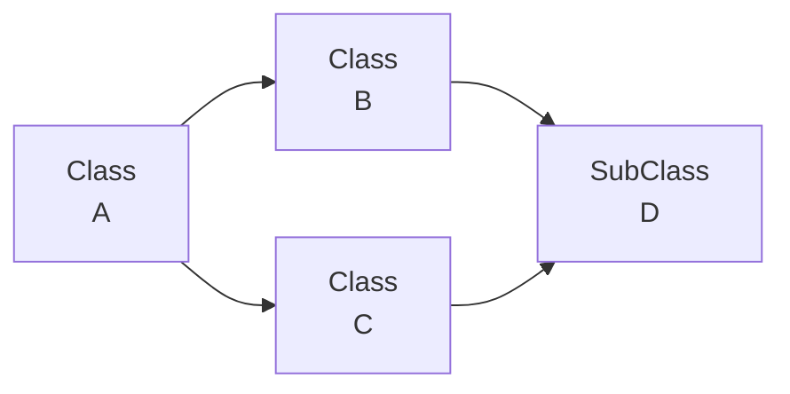

本备考笔记参考了@Karry_Ran 的复习提纲

参考复习资料 [[CPP临考之禅]]
## Chapter 1 新增语法

**作用域限定符**功能：
1. 局部变量与全局变量同名，作用域限定符可访问全局变量
2. 访问不同命名空间的同名变量
3. **类外部定义函数**，限定函数属于那个类
4. **访问类的静态成员**，`static` 修饰的成员属于类本身而非对象实例，`static` 修饰的静态成员并非必须用**静态成员函数**访问，其受到 `private` 等权限的影响
```cpp
class myClass {
	public:
		static int value;
		void func(); //此处不需要函数体
}

void myClass::func() {}; //此处实现函数体
int myClass::value = 0; //定义静态成员

int main(void)
{
	myClass obj; obj.func();
	cout << myClass::value << endl; //访问静态成员, 通过作用域限定符
	return 0;
}
```
5. **子类调用基类函数**。假设 `B` 继承自 `A`，`A` 中虚函数了一个 `virtual void show()`，`B` 重写 `A` 的 `show()` 函数后，如果想调用 `A` 中 `show` 的内容，可以用作用域限定符，如
```cpp
class A {
	public:
		virtual void show() {
			cout << "A show" << endl;
		}
}

class B {
	public:
		void show() override {
			cout << "B show" << endl;
			A::show(); // 调用基类的虚函数
		}
}
```

**内联函数——不做考察**：当函数体很短时，内联函数 `inline` 直接在 `main` 函数中调用函数的位置处插入声明的函数体，不需要压栈等一系列操作就可以实现函数使用；当函数体积太大时，会大大增加可执行文件体积
```cpp
inline int add(int x, int y) {return a + y;}
```
> 存在不需要用 `inline` 修饰的内联函数

**回顾**：指针的基础用法
```cpp
int num = 5;
int *ptr = &num; //指向num的指针
cout << *ptr << endl; //使用指针指向的元素
cout << ptr << endl; //输出指针地址
```
> 特别注意：`*` 运算符优先级最低！

`new` 与 `delete` 运算符：
* `new` 用于分配**指针**，如 `int *ptr = new int(5)` 返回指向一个值为 $5$ 的指针 `ptr`；也可以指向数组 `int *arrptr = new int[10]`
* `delete` 用于释放 `new` 指向元素的内存，如 `delete ptr` 和 `delete[] arrptr`；对于对象类型，先调用析构函数
> `new` 与 `delete` 详解参考

**`static` 关键字**：
* 修饰**全局变量**或**函数**时，它们仅能在当前文件 (如头文件的实现文件 `x.cpp`) 中被使用
* 修饰**类**的**成员**，形成**静态成员**，所有对象共享一份，内存中仅有一份，***必须在类外初始化***，常用于类的 `id` 变量 (统计第几个)。初始化时，需要声明所在类
```cpp
class MyClass { public: static int count; // 声明静态成员变量 };
int MyClass::count = 0; // 初始化静态成员变量
```
* 修饰**类**的**成员函数**，该函数无 `this` 指针，只能访问静态成员 (例如我要访问这是第几个 `id`)
```cpp
cout << Myclass::get_count() << endl; // 只能通过类名+作用域限定符号调用函数
```
* 修饰**函数内变量**，这种变量只初始化一次，而且每次调用保留上一次的值
```cpp
void func() {
	static int counter = 0;
	counter++;
	cout << counter << endl;
}
```
> 用 `static` 修饰类内的成员/成员函数，必须在类外初始化/实现
## Chapter 2 类

**访问权限**：

|修饰符|同类（类内部）|子类（派生类）|外部（其他类或全局函数）|
|---|---|---|---|
|`public`|✔️（可访问）|✔️（可继承并访问）|✔️（可访问）|
|`protected`|✔️（可访问）|✔️（可继承并访问）|❌（不可访问）|
|`private`|✔️（可访问）|❌（不可继承并访问）|❌（不可访问）|

**常 `const`**：
* `const` 属性可以分给变量、类的成员和类的成员函数
* 关于 `const` 的用法，参考[[常属性]]

**访问修饰符**：
* `public` 任何地方可访问
* `protected` 类内和派生类和可访问，类外不可访问
* `private` 仅类内可以访问

**`this` 指针**：
* 在访问类的**非静态成员**时，隐含调用了 `this` 指针
* 可以用于返回对象本身，即 `return *this`

**左右值引用**：
* **左值**指的是有地址的值，如 `int a = 5` 中的变量 `a`；**右值**指的是没有地址的值，如字面量 `5` 和临时变量 `a + b`
> 这是 `cpp11` 标准引入的，不作考试要求

**成员函数定义**：
成员函数有多种类型，可以分为：
* 普通成员函数，就是一般的成员函数
* **构造函数**和**析构函数**，分别构造和销毁对象用。特别地，有**复制构造函数**
* **静态成员函数**，通过类名直接调用，访问静态成员的函数 (不访问非静态成员)
* **常成员函数**，定义后加 `const`（在 `{}` 前，`()` 后），不可修改成员值
* **虚函数**和**纯虚函数**，在继承中用到
* **友元函数**

**成员函数实现**：成员函数可在类内声明，在类外实现，参考[[成员函数的实现]]

**友元函数**：
* 在类内声明，在类内外均可实现，在类外调用
* 友元函数有两种，分别是**全局友元函数**和**另一个类的友元函数**
* 关于**友元关系**，参见[[友元]]

**拷贝构造函数**：
* 使用时机为用一个对象**初始化**另一个对象，对象作为参数按值传递给函数，函数返回对象 (潜在，取决于编译器)
* 相对于**浅拷贝**，拷贝构造函数希望实现**深拷贝**，即避免将原对象的指针直接传递给新对象，而是重新划分区域给新对象
* 容易发现，拷贝构造函数的结果同其他构造函数类似，只是其参数为一个常量对象
* 在**继承**下，拷贝构造函数需要再初始化列表中用**子类**对象初始化**基类**对象，这可以直接实现 `Student(const Student &other) : Person(other) {...}`
```cpp
class Student {
    private:
        string name;
        int *age;

    public:
        Student(string n, int a) : name(n) {
            age = new int(a);
        }

        // copy construct function
        Student(const Student &other) : name(other.name) {
            age = new int(*other.age);
        }

        ~Student() {
            delete age;
            age = nullptr;
        }
```
## Chapter 3 继承

**继承**：对应访问修饰符有三种继承方式。对有含参构造函数的父类，在子类构造函数列表中初始化父类
```cpp
class Parent {
	public:
		int value;
		Parent(int v) : value(v) {}
};

class SubClass : public Parent {
	public:
		SubClass(int v) : Parent(v) {} // 初始化父类
};
```
* 公有继承下，父类成员在子类中性质不变
* 私有继承下，父类公有成员在子类中全部变为私有，子类函数可访问，外部不行
* 父类的私有成员，无论如何子类无法直接访问，只能通过父类的函数访问

|父类成员修饰符|`public` 继承|`protected` 继承|`private` 继承|
|---|---|---|---|
|`public`|`public`|`protected`|`private`|
|`protected`|`protected`|`protected`|`private`|
|`private`|不可访问|不可访问|不可访问|

**构造和析构顺序**：继承下的构造和析构顺序刚好相反，
1. 构造顺序。先父类构造函数，再子类成员变量 (与类定义时的声明顺序一致)，最后子类构造函数函数体
2. 析构顺序。先子类析构函数函数体，再父类析构函数调用

**虚函数**：实现了运行时多态，具体用法参见[[虚函数的使用]]。特别强调，为了实现父类指针操控子类，需要 `public` 继承父类，虚函数放在父类的 `public` 内

**虚类**：用于解决多重继承下的**菱形继承**问题。在下图中，不使用虚基类，将导致 D 继承两份 A 的成员引发问题。因此，B, C 对 A 的继承应当使用虚基类，即 `class B : virtual public A {};`

## Chapter 4 多态

在编译阶段就确定了调用的函数，这就是**静态多态性**，也就是编译时多态，包括**函数重载**和**模板**。**动态多态性**也叫做运行时多态，是在运行时确定要调用的函数，通过**虚函数**和**继承**实现

**运算符重载-不做考察**：运算符重载使得我们可以对自定义的类使用直观的**运算符**进行操作。具体要求参考[[运算符重载]]，查表参考[[运算符重载表]]。特别地，重载 `<<` 和 `>>` 涉及到 `iostream` 对象，参考 [[2025年6月11日]]
## Chapter 5 模板-不做考察

**模板**实现了泛型编程，可以提供可复用的代码。模板分为类模板和函数模板，它们创建的实例分别是**模板类**和**模板函数**

**模板的种类**：
* **函数模板**，在函数的参数列表中使用模板，可以对不同类型的变量执行同样的函数操作。参数可以有多个，如 `template<typename T1, typename T2>`
* **类模板**，在类中使用模板，则类可以接受不同类型的变量作为成员。`typename` 与 `class` 在模板中等效
* **模板的模板**，允许模板本身作为参数传递给另一个模板，基本语法为 `template<template<typename> class TemplateName>`
```cpp
#include <iostream>
#include <vector>
#include <list>
using namespace std;

// 定义一个模板类
template<template<typename> class Container>
class MyClass {
private:
 Container<int> data; // 使用模板模板参数作为容器类型
public:
 void add(int value) {
 data.push_back(value); // 使用容器的 push_back 方法
 }
 void print() {
 for (const auto& x : data) {
 cout << x << " ";
 }
 cout << endl;
 }
};

int main() {
 MyClass<vector> obj1; // 使用 vector 作为模板模板参数
 obj1.add(1);
 obj1.add(2);
 obj1.print(); // 输出：1 2

 MyClass<list> obj2; // 使用 list 作为模板模板参数
 obj2.add(3);
 obj2.add(4);
 obj2.print(); // 输出：3 4

 return 0;
}
```

## Chapter 6 流

### 6.1 输入输出流

- C++ 的输入输出基于流（stream）机制，常用头文件 `<iostream>`。
- **标准输入流**：`cin`，用于接收用户输入。
- **标准输出流**：`cout`，用于输出信息到屏幕。
- **格式化输出**：可用 `setw`、`setprecision`、`fixed` 等修饰符（需包含 `<iomanip>`）。
- **常用操作符**：
 - `<<`：插入运算符，输出
 - `>>`：提取运算符，输入
- **缓冲区刷新**：
 - `endl`：输出换行并刷新缓冲区
 - `flush`：只刷新缓冲区，不换行

```cpp
#include <iostream>
using namespace std;

int main() {
 int a;
 cout << "请输入一个数字：";
 cin >> a;
 cout << "你输入的是：" << a << endl;
 return 0;
}
```
> 为了避免频繁的 I/O 操作，有时候输入输出会在**缓冲区**进行。只有当缓冲区满或者遇到特殊符号才会一次性输出缓冲区的内容
---

### 6.2 标准错误流

- **标准错误流**：`cerr`，用于输出错误信息，默认不缓冲，遇到输出立即显示。
- **标准日志流**：`clog`，用于输出日志信息，缓冲输出。

```cpp
cerr << "发生错误！" << endl;
clog << "记录日志信息" << endl;
```
- 区别：`cerr` 不缓冲，适合立即输出错误信息；`clog` 有缓冲，适合记录日志。

关于 cpp 中的异常参见[[异常]]

## 附录: 关于 Vector

| **方法** | **功能** | **示例** |
| -------------------- | --------------------------------------------------- | ------------------------------------------ |
| `push_back(value)` | 在 `vector` 的末尾添加一个元素。 | `vec.push_back(10);` |
| `pop_back()` | 删除 `vector` 的最后一个元素。 | `vec.pop_back();` |
| `size()` | 返回 `vector` 中元素的数量。 | `std::cout << vec.size();` |
| `capacity()` | 返回 `vector` 的当前容量（可以容纳的元素数量）。 | `std::cout << vec.capacity();` |
| `resize(new_size)` | 调整 `vector` 的大小。如果新大小大于当前大小，用默认值填充；如果小于当前大小，删除多余元素。 | `vec.resize(5);` |
| `empty()` | 检查 `vector` 是否为空，返回布尔值。 | `if (vec.empty()) { ... }` |
| `clear()` | 移除所有元素，清空 `vector`。 | `vec.clear();` |
| `front()` | 返回第一个元素的引用。 | `std::cout << vec.front();` |
| `back()` | 返回最后一个元素的引用。 | `std::cout << vec.back();` |
| `insert(pos, value)` | 在指定位置 `pos` 插入一个元素。 | `vec.insert(vec.begin() + 1, 20);` |
| `erase(pos)` | 删除指定位置 `pos` 的元素。 | `vec.erase(vec.begin() + 2);` |
| `erase(first, last)` | 删除指定范围 `[first, last)` 的元素。 | `vec.erase(vec.begin(), vec.begin() + 3);` |
| `begin()` | 返回指向第一个元素的迭代器。 | `auto it = vec.begin();` |
| `end()` | 返回指向最后一个元素后一个位置的迭代器。 | `auto it = vec.end();` |
| `swap(other_vector)` | 交换两个 `vector` 的内容。 | `vec1.swap(vec2);` |

```cpp
#include <iostream>
#include <vector>
#include <algorithm> // std::sort

// 自定义结构体
struct Person {
 std::string name;
 int age;
};

// 自定义比较函数：按年龄升序排序
bool compareByAge(const Person& p1, const Person& p2) {
 return p1.age < p2.age; // 按年龄升序
}

int main() {
 std::vector<Person> people = {
 {"Alice", 25},
 {"Bob", 20},
 {"Charlie", 30}
 };

 // 使用自定义比较函数
 std::sort(people.begin(), people.end(), compareByAge);

 // 输出排序后的结果
 for (const auto& person : people) {
 std::cout << person.name << " (" << person.age << ")" << std::endl;
 }

 return 0;
}

```