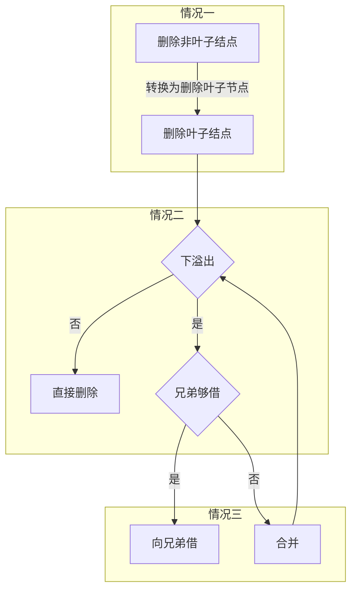

#  第一章 绪论


## 1.1 数据结构基础

**线性结构**： 数据元素之间存在一个对应一个的关系

**树状结构**： 数据元素之间存在一个对应多个的关系

**图状结构**：数据元素之间存在多个对多个的关系

**数据结构的表示**

$$
DataStructure = (D, S)
$$

其中D表示**数据元素集合**，S表示**逻辑结构表示**。数据结构在面向问题时的结构称为**逻辑结构**，在计算机硬件中的表示称为\*物理结构\*\*
和 **存储结构**

> 用类表示**抽象数据类型**

**算法的特性**：正确性，具体性，确定性，有限性，可读性和健壮性

**时间复杂度**：一般考虑最差时间复杂度，取运算次数的最高次项，例如$O(n^2 + n + 1) = O(n^2)$

# 第二章 线性表


## 2.1 线性表

线性表的实现有**顺序表** 和 **链表**两种

### 2.1.1 顺序表

顺序表可以用**数组** 或 **指针**实现

> 数组是特殊的指针

在顺序表中，逻辑结构和存储结构都是连续的。因此**随机访问**的时间复杂度为$O(1)$。用L表示每个元素存储单元个数，记$LOC(a_i)$为$a_i$的存储位置，则：

$$
LOC(a_{i+1}) = LOC(a_i) + L \\
LOC(a_i) = LOC(a_i) + (i - 1) * L
$$

> 首个元素偏移量为0

在顺序表中，插入元素的平均移动次数为$\frac{n}{2}$，删除元素的平均移动次数为$\frac{n-1}{2}$，所以这两个操作的时间复杂度为$O(n)$

### 2.1.2 链表

**链表**：链表是链式存储结构，逻辑结构连续但存储结构不连续。最简单的链表是单链表

链表的查询操作需要$O(n)$，但插入和删除操作都只需要$O(1)$

**带头结点的单链表**：带头结点的单链表可以在每次操作时不必判断链表是否为空(始终存在一个值域为空的节点)

***算法---链表元素倒置***
问题描述：用线性链表将线性表的元素倒置
算法：考虑两个一半的链表，将对应位置的值进行交换即可

**循环链表**：头结点或链表的最后一个节点的next指针不再指向nullptr，而是指向头结点。此时链表为空表示为`head->next=head`

***算法---解决约瑟夫问题***
问题描述：从n个元素组成的环中删去第m个，重复此流程直到剩下一个
算法：用循环链表解决

**双向链表**：每个节点都存储了前驱后继指针的链表是双向链表。当双向链表带一个头结点并使用循环链表形式时，可以快速的查询元素

```cpp
//插入一个新节点
n1->next = nx->next;
n1->next->back = nx;
nx->back = n1;
n1->next = nx;

//删除一个节点
nx->back->next=nx->next;
nx->next->back = nx->back;
```

> 可以为链表类添加当前位置节点的指针和元素个数，使得操作更有效率

## 2.2 习题

***算法---求两递增集合差集***
问题描述：已知两个单链表表示两个递增有序的集合，将他们合并为一个新的递增有序集合
算法：分别遍历两个链表，添加元素到另一个链表中，最后链接剩余链表

# 第三章 栈和队列


## 3.1 栈

**栈**： 限定在表头进行插入(**入栈**)和删除(**出栈**)的线性表称为栈。栈的插入删除原则是**先进后出**

### 3.1.1 顺序栈

**顺序栈**：用一个顺序表实现的栈就是顺序栈

顺序栈的缺点：

- 需要很大的存储空间防止频繁扩容
- 空间浪费

***算法---栈空间的利用***
问题描述：两个栈的内存分配不一，其中一个多另一个少，导致前者溢出而后者浪费
算法：设计一个足够大的栈空间，两端分别为栈底，直到中间相遇才发生溢出

### 3.1.2 链式栈

**链式栈**：用链表实现的栈就是链式栈。链式栈可以方便地进行增加删除操作

***算法---括号匹配***
问题描述：检查表达式中是否出现缺漏括号的现象
算法：用栈读取字符，读取右括号时判出栈前括号查询是否匹配，最后检查栈是否为空

## 3.2 队列

**队列**：只允许在一端删除(**出队**)另一端插入(**入队**)。当两端都能进行删除插入操作时称为**双端队列**，若对一端进行限制，则改为**限制双端队列**

### 3.2.1 链队列

链队列适用于元素变动大的情形，一般不会溢出

### 3.2.2 顺序队列

用数组实现队列时，需要用到**循环数组**的概念，否则会导致数组越界产生假溢出的问题，实现如下：

```
front = (front + 1) % maxSize; //入队
rear = (rear + 1) % maxSize; //出队
```

判满可以由三种方式实现：

1. 设定标志符区别队满
2. 用一个数据成员存储元素个数 推荐
3. 少用一个元素空间，判满条件改为`rear + 1 == front`

***算法---杨辉三角***
描述：输出杨辉三角的前n行
算法：用队列，第n行用到第n-1行队列元素

## 3.3 习题

***算法---表达式求值***
描述：给出字符串表示的表达式，求其运算值
算法：用栈，分别读取运算符和数字，按照优先级出栈运算

# 第四章 串

## 4.1 串及其实现

**串**：**字符串**简称为串。串是由0个及以上字符构成的有限序列，通常记为

$$
s = "a_0a_1\cdots a_{n-1}"
$$

其中s是**串名**，字符个数$n$为**串长**，双引号内的部分为**串值**，其中个每个元素是**字符**，长度为0的串是**空串**，全部字符为空格的串是**空格串**

> 串的比较设计字符的**ASCII**码值，码值靠前者为大

## 4.2 字符串匹配

**字符串匹配算法**：现有两串T和P，若从T中查找是否有与字符串P相同的子串，则称字符串T为**目标串**，字符串P为**模式串**。

### 4.2.1 简单字符串模式匹配算法

这种匹配算法的思想是从位置0出发，每次一次匹配长度为$l_p$的子串，若匹配成功返回首位置，否则将位置移动，直到匹配成功或长度不足

这个算法的循环所需的次数是$(n-m-1)*m + (m-1)$，当$m << n$时，算法时间复杂度为$O(n*m)$

### 4.2.2 KMP算法

在简单匹配算法中，我们每次比较模式串和目标串时，一旦检测到一个匹配不上的位置，就会将指针**回溯**从头比较。KMP算法解决了这个问题，使得算法时间复杂度锐减到$O(n + m)$

对于一个模式串，不妨考虑第$p_3$个位置发生匹配失败，且$p_0 \not = p_1$，因此显然地，移动一位仍然无法正确匹配

KMP算法构建了这样一个**next数组**，它用于当第$p_j$个位置发生不匹配时，模式串的整体移动长度。每个next数组元素值是当前元素前的子串的**最长公共前后缀**的长度。例如串：

$$
AABAA
$$

的前缀为：

$$
A, AA, AAB, AABA
$$

后缀有：

$$
A, AA, BAA, ABAA
$$

最长公共前后缀的长度为2。这也就是说，将模式串的2号元素与当前指针位置进行比较(起始位置为0)

kmp算法流程：

- 构建模式串的next数组 时间复杂度为$m$
- 对目标串进行比较 时间复杂度为$n$

# 第五章 数组和广义表


## 5.1 数组

### 5.1.1 数组的基本概念

**数组**是一个元素可直接按序号寻址的线性表：

$$
a = a(a_0, a_1, \cdots, a_{m-1})
$$

若$a_i$都是简单元素，则数组是**一元数组**；若每个元素$a_i$都是一维及以上数组时，这个数组就扩充为**多元数组**

### 5.1.2 数组索引

在n维数组中，每个元素受n个**线性关系**的约束。若它在第$1 \sim n$个线性关系中的序号分别为$i_j, \quad j = 1, 2, \dots, n$，则称它的下标为$i_j$，此元素可以索引为$a_{i_1 i_2 \dots i_n}$

若n维数组的第$i$为长度为$b_i$，则数组中共含有$\prod^n_{i=1}b_i$个元素，每个元素受$n$个线性关系约束。设单个元素存储单元长度为$L$，则共需要存储单元$m * L$个，其中$m = \prod^n_{i=1}b_i$

用$Loc(i_1, i_2, \dots, i_n)$表示下标同样的元素的存储地址，则已知首地址$base$时，有：

$$
Loc(i_1, i_2, \dots, i_n) = base + Map(i_1, i_2, \dots, i_n) * L
$$

其中$Map(i_1, i_2, \dots, i_n)$表示一个**映射方式**

**优先映射**：优先映射可以分为**行优先映射**和**列优先映射**，分别表示两种顺序存储方式。其中行优先映射可以看做(1)，列优先映射可以看做(2)

$$
\begin{matrix}
1 &2 & 3 \\
4 &5 & 6 \\
7 &8 &9
\end{matrix} \quad (1) \\
\space \\
\begin{matrix}
1 & 4 & 7 \\
2 & 5 & 8 \\
3 & 6 &9
\end{matrix}
\quad (2)
$$

对于高维数组，例如三维数组，先把第一个下标为0的元素排列为一行，再把第一个下标为1的元素排列为一行，依次类推。每行按后面的索引升序排列

可以得到三维数组的行优先映射函数：

$$
Map(i_1, i_2, i_3) = i_1b_2b_3 + i_2b_3 + i_3
$$

则n维数组的行优先映射函数为：

$$
Map(i_1, i_2, \dots, i_n) = \sum^{n-1}_{j=1}i_j * \prod^n_{k = j+1} b_k + i_n = \sum^n_{j=1}c_ji_j
$$

进一步地：

$$
Loc(i_i, i_2, \dots, i_n) = base + \sum^n_{j=1}c_ji_j *L
$$

其中$c_n = 1, c_{j-1} = b_j × c_j, 1 < j \leq n$

当第n维数组第k维下标范围是$[l_k, h_k]$，则第$k$维下标的长度是$d_k = h_k - l_k + 1$

列优先可以依此类推

## 5.2 矩阵

### 5.2.1 矩阵的定义和操作

**矩阵**可描述为二维数组。重新声明的矩阵类，采用第一个下标为1进行索引

### 5.2.2 特殊矩阵

特殊矩阵可以分为：

- **方阵** 行列相同的矩阵
- **对称阵** 满足$M[i][j] = M[j][i]$
- **三对角矩阵** 仅当$|i - j| > 1$时，$M[i][j]=0$
- **上下三角矩阵** 仅三角区域值不为0
 

#### 5.2.2.1 三对角矩阵

在$n × n$的三对角矩阵中，三条对角线外的元素都是0，且：

- 主对角线 满足下标$i = j$
- 低对角线 $i = j +1$
- 高对角线 $i = j - 1$

为了减少存储量，可以考虑将三对角矩阵映射为到一个数组上，映射方式有：

- 按行映射
- 按列映射
- 按对角线次序映射

每种映射方式的首个元素都是0或常值C

#### 5.2.2.2 三角矩阵

三角矩阵的**非常数区域**的元素个数为：

$$
\sum^n_{i=1} i = \frac{n(n+1)}{2}
$$

因此需要$\frac{n(n+1)}{2}+1$个存储单元存储这些元素

三角矩阵的映射方式有：

- 按行映射
- 按列映射

下三角矩阵中，若元素$M[i][j]$不在常数区域内，则他在按行映射方式存储下的位置是$\frac{i(i-1)}{2} + j$

#### 5.2.2.3 对称矩阵

在对称阵中，上下三角区域的元素是相同的，因此可以只存储上三角或下三角的元素，因此需要存储单元数为：

$$
\frac{n(n+1)}{2}
$$

可以得到$M[i][j]$在一维数组中的存储位置(按行存储)$k$为：

$$
k =
\begin{cases}
\frac{i(i-1)}{2} + j - 1, i \geq j \\
\frac{j(j-1)}{2} + i - 1, i < j
\end{cases}
$$

### 5.2.3 稀疏矩阵

**稀疏矩阵**是0居多的矩阵，有许多元素都是0的矩阵是系数矩阵。记：

$$
\delta = \frac{t}{m × n}
$$

为**稀疏因子**

为了保持原来的逻辑关系，并且减少存储量，我们用**三元组**来存储这些元素。由行号、列号、元素值可以唯一确定一个元素在矩阵中的位置；再加上行列长度这一对二元数对，可以唯一确定一个稀疏矩阵

#### 5.2.3.1 三元组顺序表

用顺序表存储三元组表可以得到稀疏矩阵的顺序存储结构，即**三元组顺序表**

为了避免丢失信息，增设一个**信息元组**：

$$
(row, column, number\_ unzero)
$$

作为三元组表的第一个元素

三元组顺序表可以实现矩阵转置，步骤：

1. 将每个非零元素的对应的三元组行号、列号对调
2. 将三元组重新排序，使其中的元素按行或列排序

为了降低时间复杂度，在进行行列互换操作时，同时排序，也即：

1. 将三元组表sourece中元素取出，交换行列号
2. 将变换后的三元组存入目标三元组dest中的适当位置

**简单转置算法**：第一从从source中取出应该放置到dest中第一个位置的元素，行列号互换放在dest的第一个位置；第二次依次类推。其本质是在source中按列号递增取出元素并存放，时间复杂度为$O(cols * num)$

> 因为按行优先存储三元组，所以在source中的三元组必然按行递增存放(同列情况下)

**快速转置算法**：在依次取出source中的每个元素的同时，确定它要放置的位置可以实现快速转置。因此增加两个数组，

- numbers\[\] 用于存放每列的元素个数
- position\[\] 用于存放每列第一个非零元素在dest中的index

这样，首先遍历一遍source，获取每列首个非零元素的位置，同时记录每列非零元素个数。遍历后，接着遍历source获取每个列的对应存放位置，直接存放

#### 5.2.3.2 十字链表

当稀疏矩阵中的非零元素个数或位置经常变化，可以用**十字链表**表示稀疏矩阵。十字链表中的节点可以表示为：

这样的结构可以使每个链表既是行中的节点，又是链中的节点

为了快速找到每个行、列链表，可用两个一维数组分别存储行列链表的头指针


## 5.3 广义表

### 5.3.1 基本概念

**广义表**：简称为**表**，记作

$$
GL = (a_1, a_2, \dots, a_n)
$$

其中$GL$是**表名**，当$n=0$时为**空表**；$a_i$为**表元素**，既可以是单个元素(**原子**)，也可以是满足本定义的广义表，例如

$$
G = ((a, (b, c), x, (y, z) )
$$

表示一个长度为3的广义表。当一个广义表中含有广义表自身时，称为**递归表**

表分为**表头**和**表尾**。当广义表长度$n>0$时，称第一个元素为表头，剩余元素为表尾。广义表的**深度**就是广义表中嵌套表的层数

> 表头任意，表尾一定是广义表！
> 例如表$(a, (b, c))$的表尾是$((b,c))$而不是$(b, c)$！

在广义表中，层号相同的节点是**同层节点**

### 5.3.2 广义表存储结构

广义表的链式存储结构包含三种结点：

- 头结点 用于表示一个表头
- 原子结点 表示一个表中的某个原子
- 表节点 表示表中的子表
 

# 第六章 树

## 6.1 树的基本概念

### 6.1.1 定义

$n=0$的树是**空树**，非空树的特征：

- 有且仅有一个特定的结点**根**，它只有直接后继，没有直接前驱
- $n > 1$时，其余节点分为$m$个互不相交的有限集$T1, T2, \dots, T_m$，其中每个$T_i$都是一颗**子树**。每个子树可有0或多个后继，但只有一个根
 

> 树的定义是递归定义

### 6.1.2 术语

树的术语有：

- **结点** 包含元素值和逻辑关系
- **结点的度** 表示结点拥有的子树数目
- **树的度** 所有节点度的最大值
- **叶子结点** 又称为终端节点和外部节点，是度为0的节点
- **分支节点** 度大于0的节点
- **孩子节点**和**双亲节点** 子树的根节点是此节点的孩子节点，此节点是双亲节点
- **结点层次** 根节点的层次为1，每层依次递增
- **高度** 叶子结点所在的最大层次为树的高度
- **兄弟节点** 同一双亲的孩子节点
- **堂兄弟结点** 同一层但双亲不同的节点
- **祖先节点** 从根节点到此节点经过的节点都是，包括双亲节点
- **子孙节点** 结点孩子和孩子的孩子
- **路径** 从树的一个节点到另一个节点的分支构成两个结点的路径
- **有序树**： 树中结点各子树从左至右有次序，即子树之间有序为有序树
- **无序树**： 根节点的各颗子树之间可换位置
- **森林** 由$m \geq 0$颗互不相交的树的集合构成

## 6.2 二叉树

由一个根节点和两颗左右子树构成的树是**二叉树**，形如：


## 6.2.1 二叉树性质

二叉树的性质有：

- **性质一** 一颗二叉树的第$i$层上，结点最多为$2^{i-1}$
- **性质二** 高度为$k$的二叉树上至多有$2^k-1$个结点
- **性质三** 含有$n_0$个叶子结点，$n_2$个度为2的节点的二叉树，必有

$$
n_0 = n_2 + 1
$$

**满二叉树**：除最后一层外，每层节点度为2，最后一层度为0的树
**完全二叉树**：满二叉树按特定顺序去掉子树


由此得到：

- **性质四** 具有$n$个结点的完全二叉树，高度为$[log2_n] + 1$，其中的$[]$表示向下取整

> 完全二叉树的度为1的节点最多只有一个

- **性质五** 含$n$个结点的完全二叉树，按照从上到下，从左到右的顺序从$i$至$n$编号，对于结点$i$，有
 - $i=1$，则$i$是根；否则$i>1$，结点$[i/2]$是$i$的双亲节点
 - $2i>n$，则$i$无左孩子；否则$2i$是$i$的左孩子
 - $2i+1>n$，则$i$无右孩子；否则$2i+1$是$i$的右孩子

### 6.2.2 二叉树存储结构

#### 6.2.2.1 顺序存储结构

将二叉树的所有节点存储在一片连续区域内，存储时只保持值。根据性质5，将结点编号，可以推算出双亲和孩子节点的编号

然而，当二叉树不完全时，会导致存储空间浪费，出现大量**虚节点**

#### 6.2.2.2 链式存储结构

链式存储结构中，每个节点包含

- 值
- 左指针 指向左孩子
- 右指针 指向右孩子
- 父指针 指向双亲，根据设计需要添加

### 6.2.3 遍历二叉树

遍历二叉树的方式有：

- 前序遍历 访问根节点$\to$遍历左子树$\to$遍历右子树
- 中序遍历 遍历左子树$\to$访问根节点$\to$遍历右子树
- 后序遍历 遍历左子树$\to$遍历右子树$\to$访问根节点
- 层次遍历 从上至下，从左往右遍历结点
 

遍历的算法有：

- 递归算法 直接按照递归方式遍历
- 非递归算法 用***栈***实现，访问后入栈，直到遍历完其子树出栈

```cpp
void pre_print() {
 if (root == nullptr) return;

 stack<node*> nodeStack;
 nodeStack.push(root);

 while (!nodeStack.empty()) {
 node *current = nodeStack.top();
 nodeStack.pop();
 cout << current->value << " ";

 //每次检查当前输出结点的左右，优先压入右孩子
 if (current->right != nullptr) {
 nodeStack.push(current->right);
 }
 if (current->left != nullptr) {
 nodeStack.push(current->left);
 }
 }
}
```

- 层次遍历算法 用***队列***实现，访问根后入队，将左右孩子分别入队，重复流程

通过遍历二叉树可以实现：

- 计算结点数和树高
- 显示、销毁、复制
- ***由前序序列中序序列构造二叉树***
 - 前序序列的首结点是根节点
 - 在中序序列中找到此节点
 - 划分左右子树，重复此流程
- ***表达式的前缀表示、中缀表示和后缀表示***

***算法---前中后缀表达式***
问题：将中缀表达式改写为其他两种表达式
思路：将中缀表达式写成二叉树(可用中序遍历得到此表达式)，再分别进行前序后序遍历

## 6.4 线索二叉树

在某种遍历条件下，二叉树会被改造为一个线性关系的序列。在一个有$n$个结点的二叉树中，有$2n_0 + n_1$个空指针成员，因此空指针有$n+1$个。可考虑用这些空指针来存储某种遍历关系下的前驱后继指针，这些指针叫做**线索**，这样的二叉树就是**线索化二叉树**

线索化二叉树除了左右结点的指针外，新增添了两个标志位，分别用于表示此结点是存储左右孩子还是存储前驱后继

对于三种遍历类型序列，都有约定：

- 若左孩子指针为空，则存储该遍历类型的前驱结点指针
- 若右孩子指针为空，则存储该遍历类型的后继结点指针

> 解决此类问题的方法是直接根据要求的遍历方式获取遍历序列，再来找前驱后继

## 6.5 树和森林

### 6.5.1 树的存储

**双亲表示法**：每个结点只存放其双亲的位置，这样每个结点的成员只有其值和双亲位置两个；查找双亲很快，但查找孩子较慢，需要遍历整棵树


**孩子双亲表示法**：每个结点后面再接上一个链表，用于存放孩子的索引。不同的结点度不一样，因此每个链表长度并不等长(否则会有很多空指针)


**孩子兄弟表示法**：每个结点的孩子与兄弟唯一，可用二叉链表表示整棵树。此时找到某节点的孩子节点只需重复遍历孩子的兄弟指针直到为空；但找到双亲则需要从根节点开始

> 左孩子右兄弟；常用于二叉树和多叉树或森林的转换


### 6.5.2 树的显示

可用**凹入法**显示树，例如：

> 凹入法显示树本质上是从输出的从上到下选择遍历方式，再确定空格输出方式


### 6.5.3 森林的存储表示

同树的存储，森林的存储也有3种：

- 双亲表示法 假定树排列顺序就是树根在数组中的顺序，因此扫描数组就可找到根
- 孩子双亲表示法 同上
- 孩子兄弟表示法 将树根旁的另一颗树根看做兄弟 ^d9b556

### 6.5.4 树和森林的遍历

遍历树没有“中序”的说法，分为：

- **先根遍历**
- **后根遍历**
- **层次遍历**

遍历森林类似于遍历树，只不过每次遍历一棵树时，都对对应的树采取相应的遍历方法

### 6.5.5 树和森林与二叉树的转换

孩子兄弟表示法可以用二叉链表存储树和森林的结构，这与二叉树的表示方式是对应的。其中，树是森林的特例，因此只需要考虑森林的转换方式 ^843404

**森林转二叉树**：

1. 将森林的每颗子树用[[#^d9b556|孩子兄弟表示法]]表示
2. 链接每棵树的树根

**二叉树转森林**：

1. 二叉树的根作为首颗树的根，根的左孩子是这颗树的子树
2. 二叉树根的右孩子作为第二课树的根，这个右孩子的左边为子树，右边为第三课树树根
3. 以此类推

> 二叉树和森林的转换主要通过孩子兄弟表示法

## 6.6 哈夫曼树和哈夫曼编码

**哈夫曼编码**是用于信息传递的一种算法，可以通过**哈夫曼树**构造。哈夫曼树的概念有：

- **路径** 根节点到某节点的路径
- **路径长度** 路径上的连线数目
- **树的路径长度** 根节点到每个结点的路径长度和
- **权** 赋予每个结点的值
- **带权路径长度** 路径长度与权的乘积。树的带权路径长度为$WPL=\sum^n_{i=1}w_il_i$
- **哈夫曼树** 给定$n$个权值，构成的$WPL$最小的二叉树

构造哈夫曼树步骤：

1. 从候选结点中取出权值最小的两个，生成父节点并连接
2. 将父节点放入候选节点中
3. 重复1-2步，直到候选结点为1
4. 将这个候选节点当做根节点

## 6.7 树的计数

含有$n$个结点的不相似二叉树有：

$$
b_n = \frac{1}{n+1} C^n_{2n}
$$

颗，可以推得任意树颗数：

$$
t_n = b_{n-1} \ = \frac{1}{n} C^{n-1}_{2n-2}
$$

因此森林树满足：

$$
f_n = b_n = \frac{1}{n+1} C^n_{2n}
$$

# 第七章 图

## 7.1 图的定义和术语

**图**由**顶点**和**边**两个有限集构成，定义为：

$$
Graph = (V, R)
$$

其中$V = \{ v| v \in dataobject\}$：

$$
\begin{aligned}
&R = \{E\} \\
&E = \{ <u, v> | P(u, v) \land (u, v \in V\}
\end{aligned}
$$

图可以分为：

- **有向图**：边限定从$u$到$v$，此时$u$为**起点**，$v$为**终点**
- **无向图**: 边不限定方向，两端都可以联通，有序对表示为$(u, v)$
- **有向网**：在有向图的基础上，边有**权值**
- **无向网**：在无向图的基础上，边有权值
 

记边数为$e$，则：

- 无向图 $0 \leq e \leq \frac{n(n-1)}{2}$，边最大时为**完全图**
- 有向图 $0 \leq e \leq n(n-1)$

> 每个节点都有连接的对应顶点时为完全图

其中，边较少的图是**稀疏图**，较多的是**稠密图**

若图$G_1 \in G_2$，则称$G_1$是$G_2$的**子图**

对于无向图，边$(u, v)$存在，则称$u,v$互为**邻接点**，这条边**依附**于顶点$u,v$。顶点的**度**是与其相关联边的数目

对于有向图，$<u, v>$存在，则称$u$邻接到点$v$，点$v$邻接自点$u$，邻接到$v$的边的数称为$v$的**入度**，记为$ID(v)$，邻接自$v$的边的数称为$v$的**出度**，记为$OD(v)$，顶点的度是出度和入度的和$D = ID + OD$。设顶点$v_i$的度记为$D(v_i)$，则一个有n个顶点，$e$条边的图满足：

$$
e = \frac{1}{2} \sum^{n-1}_{i=0} D(v_i)
$$

从顶点$u$到$v$的边构成的序列称为从$u$到$v$的**路径**，顶点序列长度为经过顶点的数(顶点可以相同)。若路径上的各个顶点都不同，这个路径是**简单路径**。**路径长度**是指路径包含边的条数。若在路径中$v_1 = v_n$，则称这样的路径是**回路**，若回路除了起点和终点相同外，其他顶点都不同，这样的路径是**简单回路**

在无向图中，***任意***两个不同顶点都存在从一个点到另一个点的路径，则称此无向图是**连通**的。无向图的极大连通子图称为**连通分量**

> 注意连通和邻接的区别。任意两个路径都能相通(从一点到另一点)是连通图；任意两个顶点都邻接是完全图


> 图可以由多个不联通的子图组成。
> 连通分量是相对于一个子图而言的

在有向图中，若***任意***两个不同顶点都存在从一个顶点到另一个顶点的路径，则称这个有向图是**强连通**的。有向图中的极大强连通子图称为**强连通分量**

连通图的极小连通子图称为**生成树**。生成树包含全部顶点，且只有$n-1$条边。任意添加一条边，必将构成回路

在图或网的实现中，对每个顶点加一个标志，用于在便利操作中标识顶点是否被访问，利于便利操作

其他关于图的补充概念与应用参见[[图论与网络模型]]

## 7.2 图的存储

### 7.2.1 邻接矩阵

设有$n$个顶点$v_0, v_1, \dots v_{n-1}$的的图，它的**邻接矩阵**是一个$n × n$的数组，第$i$行包含所有以$v_i$为起点的边，第$j$列包含所有以$v_i$为终点的边，图定义：

$$
Matrix[i][j] =
\begin{cases}
1, \quad \exists <v_i, v_j> \\
0, \quad \not \exists <v_i, v_j>
\end{cases}
$$

网定义：

$$
Matrix[i][j] =
\begin{cases}
w_{ij}, \quad \exists <v_i, v_j> \\
\infty, \quad \not \exists <v_i, v_j>
\end{cases}
$$

其中$\infty$表示比任何权值都大的一个数

邻接矩阵的每个元素都占存储空间，所以空间复杂度为$O(n^2)$

对于有向图，第$i$行的元素和为顶点$v_i$的出度$OD(v_i)$，第$j$列的元素和为顶点$v_j$的入度$ID(v_j)$，也就是：

$$
OD(v_i) = \sum^{n-1}_{j=0} Matrix[i][j] \\
ID(v_j) = \sum^{n-1}_{i=0} Matrix[i][j]
$$

对于无向图，邻接矩阵是一个***对称矩阵***。顶点$v_i$的度$D(v_i)$是邻接矩阵第$i$行的元素(或第$i$列)元素之和，即：

$$
D(v_i) = \sum^{n-1}_{i=0} Matrix[i][j] = \sum^{n-1}_{i=0}Matrix [j][i]
$$

### 7.2.2 邻接表

**邻接表**中每个顶点都建立一个单链表，第$i$个顶点的单链表由图中顶点$v_i$相关联的边构成。边在邻接表中的顺序任意，由边的输入顺序决定

本质上，邻接表是将矩阵中的行用用链表存储，且仅存储非0元素。设图的有$e$条边，有$n$个顶点则：

- 用邻接表表示无向图时，需要存储$n$个顶点和$2e$条边
- 用邻接表存储有向图时，需要存储$n$个顶点和$e$条边

因此当$e <<n^2$时，邻接表比邻接矩阵更节约存储空间
下面是图的邻接表表示：

下面是网的邻接表表示，比图多了权值的存储：


## 7.3 图的遍历

遍历图时需要解决：

- 非连接图 从起点出发不能到达所有顶点
- 回路 可能陷入死循环

解决上述问题的方式是设置$tag$进行标记。访问后的顶点设置值为true，否则为false。对于非连接图，可以跳到false的顶点继续遍历

### 7.3.1 深度优先搜索

**深度优先搜索DFS**：在搜索过程中，每次访问一个顶点$v$后，DFS将递归的访问所有它的未被访问的相邻的顶点，也即沿着图的某一分支进行搜索，直至抵达末端，最后进行回溯，以此类推。

深度优先搜索过程将产生一颗**深度优先搜索树**，此树由图遍历过程中所有连接某一个新(未被访问的)顶点边锁组成，并不包括连接已访问顶点的边。

> DFS适用于所有图


深度优先搜索的时间复杂度与存储结构有关：

- 邻接矩阵 $O(n^2)$
- 邻接表 $O(e + n)$

其中$e$是边数，$n$是顶点数

### 7.3.2 广度优先搜索

**广度优先搜索BFS**：在搜索过程中，访问了顶点$v$之后依次访问顶点$v$未被访问的邻接点，然后再从这些邻接点出发访问剩余的顶点，直到图中所有未被访问的顶点的邻接点都被访问完了为止。如果此时还有未被访问的顶点，则选择一个未被访问的顶点作为起始点继续访问

实际上，BFS是访问以$v$为起始点，从其出发依次访问和$v$路径相通且路径长度为$1, 2, \dots$的顶点，然后生成搜索树


## 7.4 连通无向网的最小代价生成树

**最小代价生成树MST**简称**最小生成树**。对于一个给定的连通网Net，最小生成树是包括Net中所有顶点和部分边的树，满足：

- 最小生成树边的条数是顶点个数减一，且最小生成树连通
- 最小生成树边上的权值和最小

构造最小生成树用到的定理：设无向连通网$Net = (V, \{E\})$，$U$是顶点集$V$的非空子集。若$(u,v)$是连接$U$与$V-U$具有最小权值的边$(u \in U, v \in V - U)$，则存在一颗包含边$(u, v)$的最小代价生成树

### 7.4.1 Prim算法

设$Net = (V, \{E\})$是连通无向网，TE是最小代价生成树的边的集合，步骤：

1. TE = {}, $U = \{u_0\}$ 也就是任取一点放到集合U中
2. 在$\forall (u, b) \in E, u \in U, v \in V - U$的边中，选择权值最小的边$(u', v')$ 也就是在整个U集合中找一条权值最小的边连接

> V - U表示不在树上点的集合

3. 将$(u', v')$并入TE中，$v'$并入$U$中 也就是放点到U中
4. 重复步骤(2)、(3)，直到TE有$n-1$条边，此时$T = (V, \{TE\})$就是最小生成树

> 考试考察作图，不考察编程

### 7.4.2 Kruskal算法

步骤：

1. 取出所有的顶点
2. 在所有的边中，找一条最小权值边放入边集，除非此边会导致回路
3. 重复步骤2，直到$n-1$的边添加到边集中

### 7.4.3 两种算法的比较

- Prim算法的时间复杂度为$O(n^2)$
- Kruskal算法的时间复杂度为$O(n +e \log e)$，在假设$e \log e > n$时，时间复杂度为$O(e \log e)$

> 要达到这种时间复杂度，需要对权值进行快速排序

稠密网适合用Prim算法构造最小生成树，稀疏网适合用Kruskal算法构造最小生成树

## 7.5 有向无环图

**有向无环图DAG**是一个无环的有向图

通过深度优先搜索遍历可以判断一个图是否为有向无环图

### 7.5.1 拓扑排序

**拓扑排序**：对于一个有向无环图，将其中任意一对顶点$<u, v>$排列在一个现行序列中，且保证所有的在图中的数对排列后都按照$u$在$v$前的顺序，这个线性序列就是拓扑序列

**AOV图**：用拓扑序列将顶点表示活动，有向边表示活动间的优先关系，这样的图称为AOV图

构造拓扑序列的步骤：

- 在图中任意选一个无前驱顶点输出(入队)
- 从图中删除该顶点和所有以它为起点的边
- 重复前两个步骤，直到全部顶点输出，此时输出序列即为拓扑序列；或者图中的所有顶点都没有前驱，此时图有环

> 从拓扑序列构造法可以看出，拓扑序列不唯一

在实现拓扑排序的过程中，可用$indegree[]$存储顶点的入度，无前驱顶点即为入度为0的顶点，删除顶点即是将此边终点顶点的入度减一；同时用队列存储输出顶点。示例代码实现的拓扑排序算法时间复杂度为$O(n + e)$其中$n$为顶点$e$为边

### 7.5.2 关键路径

**AOE(Acitivity on Edge)网**：与AOV图类似，AOE网是用***边***表示活动的网，是边带有权值的有向无环图。AOE网可以用来计算工程的最短完成时间

> AOE网中的结点是**事件**，边是**活动**

AOE网通常只有一个开始点和完成点，分别称为**源点**和**汇点**。源点的入度为0，汇点的出度为0

在AOE网中，有些活动可以并行进行，最短完成时间是从源点到汇点的最长路径长度，也就是路径上所有权值之和。这样的路径是**关键路径**，完成工程的最短时间就是关键路径的长度

预定义4个关键路径的描述量：

- $ve(v_j)$ 表示事件$v_j$的最早发生时间
- $vl(v_j)$表示事件$v_j$的最晚发生时间
- $ee(i)$表示活动$a_i$的最早开始时间
- $el(i)$表示活动$a_i$的最晚开始时间

那么，关键路径的上的结点**关键活动**可以定义为：

$$
ee(i) = el(i)
$$

的活动。对于其他活动，定义$el(i) - ee(i)$为**活动余量**。可以看到，关键活动的活动余量为0

求关键路径的步骤：

1. 从源点出发，求每个事件的最早发生时间。事件的最早发生事件通过拓扑排序求得，每次更新$ve$，保持最大值
2. 根据每个事件的最早发生时间，计算每个活动的最早发生时间
3. 从汇点出发，求每个事件的最晚发生时间
4. 根据每个事件的最晚发生时间，计算每个活动的最晚发生时间
5. 计算每个活动的活动余量，活动余量为0的边就是关键活动

## 7.6 最短路径

最短路径问题是指，从网中的某个顶点$u$到另一个顶点$v$的路径不止一条，寻找一条路径，使得其在此路径各边的权值和最小。称路径的起始点为**源点**，终止点为**终点**


### 7.6.1 单源点最短路径

不难发现，若$(v_0, \cdots, v_k, v_j)$是最短路径，则$(v_0, \cdots, v_k)$也是最短路径。要存储从$v_0$到$v_j$的最短路径，只要存储到$v_j$最短路径上的前一个顶点$v_k$即可

> 这个思想在Floyed算法中也成立。因此，Floyed算法建立最短路径的中间点时，也是记录前一个点

**迪杰斯特拉算法**是一种按最短路径长依次递增顺序逐次生成最短路径的算法，实现步骤：

1. 将所有点的距离设置为$\infty$
2. 从源点开始，获取到源点的距离(显然为0)
3. 接着，查找源点的后继点，获取到所有后继点的距离，其中，最小的值为此次搜索的最短路径，标记点从源点移动到此点；将搜索好的距离与已经占位的距离比较，保留最小的
4. 从标记点开始，搜索其后继点，同样获取到所有后继点的距离，其中最小的值为本次搜索获取的最短路径；更新占位最短距离
5. 重复流程，直到所有点的最小距离被获取

> 每次探测最短路径时，都保留其中的一条最小值作为全局搜索的最优解

迪杰斯特拉算法实际上是一种**贪心算法**，但是可以证明其为数学上全局最优。迪杰斯特拉算法的时间复杂度为$O(n^2)$

### 7.6.2 所有顶点的最短路径

**弗洛伊德算法**可以用来求所有顶点之间的最短路径

步骤：

1. 创建一个矩阵，表示每个点之间的初始距离。其中，不能直达的两个点之间的距离记为$\infty$
2. 从某一个点开始，对$\forall$的点，求这个点通过此次选择点到达另一个点的路径。若此路径比原来占位的路径短，更新此路径

> 例如，选择A点，则B到C的距离可以更新为从B-A-C或B-C

3. 选择另一个点，重复步骤2，更新占位路径。
4. 重复步骤3直到所有点都被选择了一次。此时，矩阵中的距离为每个点两两之间的最短距离

为了记录最短权值求取的过程，可以再添加一个矩阵，用于记录每次获得最小距离时，经过的点

注意：

1. 弗洛伊德算法的时间复杂度是$O(n^3)$
2. 弗洛伊德算法可以处理负权图，不能处理带负权环的图
3. 形成的矩阵是对称矩阵，对角线上的值是0

# 第八章 查找

## 8.1 查找的基本概念

**查找**：在数据集合中寻找满足够钟条件的数据对象

查找表通常包括4个操作：

1. 查询某个元素是否在表中
2. 检索某个元素的各种属性
3. 在查找表中插入一个数据元素
4. 在查找表中删除某个元素

其中，只进行前两种查找操作的的查找表是**静态查找表**，包括全部操作的，可以更改数据元素的是**动态查找表**

**关键字**是数据元素的某个数据项的值，可用于标识一个数据元素或记录。

## 8.2 静态表的查找

### 8.2.1 顺序查找

顺序查找的查找过程是：从第一个记录开始逐个地对记录的关键字的值进行***比较***，如果查找的关键字的值和给定值相等则查找成功，返回序号；如果直到最后一个值都不能成功，查找失败，返回-1

用**平均查找长度ASL**衡量查找表的效率。对于$n$个元素的查找表，查找成功的平均比较次数为：

$$
\text{ASLsucc} = \sum^{n-1}_{i=0} p_i c_i
$$

其中$p_i$为查找表中第$i$个对象的概率，满足$\sum^{n-1}_{i=0} p_i = 1$，$c_i$是查找到第$i$个对象所需关键字的比较次数

在顺序表中：

$$
\text{ASLsucc} = \sum^n_{i=0} p_i (i+1)
$$

等概率查找下，有：

$$
\text{ASLsucc} = \frac{n+1}{2}
$$

也就是对于顺序查找，等概率情况下，平均查找长度为$\frac{n+1}{2}$。当查找不成功时，比较次数为$n$

在顺序表开头添加一个哨兵，从后往前查找，则查找失败条件改为找到哨兵，可以减小比较次数

> 这里的哨兵就是待查找值，查找条件为直到找到target，无需检查边界

### 8.2.2 有序表查找

**有序表**：是指查找表的元素按关键字有序，即

$$
elem[0] \leq elem[1] \leq \cdots \leq elem[n-1]
$$

有序表的查找用**二分查找**实现。二分查找的本质是，确定待查元素的范围，再逐步缩小范围，直到查找到元素或失败

二分查找的关键是确定每次查找的上下限。为了防止超过范围，用公式：

$$
half = [i + (j - i) / 2]
$$

来计算中点

将查找过程画成一颗查找树，可以计算出查找失败的比较次数不超过$[\log_2 \space n] + 1$。对于每个元素，它的查找次数为在查找树中的高度。

一般情况下，$n$长的二分查找的判定树的深度和含有$n$个结点的完全二叉树深度相同

二分查找的时间复杂度是$O(log \space n)$

> 小数据量下，用线性查找的速度反而比二分查找快

## 8.3 动态查找表

### 8.3.1 二叉排序树

**二叉排序树**被定义为：

- 可能为空
- 若左子树不空，则左子树上所有的结点的关键值均大于它根结点的关键字值
- 若它右子树不为空，则右子树上所有的关键字指均大于它的根结点的关键字值
- 左右子树均为二叉排序树
 

二叉排序树的**查询**遵循：

- 是否为根结点
- 比根节点小，前往左孩子
- 比根节点大，前往右孩子

二叉排序树的**插入**遵循：

- 是否是当前节点，若是，结束(不能重复值)
- 比当前节点小，对左子树插入；除非左子树为空，则此节点为当前节点左孩子
- 比当前节点大，对右子树插入；除非右子树为空，则此节点为当前节点右孩子

二叉排序树的**删除**分为三种情况：子节点数为0、1、2，

- 节点度为0 直接删除，这是叶子节点
- 节点度为1 删除节点替换为其唯一子节点
- 节点度为2 需要进行节点替换
 - 找到删除节点左子树的最大节点或右子树的最小节点
 - 将被删除节点的值改为这个节点的值

> 使用右子树的最小节点，就是中序遍历的后继节点

注意到，二叉排序树是中序遍历有序的，中序遍历按升序排列

二叉排序树的查询、插入和删除操作的时间复杂度都是$O(\log n)$

> 不断地进行插入删除操作，可能使树退化为链表，这是各种操作的复杂度会退化到$O(n)$

### 8.3.2 二叉平衡树

**二叉平衡树**又叫**AVL树**，定义为：

- 根的左子树和右子树的高度差的绝对值的最大值为1
- 根的左子树和右子树都是AVL树

定义**平衡因子**是节点左子树的高度减去右子树的高度。根据定义，所有平衡因子的绝对值应当不大于1


再定义平衡二叉树的**失衡类型**，共有四种：

- LL型 失衡节点平衡因子为2，左孩子平衡因子为1
- RR型 失衡节点平衡因子为-2，右孩子平衡因子为-1
- LR型 失衡节点平衡因子为2，左孩子平衡因子为-1
- RL型 失衡节点平衡因子为-2，右孩子平衡因子为1


保持AVL树平衡的方法是进行**旋转**，旋转的方式有四种：

- **LL型** 右旋 冲突的右孩子变为失衡节点的左孩子
- **RR型** 左旋 冲突的左孩子变为失衡节点右孩子
- **RL型** 先右旋右孩子后左旋失衡节点
- **LR型** 先左旋左孩子后右旋失衡节点

> 注意RL和LR的第一步左右旋左右孩子时，冲突孩子的链接参照LL型和RR型

进行这些操作的条件如下：


需要注意的是：

- 插入结点导致多个节点失衡，只对最近失衡祖先进行旋转
- 删除结点导致多个节点失衡，依次旋转所有失衡祖先，直到根节点

### 8.3.3 B树

**B树**是一种广泛应用于数据库系统的搜索树，它的出现是为了应对硬盘访问时间比内存访问时间长，减少内存访问次数。

B树的特征是**平衡**、**有序**和**多路**。B树是平衡树，且每个元素块可以存储多个元素，中间可以产生多路的分支


注意，每个元素块中的元素都有自己的左子树和右子树，每个元素块中的元素有序，每个元素的左子树中的元素都比这个元素小，右子树都比这个元素大。一个最多有$m$个分叉的B树叫做**m阶B树**

> B树的实现叫 **$B^-$树**，此外没有别的$B^-$树
> B树的阶是人为规定的，使用中阶数不变

B树最下一层的结点叫做**叶子结点**，叶子结点下的空节点叫做**外部节点**或**失败结点**，访问到这些结点说明查找失败

$m$阶B树的特性是：

- B树的叶子结点都在同一层
- 每层分叉最多有$m$个，$m-1$个元素
- 每层最少有$[m/2]$个分支，$[m/2] - 1$个元素
- 根节点最少有一个元素，两个分支(除了空树)

> 可以记为元素数总比分叉数少一

B树查询的过程是：

1. 查询树根，在树根中用二分查找

> 元素有序，使用二分查找更快，顺序查找也可以

2. 若查不到，则从二分查找得到的分支出发，查找下面的元素块
3. 重复上面的步骤，直到查到或返回失败结点

B树的插入过程是：

1. 查询插入位置，若没有发生上溢出，插入该位置(元素块内)
2. 发生上溢出，以当前元素块的第$[m/2]$元素为分界点，令这个分界点上移到上一层的元素块对应分叉处，这个分界点两边的元素块作为这个分界点上移后的左右子树
3. 处理上移后的上溢出。若上溢出发生在根节点，新建根节点


根节点的构建过程类似于插入过程，先确定$m$阶数，再从一个元素块开始插入

B树的删除会导致下溢出发生，处理情况比较复杂：



- 删除非叶子节点，等价于用非叶子结点的直接前驱或后继替换非叶子结点，再删除直接前驱或后继。注意，直接前驱或后继都在叶子结点上
- 删除叶子节点，先判断是否发生下溢出
 - 没有发生下溢出，直接删除
 - 发生下溢出了
 - 左或右弟够借，将两者的父元素下移到删除位置，再将兄弟元素上移到父亲位置(保持有序)，简记为**父下来，兄上去**
 - 左右兄弟不够借，找到一个兄弟进行合并。具体来说，将二者的父亲下移到左边的结点块上，再将右边的节点合并过来，简记为**父移左，右左并**
 - 父节点因此下溢出，且兄弟够借，借兄弟的(父下来，兄上去)，兄的节点与新合并的数据块合并
 - 父节点因此下溢出，且兄弟不够借，兄弟合并，把子树也带上，删掉空节点和空子树

### 8.3.4 $B^+$树

**$B^+$树** 是$B$树的一种变形，常用作数据库中的索引结构，用于存储数据库索引(地址指针)


$B^+$树只在叶子结点建立索引层，这样兼顾了随机查询和顺序查询(范围查询)，特点是：

- 每个元素块最多有$m$个分叉和$m$个元素
- 每个非叶子结点层是用来索引下一层的，不能用于索引关键字
- 每个元素块两端的元素，都是它下一层的最大值
- $B^+$树有两个头指针

## 8.4 散列表

**散列表**是一种通过**散列函数**将外界输入映射到一组索引中的查找表。散列表中的元素顺序不固定，可以直接用散列函数进行查找，查找元素用到的索引被称为**关键字**

散列函数$H()$将关键字$key$映射为一个整数，满足$0 \leq H(key) < m$，其中$m$是散列表长度。若对于两个关键字$key_1$和$key_2$，有$key_1 \not = key_2, H(key_1) = H(key_2)$，此时我们称为**哈希冲突**，这两个关键字互为**同义词**。因此我们构造哈希函数需要尽可能减少冲突次数，并使这个函数易于计算

### 8.4.1 哈希函数构造法

构造哈希函数的方法有：

1. **平方取中法** 计算关键字的平方，用结果的中间几位获得哈希表元素的地址
2. **除留余数法** 用关键字除以不大于哈希表大小的数$p$的一个余数，此余数表示$key$在哈希表中的地址，即：

$$
H(key) = key \space \% \space p
$$

3. **随机数法** 关键字的随机函数值为其地址，即：

$$
H(key) = Random(key)
$$

> 需要注意`random`后的值为$[0,m-1]$

### 8.4.2 哈希冲突的处理

实际应用中，哈希冲突不可避免，处理哈希冲突主要通过**开放寻址法** 和 **链地址法**

#### 8.4.2.1 开放寻址法

开放寻址法的原理是，当哈希冲突出现时，从当前冲突位置开始，向哈希表寻找空位存放冲突元素，一般形式为：

$$
h_i = (H(key) +d_i) \% m
$$

其中$d_i$为增量序列，常见取法为：

1. $d_i = i$，即$d_I = 1, 2, \dots$，这种取法称为**线性探测法**
2. $d_i = Random(x)$， 表示恒取一个随机数，这种方法称为**随机探测法**

#### 8.4.2.2 链地址法

考虑将哈希表的原数组改为一个指针数组，后接一个链表


在这种情况下，冲突关键字可以存放在一个**桶(bucket)** 中，再通过线性查找来完成寻址。当链表过长时，还可以考虑用AVL树来缩短搜索的时间复杂度

# 第九章 排序

## 9.1 排序概述

设一组元素：

$$
(e_0, e_1, \cdots, e_{n-1})
$$

的对应关键字是：

$$
(key_0, key_1, \cdots, key_n)
$$

排序问题是找到一组新序列，使得：

$$
e_{s_0}, e_{s_1}, \cdots, e_{s_{n-1}}
$$

满足：

$$
key_{s_0} \leq key_{s_1} \leq \cdots \leq kye_{s_{n-1}}
$$

其中，若数据关键字没有重复，则排序后序列唯一；否则，若排序方法不唯一，原序列排序后，数据的相对位置不发生改变，这种方法是**稳定的**，否则是**不稳定**的

排序分为**内部排序** 和 **外部排序**，其中内部排序有：

- 插入排序
- 交换排序
- 选择排序
- 归并排序

根据不同的时间复杂度，排序可分为：

- 简单排序方法$O(n^2)$
- 先进排序方法$O(n \log n)$
- 基数排序方法$O(d × n)$

> 排序表的关键字不一定是数，可以自定义

## 9.2 插入排序

### 9.2.1 直接插入排序

思想：

1. 将序列分为有序和无序两部分。初始时，首元素有序，其余元素无序
2. 获取无序序列的首元素，在有序部分中，找到合适位置，插入
3. 插入时，比新元素大的元素全部后移，比新元素小的元素不变
4. 重复步骤2-3，直到序列全部有序

直接插入排序操作比较费时的部分是第二重循环，需要移动大量元素，因此最坏情况下，时间复杂度为$O(n^2)$，最好情况(已有序)下时间复杂度为$O(n)$

### 9.2.2 shell排序

当插入排序的序列相对有序时，插入排序的时间复杂度低。因此考虑先将序列排成相对有序

思想：

1. 将关键字序列分为若干个子序列。一般来说，第一次划分为$\frac{n}{2}$个长不大于2的子序列，此时划分序列的间隔为**增量**

> 根据gap划分组的关键是按长度依次取值，直到无值可取，例如5个数字gap为2可以分为两组$(1, 3, 5), (2, 4)$

2. 对子序列，进行排序(一般采用**插入排序**)。排序后，增量变为原来的$\frac{1}{2}$
3. 根据增量，继续分组，对组内进行排序，此时需要从头进行从新分组，但是增量缩小到原来的二分之一。重复步骤1-3
4. 当增量为1时，停止排序。此时得到相对有序的长$n$序列。对此序列进行插入排序

> Shell排序的关键是组的划分。组的划分以增量为依据，直到数组越界

shell排序的时间复杂度不好计算，当增量划分得当时，时间复杂度接近$O(n \log n)$；否则劣化至$O(n^2)$


## 9.3 交换排序

### 9.3.1 冒泡排序

思想：

1. 将序列中第一个元素与第二个元素比较，若前者大于后者，交换位置；否则不交换位置
2. 重复步骤1。不同的是，将比较元素序加一，直到$n$个元素中最大的元素放在第$n$个位置上
3. 重复步骤1-2。不同的时，缩短待排序序列的长度(每次排序长度减少1)，直到序列有序

冒泡排序在各种条件下的时间复杂度相同，都为$O(n^2)$

### 9.3.2 快速排序

思想：

1. 在待排序列中选取哨兵数
2. 定义左右指针，两指针向中间靠拢，对于
 1. 左指针指向比哨兵数大的数
 2. 右指针指向比哨兵数小的数
3. 交换二者位置，指针继续靠拢
4. 重复步骤2-3，直到有指针指向序比左指针小
5. 对左右两部分，递归使用快速排序

样板代码，此代码选取中间值作为哨兵：

```cpp
void quick_sort(int num[], int l, int r) {
 int i = l, j = r;
 int flag = num[(l+r)/2];
 do {
 while(num[i] < flag) i++; //注意是“不小于”	, 即搜索到等于哨兵数也要交换
 while(num[j] > flag) j++;
 if(i <= j) {
 swap(num[i], num[j]);
 i++; j--;
 }
 }while(i <= j);
 if(l < j) quick_sort(a, l, j);
 if(i < r) quick_sort(a, i, r);
}

```

## 9.4 选择排序

### 9.4.1 简单选择排序

思想：

1. 从未排序序列中，选择最小的元素，放在未排序序列的首位上
2. 重复步骤1，直到序列有序

简单选择排序的时间复杂度是$O(n^2)$

### 9.4.2 堆排序

**堆**是满足特殊条件的完全二叉树，分为：

- **小顶堆** $\forall$节点值$\leq$子节点值
- **大顶堆** $\forall$节点值$\geq$子节点值

> 完全二叉树表现为非叶子结点满，叶子结点连续

堆的性质是：

- 最底层节点靠左填充，其他层的节点都被填满。
- 我们将二叉树的根节点称为“堆顶”，将底层最靠右的节点称为“堆底”。
- 根节点是最值

堆是完全二叉树的特例，适合用数组进行存储。用数组表示二叉树时，元素代表节点值，索引代表节点在二叉树中位置。节点指针通过**映射公式**实现

> 用数组存储堆时，类似于层次遍历

映射公式如下，当给定索引$i$，且从0开始作为索引起点时：

1. 左子节点$2i+1$
2. 右子节点$2i+2$
3. 父节点$(i-1)/2$，且向下取整

> 此处每个结点的索引是通过层次遍历获得的；孩子必须存在

当数组越界时，表示空节点或节点不存在

堆的两个基本操作是**插入**和**删除**，以大根堆为例：

- 插入 使用向上调整。即每次插入到最后一个位置，然后与其父节点比较，更小则上浮(交换位置)
- 删除 一般删除堆顶元素，然后将最后一个索引位置的元素调到最上面，然后进行向下调整

* * *

**堆排序**是一种利用堆的性质进行排序的算法。这个算法的时间复杂度是$O(n \log n)$

思想：

1. 建堆 对于一个完全二叉树，根据堆的要求建堆。若用方法是向下调整，插入插在上面；否则每次往最后一个位置插入，然后向上调整
2. 排序 输出堆顶元素，将堆顶元素与堆的最后一个(按索引)元素交换位置，调整新堆

> 向下调整：将元素与它的子结点比较，互换位置(较大或较小的那一个，分别对应大根堆和小根堆)，直到成堆
> 

堆是不稳定排序，但时间复杂度在任意情况下保持不变

## 9.5 归并排序

思想：

1. 初始序列划分为$n$个单一元素的子序列
2. 对子序列，两两归并，形成$[\frac{n}{2}]$个长度为2或1的有序子序列
3. 重复归并步骤，直到得到长度为$n$的单一有序序列

> 对于内部的归并过程，两两子序列进行归并，形成新的有序序列，使用的方法是**双指针法**，即每次取出两个子序列中最小的元素添加到新子序列中

归并排序在任意情况下的时间复杂度均为$O(n \log n)$，所以稳定性高

> 在平均情况下，快速排序的时间复杂度更低

## 9.6 基数排序

**基础排序**是一种非比较型的排序，通过依次比较每个数字的每位关键字，运用分配和收集两种操作获得有序序列

思想：

1. 根据最低位的关键字，按顺序放入桶中，需要满足先进先出的规律
2. 从最小序号的桶中，依次取出这些数据，排好最低位
3. 依次按照1-2的方法排好其他位，获得有序序列

> 从最低位开始排的基数排序称为LSD，从最高位开始排的基数排序为MSD

基数排序是稳定排序，时间复杂度为$O(d(2n + r))$，其中$d$是关键字位数，$r$是基数(十进制下为10)

## 9.7 排序方法总结


## 9.8 外部排序


当内存无法一次性读取硬盘中的所有数据进行排序时，则需要将这些数据分成一段一段的，并对其中的数据进行排序，最后归并

归并所有有序段时，每次归并$k$个已经排好序的子段(归并段)，然后将其合并。这个操作就是$k$路归并。归并时，每次拿出足够的已排序元素，然后依次比较，输出新的归并文件

外部排序用到的排序算法是归并排序，降低时间复杂度的主要方法是降低I/O次数

# 第十章 文件

# 第十一章 算法设计

## 11.1 算法设计

### 递归算法

直接或间接地调用自身的算法称为**递归**算法，直接或间接地调用自身的函数称为**递归函数**

递归法的经典应用包括求阶乘和求斐波那契数列

### 分治算法

为了解决大的问题，将大问题分解为一堆小问题并分别解决，最后合并得到原问题解的算法是**分治算法**

分治算法的经典应用包括汉诺塔问题

### 回溯算法

**回溯算法**可以看做是搜索树的深度优先遍历。当搜索问题结果时，每次搜索结束后都返回问题前一步的状态

回溯法常用于搜索问题

## 11.2 算法分析

**递归分析**的操作方法是写出当条件 $n=n$ 时的问题时间复杂度，根据递推公式得到 $n=1$ 时的整体时间复杂度

***
#课程 
#计算机 #数据结构与算法
