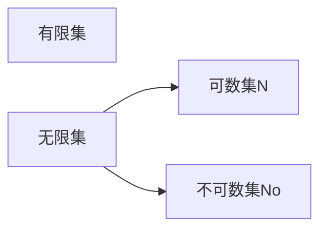

# Chapter 1 函数的定义与性质
## 1.1 函数的定义

设两个非空集合 $X,Y$，存在一个从 $X$ 到 $Y$ 的关系 $f$。若 $\forall x \in X$，存在唯一的一个元素 $y \in Y$，使得 $<x,y> \in f$。则称 $f$ 为从 $A$ 到 $B$ 的一个**函数**(或映射、变换)，记为 $f: A \to B$。当 $<x,y> \in f$ 时，记为 $y = f(x)$。此时称 $x$ 为函数的**自变量(源像)**，称 $y$ 为 $x$ 在 $f$ 下的**函数值(像)**
> 函数是一种特殊的*二元关系*。因此可以用命题、集合和关系的运算与性质等来操作函数。

**注意**：$f (x)$ 是一个值，而 $f$ 是一个集合 (一个二元关系)

设在非空集合 $A$ 上有 $f: A\to A$ 满足 $\forall x(x \in A \to f(x) = x)$。这个函数 $f$ 就是**恒等函数**，将自变量集合 $A$ 映射到他本身。通常，记这个函数为 $I_{A}$。对于两个函数 $f,g: X\to Y$，若 $\forall x(x \in X \to f(x) = g(x))$，则称函数 $f$ 和 $g$ **相等**，记为 $f=g$

设 $|X|=m, |Y|=n$，则从 $X$ 到 $Y$ 的不同函数有 $n^m$ 个，远比 $X \to Y$ 的不同关系 $2^{mn}$ 少
> 可以理解为，每个 $x\in X$ 都有 $n$ 种选择

**问题**：设 $A=\{ a, b \}, B = \{ 1, 2 \}$，求所有的 $f: A \to B$ 的集合
**解决**：记这个集合为 `func`，则
$$
\text{func} =
\{ \{ (a,1), (b,1)\}, \{ (a,1), (b,2) \}, \{ (a,2), (b,1) \}, \{ (a,2), (b,2) \} \}
$$
通常，将这个集合记为 $B^A = \{ f \mid f: A \to B \}$

**定理**：==设 $f: A \to B$，并且 $A \subseteq X, B \subseteq X$，则==
$$
\begin{align}
f(A \cup B) = f(A) \cup f(B) \\
 f(A \cap B) \subseteq f(A) \cap f(B)
\end{align}
$$
**证明**：对于第一个式子，先证明 $f(A \cup B) \subseteq f(A) \cup f(B)$。对 $\forall y \in f(A \cup B)$，$\exists x \in A \cup B$，使得 $f(x) = y$。那么 $x \in A \lor x \in B$，对其中任何一种可能，有 $y \in f(A) \lor y \in f(B)$，即有 $y \in f(A) \cup f(B)$。反向同样证明
对于第二个式子，我们只需要证明：
$$
\forall y \in f(A \cap B) , \exists x \in A \cap B, f(x) = y
$$
那么，我们有：
$$
\begin{align*}
x \in A \implies y = f(x) \in f(A) \\
x \in B \implies y = f(x) \in f(B) 
\end{align*} \implies y=f(x) \in f(A) \cap f(B)
$$
因此 $f(A\cap B) \subseteq f(A) \cap f(B)$ 成立

**注意**：==上面的定理，$\cap$ 是 $\subseteq$ 关系。可用 $A=\{ 1 \}, B=\{ -1 \}$ 和 $f=x^2$ 举例证明==
> ==特别地，如果 $f$ 是单射，那么 $f(A\cap B) = f(A) \cap B$==

**问题**：设 $f: A\to B, C \subseteq A$，证明 $f(A) - f(C) \subseteq f(A-C)$
**解决**：根据[[集合#^af1322|差集]]的定义，我们可以知道
$$
\forall y \in f(A) - f(C), \exists  x \in A, f(x) =y
$$
现在需要证明，$x \not \in C$。我们知道 $C \subseteq A$，如果 $x \in C$，那么 $f(x) \in f(C)$ 显然成立，这与 $y \in f(A)- f(C)$ 矛盾，因此 $x \in A \land x \not \in C \implies x \in A-C$，因此：
$$
\forall y \in f(A) - f(C), \quad y = f(x) \in f(A-C) \implies f(A) -f(C) \subseteq f(A -C)
$$
> 这里证明的重点是必须由 $C \subseteq A$ 才能推出矛盾，如果没有，那么假设 $x \in C$ 也不成立

## 1.2 单射、双射和满射

设 $f: X \to Y$，若 $f$ 满足：
* $\forall x_{1}, x_{2} \in X(x_{1} \not = x_{2} \to f(x_{1}) \not = f(x_{2}))$，则 $f$ 是**单射**
* $\forall  y \in Y$，都存在 $x \in X$，使得 $f(x) = y$，则称 $f$ 是**满射**
* 即使单射，又是满射的函数 $f$，就是**双射**
不难发现，定义在 $\mathbf{Z}$ 上的两个函数 $g(x) = 2x$ 仅仅是单射不是双射，$h(x) = x+10$ 是满射

典型的双射函数包括：
* 恒等函数 $I_{X}$
* 定义在实数集合 $\mathbf{R}$ 上的一次函数
* 定义在正实数集合上的对数函数

**问题**：设有限集合 $X$ 上的函数 $f: X\to X$，证明
1. $f$ 是单射 $\implies f$ 是双射
2. $f$ 是满射 $\implies f$ 是双射
**解决**：都用反证法。因为 $f$ 是单射，且 $f: X \to X$，那么 $\forall x_{1}\not=x_{2},f(x_{1}) \not=f(x_{2})$，因此 $|f(x)|=|X|$；如果 $f$ 不是满射，那么 $\exists y \in X, \forall x \in X, f(x) \not= y$，那么一定有 $|X| > f(x)$ 矛盾
同理若 $f$ 是满射，即 $\forall y \in X, \exists x \in X, f(x) = y$，如果 $f$ 不是单射，那么 $\exists x_{1} \not =x_{2}, f(x_{1}) =f(x_{2})$，那么 $|f(x)| < |X|$
# Chapter 2 函数的运算
## 2.1 函数的复合

设 $f: X \to Y, g: Y \to Z$ 是两个函数，称 $gof = \{ (x,z) \mid (\exists y \in Y)(y = f(x) \land z = g(y)) \}$ 为函数 $f,g$ 的**复合函数**，记为：
$$
gof: X \to Z
$$
函数的复合是**可结合的**，但是通常是**不可交换的**
> 注意与[[二元关系#Chapter 2 复合关系|复合关系]]的区别

**定理**：设 $f,g$ 满足是单射/满射/双射，则 $gof$ 也是单射/满射/双射

**问题**：证明若 $f,g$ 是函数，且 $gof$ 满射时，$g$ 必然满射
**解决**：不妨记，
$$
f: A \to B, g: B \to C, gof: A \to C
$$
那么由题意可知：
$$
gof\text{满射} \implies \forall z \in C, \exists x \in A, g[f(x)]   = z
$$
那么我们记 $y = f(x)$，也就是说 $\forall z \in C, \exists y \in B, y = f(x), g(y) = z$，那么 $g$ 就是满射
## 2.2 函数的置换

设有限集合 $A = \{ a_{1},a_{2},\dots a_{n} \}$，从 $A$ 到 $A$ 的双射函数称为 $A$ 上的 **$n$ 阶置换**或**排列**，记为：
$$
\pi: A \to A
$$
其中 $n$ 是置换的**阶**，通常表示为：
$$
\pi = 
\begin{bmatrix}
a_{1},  &a_{2}, & \dots &a_{n} \\
\pi_{a_{1}}, &\pi_{a_{2}}, &\dots &\pi_{a_{n}}
\end{bmatrix}
$$
例如，集合 $A = \{1, 2, 3\}$ 的置换有 6 个，表示为：
$$
\begin{bmatrix}
1 & 2 & 3  \\
1 & 2 & 3
\end{bmatrix},
\begin{bmatrix}
1 & 2 & 3 \\
1 & 3 & 2
\end{bmatrix},
\begin{bmatrix}
1 & 2 & 3 \\
2 & 1 & 3
\end{bmatrix},
\begin{bmatrix}
1 & 2 & 3 \\
2 & 3 & 1
\end{bmatrix},
\begin{bmatrix}
1 & 2 & 3 \\
3 & 2 & 1
\end{bmatrix},
\begin{bmatrix}
1 & 2 & 3 \\
3 & 1 & 2
\end{bmatrix}
$$

一个有 $n$ 个元素的集合 $A$，它的所有置换有 $n!$ 个。其中从本身映射到本身的置换，称为**单位置换**。已知两个置换，则它们的复合也是置换。如果置换 $\pi_{1}$ 将 $i$ 变为 $j$，置换 $\pi_{2}$ 将 $j$ 变成 $k$，则复合 $\pi_{2}o\pi_{1}$ 将 $i$ 变成 $k$
> 注意这里的复合是倒过来的，$\pi_{2}o\pi_{1}$ 才是将 $i$ 变成 $k$，不是 $\pi_{1}o\pi_{2}$ 不是！这是因为 $\pi_{2}o\pi_{1}=\pi_{2}(\pi_{1}(x))$

**循环**：将一个置换中，首位相连的项写在一个括号内，然后用乘积的形式表示

**问题**：已知
$$
\pi_{1} = \begin{bmatrix}
1 & 2 & 3 & 4 & 5 & 6 \\
1 &3 &6 & 5 &4 &2
\end{bmatrix},
\pi_{2} = \begin{bmatrix}
1 & 2 & 3 & 4 & 5 & 6 \\
2 & 1 & 3 & 5 & 6 & 4
\end{bmatrix}
$$
求 $\pi_{1} o \pi_{2}$ 置换的循环表示法
**解决**：$\pi_{1}o\pi_{2} = \pi_{1}(\pi_{2}(x))$，因此 $\pi_{1}o\pi_{2}$ 满足：
$$
\pi_{1}o\pi_{2} =  
\begin{bmatrix}
1 &2 &3 &4 &5 &6 \\
3 &1 &6 &4 &2 &5
\end{bmatrix}
$$
然后，我们从 $1 \to 3$ 开始，找到第一条通路：
$$
(1 \space 3 \space 6 \space 5 \space 2)
$$
剩下一条通路是 $(4)$ ，这样只有一个元素的一般不写，因此答案就是：
$$
(1 \space 3 \space 6 \space 5 \space 2)
$$

**问题**：求循环
$$
(1 \space 2 \space 4 \space 3)(3 \space  4 \space 1)
$$
的积
**解决**：根据右乘规律，我们可以知道结果是 $(4 \space 2)$，也可以写作 $(2 \space 4)$

## 2.3 逆函数

==设 $f: X \to Y$，若：存在一个函数 $g: Y \to X$，使得==：
$$
\forall x(gof(x) = x) \land \forall y(fog(y) = y)
$$
==则 $g$ 是 $f$ 的==**逆函数**，记为 $f^{-1}$。容易发现 $f o f^{-1} =f^{-1} of = I_{A}$

**定理**：$f$ 存在逆函数 $\iff$ $f$ 是双射
**证明**：证明充分性，即 $f$ 存在逆函数 $\implies$ $f$ 是双射
设存在这样一个函数 $g: Y \to X$，使得 $g o f = I_{X} \land f o g = I_{Y}$。这里用了逆函数的定义。那么：
1. 若 $f(x_{1}) = f(x_{2})$，则 $g(f(x_{1})) = g(f(x_{2}))$，即 $x_{1}=x_{2}$。我们有 $\forall x_{1}, x_{2}(f(x_{1}) = f(x_{2}) \to x_{1}= x_{2})$ ，证明 $f$ 是单射
2. $\forall y \in Y$，$f(g(y)) = f o g(y) = y$，故任意的 $y$ 都有源像 $g(y)$，因此 $f$ 为满射
证明必要性，即 $f$ 是双射 $\implies f$ 存在逆函数
因为 $f$ 双射，则：
$$
\forall y (y \in Y \to \exists x(x \in X \land f(x) =y))
$$
我们可以定义一个映射 $f^{-1}: Y \to X$ 表示 $\forall y \in Y$，$f^{-1}(y)$ 就是满足 $f(f^{-1}(y)) = y$ 的唯一的 $x$。因此，对于 $\forall x \in X$：
$$
f^{-1}(f(x)) = x
$$
这里 $f^{-1}$ 就是 $f$ 的逆函数，因此 $f$ 可逆
> 这个定理提示我们，可以通过证明 $f$ 存在逆函数，来证明 $f$ 是双射

**定理**：设 $f: X \to Y$ 和 $g: Y \to Z$ 是两个双射，则 $(gof)^{-1} = f^{-1} o g^{-1}$ 
> 注意 $f$ 和 $g$ 的位置发生了转换，用 $f(g(x))$ 的思路容易理解
# Chapter 3 集合的基数、可数集和不可数集

## 3.1 集合的基数

**回顾**：集合的基数就是集合元素的个数，即为 $\text{card(A)}$ 或者 $|A|$

设 $X$ 和 $Y$ 是两个集合，若 $X, Y$ 存在一一对应关系 (即双射)，则称集合 $X$ 与集合 $Y$ 是**等势的**，即为 $X \sim Y$。且：
$$
X = Y \implies X \sim Y \iff \text{card} (X)  = \text{card(Y)}
$$
反之不成立。等势满足传递性，即 $A \sim B, B \sim C \implies A \sim C$

**问题**：证明自然数集合 $\mathbf{N}$ 与非负偶数集合 $2\mathbf{N}$ 是等势的
**解决**：令 $f: \mathbf{N} \to 2 \mathbf{N}$ 即可

**问题**：证明不超过 8 的整数集和 $\mathbf{N}$ 等势
**解决**：令 $f(x) = 8-x$ 即可
## 3.2 可数集和不可数集

**回顾**：常见的单调函数有线性函数 $f(x) = kx+b$ ，指数函数 $f(x) = \ln x$，$f(x) = e^x$。单调函数的相加也是单调函数，单调函数的相减在 $f, g$ 的正负号相反时依然单调，单调函数的数乘是单调函数

**回顾**：当 $x >0 \lor x <0$ 时 $f(x) = \frac{1}{x}$ 也是单调函数

**定理**：设集合 $X, Y$，若存在 $X$ 到 $Y$ 的单射，则 $\text{card}(X) \le \text{card}(Y)$。进一步，若不存在从 $X$ 到 $Y$ 的双射，则 $\text{card}(X) < \text{card}(Y)$
> 这个定理指出，证明两个集合等势，可以转换为分别找两个单射。非常常用！

记 $N_{m}$ 表示包含前 $m$ 个自然数的集合。若 $X$ 是空集，或 $\exists m \in \mathbf{N}$，使得 $X \sim N_{m}$ ，则称 $X$ 是**有限集**，否则是**无限集**。自然数集 $\mathbf{N}$ 是最常见的无限集，它的基数记为 $\aleph_{0}$。与自然数集等势的集合，称为**可数集**
> 证明集合可数，就证明它与 $\mathbf{N}$ 等势

**问题**：证明 $\mathbf{N}\times \mathbf{N} \sim \mathbf{N}$
**解决**：首先，我们可以找到一个单射 $f:\mathbf{N} \to \mathbf{N} \times \mathbf{N}$，即
$$
f(x) = (x,x)
$$
这说明 $\text{card}(\mathbf{N}) \le \text{card}(N \times N)$。同理我们能找到一个单射 $g: \mathbf{N} \times \mathbf{N} \to \mathbf{N}$，即：
$$
g(x, y) = 2^x 3^y
$$
这说明 $\text{card}(\mathbf{N \times N}) \le \text{card}(\mathbf{N})$。这就意味着 $\text{card}(\mathbf{N}) = \text{card}(\mathbf{N} \times \mathbf{N})$

称开区间 $(0,1)$ 是**不可数集**，基数为 $\aleph$。所有与 $(0,1)$ 等势的集合，都是不可数集
> 可数集和不可数集，都是无限集

**注意**：有限集的代表是 $\{ 1,2,3 \}$，可数集的代表是 $\mathbf{N}$，并且 $|\mathbf{N}|=\aleph_{0}$，不可数集的代表是 $\mathbf{R}$，并且 $|\mathbf{R}|=\aleph$

**问题**：已知 $A = (0,1), B = [0,1]$，证明 $A \sim B$
**解决**：使用本节开头的定理。先找到一个 $f: A\to B$ 是单射，即
$$
f(x) = x
$$
然后再找到一个 $g: B \to A$ 是单射，即：
$$
g(x) = \frac{1}{x+2}
$$
证明完毕

设 $M$ 是任意集合，$S$ 是 $M$ 的幂集，则 $\text{card}(M) < \text{card}(S)$，这就是**Cantor 定理**。这可以说明，不存在最大的基数，也就是没有最大的集合，使得这个集合无所不包，即：
$$
|A| \le \aleph_{0} \le \aleph
$$

