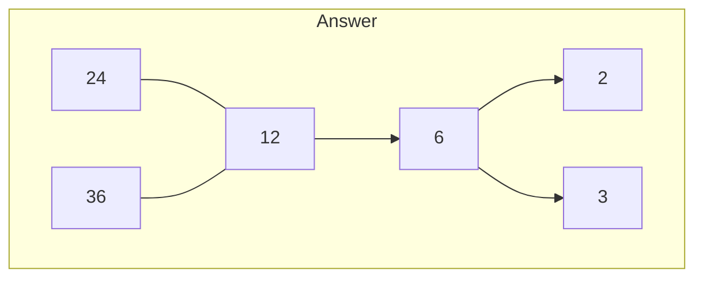

# Chapter 1 等价关系

## 1.1 等价关系

设正整数 $m$，在整数集 $\mathbf{Z}$ 上有二元关系：
$$
R = \{ (x, y) \mid x, y \in \mathbf{Z} \land (m \mid (x-y)) \}
$$
这个 $R$ 就是**同余关系**。若 $x, y$ 同余，记作：
$$
x \equiv y (\text{mod} \space k)
$$

**问题**：证明同余关系具有传递性
**解决**：设 $x,y$ 同余，$y,z$ 同余，那么有：
$$
m \mid x - y, \quad m \mid y - z
$$
这可以写作：
$$
x - y = k_{1} m, \quad y-z = k_{2} m
$$
两个式子相加即可证明

设非空集合 $A$ 上的二元关系 $R$，若 $R$ 同时具有自反、对称和可传递性，那么 $R$ 就是 $A$ 上的一个**等价关系**。例如，“整数集 $\mathbf{Z}$ 上的模 $k$ 同余关系”是等价关系，但是直线的平行关系不是等价关系，因为不满足自反性。要证明一个关系是等价关系，需要分别证明它具有 3 个特殊的二元关系，即自反，对称和传递性
> 回顾 3 个特殊的二元关系，参见[[二元关系#1.3 二元关系的性质|特殊的二元关系]]

## 1.2 等价类

设集合 $A$ 上的等价关系 $R$ ，对任意 $a \in A$，那么记：
$$
[a]_{R} = \{ x \mid (x \in A) \land ((x, a) \in R)  \}
$$
这个集合 $[a]_{R}$ 是 $A$ 的子集，称为**等价类**，称这个等价类是由 $a$ 生成的，$a$ 称为**生成元**。不难发现：
$$
\cup_{a} [a] = A
$$
> 注意，生成元 $a$ 必包含于等价类中，即 $a \in [a]_{R}$。等价类是一个单元素的*集合 (set)*

所有生成元组成的集合，称为这个集合 $A$ 上等价关系 $R$ 的**商集**

**问题**：设 $\{ 1,2,3,4 \}$，等价关系 $R$ 表示模 $k$ 同余关系，其中 $k=3$。求 $[1]_{R}$
**解决**：
$$
[1]_{R } = \{ 1, 4 \}
$$

**定理**：设等价关系 $R$。对 $\forall a, b \in A$，要么 $[a] = [b]$，要么 $[a] \cap [b] = \emptyset$
**证明**：我们证明 $[a] \cap [b] \not = \emptyset$ 时的情况即可。此时，必然：
$$
\exists x, x \in [a] \cap [b]
$$
那么，我们有：$x \in [a] \land x \in[b]$。根据生成类的定义，我们有：
$$
xRa, xRb
$$
并且因为 $R$ 等价关系，拥有对称性和传递性，所以我们有 $aRb$，因此 $\forall y \in [a], yRa, aRb \implies y Rb \implies [a] \subseteq [b]$；同理 $b R a \implies [b] \in [a]$，故 $[a] = [b]$

## 1.3 分划

设 $A$ 是非空集合，它的子集有 $A_{1}, A_{2}, \dots A_{m}$，且：
* $\forall i \not =j, A_{i} \cap A_{j} = \emptyset$
* $\cup^m_ {{i=1}} A_{i = A}$
则称集合 $S=\{ A_{1}, A_{2}, \dots A_{m} \}$ 为集合 $A$ 的**分划**

**定理**：==非空集合 $A$ 上的每个分划，都对应一种等价关系；而每个等价关系，都对应一种分划==

**注意**：已知等价关系 $R$，求对应的分划，就是求所有等价类的集合，组成的集合

**问题**：已知集合 $A = \{ 1, 2, 3, 4 \}$，分划 $S_{0} \in \{ \{ 1, 2, 3 \}, \{ 4 \} \}$，求分划对应的等价关系 $R$
**解决**：等价关系 $R$ 就是
$$
R = \{ 1, 2, 3 \} \times \{ 1, 2, 3 \} \cup \{ 4 \} \times \{ 4 \}
$$
> 已知分划 $S=\{ A_{1}, A_{2}, \dots, A_{m} \}$，则等价关系就是 $R=\cup^m_{{i=1}}(A_{i}\times A_{i})$
# Chapter 2 偏序关系

## 2.1 偏序集

设集合 $A$ 上的二元关系 $R$ 满足：是自反的，是反对称的，是传递的。那么我们称这个 $R$ 是一个**偏序关系**，$A$ 称为关于偏序 $R$ 的**偏序集**，记为 $<A,R>$

常见的偏序关系：
* 在正整数集 $\mathbf{Z}^+$ 上定义的**整除关系**
* 在集合 $A$ 的幂集 $2^A$ 上定义的 $\subseteq$ 关系，即 $<2^A, \subseteq>$
* $\le$ 和 $\ge$ 关系
因此，篇序关系常用 $\le$ 和 $\ge$ 表示
> 记住这 3 种常见的偏序关系！

**哈斯图**：一种展示偏序关系的图。哈斯图的画法如下
* 用圆圈表示 $A$ 中元素，但是不要画自己到自己的圆圈
* 对于任意的 $x,y \in A$，若 $x \leq y$，则将 $x$ 画在 $y$ 下方，且连线 (不需要箭头)
* 去掉有向边。即若 $(i,j)$ 和 $(j,k)$ 存在，且 $(i,k)$ 存在，那么不要画出来
哈斯图实际上就是关系图的画简

下面是两个哈斯图的示例，注意观察画法：
![[Pasted image 20251114172150.png]]

**盖住关系**：哈斯图表示的关系，记为盖住关系 $\text{Cover(R)}$，用集合表示如下
$$
\text{cover}(R) = \{ (x,y) \in R \mid (\forall t \in z)(t \not = x \land t \not = y) \to (x, t) \not \in R \land (y, t) \not \in R \}
$$
由盖住关系得到的集合 $\text{cover}(R)$ 是二元关系 $R$ 的一个真子集，即 $\text{cover}(R) \subseteq R$
> 两个结点，在哈斯图中处于一条线直连的，就属于盖住关系

**问题**：设一个偏序集 $<\{ 2, 3,6, 12,24, 36 \}, \mid$，求它的哈斯图
**解决**：由于 `mermaid` 限制，图像的连线包括了箭头。下面为示意图，实际的哈斯图没有箭头，用圆点表示元素

## 2.2 全序集与良序集

设偏序集 $<A, \leq>$，若 $\forall x, y \in A$，若 $x \le y$ 或 $y \le x$ 之一成立，那么称 $x$ 和 $y$ 是**可比较的**，否则称为**不可比较的**
> 画出哈斯图，是否可比较一目了然

从逻辑上来说：
* 全序集指的是一个集合的任何子集，都有最小值。从哈斯图上看就是一条直线无分叉
* 良序集中任意取子集，都有最小值。例如 $\mathbf{N}$，但是 $\mathbf{Z}$ 就不是；从哈斯图上看就是底部有限的离散直线
### 2.2.1 全序集

如果 $<A, \le>$ 中的任何两个元素都是可比较的，则这个集合 $<A, \le >$ 是**全序集**，称关系 $\le$ 是 $A$ 上的一个**全序关系**。对于一个偏序集 $<A, \le>$ ，如果 $<B, \le>$ 是一个**全序子集**，则称 $B$ 是 $A$ 中的一条**链**，链中元素的个数减去一称为**链的长度**
>  如果一个关系 $R$ 的哈斯图是一个只有一条主干，不存在分支的链路，那么这个关系就是**全序关系**

对于偏序集 $<A, \le>$：
* 若 $\forall b \in A, b \le a$，则 $a$ 是 $A$ 的**最大元**；若 $\forall b \in A, a \le b$，则 $a$ 是 $A$ 的**最小元**
* 若 $\forall b \in A$，要么 $b \le a$，要么 $b$ 与 $a$ 是不可比较的，那么 $a$ 是 $A$ 的**极大元**
* 若 $\forall b \in A$，要么 $a \le b$，要么 $b$ 与 $a$ 是不可比较的，那么 $a$ 是 $A$ 的**极小元**
最/极大/小元是针对集合而言的，既可以是全集 $A$，也可以挑出它的子集 $B$ 分析。但是只要选定了一个集合，这个元必定在集合中

从哈斯图上看，极大元就是图中位置最高的几个元素，若极大元唯一，则为最大元；极小/最小同理

对于偏序集 $<A, \le>$，且 $B \subseteq A, a \in A$：
* 若对于 $\forall b \in B, b \le a$，则称 $a$ 是子集 $B$ 的一个**上界**。进一步，若 $c$ 是 $B$ 的任意一个上界时，都有 $a\le c$，则称 $a$ 是 $B$ 的**最小上界**
* 若对于 $\forall b \in B, a \le b$，则称 $a$ 是子集 $B$ 的一个**下界**。进一步，若 $c$ 是 $B$ 的任意一个下界时，都有 $c \le a$，则称 $a$ 是 $B$ 的**最大下界**
上下界是针对子集而言的，并且上下界既可以在这个子集中，也可以在全集中
> 上界和下界可以有多个，但最大/最小只有一个

**注意**：若一个子集合 $B$ 的最大元/最小元存在，那么它的最小上界/最大下界就是最大/最小元。否则，需要越过集合 $B$，去它的全集 $A$ 中找

**问题**：设偏序集合 $< \rho(\{ a,b \}), \subseteq >$，求子集 $B=\{ \{ a \}, \{ b \}, \emptyset \}$ 的最大/小元，极大/小元和上/下届及其最小上界/最大下界
**解决**：
用表格表示如下

| 项目               | 结果      |
| ---------------- | ------- |
| **极大元**          | {a},{b} |
| **极小元**          | ∅       |
| **最大元**          | 无       |
| **最小元**          | ∅       |
| **上界**           | {a,b}   |
| **下界**           | ∅       |
| **最小上界 (sup B)** | {a,b}   |
| **最大下界 (inf B)** | ∅       |

### 2.2.2 良序集

若一个偏序集 $<A, \le>$ 的任何一个非空子集，都有最小元，那么 $\le$ 称为**良序关系**，此时 $<A, \le>$ 称为**良序集**。并且：
$$
\le \text{良序} \implies \le \text{全序} \implies \le \text{偏序}
$$
容易发现，非无穷集合的全序关系，都是良序集

**问题**：判断集合 $\mathbf{N}$ 和集合 $\mathbf{Z}$ 与二元关系 $\le$ 组成的偏序集是否为良序集
**解决**：$\mathbf{N}$ 是 $\mathbf{Z}$ 不是，因为前者的哈斯图有起点 $0$ ，但是后者没有起点，是无穷长的链

**注意**：==从哈斯图上看，良序集就是离散的有底部的无分叉长链==
> 因此正有理数 $\mathbf{Q}^+$ 就不是，因为中间稠密，虽然有底
### 2.2.3 偏序集转全序集和良序集

设集合 $A$ 上的两个偏序关系 $\le$ 和 $\le'$，若 $\forall a, b \in A$，当 $a \le b$ 时，都有 $a \le 'b$，则称两个偏序关系是**可比较的**。我们可以理解为，对于两个偏序集上的所有元素，如果左边的偏序成立，那么右边的偏序也要成立

**问题**：说明两个偏序关系 $\mid$ 和 $\le$ 的关系
**解决**：若 $a \mid b$，则 $a \le b$。所以 $\mid$ 和 $\le$ 是可比较的

设集合 $A$ 上的两个偏序关系 $\le$ 和 $\le'$，若 $\le$ 与 $\le'$ 是可比较的，且 $\le'$ 是全序关系，则称 $\le'$ 是 $\le$ 的一个**拓扑排序**。如果要将一个普通的偏序关系 $\le$ 改造为拓扑排序，需要：
1. 取 $<A, \le>$ 中的极小元，放入拓扑排序的集合
2. 从集合 $<A, \le>$ 中，删除这个极小元
3. 当 $<A, \le> \not = \emptyset$ 时，重复步骤 1-2。然后，将这个序列中的所有元素，用 $\le'$ 连接起来，得到拓扑排序
因此，任何有限偏序集都可以转为拓扑排序 (全序集)

**问题**：已知集合 $\{ a, b,c,d \}$，构造它的偏序集 $<2^A, \subseteq>$ 的全序集 $<2^A, \le>$，使得它是一个拓扑排序
**解决**：画出哈斯图，不难发现，仅需要根据子集的元素个数，即基数的大小排列即可
