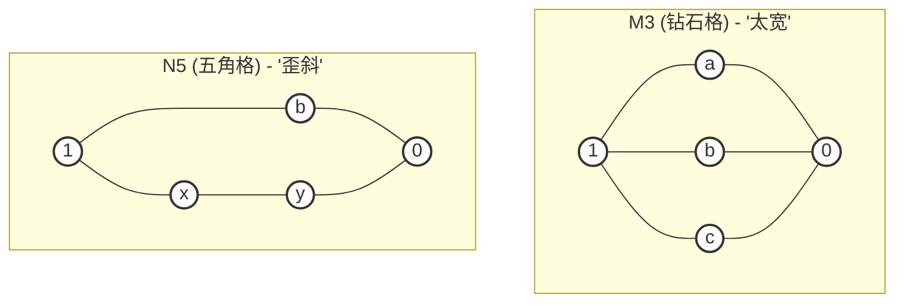
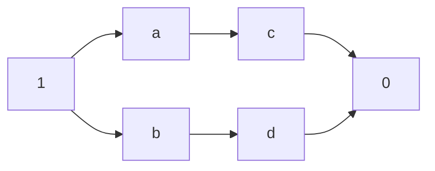

# Chapter 17 格与布尔代数

从哈斯图判断一个偏序集是不是格，有补格，分配格和布尔代数常考
## 17.1 格

**回顾**：证明一个二元关系 $R$ 是偏序关系，就是证明它自反，传递和反对称

设 $<L, \land, \lor>$ 是一个代数系统，如果 $\land ,\lor$ 满足：
* 交换律，即 $a \lor b = b \lor a, a\land b = b \land a$
* 结合率，即 $a\lor(b\lor c) = (a\lor b) \lor c, a\land b \land c = a\land (b \land c)$
* 吸收率，即 $a \lor (a \land b) = a, a \land (a \lor b) = a$
则称 $<L,\land,\lor>$ 是一个**代数格**。典型的格包括 $<2^A,\cup,\cap>$ 和 $<P,\lor,\land>$

**定理**：在格中，有 $a \land a = a, a \lor a = a$

设 $<L, \le>$ 是一个偏序集。$\forall a, b \in L$，$\{ a,b \}$ 都有最大下界 `glb` 和最小上界 `lub`，则称 $<L, \le>$ 是一个**偏序格**，简称 $L$ 是一个**格**。最大下界和最小上界记为 $glb(a,b),lub(a,b)$
> 因此，$\land,\lor$ 两个运算，在格中是封闭的

**定理**：设 $<L,\lor,\land>$ 是一个代数格，定义格上的自然偏序 $\le$：$a\le b\iff a\land b=a$，则 $<L, \le>$ 是一个**偏序格**
**定理**：设 $<L, \le>$ 是一个偏序格，在格上定义 $\lor,\land$：$a\land b=glb(a,b), a \lor b = lub(a, b)$，则 $<L, a,b>$ 是一个代数格
> 由此可见，格的两种定义是等价的


从哈斯图上看，如果哈斯图上面有两个头，或者下面有两个脚，则一定不是格；如果只有一个头，一个脚，也不能推出就是格，例如：
```
  1 (最大元)
 / \
c   d
 \ / \ /
  a   b
   \ /
  0 (最小元)
```
其中的 $a,b$，没有最小上界 (注意 1 不是！因为 $c,d$ 同为 $a,b$ 的不可比上界)
> 一般选择题用两头两脚就能排除很多

从韦恩图上看，容易发现：
$$
a \le b \iff a \land b = a \iff a \lor b = b
$$

从偏序到代数的角度来看，有：
$$
a \le b := a \land b = a \iff a \lor b = b
$$
从代数到偏序的角度来看：
$$
\begin{align*}
a \land b := glb(a,b) \\
a \lor b := lub(a,b)
\end{align*}
$$

**问题**：证明 $<\mathbf{N}, |>$ 是格
**解决**：首先证明 $<\mathbf{N},|>$ 是偏序集。$\forall x \in \mathbf{N}, x |x$ 成立，自反性成立；若 $x | y \land y|x$，那么只能是 $x \le y \land y \le x \implies x = y$ 成立，反对称性成立；若 $x|y, y|z$，显然 $x|z$ 成立，传递性成立
其次证明有界性。$\forall x,y \in \mathbf{N}$，它们的最大下界 `glb` 就是他们的最大公因子，最小上界 `lub` 就是它们的最小公倍数，即有界性成立

## 17.2 子格

设代数系统 $<L,\land,\lor>$ 是格，$S\subseteq L$，若 $S$ 满足：
1. $S \not = \varnothing$
2. $\land,\lor$ 相对于 $S$ 封闭
则称 $<S,\land,\lor>$ 是 $<L,\land,\lor>$ 的**子格**
> 证明子格： $\text{S非空} \to \land,\lor\text{在S封闭}$

设 $<L,\le>$ 和 $<L, \le'>$ 是两个偏序关系，若 $\le$ 是 $\le'$ 的逆关系，则称这两个偏序格是**互为对偶格**。两个对偶格的哈斯图颠倒

设 $<L,\land,\lor>$ 是一个格，$E$ 是格的公式。将 $E$ 中的 $0,1$ 互换，$\land,\lor$ 互换得到的公式称为**对偶公式**
> 在命题逻辑中出现过，参见[[命题逻辑#^3c023b|对偶公式]]

**定理(对偶原理)**：已知 $X,Y$ 是格上 $<L,\land, \lor>$ 上的两个公式，$X',Y'$ 则是相应的对偶公式。如果 $X=Y$，那么 $X'=Y'$ ^eda445

**定理**：已知 $X,Y$ 是格上 $<L,\land, \lor>$ 上的两个公式，$\le$ 是对应的偏序，若 $X\le Y$，那么 $X'\le Y'$

**定理**：设 $<L,\land,\lor>$ 是格，$\le$ 是对应的偏序，$a,b,c,d\in L$，则
$$
\begin{align*}
&a \le b \implies a \lor c \le b \lor c \tag 1 \\
&a \le b \implies a \land c \le b \land c \tag 2 \\
&a \le b, c \le d \implies a \land c \le b \land d \tag 3 \\
&a \le b, c \le d \implies a \lor c \le b \lor d \tag 4 \\
&a \le b, a \le c \implies a \le b \land c \tag 5 \\
& a \le c, b \le c \implies a \lor b \le c \tag 6
\end{align*}
$$

**问题**：设 $f: A\to B$，令 $S=\{ y | y=f(x), x\in 2^A \}$。证明 $<S, \subseteq >$ 是 $<2^B,\subseteq>$ 的子格
**解决**：先证明 $S$ 是 $2^B$ 的子集合。根据 $S$ 的定义，
$$
\forall y \in S, \exists x \in 2^A, f(x) = y \in 2^B
$$
因此 $S$ 是 $2^B$ 的子集。下面，我们要证明原格的两个运算 $\cap, \cup$ 在子格中仍然封闭。首先对于 $\cup$，设 $y_{1}, y_{2} \in S$，那么 $\exists x_{1}, x_{2} \in 2^A, f(x_{1}) = y_{1}, f(x_{2})=y_{2}$，而且，我们知道 $f(x_{1}) \cup f (x_2) = f(x_{1} \cup x_{2}) =y_{1} \cup y_{2} \in S$，因此对于 $\cup$ 封闭。同理可证对于 $\cap$ 封闭

***

设 $<L,\lor,\land>$ 和 $<S, \oplus, \otimes>$ 是两个格，$\varPhi$ 是从 $L$ 到 $S$ 的映射，若 $\forall x, y\in L$，有：
$$
\begin{align*}
\varPhi(x \lor y) = \varPhi(x) \oplus \varPhi(y)  \\
\varPhi(x \land y) = \varPhi(x) \otimes \varPhi(y)
\end{align*}
$$
则称 $\Phi$ 是从 $<L,\lor,\land>$ 到 $<S,\oplus,\otimes>$ 的**格同态映射**，当 $\Phi$ 分别是单射，满射和双射，则 $\Phi$ 是**单一格同态**，**满格同态**和**格同构**

**问题**：设 $D_{6}$ 表示 6 的正因子集，证明因子格 $<D_{6}, |>$ 和幂集格 $<2^{\{ a,b \}}, \subseteq>$ 格同构
**解决**：画出哈斯图，然后一一映射即可

**定理(保序定理)**：设 $<L_{1},\lor,\land>$ 和 $<L_{2},\oplus,\otimes>$ 是两个格，对应偏序关系就是 $\le, \subseteq$，则有
$$
f: L_{1}\to L_{2} \text{是格同态} \implies \forall a, b \in L, a \le b \implies f(a) \subseteq f(b)
$$

**定理**：双射 $f: L \to P$ 是格 $<L,\lor,\land>$ 到格 $<P,\oplus,\otimes>$ 的格同构的充要条件是
$$
\forall a,b \in L, a \le b \iff f(a) \subseteq f(b)
$$
其中 $\le$ 和 $\subseteq$ 分别是 $L,P$ 对应的偏序

## 17.3 分配格与有补格

设 $<L,\lor,\land>$ 是格，若 $\forall a,b,c,d \in L$ 都使：
1. $a \lor (b \land c) = (a \lor b) \land (a\lor c)$
2. $a \land (b \lor c) = (a \land b) \lor (a \land c)$
则 $<L,\land, \lor>$ 是**分配格**。证明时只需要证明其中之一，另一可用[[#^eda445|对偶原理]]直接给出。常见的分配格包括 $<2^A,\cup,\cap>$ 和 $<L,\le>$

直接证明一个格是分配格并不容易，但是可以证明一个格不是分配格。一个格不是分配格，它必定包含以下两种形状：



**定理**：设 $<L,\lor,\land>$ 是分配格，$\forall a,x,y\in L$：
$$
(a \lor x = a \lor y ) \land (a \land x = a \land y) \implies x = y
$$

如果格 $<L,\lor,\land>$ 存在==最大元和最小元==，则 $<L,\lor,\land>$ 是**有界格**
> 有限格一定有界，反之不成立

设 $<L,\lor,\land>$ 是有界格，$1,0$ 分别是最大/小元，$\forall a \in L$，若 $\exists b \in L$，使得：
$$
a \land b = 0, a \lor b = 1
$$
则称 $a,b$ 互为**补元**。若 $\forall a \in L$，都有补元 $\overline a$ 存在，则 $<L,\lor,\land>$ 是**有补格**，例如下面的格

> 据图可知，补元存在，不一定唯一

**定理**：有补分配格中的元素有补元必唯一

**定理**：设 $<L,\lor,\land>$ 是有补分配格，$\le$ 是它的自然偏序，则 $\forall a,b \in L$
1. 对合律 $\overline {\overline{a} }= a$
2. $\overline{a\lor b} = \overline{a} \land \overline{b}$
3. $\overline{a \land b} =\overline{a} \lor \overline{b}$
4. $a\le b \iff a \land \overline{b} =0$

## 17.4 布尔代数

有补分配格称为**布尔格**，记为 $<B, \lor,\land>$。由上一节的结论，我们知道布尔格元素的补元唯一，记求补运算为 $\overline{}$，那么布尔格记为：
$$
<B,\lor,\land,\overline{}, 0,1>
$$
称其为**布尔代数**
> $\text{布尔格} = \text{格} + \text{分配} + \text{有界} +\text{有补}$


称 $<2^S, \cap, \cup, \overline{}, \Phi, S>$ 是布尔代数，称之为**集合代数**，其哈斯图是 $n$ 维立方体图。设 $B_{n}$ 是由 $0,1$ 组成的 $n$ 重组的集合，记 $a= <a_{1},a_{2},\dots, a_{n}>, b= <b_{1},b_{2},\dots, b_{n>}$，同理定义 $0_{n}$ 和 $1_{n}$，那么 $<B,\lor,\land>$ 是布尔代数，称为**开关代数**

在布尔格 $<B,\le>$ 中，直接**盖住**(直观上看就是连接着) 最小元 $0$ 的元素，称为**原子**

**定理**：在有限布尔代数中，$a,b$ 是不同原子，$x,y$ 是任意元素，则
1. $a \land b = 0$
2. $a \le x$ 和 $a\le \overline x$ 有且只有一个成立
3. $a \le x \lor y \iff a \le x \lor a \le y$

**定理**：设有限布尔代数的全体原子构成的集合是 $S=\{ a_{1},a_{2},\dots, a_{n} \}$，则对于 $B$ 中任何不是 $0$ 的元素 $x$，$\exists a_{i_{1}}, a_{i_{2}}, \dots, a_{im} \in S$，使得
$$
x = a_{i_{1}} \lor a_{i_{2}} \dots \lor a_{im}
$$
也就是说，布尔代数中的所有元素，都可以用原子的 $\lor$ 组成

**定理**：设 $A$ 是以 $S=\{ a_{1},a_{2},\dots,a_{n} \}$ 为原子集的布尔代数，$B$ 是以 $V=\{ b_{1},b_{2},\dots b_{n} \}$ 为原子集的布尔代数，则一定存在双射 $f: A\to B$，使得 $\forall x,y\in A$，满足：
1. $f(x\lor y) = f(x) \cup f(y)$
2. $f(x\land y) = f(x) \cap f(y)$
3. $f(\overline x) = f(\overline x')$
**推论**：有 $n$ 个原子的布尔代数必有 $2^n$ 元素
## 17.5 布尔表达式

布尔代数 $<B,\le>$ 中的每个元素，任何变量和经过有限次布尔运算得到的式子，都是**布尔表达式**

设 $<B, \le>$ 是布尔代数。一个从 $B^n \to B$ 的函数，如果能用布尔代数上的布尔表达式表示，这个函数就是**布尔函数** 


