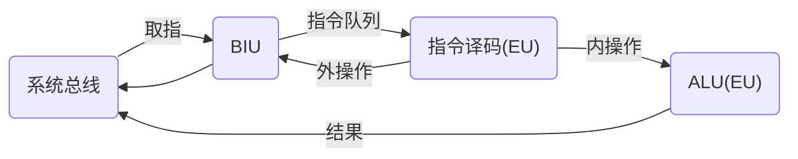
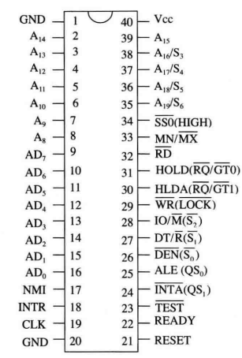
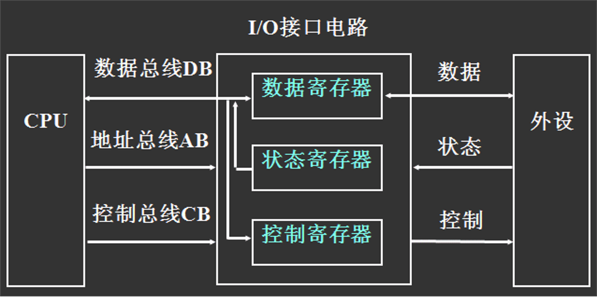
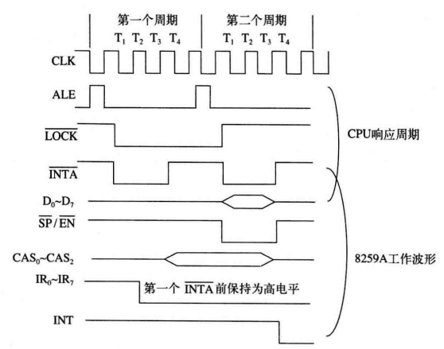
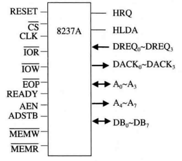
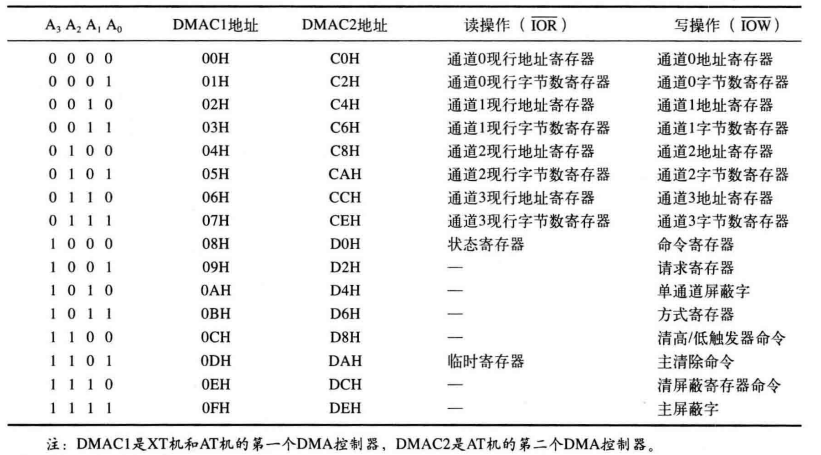
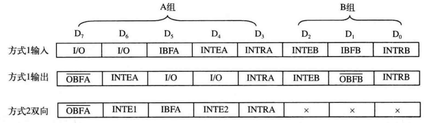

## 一、微机系统

### 1.1 相关概念

- 微处理器：是一个大规模集成电路芯片，内含控制器、运算器和寄存器等，是微机中的核心芯片
- 微型计算机（微机）：指微型计算机的硬件系统
- 微型计算机系统：指由硬件和软件共同组成的完整的计算机系统
- 三态：指引脚上的信号除“0”、“1”状态外，还具有一种“高阻”状态；当处于“高阻”状态时，引脚可视为与总线间物理断开
- 复用：在引脚功能复用的情况下，一个引脚可以承担不同的功能，通过在不同的时间点上切换功能来实现多种功能
- 双向：某些引脚在一定条件下可以作为输入和输出引脚，这种引脚称为双向引脚

### 1.2 系统总线

- 微机系统采用总线结构连接系统功能部件
- 总线是传送信息的公共通道
- 总线周期：指CPU通过总线操作与外部（存储器或I/O端口）进行一次数据交换的过程，具体过程如下
  1. 总线的请求和仲裁
  2. 寻址
  3. 数据传送
  4. 结束

### 1.3 总线的组成和分类

- **系统总线的组成（按功能分类）：**

  - 地址总线AB：输出将要访问的内存单元或I/O端口的地址

    - 地址线的多少决定了系统直接寻址存储器的范围

  - 数据总线DB ：CPU读操作时，外部数据通过数据总线送往CPU，CPU写操作时，CPU数据通过数据总线送往外部

    - 数据线的多少决定了一次能够传送数据的位数

  - 控制总线CB ：协调系统中各部件的操作，有输出控制、输入状态等信号

    - 控制总线决定了系统总线的特点，例如功能、适应性等

    - 总线带宽 = 传输的数据量 ÷ 需要的时间

      > 如8088处理器数据总线为8位，典型的时钟频率为5MHz，即每个时钟周期为$\frac{1}{5MHz} = 0.2\times10^{-6}s$，4个时钟周期构成一个总线周期，因此，8088处理器的总线带宽为：
      >
      > $8\div(4\times0.2\times10^{-6})b/s=10Mb/s=1.25MB/s$

- 总线按连接对象分类

  - 芯片总线：一个大规模集成电路芯片内部，或一个较小系统中各种不同器件连接在一起的总线；用于芯片级互连

  - 内总线：微机系统中模板与模板间连接的总线，是微机系统所特有的总线；用于模板级互连

  - 外总线：微机系统之间或微机系统与其外设通信的总线，用于设备级互连

    

- 总线按数据传输方式分类：

  - 并行总线：同时传输多位数据的总线
  - 串行总线：逐位传输数据的总线

## 二、8086/8088 CPU

### 2.1 功能结构

- 8086与8088的区别：
  - 8088数据线引脚为8个，是一个“准16位”的微处理器；8086数据线引脚为16个，是真正的16位微处理器
  - 8088CPU的指令队列只能容纳 4个字节，当队列有一个字节空缺时就自动取指，当队列有一个字节就会执行。 8086CPU的指令队列可容纳6个字节，当队列有两个字节空缺时才自动取指，当队列有两个字节才会执行
- 总线接口单元(BIU)：管理8088与系统总线的接口，负责CPU对存储器和外设进行访问（负责与内存或I/O端口传送指令或数据）
- 执行单元(EU)：负责指令的译码、执行和数据的运算

### 2.2 指令的执行

- 指令队列：一个4字节(或6字节)的先进先出的队列，当指令队列出现空缺时，BIU会自动取指弥补这一空缺；而当程序发生转移时，BIU又会废除原队列，通过重新取指来形成新的指令队列
- 指令流水线技术：BIU单元读取指令 + EU单元执行指令，两个单元可以并行进行操作

### 2.3 寄存器结构

- 通用寄存器
  - 数据寄存器：`AX`、`BX`、`CX`、`DX`
  - 变址寄存器：`SI`、`DI`
  - 指针寄存器：`BP`、`SP`
- 段寄存器：`CS`、`SS`、`DX`、`ES`
- 指令指针寄存器：`IP`
- 标志寄存器：`FLAGS`
  - `CF` 进位标志
  - `ZF` 零标志
  - `SF` 符号标志
  - `PF` 奇偶标志
  - `OF` 溢出标志
  - `AF` 半进位标志
  - `DF` 方向标志
  - `IF` 中断标志
  - `TF` 跟踪标志

### 2.4 寻址方式

- 立即数寻址
- 寄存器寻址
- 存储器寻址
  - 直接寻址方式
  - 寄存器间接寻址方式
  - 寄存器相对寻址方式
  - 基址变址寻址方式
  - 相对基址变址寻址方式

### 2.5 8086/8088最小/最大组态

- 8086和8088的区别：

  - 8086定义AD~15~ ~ AD~0~引脚为地址/数据复用总线，8088由于只需用8条数据总线，因此AD~7~ \~ AD~0~这8条引脚作为地址/数据复用
  - 第28号引脚8088为IO/M\*，8086为IO\*/M
  - 第37号引脚8088为SS0\*，8086为BHE\*/S7

- 引脚图（括号中的为最大组态下的定义），以8088为例：

  

- **引脚信号**
  - **数据和地址引脚：**
    - 地址/数据分时复用引脚 AD~n~
    - 地址引脚 A~n~
    - 地址/状态分时复用引脚 A~m~/S~n~
  - **读写控制引脚：**
    - ALE：高电平有效，表示复用引脚：AD~7~ \~ AD~0~和A~19~/S~6~ \~ A~16~/S~3~正在传送地址信息
    - IO/M*：高电平时，表示CPU将访问I/O端口，这时地址总线A15～A0提供16位I/O口地址；低电平时，表示CPU将访问存储器，这时地址总线A19～A0提供20位存储器地址
    - WR*：低电平有效，表示CPU正在写出数据给存储器或I/O端口
    - RD*：低电平有效，表示CPU正在从存储器或I/O端口读入数据
    - READY：高电平有效，CPU在等待周期中仍然要监测READY信号，有效则进入第4个时钟周期，否则继续插入等待周期T~w~
    - DEN*：低电平有效，表示当前数据总线上正在传送数据，可利用它来控制对数据总线的驱动
    - DT/R*：高电平时数据自CPU输出（发送），低电平时数据输入CPU（接收）
    - SS0*：低电平为系统级操作，高电平为指令级操作
  - 中断请求和响应引脚：
    - INTR：高电平有效，表示请求设备向CPU申请可屏蔽中断
    - INTA*：低电平有效，表示来自INTR引脚的中断请求已被CPU响应，CPU进入中断响应周期
    - NMI：上升沿有效，表示外界向CPU申请不可屏蔽中断
  - 总线请求和响应引脚：
    - HOLD：高电平有效，表示总线请求设备向CPU申请占有总线
    - HLDA：高电平有效，表示CPU已响应总线请求并已将总线释放
  - 其他引脚
    - RESET：高电平有效，使CPU回到其初始状态
    - CLK：时钟输入
    - Vcc：电源输入
    - GND：接地（输入）
    - MN/MX*：组态选择，输入，高电平时，8088引脚工作在最小组态；反之，8088工作在最大组态
    - TEST*：低电平有效，当CPU执行WAIT指令时，他将在每个时钟周期对该引脚进行测试：如果无效，则程序踏步并继续测试；如果有效，则程序恢复运行

### 2.7 8086/8088总线时序

- 时序（Timing）：是指信号高低电平(有效或无效)变化及相互间的时间顺序关系
  - 指令周期：指一条指令经取指、译码、读写操作数到执行完成的过程。若干总线周期组成一个指令周期
  - 总线周期：指CPU通过总线操作与外部（存储器或I/O端口）进行一次数据交换的过程
- 等待状态T~w~
- 掌握时序图的绘制

## 三、半导体存储器及其接口

### 3.1 半导体存储器

- 按制造工艺分类：

  - 双极型
  - MOS型

- 按使用属性分类：

  - **随机存取存储器(RAM)：**
    - **静态RAM (SRAM)：**每个存储单元存放多位（4、8、16等）且具有一个地址，速度快，集成度低，适用于小容量系统
      - SRAM 2114
      - SRAM 6264
    
    - **动态RAM (DRAM)：**需要8个存储芯片构成一个字节单元，每个字节存储单元具有一个地址，速度慢，集成度高，适用于大容量系统
      - DRAM 4116
      - DRAM 2164
    - 非易失RAM (NVRAM)：速度慢，集成度低，适用于小容量非易失系统
    
  - **只读存储器(ROM)**
  
    - 掩膜式ROM：不可更改
    - 一次性可擦除ROM (PROM)：允许一次编程
    - **紫外线擦除可编程ROM (EPROM)：**用紫外光擦除，擦除后可编程；并允许用户多次擦除和编程
      - EPROM 2716
      - EPROM 2764
    - **电可擦除可编程ROM (EEPROM)：**采用加电方法在线进行擦除和编程，也可多次擦写
      - EEPROM 2717A
      - EEPROM 2864A

### 3.2 半导体存储器与CPU的连接

- **存储芯片的数据线**

  - 若芯片的数据线正好8根，则直接与数据总线连接
  - 若不足8根，就要利用多个芯片扩充数据位**（位扩充）**，这些芯片应被看作是一个整体，常被称为“芯片组”

- 存储芯片的地址线：芯片的地址线通常应全部与系统的低位地址总线相连

  - 寻址时，这部分地址的译码是在存储芯片内完成的，我们称为“片内译码”

- **存储芯片的片选端：**存储系统常需利用多个存储芯片扩充容量，这需要利用存储芯片的片选端对多个存储芯片（组）进行寻址，主要通过将存储芯片的片选端与系统的高位地址线相关联来实现**（地址扩充/字扩充）**

  

  - 片选端常有效：令芯片（组）总处在被选中的状态，虽简单易行、但无法再进行地址扩充，会出现“地址重复”
  - 地址重复：有些高位地址线没有用、可任意
  - **地址译码：**
    - 全译码
      - 每个存储单元的地址都是唯一的，不存在地址重复
      - 译码电路可能比较复杂、连线也较多
    - 部分译码
      - 可简化译码电路的设计
      - 系统的部分地址空间将被浪费
    - 线选译码
      - 虽构成简单，但地址空间严重浪费，必然会出现地址重复

- 存储芯片的读写控制：芯片OE\*与系统的读命令线相连，芯片WE\*与系统的写命令线相连
  - 需要注意CPU总线的负载能力与存储芯片和CPU总线时序的配合

## 四、I/O接口

### 4.1 相关概念

- I/O接口是位于系统与外设间、用来协助完成数据传送和控制任务的逻辑电路

  

- I/O接口的典型结构
  - 数据寄存器：保存外设给CPU和CPU发往外设的数据
  - 状态寄存器：保存外设或接口电路的状态
  - 控制寄存器：保存CPU给外设或接口电路的命令

### 4.2 数据交换

- 端口泛指I/O地址，通常对应寄存器，一个接口电路可以具有多个I/O端口，每个端口用来保存和交换不同的信息

- 编址方式

  - 独立编址：I/O地址空间独立于存储地址空间

    - 优点：I/O端口的地址空间独立，控制和地址译码电路相对简单，专门的I/O指令使程序清晰易读（`IN`指令和`OUT`指令）
    - 缺点：I/O指令没有存储器指令丰富

  - 统一编址：I/O端口与存储器共享一个地址空间

    - 优点：不需要专门的I/O指令，I/O数据存取与存储器数据存取一样灵活

    - 缺点：I/O端口要占去部分存储器地址空间，程序不易阅读（不易分清访存和访问外设）

- 寻址方式

  - 直接寻址：只用于寻址00H ~ FFH前256个端口
  - 间接寻址：可用于寻址全部64K个端口，DX寄存器的值就是端口号

- 数据交换方式

  - 输入输出一个字节，使用AL寄存器
  - 输入输出一个字，使用AX寄存器（实际上是将AL+AH与连续两个接口进行数据交换）

- 数据传送方式

  - 无条件传送：CPU与外设间直接进行数据交换，不经过任何状态查询，此方式的使用前提是外部设备始终处于“准备好”状态
  - 查询传送：CPU与外设交换数据前，需要先查询外设状态，当外设“准备好”时，才进行数据传输
  - 中断传送：CPU不主动查询外设状态，当外设准备好时，主动向CPU提出中断请求，CPU收到中断请求信号时才给予响应并进行数据传输
  - DMA：传送请求由外设向DMA控制器（DMAC）提出，后者向CPU申请总线，最后DMAC利用系统总线来完成外设和存储器间的数据传送
  - I/O处理机：CPU委托专门的I/O处理机来管理外设，完成传送和相应的数据处理

## 五、中断控制接口（8259）

### 5.1 8088中断系统

- 8088的中断系统采用向量中断机制，能够处理256个中断，用中断向量号0～255区别
- 内部中断：由于8088内部执行程序出现异常引起的程序中断
  - 除法错中断
  - 指令中断 (INT n)
  - 溢出中断 (INTO)
  - 单步中断
- 外部中断：由于8088外部提出中断请求引起的程序中断
  - 非屏蔽中断(NMI)：通过非屏蔽中断请求信号向微处理器提出的中断请求，微处理器无法禁止，将在当前指令执行结束予以响应
    - 8088的非屏蔽中断的向量号为2，非屏蔽中断请求信号为NMI
  - 可屏蔽中断(INTR)：外部通过可屏蔽中断请求信号向微处理器提出的中断，微处理器在允许可屏蔽中断的条件下，在当前指令执行结束予以响应，同时输出可屏蔽中断响应信号
    - 8088的可屏蔽中断请求和响应信号分别是INTR和INTA*；**由IF标志控制可屏蔽中断是否允许响应；**向量号来自外部中断控制器
    - 可屏蔽中断主要用于主机与外设交换数据
- **中断向量：**中断服务程序的入口地址（首地址），逻辑地址含有段地址CS和偏移地址IP（32位），低字是偏移地址、高字是段地址，需占用4个字节
- **中断向量表：**256个中断占用1KB区域，就形成中断向量表
  - 向量号为N的中断向量的物理地址 ＝ N × 4

### 5.2 8259A中断控制器

- Intel 8259A是可编程中断控制器PIC，可用于管理Intel 8080/8085、8086/8088、80286/80386的可屏蔽中断

- **中断控制：**

  - **中断请求寄存器IRR：**保存8条外界中断请求信号IR~0~～IR~7~的请求状态，D~i~位为1表示IR~i~引脚有中断请求；为0表示无请求
  - **中断服务寄存器ISR：**保存正在被8259A服务着的中断状态，D~i~位为1表示IR~i~中断正在服务中；为0表示没有被服务
  - **中断屏蔽寄存器IMR：**保存对中断请求信号IR的屏蔽状态，Di位为1表示IRi中断被屏蔽（禁止）；为0表示允许

- 一个系统中，8259A可以级联，有一个主8259A，若干个（最多8个）从8259A。级联时，主8259A的三条级联线CAS~0~～CAS~2~作为输出线，连至每个从8259A的CAS~0~～CAS~2~

- **中断过程：**

  

  1. 8259A的一条或几条IR~i~信号高电平有效表示请求中断，使IRR的第i位置位
  2. 8259A对这些请求进行分析，如果中断允许则向CPU发出INT信号
  3. CPU在允许可屏蔽中断状态时对INTR做出响应，产生中断响应周期
  4. 8259A收到第一个INTA*有效信号后，使最高优先权的ISR置位，对应的IRR复位
  5. 8259A在第二个INTA*有效时，把中断向量号送上数据总线，供CPU读取
  6. CPU利用向量号转至中断服务程序执行程序，知道执行IRET指令返回。此时如果8259A工作在自动中断结束方式，在最后一个INTA*时，发生中断的ISR相应位复位，中断完成；如果8259A为非自动中断结束方式，就等待CPU发送中断结束命令，接收到该命令时才将ISR相应位复位，中断完成。

- **工作方式：**

  

  - 设置优先权方式
    - 普通全嵌套方式：8259A的中断优先权顺序固定不变，从高到低依次为IR~0~、IR~1~、IR~2~、……IR~7~，在ISR的Di位置位期间，禁止再发生同级和低级优先权的中断，但允许高级优先权中断的嵌套
    - 特殊全嵌套方式：级联情况下，允许主片在某级从片进行中断服务时响应同一级从片来的另一级申请，发生嵌套，从片工作在普通完全嵌套方式
    - 自动循环方式：用于多个优先级相等中断源场合，服务完优先级降为最低
    - 特殊循环方式：最低优先级由编程时设置实现。若IR5为最低时，则IR6最高
  - 结束中断处理方式：见中断过程-6
  - 屏蔽中断源方式
    - 普通屏蔽方式：将IMR的D~i~位置1，则对应的IR~i~就会被屏蔽
    - 特殊屏蔽方式：将IMR的D~i~位置1，就会同时使ISR的D~i~位置0

### 5.3 8259A的编程

1. 初始化编程：8259A开始工作前，必须进行初始化编程，给8259A写入初始化命令字ICW（共4个，必须按照1~4的顺序写入，其中1和2是必须的，3和4是由工作方式决定的）

- ICW1：初始化字
  - IC4：是否写入ICW4
  - SNGL：1为单片方式，不需写入ICW3；0为级联方式，需要写入ICW3
  - LTIM：1为电平触发方式，0为边沿触发方式
- ICW2：中断向量字，用于设置中断向量号
- ICW3：级联命令字
- ICW4：中断方式字
  - μPM：1（16为80x86），0（8位8080/8085）
  - AEOI：1（自动中断结束），0（非自动中断结束）
  - M/S：1（主片），0（从片）
  - BUF：1（缓冲方式），0（非缓冲方式）
  - SFNM：1（特殊全嵌套方式），0（普通全嵌套方式）

2. 中断操作编程：在8259A工作期间，可以写入操作命令字OCW（共3个，写入时没有顺序要求）将选定的操作命令传送给8259A，使之按要求完成操作，还可以读取8259A的信息，以便了解他的工作状态

- OCW1：屏蔽命令字，D~i~=1代表禁止IR~i~中断
- OCW2：中断结束和优先权循环命令字
  - R：循环
  - SL：设置优先权
  - EOI：中断结束
  - L~2~ ~ L~0~：指定IR引脚
- OCW3：屏蔽和读状态命令字，ESMM、SMM设置中断屏蔽方式，P、RR和RIS规定随后读取的状态字含义

3. 读取状态字：CPU可读出IRR、ISR、IMR和查询字

4. **命令字和状态字的区别方法：**

- 利用读写信号区别写入的控制寄存器和读出的状态寄存器
- 利用地址信号区别不同I/O地址的寄存器
- 由控制字中的标志位说明是哪个寄存器
- 由芯片内顺序控制逻辑按一定顺序识别不同的寄存器
- 由前面的控制字决定后续操作的寄存器

## 六、定时计数控制接口（8253）

### 6.1 8253定时计数器

- 有3个独立的16位计数器通道和6种工作方式，工作方式通过控制字选择

- 引脚

  

  - 数据线D~0~ ~ D~7~
  - 读信号RD*
  - 写信号WR*
  - 地址信号A~0~ ~ A~1~：WR* = 0， RD* = 1， A~1~A~0~=11时为设置控制字，其余为读/写对应编号的计数器
  - 片选CS*

- 工作过程：8253有6种工作方式，每种工作方式的过程类似
  1. 设定工作方式
  2. 设定计数初值
  3. （硬件启动）
  4. 计数初值进入减1计数器
  5. 每输入一个时钟（脉冲）使计数器减1
  6. 结束计数过程
- **工作方式（具体见课本P184)**
  - 计数结束中断
  - 可编程单稳脉冲
  - 频率发生器
  - 方波发生器
  - 软件触发选通信号
  - 硬件触发选通信号

### 6.2 8253的编程

1. 写入方式控制字：

   - D~7~D~6~：计数器选择

   - D~5~D~4~：读/写格式，01只读写低8位，10只读写高8位，11先读低8位再读高8位

   - D~3~D~2~D~1~：工作方式

   - D~0~：数制选择，0二进制，1十进制(BCD)

2. 写入计数初值

3. 读取计数值

## 七、DMA控制接口（8237）

### 7.1 DMA控制器8237A

- 每个8237A芯片有4个DMA通道，就是有4个DMA控制器，每个DMA通道具有不同的优先权，可以分别允许和禁止，每个DMA通道有4种工作方式，多个8237A芯片可以级连，扩展通道数

- 引脚（具体见课本P196)

  

- 工作时序：

  - 空闲周期：作为接口电路，受CPU控制的工作状态
  - 有效周期：作为DMAC控制DMA传送的工作状态

- **DMA传送方式：**

  - **单字节方式：**每次DMA传送时仅传送一个字节，传送一个字节之后，字节数寄存器减1，地址寄存器加1或减1，HRQ变为无效，8237A释放系统总线，将控制权还给CPU，若传送后使字节数从0减到FFFFH，则终结DMA传送或重新初始化
    - 特点：一次传送一个字节，效率略低，DMA传送之间CPU有机会重新获取总线控制权
  - **数据块方式：**由DREQ启动就连续地传送数据，直到字节数寄存器从0减到FFFFH终止计数，或由外部输入有效信号终结DMA传送
    - 特点：一次请求传送一个数据块，效率高，整个DMA传送期间CPU长时间无法控制总线
  - **请求方式：**DREQ信号有效就连续传送数据，DREQ信号无效，DMA传送被暂时中止，8237A释放总线，CPU可继续操作，DMA通道的地址和字节数的中间值仍被保持，DREQ信号再次有效，DMA传送就继续进行，如果字节数寄存器从0减到FFFFH，或者由外部送来一个有效的信号，将终止计数
    - 特点：DMA操作可由外设利用DREQ信号控制传送的过程
  - 级联方式：用于通过多个8237A级联以扩展通道

- DMA传送类型：

  - DMA读——把数据由存储器传送到外设
  - DMA写——把外设输入的数据写入存储器
  - DMA检验——空操作

- 存储器到存储器的传送：固定使用通道0和通道1，通道0的地址寄存器存源区地址，通道1的地址寄存器存目的区地址，通道1的字节数寄存器存传送的字节数，传送由设置通道0的软件请求启动，每传送一字节需用8个时钟周期

- DMA通道的优先权方式

  - 固定优先权方式

  - 循环优先权方式

    *注意：DMA传送不存在嵌套*

### 7.2 8237A的寄存器

- 高/低触发器：1（控制读写高字节），0（控制读写低字节）

- **软件命令：**不需要通过数据总线写入控制字，直接由地址和控制信号译码实现

  这些软件命令是由地址信号与IOW*信号共同译码产生的，对于这种特定的地址信号，8237并不从数据总线接收写入的数据

  - A~3~A~2~A~1~A~0~＝1100：清除高/低触发器
  - A~3~A~2~A~1~A~0~＝1101：主清除命令
  - A~3~A~2~A~1~A~0~＝1110：清屏蔽寄存器命令

*以下寄存器的具体格式见课本P202 ~ 204*

- **通道寄存器：**

  - 基地址寄存器：存放初始值
  - 现行地址寄存器：保持DMA传送的当前地址值
  - 基字节数寄存器：存放初始值
  - 现行字节数寄存器：保持DMA传送的剩余字节数，如传送N个字节，初始值为N－1

- 方式寄存器：存放相应通道的方式控制字，其中用最低2位选择哪个DMA通道

- 命令寄存器：存放8237A的命令字

- 请求寄存器：存放软件DMA请求状态，除硬件DMA请求外，当工作在数据块传送方式时也可以通过软件发出DMA请求

- 屏蔽寄存器：控制外设硬件DMA请求是否被响应（为0允许），各个通道互相独立

- 状态寄存器：低4位反映读命令这个瞬间每个通道是否产生TC（为1，表示该通道传送结束），高4位反映每个通道的DMA请求情况（为1，表示该通道有请求）

- 临时寄存器：在存储器到存储器的传送方式下，临时寄存器保存从源存储单元读出的数据，该数据又被写入到目的存储单元

  寄存器的选择：

  

### 7.3 8237A的编程

1. 初始化编程：只要写入命令寄存器

2. DMA通道的DMA传送编程

   - 将存储器起始地址写入地址寄存器（如果采用地址减量工作，则是结尾地址）

   - 将本次DMA传送的数据个数写入字节数寄存器（个数要减1）

   - 确定通道的工作方式，写入方式寄存器

   - 写入屏蔽寄存器复位通道屏蔽位，允许DMA请求

## 八、并行接口（8255）

### 8.1 并行接口电路8255A

- 引脚：

  

  - PA~0~～PA~7~：A组，支持工作方式0、1、2
    - 常作数据端口，功能最强大
  - PB~0~～PB~7~：B组，支持工作方式0、1
    - 常作数据端口
  - PC~0~～PC~7~：仅支持工作方式0，A组控制高4位PC~4~～PC~7~，B组控制低4位PC~0~～PC~3~
    - 可作数据、状态和控制端口
    - 分两个4位，每位可独立操作
    - 控制最灵活，最难掌握
  - 其余引脚与之前的类似

- **工作方式**

  - **0-基本输入输出方式：**适用于无条件传送和查询方式的接口电路，CPU只要用输入或输出指令就可以与外设进行数据交换

  - **1-选通输入输出方式：**适用于查询和中断方式的接口电路

    - **选通输入方式：**具体过程见课本P213

      - STB*：选通信号，低电平有效，将输入设备送来的数据锁存至8255A的输入锁存器
      - IBF：输入缓冲器满信号，高电平有效，表示数据已锁存在输入锁存器
      - INTR：中断请求信号，高电平有效，用于向CPU提出中断请求，要求CPU读取外设数据

      *STB\*和IBF是外设和8255A间的一对应答联络信号，其目的在于完成可靠的数据输入*

    - **选通输出方式：**具体过程见课本P214

      - OBF*：输出缓冲器满信号，低有效，表示CPU已把数据输出给指定的端口，外设可以取走
      - ACK*：响应信号，低有效，指示8255A的端口数据已由外设接受
      - INTR：中断请求信号，高有效

      *OBF\*和ACK\*是外设和8255A间的一对应答联络信号，目的也是在于完成可靠的数据输出*

  - 2-双向选通传送方式：适用于双向传送数据的外设、查询和中断方式的接口电路，外设利用这个端口既能发送数据，又能接受数据

### 8.2 8255A的编程

1. 写入方式控制字

   

2. 读写数据端口：IN/OUT命令

3. 读写端口C：

   - C端口被分成两个4位端口，两个端口只能以方式0工作，可分别选择输入或输出

   - 当A和B端口工作在方式1或方式2时，C端口的部分或全部引脚将被占用，其余引脚仍可设定工作在方式0

   - 对端口C的数据输出有两种办法

     - 通过端口C的I/O地址：向C端口直接写入字节数据。这一数据被写进C端口的输出锁存器，并从输出引脚输出，但对设置为输入的引脚无效

     - 通过控制端口：向C端口写入位控字，使C端口的某个引脚输出1或0，或置位复位内部的中断允许触发器

       

   - 读取的C端口数据有两种情况

     - 未被A和B端口占用的引脚：将从定义为输入的端口读到引脚输入信息；将从定义为输出的端口读到输出锁存器中的信息

     - 被A和B端口占用作为联络线的引脚：将读到反映8255A状态的状态字

       

### 8.3 了解8255A的应用

见课本P217