# 前言

具体的项目实现请[参考](https://15445.courses.cs.cmu.edu/fall2022/project1/)
这份Tutorial目的是提供一个更加友好的入门解答，给出其中一些算法实现解析和实现的注意事项，帮助大家在实现和Debug过程中节约时间。这个项目的课程对应Lecture03-Lecture07，请同学们实现之前先阅读这一部分的讲义。
# 参考资料
1. 课程官网：[https://15445.courses.cs.cmu.edu/fall2022/](https://15445.courses.cs.cmu.edu/fall2022/)
2. Bustub Github Repo:[https://github.com/cmu-db/bustub](https://github.com/cmu-db/bustub) 
3. 课程视频：[CMU Intro to Database Systems (15-445/645 Fall 2022) ](https://www.youtube.com/playlist?list=PLSE8ODhjZXjaKScG3l0nuOiDTTqpfnWFf)
4. 自动测评网站 GradeScope：[Your Courses | Gradescope](https://www.gradescope.com/)，课程代码是PXWVR5，学校要选择CMU.
5. Discord 交流平台：[https://discord.gg/YF7dMCg](https://discord.gg/YF7dMCg)
6. 课程中文讲解：[CMU-15445 数据库内核](https://www.bilibili.com/video/BV1bQ4y1Y7iT/)
7. 去年课程任务代码[参考](https://github.com/will-bw/DataBaseHomework)（请注意，任务相似但不同，代码无法直接迁移！）
# 概述
Bustub的组织结构[如下](https://zhuanlan.zhihu.com/p/570917775)：
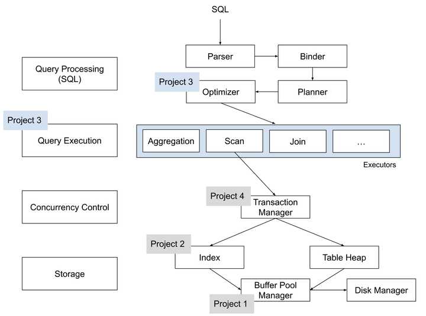
我们这里需要修改的是内存管理 (Project 1 Buffer Pool Manager)、存储引擎 (Project 2 Index)两个部分。
**项目1** 与 **Bustub** 的存储管理器相关联，其重点在于实现存储管理器中的缓冲池。该项目分为三个主要部分：

1. **Extendible Hash Table**（可扩展哈希表）
- src/include/container/hash/extendible_hash_table.h
- src/container/hash/extendible_hash_table.cpp
2. **LRU-K Replacer**（LRU-K页替换算法）
- src/include/buffer/lru_k_replacer.h
- src/buffer/lru_k_replacer.cpp
3. **Buffer Pool Manager** 实例
- src/include/buffer/buffer_pool_manager_instance.h
- src/buffer/buffer_pool_manager_instance.cpp
其中，`Extendible Hash Table` 和 `LRU-K Replacer` 是 `Buffer Pool Manager` 的内部组件，而 `Buffer Pool Manager` 则为系统提供了获取页面的接口。系统通过提供一个 `page_id` 即可向 `Buffer Pool Manager` 请求对应页面，而无需关心页面具体存储位置。系统对获取页面的过程不感兴趣，无论是从磁盘还是内存读取，或者页面在磁盘和内存之间可能发生的移动。所有这些内部操作均由 `Buffer Pool Manager` 完成，对系统而言这些过程不可见。

`Disk Manager` 已经为我们提供，是实际在 disk 上读写数据的接口。整体流程如下
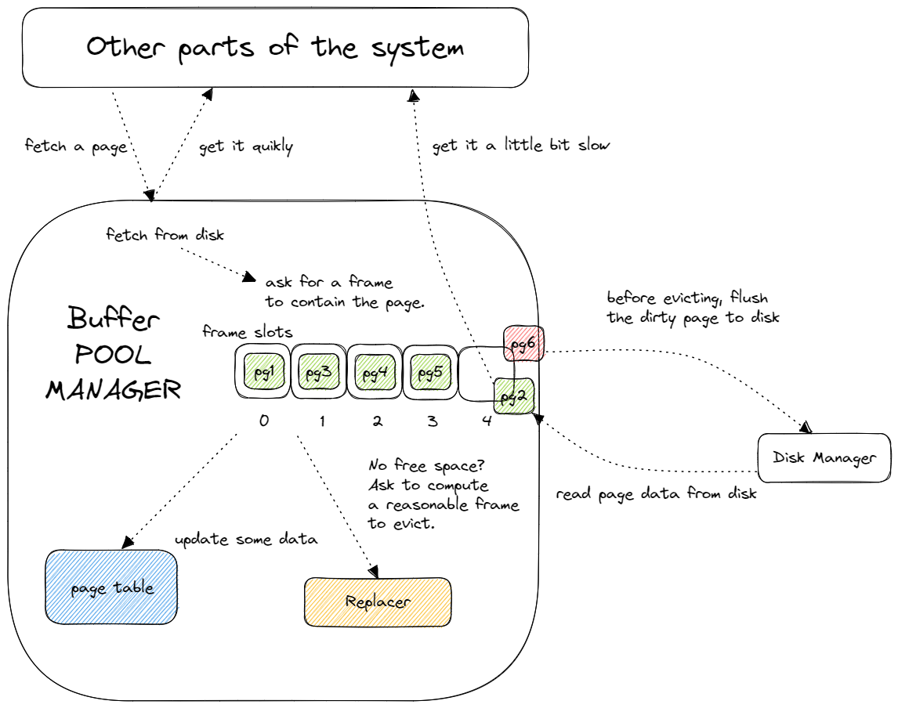
## Extendible Hash Table
## 任务描述
在这个部分，我们需要实现一个可扩展哈希表，不允许使用内建的哈希表，比如 `unordered_map`。这个哈希表在 Buffer Pool Manager 中的主要作用是存储缓冲池中页面 ID 和帧 ID 的映射关系。该哈希表使用无序桶来存储唯一的键/值对。你的哈希表必须支持在不指定表的最大大小的情况下插入/删除键/值条目的能力。你的表需要根据需要逐渐增长，但不需要缩小。也就是说，你不需要实现缩小或压缩哈希表的支持。你还需要支持检查键是否存在于哈希表中，并返回其相应的值。

你必须在项目源代码的指定文件中实现哈希表。你只被允许修改哈希表头文件（src/include/container/hash/extendible_hash_table.h）及其相应的实现文件（src/container/hash/extendible_hash_table.cpp）。你不需要修改任何其他文件。在你的实现中，你不能在内部使用另一个内置的哈希表。你必须在 ExtendibleHashTable 类中实现以下函数：
- `Find(K, V)`：对于给定的键 K，检查它是否存在于哈希表中。如果存在，则将指向其相应值的指针存储在 V 中并返回 true。如果键不存在，则返回 false。
- `Insert(K, V)`：将键/值对插入哈希表。如果键 K 已经存在，用新值 V 覆盖其值并返回 true。如果键/值对无法插入桶中（因为桶已满且键未更新现有对），在重试之前执行以下步骤：
	- 如果桶的局部深度等于全局深度，请增加全局深度并将目录的大小加倍。
	- 增加桶的局部深度。
	- 拆分桶并重新分配目录指针和桶中的键值对。有些实现在插入后，如果桶立即变满，会拆分桶。但是在这个项目中，请检测桶是否溢出，并在插入之前执行拆分。
- `Remove(K)`：对于给定的键 K，从哈希表中删除其相应的键/值对并返回 true。如果键 K 在哈希表中不存在，则返回 false。
- `GetGlobalDepth()`：返回整个哈希表的当前全局深度。
- `GetLocalDepth(dir_index)`：返回给定目录索引指向的桶的当前局部深度。
- `GetNumBuckets()`：返回哈希表中分配的桶的总数。
你可以利用提供的 `IndexOf(K)` 私有函数来计算给定键哈希到的目录索引。此外，我们提供了一个表示可扩展哈希表中桶的嵌套类 `Bucket`。首先按照代码文档的说明完成 `Bucket` 类的 TODO 部分，可以使你更容易实现 `ExtendibleHashTable` 类的 API。但是你可以随意编写自己的内部类/辅助函数。

你需要确保哈希表中的所有操作都是线程安全的，使用 `std::mutex` 来保护数据结构。保护数据结构的方式由你决定。
### Extendible Hash Table Design
Extendible Hash Table 由一个目录（directory）和多个桶（bucket）组成。
- **目录（directory）**: 存放指向桶的指针，是一个数组。用于寻找键对应值所在的桶。
- **桶（bucket）**: 存放值，是一个链表。一个桶最多可以存放指定数量的值（用于存放每个 `<K, V>`，即 `<frame_id, page_id>`）。
在介绍 Extendible Hash 之前，首先需要了解一下哈希表和链式哈希。
### Hash Table
哈希表是一种抽象数据类型，通过哈希函数将数据从键（key）映射到值（value）。它提供平均 O(1) 的时间复杂度，但最坏情况下可能达到 O(n)。需要注意的是，实际实现中可能存在较大的常数，这是需要考虑的现实因素。
哈希表的实现包括两个关键部分：
1. **哈希函数（Hash Function）**
    - 定义了如何将大的键空间映射到较小的域。
    - 需要在执行效率和冲突率之间进行权衡。一个极端是，存在一个哈希函数，总是返回一个常数（非常迅速，但会导致冲突）。另一个极端是存在“完美”的哈希函数，其中没有冲突，但计算起来非常耗时。
2. **哈希方案（Hashing Scheme）**
    - 解决哈希后的键冲突的方式。
    - 需要在分配大哈希表以减小碰撞率，以及提供其他机制处理碰撞之间进行权衡。
### Chained Hashing
在链式哈希中，哈希表的数组成员是桶的链表。因此，当发生冲突时，只需将元素添加到相应桶的末尾。如果桶已满，则可以创建一个新的桶。Chained Hash 简单地将新的 value 追加到其 key 对应 bucket 链表的最后，也就是说 Chained Hash 的 bucket 没有容量上限。

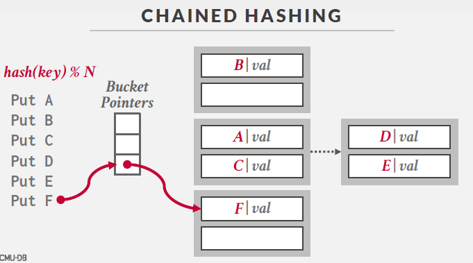

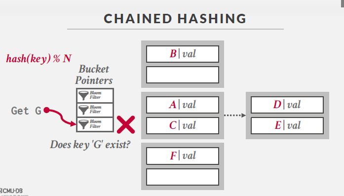

### Extendible Hashing
Extendible Hashing 是链式哈希的一种变体，其主要区别在于将桶拆分，而不是让链表永远增长。拆分过程只涉及移动被拆分桶中的元素，不会影响其他元素。这种方法允许哈希表的多个槽（slots）指向同一个桶。
在下图中，哈希数组中存放了对应桶的指针。

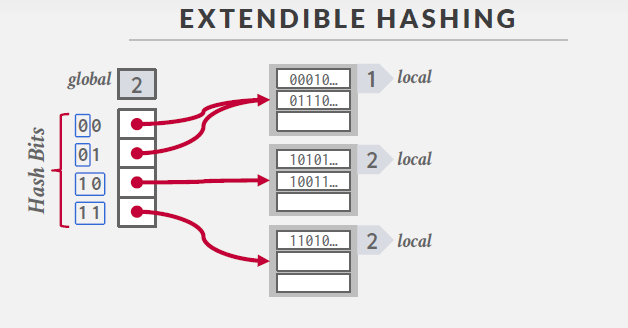

对于哈希数组，存在一个 **全局 bit 位**，表示要检查前多少位作为哈希值。在上图中，全局 bit 为 2，表示只需查看前两位即可确定哈希值，也可推断哈希表中槽总数为$2^2=4$个。同时，每个桶有一个 **本地 bit 位**，表示找到本地桶需要多少位。查找过程如下图，以查找元素 A 为例，全局 bit 为 2，A 的前两位为 01，推断 A 在第 2 个槽内，然后在相应的桶中查找 A。


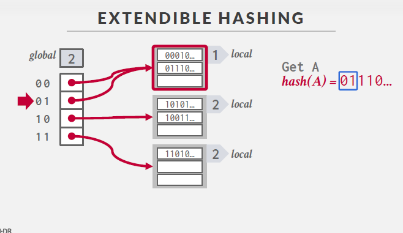

插入操作如下图所示，例如要插入元素 B，B 的前两位为 10，知道它在第 3 个槽内，于是将它放入第 3 个槽对应的桶中。

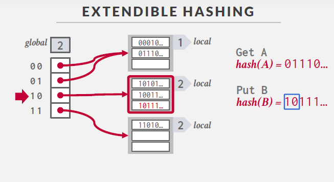

如果插入时发现桶已满，如下图所示，在插入元素 C 时，前两位为 10，插入第 3 个槽对应的桶，但发现已满，因此对该桶进行拆分。拆分后，本地 bit 加 1，变为 3，全局 bit 也变为 3。

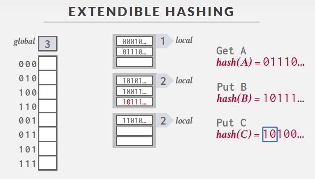

拆分后再将元素 C 插入。

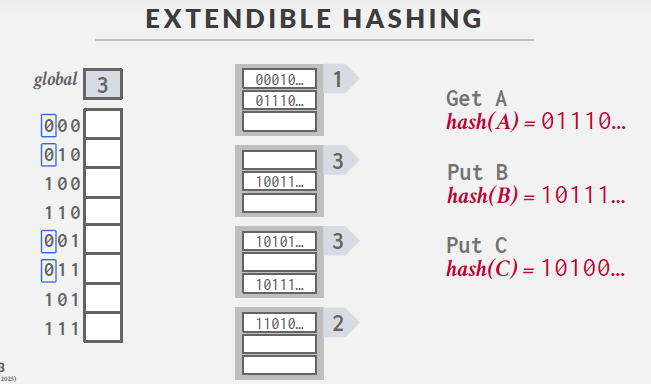
随后，按照 local bit 从小到大的顺序，依次遍历桶，将哈希数据连接到桶中。

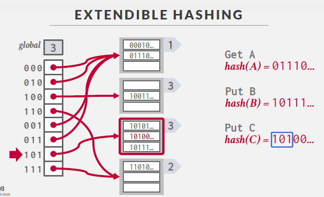

在拆分过程中，Extendible Hash Table 通过只修改哈希数组并移动桶中的元素来实现扩展，这种方法利用了前缀的性质，使得桶的拆分变得简单而有效。拆分操作需要进行判断当前 bucket 的 local depth 是否等于 global depth：

- 若相等，即仅有一个指针指向 bucket，需要对 directory 扩容。
- 若不相等，即有多个指针指向 bucket，则无需扩容，只需重新分配原来指向此 bucket 的指针。

拆分操作包含以下步骤：
1. 全局深度（global depth）加一
2. 目录（directory）容量翻倍
3. 创建一个新的 bucket
4. 重新安排指针：新索引应指向低位对应索引的 bucket。这些指向同一个bucket的指针称为兄弟指针。重新安排指针实际上是重新安排指向需要拆分的bucket的兄弟指针。兄弟指针的数量不一定只有两个，可以有 2^n 个。
5. 重新分配 KV 对：使用全局深度重新计算一遍 K 对应的 index 并插入对应的 bucket。

需要注意的是，每次插入操作前都要判断是否需要进行拆分。拆分后并不代表可以直接插入，因为可能在重新分配 KV 对时，所有的 KV 对又被塞到了同一个 bucket 里，而需要插入的 KV 对也被带到了这个 bucket。因此可能需要多次拆分才能成功插入。

总体而言，Extendible Hash Table 与 Chained Hash Table 最大的区别在于，Extendible Hash 中不同的指针可以指向同一个桶，而 Chained Hash 中每个指针对应一个桶。在 Chained Hash 中，发生冲突时会简单地将新的值追加到其键对应桶链表的最后，而桶没有容量上限。而在 Extendible Hash 中，如果桶达到容量上限，则对桶进行一次拆分操作。


# LRU-K Replacer
## 任务描述
这个组件负责在缓冲池中跟踪页面的使用。你将在 `src/include/buffer/lru_k_replacer.h` 中实现一个名为 `LRUKReplacer` 的新类，以及其相应的实现文件 `src/buffer/lru_k_replacer.cpp`。请注意，`LRUKReplacer` 是一个独立的类，与其他 `Replacer` 类无关。你只需实现 LRU-K 替换策略，即使有对应的文件，也无需实现 LRU 或时钟替换策略。

LRU-K 算法淘汰的帧是与替换器中所有其他可替代帧的最大后退 k-距离的帧。后退 k-距离计算为当前时间戳与第 k 次先前访问的时间戳之间的差异。具有小于 k 的历史访问次数的帧将其后退 k-距离设为 +inf。当多个帧具有 +inf 后退 k-距离时，替换器将淘汰具有最早时间戳的帧。

`LRUKReplacer` 的最大大小与缓冲池的大小相同，因为它包含了 `BufferPoolManager` 中所有帧的占位符。然而，在任何给定的时刻，并非所有替代器中的帧都被视为可淘汰的。`LRUKReplacer` 的大小由可淘汰帧的数量表示。`LRUKReplacer` 被初始化为没有帧。然后，只有当一个帧被标记为可淘汰时，替代器的大小才会增加。

你需要实现LRU-K 策略。你需要实现以下方法：

- `Evict(frame_id_t*)`：淘汰具有替换器中所有其他可替代帧的最大后退 k-距离的帧。将帧 ID 存储在输出参数中并返回 True。如果没有可淘汰的帧，则返回 False。
- `RecordAccess(frame_id_t)`：记录给定帧 ID 在当前时间戳被访问。在 `BufferPoolManager` 中将页面固定后应调用此方法。
- `Remove(frame_id_t)`：清除与帧关联的所有访问历史。仅在 BufferPoolManager 中页面删除后应调用此方法。
- `SetEvictable(frame_id_t, bool set_evictable)`：控制帧是否可淘汰，并调整 `LRUKReplacer` 的大小。当页面的引用计数达到 0 时，其相应的帧被标记为可淘汰，替代器的大小增加。
- `Size()`：返回当前在 `LRUKReplacer` 中可淘汰的帧数。

在实现这些方法时，请确保它们是线程安全的，并使用 `std::mutex` 来保护数据结构。
## LRU-K Replacer Design
LRU-K 替换算法旨在管理缓冲池中页面引用的记录，并在缓冲池满时确定需要驱逐的页面。虽然 LRU（最近最少使用）是一个熟悉的概念，但 LRU-K 引入了一些微小的变化。

在 LRU-K 中，我们引入了一个参数 K，用于表示考虑的引用次数范围。每个页面都会保持一个大小为 K 的引用时间戳列表，记录过去 K 次引用的时间。当缓冲池达到容量限制时，需要选择页面进行替换。具体步骤如下：

1. **引用次数大于等于 K 的页面：** 如果缓冲池中的所有页面都被引用了 K 次或更多次，那么选择最早被引用的页面进行替换，即比较第 K 次引用的时间戳。
   
2. **引用次数小于 K 的页面：** 如果存在被引用次数少于 K 次的页面，那么只考虑这些页面。在这个子集中，采用传统的 LRU 方法，比较它们第一次被引用的时间戳，并替换最早被引用的页面。

这一变化使得 LRU-K 在处理多次引用的页面时更为灵活，能够更好地适应不同的访问模式。通过引入 K 这个参数，算法可以根据具体需求进行调整，从而更好地满足应用程序的需求。

在LRU-K Replacer中，页面具有一个`evictable`属性。当页面的`evictable`为`false`时，上述算法将跳过该页面。这主要是为了使上层调用者能够锁定一个页面，执行一些读写操作，从而确保页面保留在内存中。

在实现时需要注意，传统的LRU使用哈希表加双向链表实现，可以保证各操作均为O(1)的复杂度。但是由于LRU-K需要保存K次引用的记录，因此不能再使用双向链表。

## LRU-K Replacer Implementation
### 如何LRU-K算法运行
#### 访问记录：

1. 每当页面被访问时，该访问被记录下来。
2. 如果页面访问次数少于K次，它被放在历史列表中。
3. 一旦页面被访问K次，它被移动到缓存列表。

#### 列表维护：

1. 历史列表中的页面在达到K次访问之前不会被考虑用于替换。
2. 缓存列表中的页面是根据最近一次访问时间排序的，最近最少被访问的页面排在列表末尾。

#### 页面替换：

1. 当需要替换页面时，LRU-K算法首先查看缓存列表，从列表末尾开始（即最少最近使用的页面）。
2. 如果缓存列表中没有可替换的页面，算法会检查历史列表。

### 维护历史列表和缓存列表
#### 历史列表：
1. 记录访问次数小于K的页面。
2. 当页面访问次数增加时，从历史列表移除并加入缓存列表。
3. 用于追踪那些不太频繁但仍然重要的页面。
#### 缓存列表：

1. 记录访问次数等于或超过K次的页面。
2. 列表根据最近一次访问时间维护。
3. 用于追踪最活跃的页面。

### 为什么存在两个列表
1. 提高精度：
  - 通过区分不同访问频率的页面，LRU-K能更精确地预测哪些页面可能不再被需要。这比传统LRU的“一刀切”方法要灵活得多。
2. 减少错误替换：
  - 避免了将经常访问但最近偶尔未被访问的页面错误地替换出去。
3. 性能优化：
  - 对于不同类型的工作负载，这种方法可以更好地适应，特别是在数据库和文件系统的缓存管理中。
4. 避免抖动：
  - 在传统的LRU中，即使是临时增加的访问频率也可能导致页面被保留在缓存中。LRU-K通过要求连续的K次访问来减少这种抖动。

# Buffer Pool Manager Instance
## 任务描述
接下来，您需要在系统中实现缓冲池管理器(`BufferPoolManager`)。`BufferPoolManager`负责从`DiskManager`获取数据库页面并将它们存储在内存中。`BufferPoolManage`还可以在有要求它这样做时，或者当它需要驱逐一个页以便为新页腾出空间时，将脏页写入磁盘。为了确保您的实现能够正确地与系统的其余部分一起工作，我们将为您提供一些已经填写好的功能。您也不需要实现实际读写数据到磁盘的代码(在我们的实现中称为`DiskManager`)。我们将为您提供这一功能。

系统中的所有内存页面均由`Page`对象表示。`BufferPoolManager`不需要了解这些页面的内容。 但是，作为系统开发人员，重要的是要了解`Page`对象只是缓冲池中用于存储内存的容器，因此并不特定于唯一页面。 也就是说，每个`Page`对象都包含一块内存，`DiskManager`会将其用作复制从磁盘读取的物理页面内容的位置。 `BufferPoolManager`将在将其来回移动到磁盘时重用相同的Page对象来存储数据。 这意味着在系统的整个生命周期中，相同的`Page`对象可能包含不同的物理页面。`Page`对象的标识符（`page_id`）跟踪其包含的物理页面。 如果`Page`对象不包含物理页面，则必须将其`page_id`设置为`INVALID_PAGE_ID`。

每个Page对象还维护一个计数器，以显示“固定”该页面的线程数。`BufferPoolManager`不允许释放固定的页面。每个`Page`对象还跟踪它的脏标记。您的工作是判断页面在解绑定之前是否已经被修改（修改则把脏标记置为1）。`BufferPoolManager`必须将脏页的内容写回磁盘，然后才能重用该对象。

`BufferPoolManager`实现将使用在此分配的前面步骤中创建的`LRUReplacer`类。它将使用`LRUReplacer`来跟踪何时访问页对象，以便在必须释放一个帧以为从磁盘复制新的物理页腾出空间时，它可以决定取消哪个页对象

你需要实现在(`src/buffer/buffer_pool_manager.cpp`):的以下函数

- `FetchPageImpl(page_id)`
- `NewPageImpl(page_id)`
- `UnpinPageImpl(page_id, is_dirty)`
- `FlushPageImpl(page_id)`
- `DeletePageImpl(page_id)`
- `FlushAllPagesImpl()`
## Buffer Pool
`Buffer pool`是一种内存缓存，用于存储从磁盘读取的页面，本质上是从数据库内存中分配的一大块区域。
### 组织形式
`Buffer pool`的组织形式是一个固定大小的页面数组，其中的每个数组项称为一 **帧**（frame）。当数据库管理系统（DBMS）需要一个页面时，该页面的副本就会放在一个帧中。因此，系统可以首先在`buffer pool`中查找是否有这个页面。如果没有找到，系统就会从磁盘中读取该页面。
以下是一个示意图，其中`frame1`存放着`page1`，`frame2`存放着`page3`。脏页（`dirty pages`）被缓存，并且不会立即写回到磁盘中。这意味着对页面的修改首先发生在`buffer pool`中，而不是直接在磁盘上进行。这样可以提高性能，因为写入磁盘通常比写入内存慢得多。
同时 DBMS 会维护一个 page table，负责记录每个 page 在内存中的位置，以及是否被写过（Dirty Flag），是否被引用或引用计数（Pin/Reference Counter）等元信息。
### Buffer Pool Metadata
Buffer pool必须维护一些元数据，以便能高效、正确地运行。
#### Page Table
`Page table`是一个在内存中的哈希表，用于记录当前在`buffer pool`中的页面信息。它执行以下映射：将`page id`映射到`frame location`（因为在`buffer pool`中的页面不是按顺序存储的）。

与操作系统中的页表不同，`Page table`主要用于管理数据库页面的位置信息。它允许系统快速查找给定`page id`的页面在`buffer pool`中的位置。
#### Page Directory
`Page directory`将`page id`映射到数据库文件位置。与`Page table`不同，`Page directory`的更改需要写回磁盘。它提供了一个从`page id`到实际存储位置的映射，确保在需要从磁盘读取页面时，系统知道在哪里查找。
#### Other Metadata
##### Dirty Flag
`Dirty flag`是一个标志，用于指示页面是否已经被修改。如果页面被修改，`dirty flag`将被设置为`true`，表示该页面的内容在`buffer pool`中与磁盘上的内容不同。这允许系统延迟将修改的页面写回磁盘，提高性能。
##### Pin/Reference Counter
`Pin/reference counter`记录有多少线程正在访问特定页面（读或写）。如果`counter`大于0，表示该页面正在被活动线程使用，因此不应该被替换出内存。同时，它还可以用于实施锁，以防止多线程访问可能导致的问题。当`counter`为0时，表示没有线程在使用该页面，可以考虑替换出内存。

### Buffer Pool Manager Design

在`Buffer Pool Manager`中有几个关键的成员：

- `pages`：缓冲池中缓存页面的指针数组

- `disk_manager`：用于读取和写入磁盘上指定页码的页面数据的工具

- `page_table`：刚才实现的可扩展哈希表，用于将页码映射到帧码，即页面在缓冲池中的位置

- `replacer`：刚才实现的LRU-K替换算法，用于确定需要驱逐的页面

- `free_list`：用于管理空闲帧的列表

`Buffer Pool Manager`向上层调用者提供的两个最重要的功能是`new page`和`fetch page`。下面整理一下`Buffer Pool Manager`完成这两项工作的流程：

### New Page
上层调用者希望新建一个页面时，调用 `NewPgImp`。如果当前缓冲池已满且所有页面都是不可驱逐的，则直接返回。否则，执行以下步骤：

- 如果当前缓冲池中仍有空闲的帧，创建一个空的页面并将其放置在一个空闲帧中。
- 如果当前缓冲池中没有空闲的帧，但有可驱逐的页面，利用`LRU-K Replacer`获取可驱逐的帧码，将帧中原页面驱逐出缓冲池，并将新的页面放置在此帧中。在驱逐时：
    - 如果当前帧为`dirty`（已发生写操作），将对应帧中的页面数据写入磁盘，并将`dirty`标志重置为`false`。清空帧数据，并从`page_table`中移除页面ID，在`replacer`中移除引用记录。
    - 如果当前帧不为`dirty`，直接清空帧数据，并从`page_table`中移除页面ID，在`replacer`中移除引用记录。在`replacer`中记录帧的引用记录，并将帧的`evictable`属性设为`false`，因为上层调用者可能需要对该页面进行读写操作。
- 使用 `AllocatePage` 分配一个新的页面ID（从0递增）。将此页面ID和存放页面的帧码插入`page_table`。将页面的`pin_count`加1。

### Fetch Page
上层调用者给定一个页面ID，`Buffer Pool Manager`返回对应的页面指针，调用 `FetchPgImp`。如果可以在缓冲池中找到对应页面，则直接返回。否则，需要将磁盘上的页面载入内存，即放入缓冲池。如果当前缓冲池已满且所有页面都是不可驱逐的，则直接返回空指针。否则，按照与`New Page`操作相同的方式处理：

- 首先尝试在`free list`中找到一个空闲的帧来存放需要读取的页面。如果没有空闲帧，就驱逐一个页面来腾出帧。获取一个空闲帧后，通过`disk_manager`读取页面ID对应的页面数据，将其存放在帧中。
- 在`replacer`中记录引用，将帧的`evictable`属性设为`false`，并将页面ID插入`page_table`。页面的`pin_count`加1。

总体流程相对简单，如果缓冲池没有空位，也无法腾出空位，`Buffer Pool Manager`会直接返回，表示暂时无法处理请求。如果有空位，就会尝试使用空位，如果没有空位但可以驱逐页面，就会驱逐一个页面来腾出空位。这样可以在内存中缓存一个页面，方便上层调用者进行操作。同时，还需要同步更新一些信息，如`page_table`和`replacer`。在驱逐页面时，如果页面为`dirty`（已发生写操作），还需要将其数据写回磁盘。

### Pin & Unpin

当上层调用者新建一个页面或者获取一个页面时，`Buffer Pool Manager`会自动将该页面的`pin_count`加1，表示此页面被引用。接下来，上层调用者对页面进行一系列读写操作，操作完之后，调用`unpin`，告知`Buffer Pool Manager`此页面的使用情况。`Buffer Pool Manager`内部会根据`pin_count`的情况来决定是否可以将页面从内存中移除或刷新到磁盘上。需要特别注意的是，`Buffer Pool Manager`不会直接修改页面的`dirty`标志，只有在`unpin`操作时，通过传入`is_dirty`参数来标识页面是否发生了写操作，从而更新`dirty`标志。如果页面的`dirty`标志已经为`true`，则不会被改变，表示其他调用者已经进行了写操作。只有在页面的`dirty`标志为`false`时，才能将其标记为`is_dirty`。

### 备注
#### `Locks`和`Latches`有什么区别
* `Locks`
  `Locks`不同于OS中的锁，数据库中的lock是一个higher-level的，概念上的，避免不同transactions对数据库的竞争。如对tuples、tables、databases的lock。Transactions会在它整个生命周期持有lock
* `Latches`
  `Latches`是一个low-level的保护原语，DBMS用于其内部数据结构中的关键部分，如hash table等。Latch只在操作执行的时候被持有。
#### 性能优化
[perf](https://perf.wiki.kernel.org/index.php/Main_Page) 是 linux 下的一款性能调优工具。
##### Installation
安装方式 (Ubuntu 22.04 LTS)：
```bash
sudo apt-get install linux-tools-$(uname -r) linux-tools-generic -y
```
##### Commands
```bash
sudo perf record -g -a /path/to/your/application
```
运行一个程序，并对其采样，生成相关数据 `perf.data`。`-g` 表明记录函数调用关系，`-a` 为路径名，还有一个可选参数 `-e`，表明需要监控的事件。

perf 有一个监控事件列表，包含 cpu clock，cache miss，page fault 等各种事件。可以用查看。默认为 cpu clock。
```bash
sudo perf list
```

生成 `perf.data` 后，执行
```bash
sudo perf report -g
```
查看报告。在报告中可以看到各个函数的使用情况以及调用关系。
# 测试
```shell
make format
make extendible_hash_table_test
make lru_k_replacer_test
make buffer_pool_manager_instance_test
./test/extendible_hash_table_test
./test/lru_k_replacer_test
./test/buffer_pool_manager_instance_test
```
如果通过了测试，将会显示如下的通过测试截图
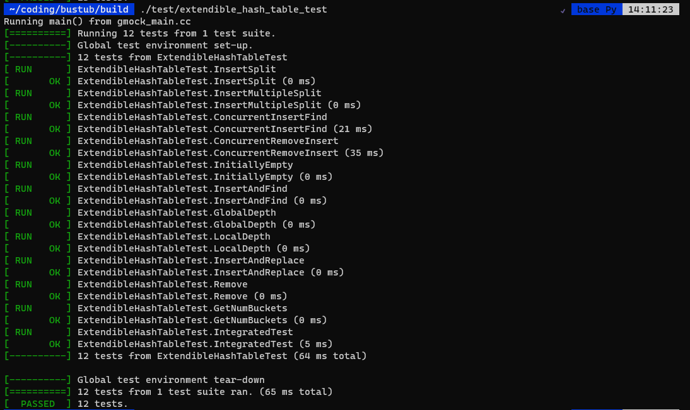
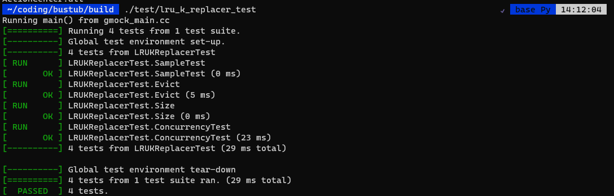
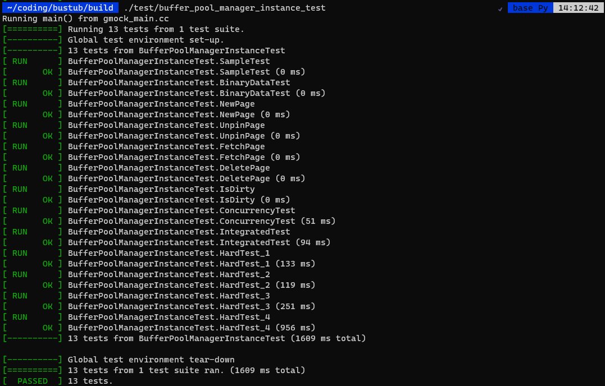

# 提交
```shell
zip project1-submission.zip \
    src/include/container/hash/extendible_hash_table.h \
    src/container/hash/extendible_hash_table.cpp \
    src/include/buffer/lru_k_replacer.h \
    src/buffer/lru_k_replacer.cpp \
    src/include/buffer/buffer_pool_manager_instance.h \
    src/buffer/buffer_pool_manager_instance.cpp
```
或者
```shell
make submit-p1
```
# 注意事项：
1. 多个线程将同时访问内部数据结构，因此您需要确保它们的关键部分受到锁存器[(latches)](https://stackoverflow.com/a/42464336)的保护（这些在操作系统中被称为“锁”）。
2. 您可以使用任何内置的[C++17容器](http://en.cppreference.com/w/cpp/container)除非另有规定。这取决于你决定你想使用哪一个。请注意，这些容器不是线程安全的，您需要在实现中包含锁存器来保护它们。
3. 因为代码框架内部注释良好，建议写代码的时候关闭Copilot进行写作。

