# 前言
具体的项目实现请[参考](https://15445.courses.cs.cmu.edu/fall2022/project2/)
这份Tutorial目的是提供一个更加友好的入门解答，给出其中一些算法实现解析和实现的注意事项，帮助大家在实现和Debug过程中节约时间。这个项目的课程对应Lecture08-Lecture09，请同学们实现之前先阅读这一部分的讲义。
# 参考资料
1. 课程官网：[https://15445.courses.cs.cmu.edu/fall2022/](https://15445.courses.cs.cmu.edu/fall2022/)
2. Bustub Github Repo:[https://github.com/cmu-db/bustub](https://github.com/cmu-db/bustub) 
3. 课程视频：[CMU Intro to Database Systems (15-445/645 Fall 2022) ](https://www.youtube.com/playlist?list=PLSE8ODhjZXjaKScG3l0nuOiDTTqpfnWFf)
4. 自动测评网站 GradeScope：[Your Courses | Gradescope](https://www.gradescope.com/)，课程代码是PXWVR5，学校要选择CMU.
5. Discord 交流平台：[https://discord.gg/YF7dMCg](https://discord.gg/YF7dMCg)
6. 课程中文讲解：[CMU-15445 数据库内核](https://www.bilibili.com/video/BV1bQ4y1Y7iT/)
7. B+ 树插入删除的动态演示: [https://goneill.co.nz/btree-demo.php](https://goneill.co.nz/btree-demo.php) 
8. 官方可视化参考:[https://15445.courses.cs.cmu.edu/fall2022/bpt-printer/](https://15445.courses.cs.cmu.edu/fall2022/bpt-printer/)
9. [一个与本项目无关的内存B+树实现](https://github.com/sayef/bplus-tree)
10. [B+树并发控制机制的前世今生](http://mysql.taobao.org/monthly/2018/09/01/)
11. B+树数据结构讲解：https://zhuanlan.zhihu.com/p/149287061

# 概述
Project 2 需要为 Bustub 实现 B+ 树索引。拆分为两个部分：
- Checkpoint1: 单线程 B+ 树
- Checkpoint2: 多线程 B+ 树
实验中给出的 B+ 树接口非常简单，基本只有查询、插入和删除三个接口，内部基本没有给出别的辅助函数，可以让我们自由发挥。


因此，任何合法的 B+ 树实现都是允许的。B+ 树索引在 Bustub 中的位置如图所示：


需要使用我们在 Project 1 中实现的 buffer pool manager 来获取 page。
# Checkpoint1 Single Thread B+Tree
**Checkpoint1** 分为两个部分：
- **Task1: B+Tree Pages**  
    在 Bustub 索引 B+ 树中，所有的节点都是 page。这包括 leaf page，internal page，以及它们的父类 tree page。在这一部分，我们将深入研究 B+ 树中的各种页面。  
- **Task2: B+Tree Data Structure (Insertion, Deletion, Point Search)**  
    Checkpoint1 的重点在于 B+ 树的插入、删除和单点查询操作。我们将详细了解 B+ 树数据结构，并实现这些关键操作。
## Task1 B+Tree Pages
### 任务描述
您需要实现三个页面类来存储您的B+Tree树的数据。
#### B+Tree父页面
这是内部页面和叶页面都继承的父类。父页仅包含两个子类共享的信息。父页被划分为如下表所示的多个字段。

|变量名|大小|描述|
|---|---|---|
|`page_type_`|4|页面类型（内部或叶子）|
|`lsn_`|4|日志序列号（用于第4项目）|
|`size_`|4|页面中键和值对的数量|
|`max_size_`|4|页面中键和值对的最大数量|
|`parent_page_id_`|4|父页面ID|
|`page_id_`|4|自身页面ID|

您必须在指定的文件中实现父页。您只允许修改头文件（src/include/storage/page/b_plus_tree_page.h）及其相应的源文件（src/storage/page/b_plus_tree_page.cpp）。

#### B+Tree内部页面
内部页面不存储任何真实数据，而是存储一个有序的m个键条目和m+1个子指针（即页面ID）。由于指针的数量不等于键的数量，因此第一个键被设置为无效，并且查找方法应始终从第二个键开始。在任何时候，每个内部页面至少半满。在删除期间，两个半满页面可以合并为一个合法的页面，也可以进行重新分配以避免合并，而在插入期间，一个满页面可以分裂为两个。这是您在B+树实现中可能会做出的许多设计选择之一。

您必须在指定的文件中实现内部页面。您只允许修改头文件（src/include/storage/page/b_plus_tree_internal_page.h）及其相应的源文件（src/storage/page/b_plus_tree_internal_page.cpp）。

#### B+Tree叶子页面
叶子页面存储一个有序的m个键条目和m个值条目。在您的实现中，值应该只是用于定位实际元组的64位记录ID，参见src/include/common/rid.h中定义的RID类。叶子页面对键/值对的数量有与内部页面相同的限制，并且应该遵循与合并、重新分配和分裂相同的操作。

```C++
//Identification: src/include/common/rid.h
#include <cstdint>
#include <sstream>
#include <string>

#include "common/config.h"  // 包含配置文件

namespace bustub {

class RID {
 public:
  /** 默认构造函数创建一个无效的 RID！ */
  RID() = default;

  /**
   * 为给定的页面标识符和槽号创建新的记录标识符。
   * @param page_id 页面标识符
   * @param slot_num 槽号
   */
  RID(page_id_t page_id, uint32_t slot_num) : page_id_(page_id), slot_num_(slot_num) {}

  /**
   * 从一个64位整数创建 RID。
   * @param rid 64位整数，高32位为页面标识符，低32位为槽号
   */
  explicit RID(int64_t rid) : page_id_(static_cast<page_id_t>(rid >> 32)), slot_num_(static_cast<uint32_t>(rid)) {}

  /**
   * 获取表示此 RID 的64位整数。
   * @return 64位整数，高32位为页面标识符，低32位为槽号
   */
  inline auto Get() const -> int64_t { return (static_cast<int64_t>(page_id_)) << 32 | slot_num_; }

  /**
   * 获取页面标识符。
   * @return 页面标识符
   */
  inline auto GetPageId() const -> page_id_t { return page_id_; }

  /**
   * 获取槽号。
   * @return 槽号
   */
  inline auto GetSlotNum() const -> uint32_t { return slot_num_; }

  /**
   * 设置页面标识符和槽号。
   * @param page_id 页面标识符
   * @param slot_num 槽号
   */
  inline void Set(page_id_t page_id, uint32_t slot_num) {
    page_id_ = page_id;
    slot_num_ = slot_num;
  }

  /**
   * 将 RID 转换为字符串表示。
   * @return 字符串表示，格式为 "page_id: xxx slot_num: xxx"
   */
  inline auto ToString() const -> std::string {
    std::stringstream os;
    os << "page_id: " << page_id_;
    os << " slot_num: " << slot_num_ << "\n";

    return os.str();
  }

  /**
   * 重载 << 运算符，用于将 RID 输出到流中。
   * @param os 输出流
   * @param rid RID 对象
   * @return 输出流
   */
  friend auto operator<<(std::ostream &os, const RID &rid) -> std::ostream & {
    os << rid.ToString();
    return os;
  }

  /**
   * 比较两个 RID 是否相等。
   * @param other 另一个 RID 对象
   * @return 如果相等则返回 true，否则返回 false
   */
  auto operator==(const RID &other) const -> bool { return page_id_ == other.page_id_ && slot_num_ == other.slot_num_; }

 private:
  page_id_t page_id_{INVALID_PAGE_ID};  // 页面标识符，默认为无效值
  uint32_t slot_num_{0};  // 槽号，默认为0，表示逻辑偏移量，从0开始，1...
};

}  // namespace bustub

namespace std {
// 为 RID 类定义哈希函数，使其可以用于标准库中的哈希容器
template <>
struct hash<bustub::RID> {
  auto operator()(const bustub::RID &obj) const -> size_t { return hash<int64_t>()(obj.Get()); }
};
}  // namespace std
```


您必须在指定的文件中实现叶子页面。您只允许修改头文件（src/include/storage/page/b_plus_tree_leaf_page.h）及其相应的源文件（src/storage/page/b_plus_tree_leaf_page.cpp）。

重要提示：尽管叶子页面和内部页面包含相同类型的键，它们可能具有不同类型的值，因此叶子页面和内部页面的max_size可能不同。
每个B+树叶子/内部页面对应于缓冲池中的内容（即data_部分）的内存页面。因此，每当您尝试读取或写入叶子/内部页面时，您都需要使用其唯一page_id从缓冲池中获取页面，然后重新解释为叶子或内部页面，并在任何写入或读取操作后取消固定页面。
### Design for B+Tree Pages
Task1 的实现非常简单，都是一些普通的 Getter 和 Setter。这里主要介绍一下 page 的内存布局。在 Project 1 中我们第一次与 page 打交道。page 实际上可以存储数据库内很多种类的数据。例如索引和实际的表数据等等。
```cpp
/** The actual data that is stored within a page. */
char data_[BUSTUB_PAGE_SIZE]{};
/** The ID of this page. */
page_id_t page_id_ = INVALID_PAGE_ID;
/** The pin count of this page. */
int pin_count_ = 0;
/** True if the page is dirty, i.e. it is different from its corresponding page on disk. */
bool is_dirty_ = false;
/** Page latch. */
ReaderWriterLatch rwlatch_;
```

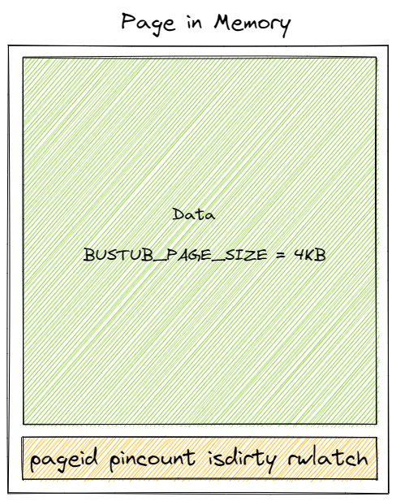

其中，`data_` 是实际存放 page 数据的地方，大小为 `BUSTUB_PAGE_SIZE`，为 4KB。其他的成员是 page 的 metadata。B+树中的 tree age 数据均存放在 page 的 data 成员中。
#### B_PLUS_TREE_PAGE
`b_plus_tree_page` 是另外两个 page 的父类，即 B+树中 tree page 的抽象。page data 的 4KB 中，24Byte 用于存放 header，剩下的则用于存放 tree page 的数据，即 KV 对。
```C++
IndexPageType page_type_; // leaf or internal. 4 Byte 
lsn_t lsn_ // temporarily unused. 4 Byte 
int size_; // tree page data size(not in byte, in count). 4 Byte 
int max_size_; // tree page data max size(not in byte, in count). 4 Byte 
page_id_t parent_page_id_; // 4 Byte 
page_id_t page_id_; // 4 Byte // 24 Byte in total
```


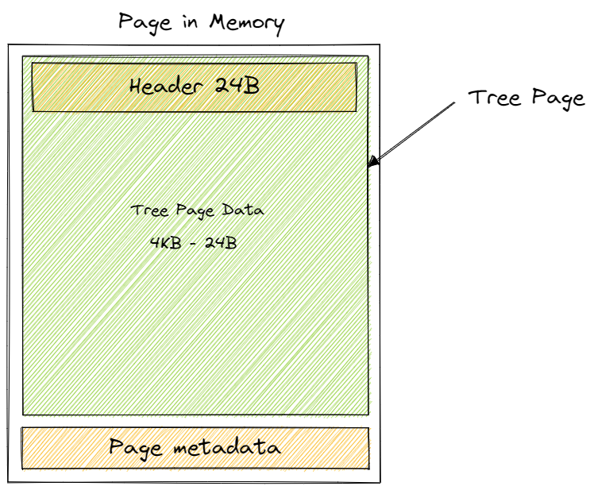

#### B_PLUS_TREE_INTERNAL_PAGE
这部分涉及 B+ 树中的内部节点。
```C++
MappingType array_[1];
```
在 internal page 中，没有新的 metadata，header 大小仍为 24B。它唯一的成员是这个看似怪异的大小为 1 的数组。这个大小为 1 的数组在逻辑上似乎无法存放多个键值对，引起了一些疑惑。然而，这种设计采用了一种特殊的写法，称为 flexible array。

简单来说，当你有一个类，这个类中有一个成员为数组。在用这个类初始化一个对象时，你不能确定该将这个数组的大小设置为多少，但知道整个对象的大小是多少 byte，你就可以使用 flexible array。Flexible array 必须是类中的最后一个成员，并且仅能有一个。在为对象分配内存时，flexible array 会自动填充，占用未被其他变量使用的内存。这样就可以确定自己的长度了。

虽然成员在内存中的先后顺序和声明的顺序一致，但需要注意可能存在的内存对齐的问题。在这里，header 中的数据大小都为 4 bytes，没有对齐问题。

到这里，这个大小为 1 的数组的作用就比较清楚了。它利用 flexible array 的特性来自动填充 page data，填充至 4KB 减去 header 24 bytes 后剩余的内存。这些剩余的内存用来存放键值对。


internal page 中，KV 对的 K 是能够比较大小的索引，V 是 page id，用来指向下一层的节点。Project 中要求，第一个 Key 为空。主要是因为在 internal page 中，n 个 key 可以将数轴划分为 n+1 个区域，也就对应着 n+1 个 value。实际上你也可以把最后一个 key 当作是空的，只要后续的处理自洽就可以了。


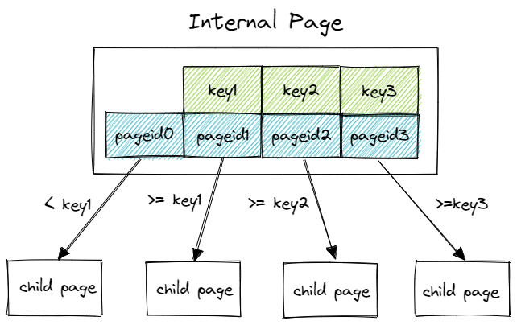

通过比较 key 的大小选中下一层的节点。实际上等号的位置也可以改变，总之，只要是合法的 B+ 树，即节点大小需要满足最大最小值的限制，各种实现细节都是自由的。

另外需要注意的是，internal page 中的 key 并不代表实际上的索引值，仅仅是作为一个向导，引导需要插入/删除/查询的 key 找到这个 key 真正所在的 leaf page。
#### B_PLUS_TREE_LEAF_PAGE
1. **Leaf Page 和 Internal Page 内存布局：** Leaf Page 和 Internal Page 的内存布局基本相似，区别在于 Leaf Page 多了一个成员变量 `next_page_id`，用于指向下一个 Leaf Page，在范围扫描中非常重要。因此，Leaf Page 的 Header 大小为 28 字节。
2. **Leaf Page 中的键值对（KV 对）：** 在 Leaf Page 中，每个键值对（KV 对）中，K 代表实际的索引，而 V 则表示记录的 ID（Record ID），它用于唯一标识表中的某一条数据。与 Internal Page 不同的是，Leaf Page 的键值对是一对一的关系，不像 Internal Page 的 Value 多一个。
3. **B+ 树索引类型：** 在 Bustub 中，所有的 B+ 树索引，无论是主键索引还是二级索引，都是非聚簇索引。这意味着 Leaf Page 不包含完整的记录，而是包含记录的标识符（Record ID），需要额外的查询才能获取完整的记录。
4. **聚簇索引 vs. 非聚簇索引：**
   - **聚簇索引：** 在聚簇索引中，Leaf Page 的 Value 包含表中一条数据的某几个字段或所有字段，但一定包含主键字段。
   - **非聚簇索引：** 在非聚簇索引中，Leaf Page 的 Value 是记录 ID，即指向一条数据的指针。
5. **主键索引 vs. 二级索引：**
   - **主键索引：** 在聚簇索引中，Leaf Page 包含所有字段。在非聚簇索引中，Leaf Page 的 Value 是 Record ID。
   - **二级索引（非主键索引）：** 当使用主键索引查询时，查询到 Leaf Page 即可获得整条数据。当使用二级索引查询时，若查询字段包含在索引内，可以直接得到结果。如果查询字段不包含在索引内，则需要在主键索引中再次查询，这就是回表的过程。
6. **Internal Page 的索引键和索引数：** Internal Page 有 n 个索引键和 n+1 个索引（子结点指针/页号）。0 号槽的键是无效的，但是值（索引）是有效的。这里解释了 Internal Page 的 size 指的是索引数，也就是键值对的总数目，与 Leaf Page 保持统一。在后续查找操作中需要避开 0 号键以确保正确的索引查找。
7. **Leaf Page 中的 Record ID（RID）：** Leaf Page 的键值对的值是 RID，RID 是数据库中的一行数据（Tuple）在内存或者硬盘中的指向。它包括了 4 字节的 page_id（所属页）和 4 字节的 slot_num（页的槽编号）。这个信息表明了实现的B+树为非聚簇索引。

## Task2 B+Tree Data Structure (Insertion, Deletion, Point Search)
### 任务描述
您的B+树索引应仅支持唯一键。也就是说，当您尝试将具有重复键的键-值对插入索引时，它不应执行插入并返回false。如果删除导致某个页面低于占用阈值，则您的B+树索引还必须正确执行合并或重新分配（称为文本中的“合并”）。

对于检查点＃1，您的B+树索引只需要支持插入（`Insert()`）、点搜索（`GetValue()`）和删除（`Delete()`）。如果插入触发了分裂条件（插入后键/值对的数量等于叶节点的max_size，插入前子节点的数量等于内部节点的max_size），则您应正确执行分裂。由于任何写操作都可能导致B+树索引中`root_page_id`的更改，因此您有责任在头部页（src/include/storage/page/header_page.h）中更新root_page_id，以确保索引在磁盘上是持久的。在BPlusTree类中，我们已经为您实现了一个名为`UpdateRootPageId`的函数；您只需在B+Tree索引的`root_page_id`更改时调用此函数。

您的B+树实现必须隐藏键/值类型和相关比较器的细节，如下所示：
```C++
template <typename KeyType,
          typename ValueType,
          typename KeyComparator>
class BPlusTree{
   // ---
};
```
以下类已经为您实现：
- `KeyType`：索引中每个键的类型。这将只是GenericKey，GenericKey的实际大小由模板参数指定并实例化，取决于索引属性的数据类型。
- `ValueType`：索引中每个值的类型。这将只是64位RID。
- `KeyComparator`：用于比较两个KeyType实例是小于还是大于的类。这些将包含在KeyType的实现文件中。


为了帮助大家更好理解和实现，这里先讲解B+树的相关内容
### B+树简介
#### B+ Tree的特性
1. 完美平衡树
2. 根结点至少有两个子女。
3. 除了根结点以外的其他结点的关键字个数 $m/2≤keys≤m−1$。
4. 内部结点有k个关键字就会有k+1个孩子
5. 叶结点会用双向链表连接起来。因为所有的value都保存在叶子结点。其他结点只保存索引，这样可以支持顺序索引和随机索引
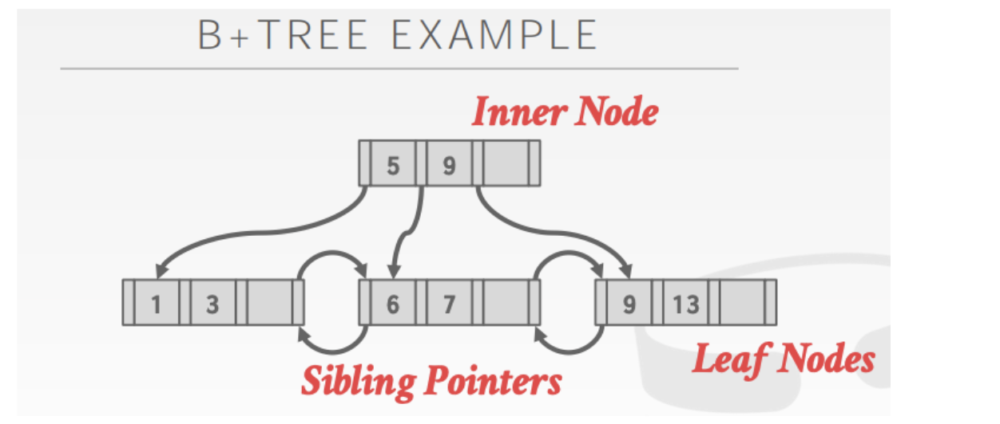
正常来讲b+树的所有元素都需要在叶子结点出现。
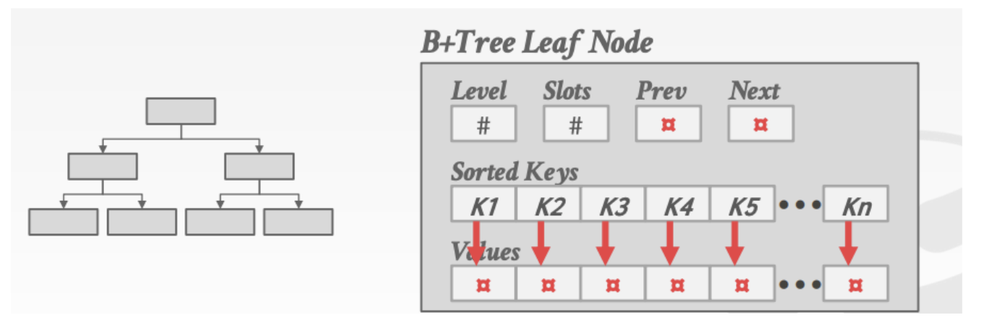
对于叶子结点的存储有两种形式,一种是存指针。一种存数据
1. Record IDs: A pointer to the location of the tuple
2. Tuple Data: The actual contents of the tuple is stored in the leaf node
#### B+树的查找
##### 算法原理
1. **开始于根节点：** 查找操作始终从根节点开始。
2. **内部节点查找：** 如果当前节点是内部节点（非叶子节点），它包含键的范围，根据键的值决定要进入哪个子节点。通过在内部节点的键数组上进行二分查找，找到子节点的索引。
3. **叶子节点查找：** 查找会一直向下，直到达到叶子节点。叶子节点包含实际的键值对。
4. **叶子节点查找：** 一旦到达叶子节点，采用二分查找或其他适当的方法查找具体的键。如果找到了匹配的键，返回相应的值。
5. **未找到键：** 如果在叶子节点中未找到键，返回未找到或者null，表示键不存在。
##### 伪代码
```
procedure BPlusTreeSearch(tree, key):
    node = tree.root
    search_result = Search(node, key)

    if search_result.key_exists:
        // 在叶子节点中找到键
        return search_result.value
    else:
        // 未找到键
        return null

procedure Search(node, key):
    // 从给定节点开始在B+树中查找键
    if node is leaf node:
        // 在叶子节点中查找
        index = binarySearch(node.keys, key)
        if index < node.keys.length and node.keys[index] == key:
            return { "key_exists": true, "node": node, "index": index }
        else:
            return { "key_exists": false, "node": null, "index": null }
    else:
        // 在内部节点中查找
        index = binarySearch(node.keys, key)
        child = node.children[index]
        return Search(child, key)

procedure binarySearch(keys, key):
    // 执行二分查找以在给定键数组中找到键的索引
    left = 0
    right = keys.length - 1

    while left <= right:
        mid = (left + right) / 2
        if keys[mid] == key:
            return mid
        elif keys[mid] < key:
            left = mid + 1
        else:
            right = mid - 1

    return left
```
B+树的结构应该已经比较熟悉了，节点分为内部节点（Internal Page）和叶子节点（Leaf Page），每个页面上的键（key）都按顺序排列。当需要查找一个键对应的值时，首先从根节点开始递归向下查找，直到找到键所在的叶子节点。这个过程可以简化为一个名为 `FindLeaf()` 的函数。

`FindLeaf()` 函数从根节点开始查找，如果在查找过程中到达了叶子节点，直接返回叶子节点，否则根据键在当前内部节点中找到对应的子节点（child）的页面ID，然后递归调用 `FindLeaf()`。由于键是有序的，所以可以使用二分搜索来查找对应的子节点。

内部节点中存储了键和子节点的页面ID。如果我们获得了一个页面ID，如何将其转换为页面指针？我们可以使用项目1中实现的缓冲池（buffer pool）。

```cpp
Page *page = buffer_pool_manager_->FetchPage(page_id);
```

同样地，如果需要创建一个新的页面，也可以使用缓冲池的 `NewPage()` 函数。

获得一个页面后，我们如何使用它来存储数据？如之前提到的，页面的 `data_` 字段是用于存储数据的实际4KB字节数组。我们可以使用 `reinterpret_cast` 将这个字节数组强制转换为我们要使用的类型，例如叶子节点（Leaf Page）：

```cpp
auto leaf_page = reinterpret_cast<B_PLUS_TREE_LEAF_PAGE_TYPE *>(page->GetData())
```
`reinterpret_cast` 用于执行无关类型的强制转换，这意味着原始位（bits）不变，只是用新类型重新解释这些位。需要注意，这种转换是非常不安全的，必须确保转换后的内存布局仍然是合法的。在这里，原始类型是字节数组，而新类型是我们要使用的树页面（tree page）。

一旦找到了叶子节点，就可以使用二分搜索查找键，并找到相应的记录ID。搜索过程相对简单，但还有一个重要且复杂的细节，即页面取消固定（page unpin）的问题。

在获取页面ID后，我们使用缓冲池的 `FetchPage()` 函数获取页面指针。但要注意，在使用完页面后，必须将页面取消固定，否则最终会导致缓冲池中的所有页面都被固定，无法从磁盘读取其他页面。一个合适的做法是，在本次操作中找到页面最后一次使用的地方，并在最后一次使用后取消固定页面。

####  B+ Tree 的插入
##### 算法原理
- 如果树为空，创建一个新的叶子结点，并将记录插入其中，成为根结点。
- 对于叶子结点：
    - 找到叶子结点，插入记录。
    - 如果当前结点的键的数量小于等于 `m-1`，插入结束。
    - 否则，将叶子结点分裂成左右两个叶子结点，更新父结点的索引信息。
- 对于索引结点：
    - 如果当前结点的键的数量小于等于 `m-1`，插入结束。
    - 否则，将索引结点分裂成左右两个索引结点，更新父结点的索引信息。
##### 伪代码
```
procedure BPlusTreeInsert(tree, key, value):
    node = tree.root
    insert_result = InsertInNode(node, key, value)

    if insert_result.node is overflowed:
        // 如果节点溢出，需要分裂根节点
        if node is root:
            new_root = createNewRoot()
            tree.root = new_root
            new_root.children.append(node)
            node.parent = new_root

        // 分裂节点并更新父节点
        splitNode = SplitNode(insert_result.node)
        updateParentAfterSplit(insert_result.node, splitNode)
        
        // 将键插入到适当的分裂节点中
        InsertInNode(splitNode, insert_result.key, insert_result.value)

procedure InsertInNode(node, key, value):
    // 将键值对插入节点
    node.keys.append(key)
    node.values.append(value)

    // 按升序排序键以保持顺序
    sortKeys(node)

    if node is overflowed:
        // 如果节点溢出，需要分裂节点并返回分裂的节点
        splitNode = SplitNode(node)
        return { "node": splitNode, "key": splitNode.keys[0], "value": splitNode.values[0] }
    else:
        return { "node": node, "key": null, "value": null }

procedure sortKeys(node):
    // 按升序排序键
    node.keys.sort()

procedure createNewRoot():
    // 创建B+树的新根节点
    return { "keys": [], "values": [], "children": [], "parent": null }

procedure SplitNode(node):
    // 将节点分裂为两个节点
    midIndex = node.keys.length / 2
    splitNode = { "keys": node.keys.splice(midIndex), "values": node.values.splice(midIndex), "children": [], "parent": node.parent }

    // 更新分裂节点的父子关系
    updateChildRelationship(splitNode)

    return splitNode

procedure updateParentAfterSplit(originalNode, splitNode):
    // 分裂后更新原节点和分裂节点的父节点
    parent = originalNode.parent

    if parent is not null:
        parent.keys.append(splitNode.keys[0])
        parent.values.append(splitNode.values[0])
        sortKeys(parent)

        // 更新分裂节点的父子关系
        updateChildRelationship(splitNode)

        // 检查父节点是否溢出
        if parent is overflowed:
            // 递归分裂并更新父节点
            splitParent = SplitNode(parent)
            updateParentAfterSplit(parent, splitParent)

procedure updateChildRelationship(node):
    // 更新给定节点的父子关系
    for child in node.children:
        child.parent = node
```

假如有一棵 4 阶的 B+ 树：

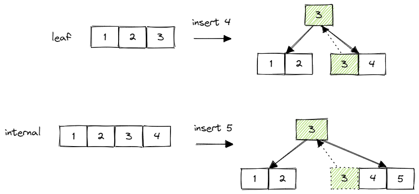

Insert 的整个流程大致就是先向下递归找到 leaf page，插入 KV 后再向上递归分裂。可以按照以下步骤：

**步骤 1: 查找叶子页**

首先，我们需要根据关键字（key）找到要插入的叶子页。这一步使用 `Findleaf()` 函数来完成。找到叶子页后，我们可以在其中插入键值对。

**步骤 2: 插入键值对到叶子页**

在叶子页上插入键值对是我们的下一步。在插入时，一定要保持键的有序性。通常，可以使用二分搜索来确定插入位置，确保键值对正确地插入到叶子页中。

**步骤 3: 检查叶子页大小**

插入完成后，我们需要检查当前叶子页的大小是否已达到最大允许大小。如果叶子页的大小等于最大大小，那么需要执行叶子页的分裂操作。这个过程包括以下步骤：

1. 创建一个新的空白页。
2. 将原叶子页的一半数据移动到新页中。这通常涉及将原叶子页的右半部分移动到新页中。
3. 更新原叶子页和新叶子页的下一页标识。
4. 获取叶子页的父页面。
5. 将用于区分原叶子页和新叶子页的键插入父页面中。
6. 更新父页面中所有子页面的父节点指针。

**步骤 4: 插入新键到父页面**

为了正确区分原叶子页和新叶子页，我们需要在父页面中插入一个新的键。这是因为我们添加了一个新的子节点，需要一个键来区分它们。在这一步中，需要执行以下操作：

1. 根据父页面的标识获取父页面。
2. 检查父页面的大小是否等于最大大小（在插入之前进行检查）。
3. 如果父页面的大小小于最大大小，直接返回父页面。
4. 否则，分裂当前内部页面，并根据需要插入的键选择其中一个分裂后的页面作为新的父页面。

**步骤 5: 分裂内部页面**

分裂内部页面是一个关键步骤，它确保B+树的结构保持平衡。这个过程包括以下步骤：

1. 创建一个新的空白页面。
2. 将原始内部页面的一半数据移到新页面中。需要注意原始页面和新页面的第一个键都是无效的。
3. 更新新页面中所有子页面的父节点指针，以便它们指向新页面。
4. 获取父页面。
5. 将用于区分原始内部页面和新页面的键插入父页面中。
6. 更新父页面中所有子页面的父节点指针。

需要注意的是，第 4 步需要重复执行上述步骤，直到找到一个合适的父节点或者到达根节点。如果在根节点处需要分裂，除了创建一个新节点来容纳原始根节点的一半键值对外，还需要创建一个新的根节点。

#### B+树的删除
##### 算法原理
- 如果叶子结点中不存在对应的键，则删除失败。
- 删除叶子结点中的键，如果结点键的数量大于等于 `Math.ceil(m-1)/2 – 1`，删除操作结束，否则继续执行下一步。
- 如果兄弟结点有富余的键，向兄弟结点借一个键，替换父结点中的键，删除结束。
- 如果兄弟结点没有富余的键，将当前结点和兄弟结点合并，同时删除父结点中的键。
- 如果索引结点键的数量大于等于 `Math.ceil(m-1)/2 – 1`，删除操作结束，否则继续执行下一步。
- 如果兄弟结点有富余的键，父结点键下移，兄弟结点键上移，删除结束。
- 如果兄弟结点没有富余的键，将当前结点和兄弟结点以及父结点合并成一个新结点。
具体可以参考下表
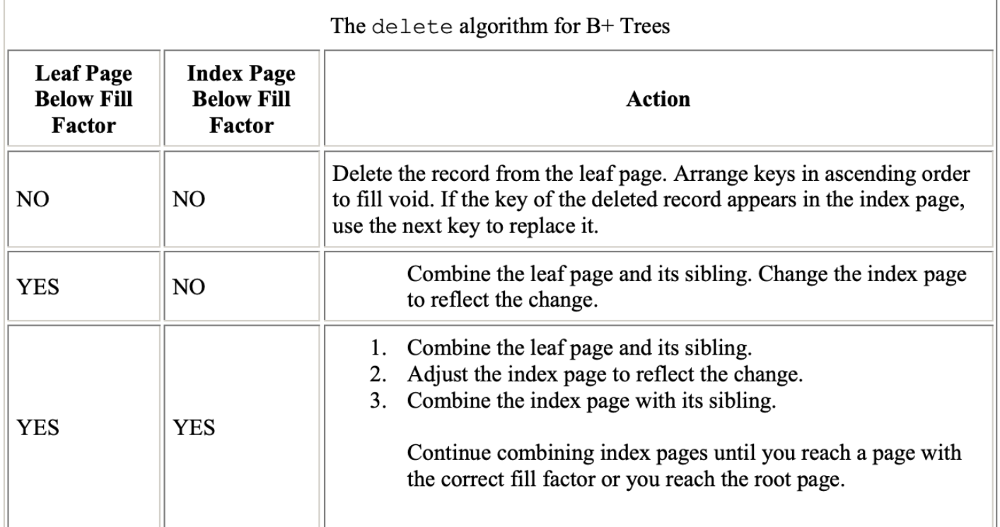
##### 伪代码
```
procedure BPlusTreeDelete(tree, key):
    node = tree.root
    search_result = Search(node, key)

    if search_result.key_exists:
        // Key exists, delete it
        DeleteInLeaf(search_result.node, search_result.index)

        if search_result.node is underflowed:
            // Merge or redistribute nodes if necessary
            AdjustAfterDeletion(search_result.node)

            if search_result.node is root and has only one child:
                // Update the tree's root if necessary
                tree.root = search_result.node.child[0]

procedure DeleteInLeaf(leaf, index):
    // Delete the key-value pair in the leaf node at the specified index
    leaf.delete(index)

    if leaf is underflowed:
        // Merge or redistribute nodes if necessary
        AdjustAfterDeletion(leaf)

procedure AdjustAfterDeletion(node):
    // Merge or redistribute nodes after a deletion
    parent = node.parent

    if parent is not null:
        // Recursively adjust the parent
        AdjustAfterDeletion(parent)

        // Merge or redistribute nodes at the parent level
        parent.adjust(node)
```
DeleteInLeaf 实现细节
```
procedure DeleteInLeaf(leaf, index):
    // Delete the key-value pair in the leaf node at the specified index
    leaf.keys.delete(index)
    leaf.values.delete(index)

    if leaf is underflowed:
        // Merge or redistribute nodes if necessary
        AdjustAfterDeletion(leaf)
```
AdjustAfterDeletion 实现细节
```
procedure AdjustAfterDeletion(node):
    // Merge or redistribute nodes after a deletion
    parent = node.parent

    if node.keys.length < Math.ceil(m/2) - 1:
        // Underflow detected, adjustments needed
        left_sibling = node.leftSibling()
        right_sibling = node.rightSibling()

        if right_sibling is not null and right_sibling.keys.length > Math.ceil(m/2) - 1:
            // Redistribute keys from the right sibling
            redistributeFromRightSibling(node, right_sibling)
        else if left_sibling is not null and left_sibling.keys.length > Math.ceil(m/2) - 1:
            // Redistribute keys from the left sibling
            redistributeFromLeftSibling(node, left_sibling)
        else if right_sibling is not null:
            // Merge with the right sibling
            mergeWithRightSibling(node, right_sibling)
        else if left_sibling is not null:
            // Merge with the left sibling
            mergeWithLeftSibling(node, left_sibling)

    if parent is not null:
        // Recursively adjust the parent
        AdjustAfterDeletion(parent)
```

例如 4 阶 B+ 树：

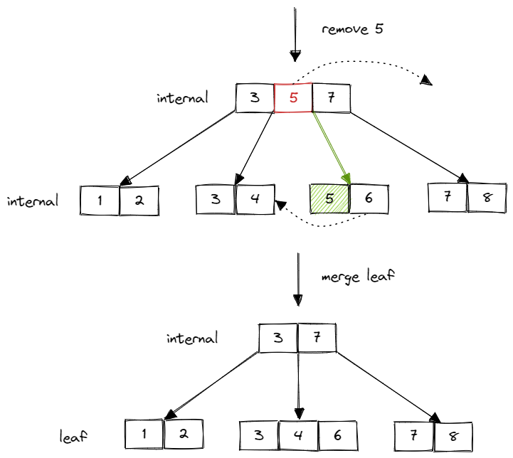

合并 internal page 后，并不是简单地删除父节点中对应 key，而是有一个父节点 key 下推的过程：

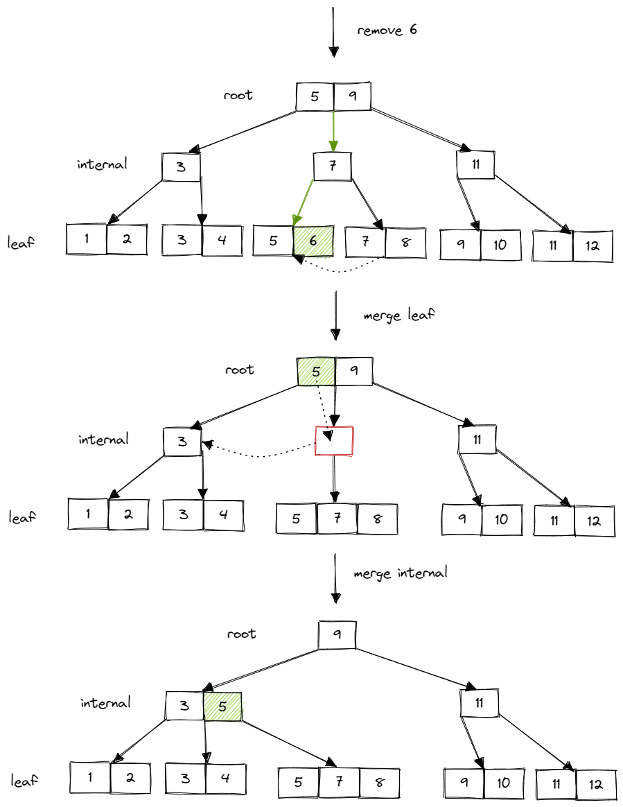

需要注意的是，root page 并不受 min size 的限制。但如果 root page 被删到 size 只剩 1，即只有一个 child page 的时候，应将此 child page 设置为新的 root page。另外，在合并时，两个 page 合并成一个 page，另一个 page 应该删除，释放资源。删除 page 时，仍是调用 buffer pool 的 `DeletePage()` 函数。和 Insert 类似，Delete 过程也是先向下递归查询 leaf page，不满足 min size 后先尝试偷取，无法偷取则合并，并向上递归地检查是否满足 min size。

实现过程中可以参考以下情况分类讨论

**情形 1: 删除键位于叶子节点**

这是最简单的情况，要删除的键位于叶子节点中。处理方法如下：

1. 找到包含要删除键的叶子节点。
2. 从叶子节点中删除该键。
3. 如果删除后，叶子节点的键的数量小于最小允许数量，可能需要进行合并或者重新平衡操作，确保树的平衡性。

**情形 2: 删除键位于内部节点**

如果要删除的键位于内部节点中，处理方法略有不同：

1. 找到包含要删除键的内部节点。
2. 用该键的后继键（或前驱键）替代它，这个后继键可以在右子树中找到。
3. 更新内部节点的键。
4. 如果替代键后导致内部节点的键的数量小于最小允许数量，可能需要进行合并或者重新平衡操作，确保树的平衡性。

**情形 3: 删除导致叶子节点合并**

有时删除操作可能导致叶子节点合并。例如，删除一个叶子节点上的键后，节点的键的数量小于最小允许数量。处理方法如下：

1. 从叶子节点中删除要删除的键。
2. 如果删除后，叶子节点的键的数量小于最小允许数量，可以考虑从相邻的兄弟节点借用键或者合并节点。
3. 如果有兄弟节点具有多余的键，可以借用一个键并更新父节点的对应键。
4. 如果兄弟节点也没有多余的键，那么可以合并叶子节点，并删除父节点中的相应键，然后递归地处理可能导致父节点合并的情况。

**情形 4: 删除导致内部节点合并**

类似于情形3，删除操作可能导致内部节点合并。处理方法如下：

1. 从内部节点中删除要删除的键。
2. 如果删除后，内部节点的键的数量小于最小允许数量，可以考虑从相邻的兄弟节点借用键或者合并节点。
3. 如果有兄弟节点具有多余的键，可以借用一个键并更新父节点的对应键。
4. 如果兄弟节点也没有多余的键，那么可以合并内部节点，并删除父节点中的相应键，然后递归地处理可能导致父节点合并的情况。

**情形 5: 删除导致根节点合并**

如果删除操作导致根节点合并，这意味着树的高度减少了。处理方法如下：

1. 合并根节点的子节点。
2. 删除根节点，并将合并后的节点成为新的根节点。

#### Debug Your B+Tree

- 使用已实现好的 b_plus_tree_printer 工具，可以自己对 B+ 树执行插入、删除等操作，并将结果输出为 dot 文件。
```bash
$ # To build the tool
$ mkdir build
$ cd build
$ make b_plus_tree_printer -j$(nproc)
$ ./bin/b_plus_tree_printer
>> ... USAGE ...
>> 5 5 # set leaf node and internal node max size to be 5
>> f input.txt # Insert into the tree with some inserts 
>> g my-tree.dot # output the tree to dot format 
>> q # Quit the test (Or use another terminal) 
```
- 在代码中调用 `BPlusTree` 的 `Draw()` 函数，可以在指定目录生成一个 dot 文件。

拿到 dot 文件后，可以在本地生成对应的 B+ 树 png：
```bash
dot -Tpng -O my-tree.dot
```
或者把文件内容复制到 [这里](http://dreampuf.github.io/GraphvizOnline/)。（更推荐，生成 svg，对 B+ 树大小无限制）

这个可视化工具对早期发现 B+ 树的各种基本 bug 非常有用。
# Checkpoint2 Multi Thread B+Tree
Checkpoint2 也分为两个部分：
- Task3：Index Iterator。实现 leaf page 的 range scan。
- Task4：Concurrent Index。支持 B+ 树并发操作。
## Task 3: Index Iterator
### 任务描述
您将构建一个通用的索引迭代器，以有效地检索所有叶子页面。基本思想是将它们组织成单个链接列表，然后遍历B+树叶子页面中指定方向的每个键/值对。您的索引迭代器应遵循C++17中Iterator定义的功能，包括使用一组运算符遍历一系列元素的功能，以及支持for-each循环（至少包括增量、解引用、相等和非相等运算符）。需要注意的是，为了支持索引的for-each循环功能，您的BPlusTree应正确实现begin()和end()。

您必须在指定的文件中实现索引迭代器。您只能修改头文件（src/include/storage/index/index_iterator.h）及其相应的源文件（src/storage/index/index_iterator.cpp）。您需要在IndexIterator类的这些文件中实现以下函数。在索引迭代器的实现中，您可以添加任何辅助方法，只要您有以下三个方法即可。

- `isEnd()`：返回此迭代器是否指向最后一个键/值对。
- `operator++()`：移动到下一个键/值对。
- `operator*()`：返回此迭代器当前指向的键/值对。
- `operator==()`：返回两个迭代器是否相等。
- `operator!=()`：返回两个迭代器是否不相等。

在迭代器中，我们只需存储当前叶子页（leaf page）的指针和当前停留的位置即可。遍历完当前页后，通过下一个叶子页的标识找到下一个叶子页。同样，不要忘记解锁已经遍历完的页。

## Task 4: Concurrent Index
### 任务描述
在这部分，您需要更新您原始的单线程B+树索引，以便支持并发操作。我们将使用课堂上和教材中描述的锁抓取技术。遍历索引的线程将在B+树页面上获取然后释放锁。只有当子页面被认为“安全”时，线程才能释放父页面上的锁。需要注意的是，“安全”的定义可以根据线程执行的操作类型而变化：

搜索：从根页面开始，在子页面上获取读（R）锁，然后在着陆在子页面上时释放父页面上的锁。 插入：从根页面开始，在子页面上获取写（W）锁。一旦锁定子页面，检查它是否安全，即此情况下未满。如果子页面是安全的，则释放所有祖先上的锁。 删除：从根页面开始，在子页面上获取写（W）锁。一旦锁定子页面，检查它是否安全，即此情况下至少半满。（注意：对于根页面，我们需要根据不同标准进行检查。）如果子页面是安全的，则释放所有祖先上的锁。

重要提示：该文仅描述了锁抓取背后的基本概念，在开始实现之前，请参阅讲座和教材第15.10章。我们的目标是使之前实现的 B+ 树能够支持并发的搜索（Search）、插入（Insert）和删除（Delete）操作。虽然在逻辑上整棵树使用一把锁是可行的，但这样做性能显然会受到影响。因此，在讨论具体实现之前，我们需要先介绍一下 Latch 相关的概念，然后深入了解 Latch Crabbing。

### Latches Overview

**Latch 锁**，也称为闩锁（轻量级锁），其锁定时间必须非常短。如果锁定时间过长，应用的性能将会大幅下降。在 InnoDB 引擎中，Latch 又分为 mutex（互斥量）和 rwlock（读写锁）。其目的是确保并发线程对临界资源的操作正确性，通常缺乏死锁检测机制。

**Lock 锁**的对象是事务，用于锁定数据库中的对象，比如表、页、行。一般来说，lock 锁仅在事务提交或回滚后释放（不同事务隔离级别的释放时间可能不同），并且存在死锁检测机制。

**两者之间的区别：**

- **Locks:** Locks 不同于操作系统中的锁，数据库中的 lock 是一个更高级别的概念，用于避免不同事务对数据库的竞争，例如对元组（tuples）、表、数据库的锁。事务在其整个生命周期中持有 lock。
  
- **Latches:** Latches 是一个低级别的保护原语，DBMS 用于其内部数据结构的临界区，如哈希表等。Latch 仅在操作执行时被持有。
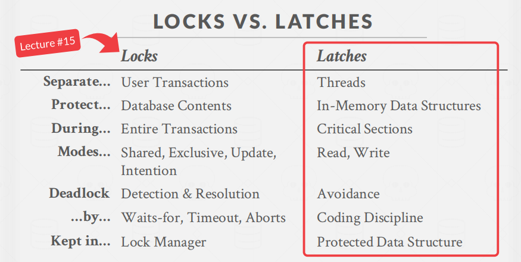
Latch 有两种模式：读模式和写模式，分别称为 "读锁" 和 "写锁"。当线程需要读取数据时，它需要获取读锁，以阻止其他线程对该数据进行写入。当线程需要修改某个数据时，它需要获取写锁，以确保其他线程既不能读取也不能写入该数据。

读锁是相互兼容的，这意味着多个线程可以同时获取相同对象的多个读锁。但是写锁与其他锁不兼容，如果一个线程获取了写锁，那么其他线程不能获取任何其他锁。如果有一个线程正在等待获取写锁，同时有一个新线程尝试获取读锁，那么新线程不能立即获得读锁，必须等待正在等待写锁的线程释放锁后才能获取读锁。这是为了防止饥饿情况的发生。

Latch 的这种锁模式确保了对数据的访问在多线程环境下的正确性和一致性，同时避免了写入操作与读取操作之间的冲突。这是在并发数据库系统中维护数据完整性和性能的关键机制之一。


### B+ Tree Latching
B+树锁要防止两方面问题：
* 多个线程同时尝试修改一个节点的内容
* 一个线程遍历树的时候，另一个线程在分裂或者合并节点
举例：


例如，线程T1要删除44，T1会从根节点遍历，找到44将其删除。这时，来了个线程T2，要找41.如下图所示。

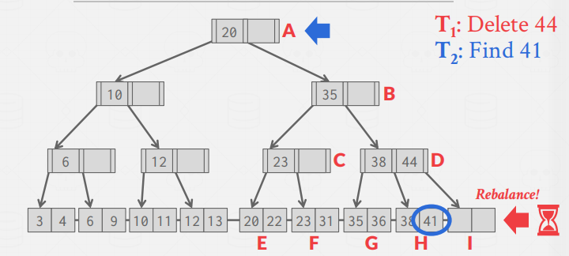

但是，线程T1删除完数值44时，会将树进行重构，导致线程T2找不到41。
#### Enhanced Latch Crabbing & Coupling Tutorial
在 B+ 树中，我们引入了一种被称为 "latch crabbing/coupling" 的加锁方式，以确保对线程的安全性进行有效管理。顾名思义，就像螃蟹一样，移动一只脚，放下，移动另一只脚，再放下。
基本思想如下：
1. 先锁住父节点（parent page），
2. 再锁住子节点（child page），
3. 如果子节点被认定为_安全_，则释放父节点的锁。这里的安全是指当前 page 在当前操作下一定不会发生分裂（split）、偷取（steal）、或合并（merge）。需要注意的是，安全在不同的操作下有不同的定义：对于搜索（Search）操作，任何节点都是安全的；对于插入（Insert）操作，需要判断是否达到最大大小；对于删除（Delete）操作，则需要判断是否达到最小大小。

这里的父节点的“安全”指的是在本次操作中，确定不会发生节点的分裂或合并，即父节点的状态不会发生变更。这样做的原因和正确性是相当明显的。当 page 被认定为安全时，当前操作仅可能改变此 page 及其子节点的值，因此可以提前释放其祖先的锁，以提高并发性能。
##### Search
在 B+ 树上进行读操作时，我们从根节点开始向下搜寻。首先对扫描到的节点加读锁，然后在向下一层时，直接释放父节点的锁。这里能直接释放的原因是整个操作是只读的，不会变更 B+ 树节点的状态。

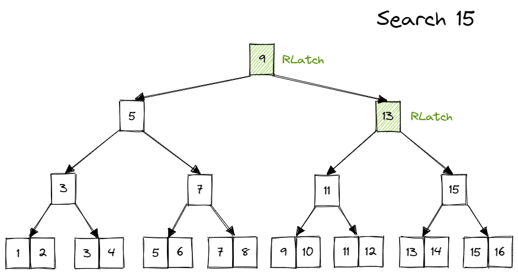
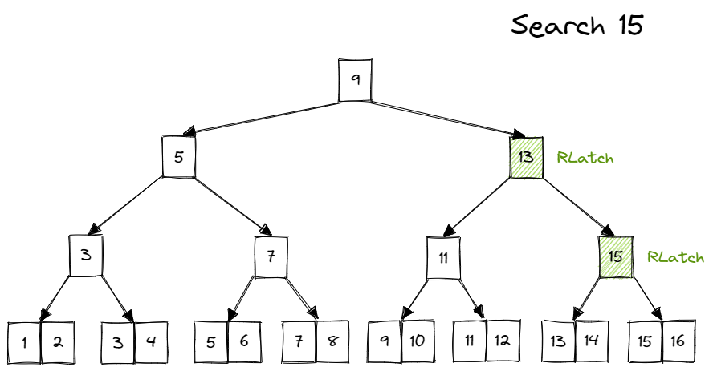
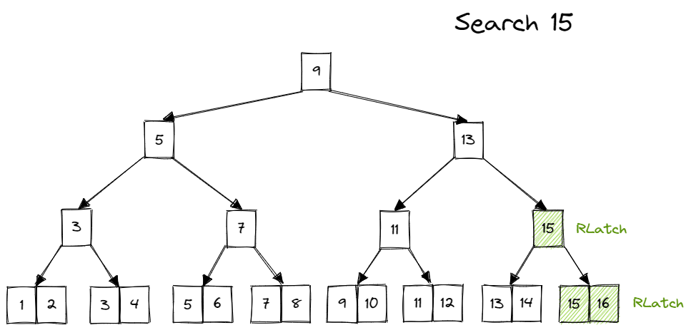
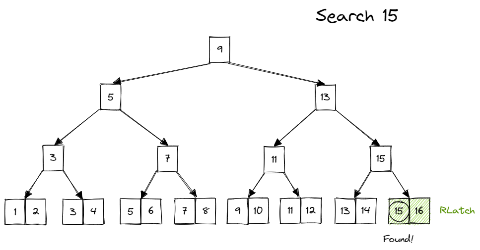
##### Insert&Delete
当需要对 B+ 树进行更新（写入/删除）时，同样从根节点开始搜寻。在经过的节点上加写锁，并进一步判断，如果当前节点被认定为“安全”，那么释放所有父级节点的锁。

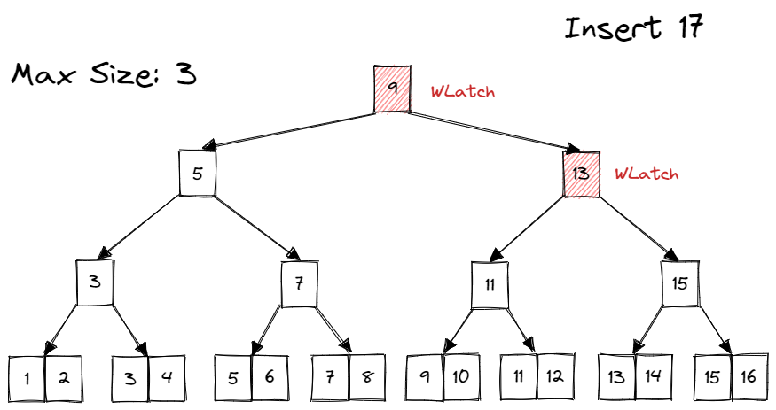
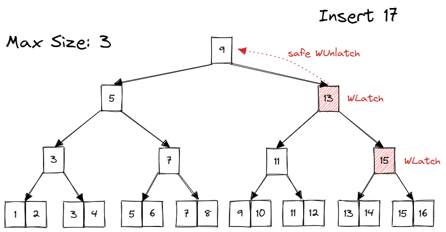
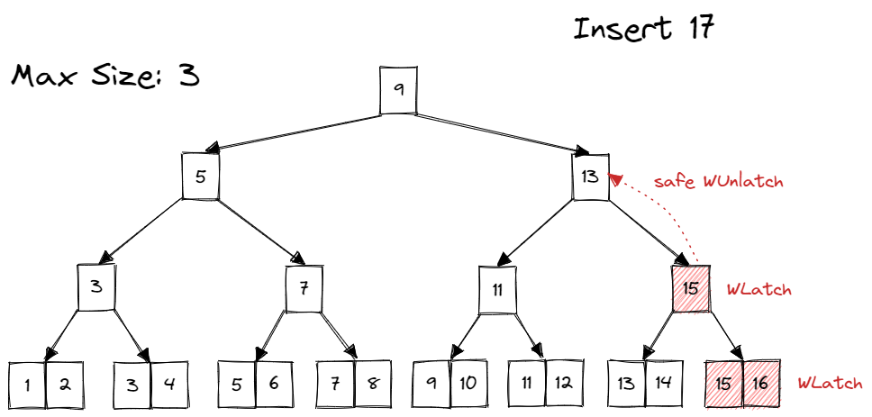
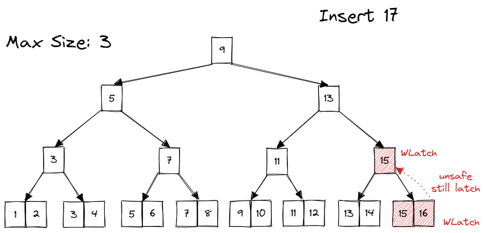
在 child page 不安全时，需要持续持有祖先的写锁。并在出现安全的 child page 后，释放所有祖先写锁。如何记录哪些 page 当前持有锁？这里就要用到在 Checkpoint1 里一直没有提到的一个参数，`transaction`。

transaction 就是 Bustub 里的事务。在 Project2 中，可以暂时不用理解事务是什么，而是将其看作当前在对 B+ 树进行操作的线程。调用 transaction 的 `AddIntoPageSet()` 方法，来跟踪当前线程获取的 page 锁。在发现一个安全的 child page 后，将 transaction 中记录的 page 锁全部释放掉。按理来说，释放锁的顺序可以从上到下也可以从下到上，但由于上层节点的竞争一般更加激烈，所以最好是从上到下地释放锁。

在完成整个 Insert 操作后，释放所有锁。
### Leaf Node Scans
到目前为止，所有示例中的线程都以“自上而下”的方式获取了锁存器。
- 线程只能从低于其当前节点的节点获取锁存器。

- 如果所需的锁存器不可用，则线程必须等待，直到它变为可用。

  

  当处理兄弟节点锁时，我们必须牢记持有其父节点页面的锁，这意味着不会出现另一个线程同时持有兄弟节点锁和父节点锁，从而导致死锁的情况。因此，我们可以放心地说，在这种情况下，死锁是不会发生的。

  然而，如果我们考虑到索引迭代器（Index Iterator），情况可能就会有所不同。索引迭代器按照从左到右的顺序获取叶子节点的锁。如果存在一个需要窃取（steal）或合并（merge）页面的情况，尝试获取其左侧兄弟节点的锁，那么一个迭代器是从左向右移动的，而另一个迭代器是从右向左移动的，这可能会导致循环等待，也就是死锁。因此，在索引迭代器无法获取锁的情况下，我们应该及时放弃锁的获取。在叶子节点扫描过程中，我们要遵守“no-wait”模式，即如果无法获取锁，立即释放所有已经获取的锁，并重新开始扫描过程，以防止死锁的发生。

例子1：只读操作
首先是读操作，有两个线程都去读取数据，并且在各自扫描的叶子节点都加了读锁。线程T1要扫描B，线程T2要扫描A。但由于加的是读锁。都可共享，因此不会产生死锁。

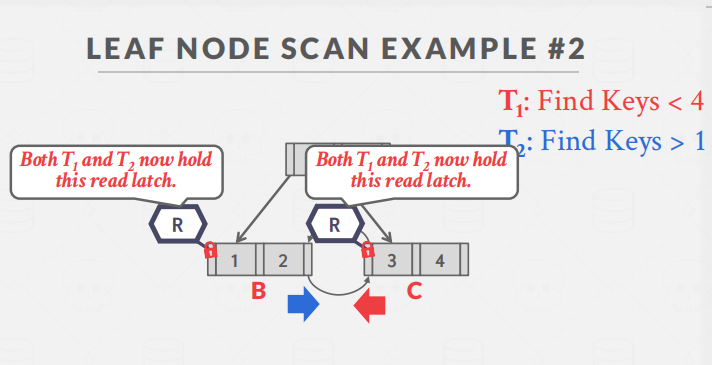

例子2：读写操作
T1 需要删除 4，T2 需要扫描数据，他们都各自枷锁。导致此时两个线程都无法获取到另一个 page 的锁，从而产生死锁。

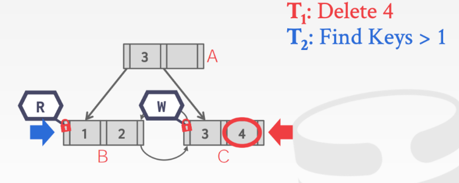
**这里有几种解决方法**

1. 可以等到T1的写操作完成
2. 可以重新执行T2
3. 可以直接让线程T2停止抢得这个Latch。

### When should we unlatch and unpin pages?
在这个项目中，释放页面资源（unpin page）是一个重要的问题，特别是在引入页面锁之后。接下来我们将讨论如何优雅地管理页面资源，避免资源泄漏。首先，让我们明确为什么需要释放页面资源。这是为了避免持续占用缓冲池的资源，可以将其类比为资源泄漏的一种形式。

在这个情境中，我们可以借鉴RAII（Resource Acquisition Is Initialization）的思想。RAII的主要概念是在资源获取时进行初始化，在资源不再需要时进行释放。这有助于确保资源在程序中途退出或抛出异常后也能够被正确释放。这个概念通常用于管理诸如打开套接字、获取互斥锁等资源。实际上，在Project1中，我们已经使用了RAII的方式：

```cpp
std::scoped_lock<std::mutex> lock(mutex_);
```

在这里，我们实际上使用了RAII。在初始化`lock`时，调用`mutex_.Lock()`，在`lock`析构时，调用`mutex_.Unlock()`。这样一来，我们就能够简单地一行代码中确保了在`lock`作用域内锁住了互斥锁，并且在离开`lock`的作用域后，由于`lock`的析构函数，锁会自动释放。

然而，当我们考虑如何管理页面时，情况可能会更加复杂。例如，我们可能需要在不同函数之间传递页面，并且页面资源可能需要在作用域外保持有效，比如在执行"latch crabbing"时可能需要跨越多个函数来持有锁。尽管我们可以尝试使用类似于`PageManager`的方式，初始化时获取页面并在析构时释放页面，但这会引入一些复杂性。

此外，还有一个问题需要考虑。在插入操作中，如果需要分裂页面，我们会在向下递归时持有锁，然后在向上递归时进行分裂。在分裂时，我们需要重新从缓冲池获取页面。需要注意的是，在这里获取页面时不能再次对页面上锁，因为之前在向下递归时已经对页面上锁了，如果同一个线程再次尝试对页面上锁，会引发异常。

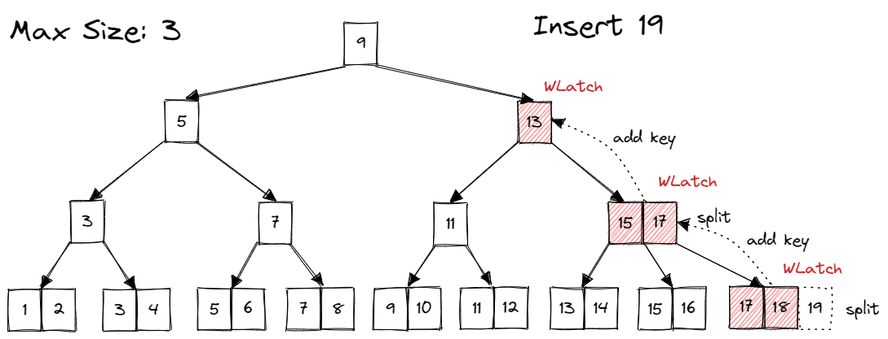

比如这里的例子。在向上递归时，我们已经获取过 parent page 的锁，因此再次从 buffer pool 获取 parent page 时，无需对 parent page 再次加锁。那有没有办法能够知道我们对哪些 page 加过锁？transaction。也就是说，如果一个 page 出现在 transaction 的 page set 中，就代表这个线程已经持有了这个 page 的锁。当然，通过认真分析各个操作获取 page 的路径，我们也可以发现持锁的规律。

**Search（搜索操作）**

在搜索操作中，我们仅向下递归，一旦获得了子页面（child page），就释放了父页面（parent page）的锁。这相对比较简单，因为获取页面的路径从根节点一直到叶子节点是一条直线。在达到叶子节点时，我们仅持有叶子页面的资源。

**Insert（插入操作）**

在插入操作中，首先向下递归，这可能导致持有多个父页面的锁。获取页面的路径仍然是一条线，从根节点到叶子节点，但不同之处在于，到达叶子节点时，可能还持有其祖先页面的资源。接下来是向上递归。向上递归的路径与向下递归的路径完全重叠，只是方向相反。因此，在向上递归时，无需再次获取页面资源，我们可以直接从事务（transaction）中获取页面指针，绕过对缓冲池的访问。在执行分裂操作时，新创建的页面由于尚未连接到树中，不可能被其他线程访问，因此也不需要加锁，只需解锁（unpin）即可。

**Delete（删除操作）**

在删除操作中，向下递归的情况与插入操作类似，路径是一条直线。到达叶子页面后，情况略有不同。由于可能需要对兄弟页面进行窃取（steal）或合并（merge），我们还需要获取兄弟页面的资源。因此，在向上递归时，主要路径与向下递归的路径完全相同，只是除了这条路径之外，还会在途中获取兄弟页面的资源，兄弟页面需要被锁定，而父页面无需再次锁定。兄弟页面仅在需要时被临时使用，使用完后可以直接释放。而在向下递归路径上的锁将在整个删除操作完成后释放。

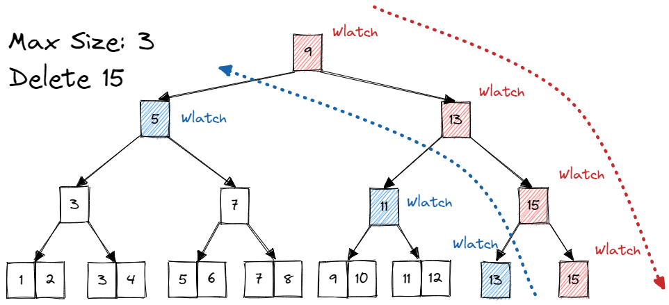

经过上面的讨论，可以得出我们释放资源的时机：向下递归路径上的 page 需要全程持有（除非节点安全，提前释放），在整个操作完成后统一释放。其余 page 要么是重复获取，要么是暂时获取。重复获取无需加锁，使用完后直接 unpin。暂时获取（steal/merge sibling）需要加锁，使用完后 unlatch & unpin。

### Optimization
对于 latch crabbing，存在一种比较简单的优化。在普通的 latch crabbing 中，Insert/Delete 均需对节点上写锁，而越上层的节点被访问的可能性越大，锁竞争也越激烈，频繁对上层节点上互斥的写锁对性能影响较大。因此可以做出如下优化：

Search 操作不变，在 Insert/Delete 操作中，我们可以先乐观地认为不会发生 split/steal/merge，对沿途的节点上读锁，并及时释放，对 leaf page 上写锁。当发现操作对 leaf page 确实不会造成 split/steal/merge 时，可以直接完成操作。当发现操作会使 leaf page split/steal/merge 时，则放弃所有持有的锁，从 root page 开始重新悲观地进行这次操作，即沿途上写锁。

# 注意
## Road Map
There are several ways in which you could go about building a B+Tree Index. This roadmap serves as only a rough conceptual guideline for building one. This roadmap is based on the algorithm outlined in the textbook. You could choose to ignore parts of the roadmap and still end up with a semantically correct B+Tree that passes all our tests. The choice is entirely yours.
- `Simple Inserts`: Given a key-value pair KV and a non-full node N, insert KV into N. Self check: What are the different types of nodes and can key-values be inserted in all of them?
- `Tree Traversals`: Given a key K, define a traversal mechanism on the tree to determine the presence of the key. Self check: Can keys exist in multiple nodes and are all these keys the same?
- `Simple Splits`: Given a key K, and a target leaf node L that is full, insert the key into the tree, while keeping the tree consistent. Self check: When do you choose to split a node and how do define a split?
- `Multiple Splits`: Define inserts for a key K on a leaf node L that is full, whose parent node M is also full. Self check: What happens when the parent of M is also full?
- `Simple Deletes`: Given a key K and a target leaf node L that is at-least half full, delete K from L. Self check: Is the leaf node L the only node that contains the key K?
- `Simple Coalesces`: Define deletes for a key K on a leaf node L that is less than half-full after the delete operation. Self check: Is it mandatory to coalsesce when L is less than half-full and how do you choose which node to coalesce with?
- `Not-So-Simple Coalesces`: Define deletes for a key K on a node L that contains no suitable node to coalesce with. Self check: Does coalescing behavior vary depending on the type of nodes? This should take you through to Checkpoint 1
- `Index Iterators` The section on Task 3 describes the detailed implementation of an iterator for the B+Tree.
- `Concurrent Indices` The section on Task 4 describes the detailed implementation of the latch crabbing technique to introduce concurrency support into your design.

## Requirements and Hints
- 您不得使用全局范围的锁来保护数据结构。换句话说，您不能锁定整个索引，然后在操作完成时解锁锁。我们将通过语法检查和手动检查来确保您正确地执行了锁抓取。
- 我们已经提供了读-写锁的实现（src/include/common/rwlatch.h）。并且已经在页面头文件中添加了获取和释放锁的辅助函数（src/include/storage/page/page.h）。
- 我们不会在B+树索引中添加任何强制性接口。您可以在您的实现中添加任何功能，只要您保持所有原始的公共接口以进行测试目的。
- 不要使用malloc/new来分配大块内存用于您的树。如果需要为树创建新节点或进行某些操作，您应该使用缓冲池。
- 对于此任务，您必须使用传入的指针参数transaction（src/include/concurrency/transaction.h）。它提供了在遍历B+树时存储已获取锁的页面以及在Remove操作期间存储已删除页面的方法。我们建议您仔细查看B+树中的FindLeafPage方法，您可能需要修改您之前的实现（请注意，您可能需要更改此方法的返回值），然后在此特定方法中添加锁抓取的逻辑。
- 在缓冲池管理器中，FetchPage()的返回值是一个指向Page实例的指针（src/include/storage/page/page.h）。您可以在Page上获取锁，但不能在B+树节点（内部节点或叶子节点）上获取锁。

# 提交
```shell
make submit-p2
```

# 测试
```shell
make format
make b_plus_tree_insert_test
make b_plus_tree_sequential_scale_test
make b_plus_tree_delete_test
make b_plus_tree_concurrent_test
./test/b_plus_tree_insert_test
./test/b_plus_tree_sequential_scale_test
./test/b_plus_tree_delete_test
./test/b_plus_tree_concurrent_test
```