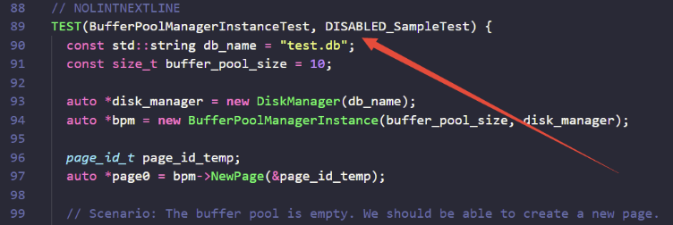
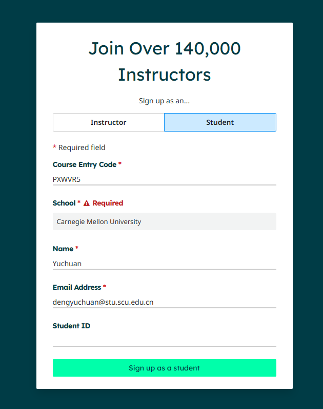
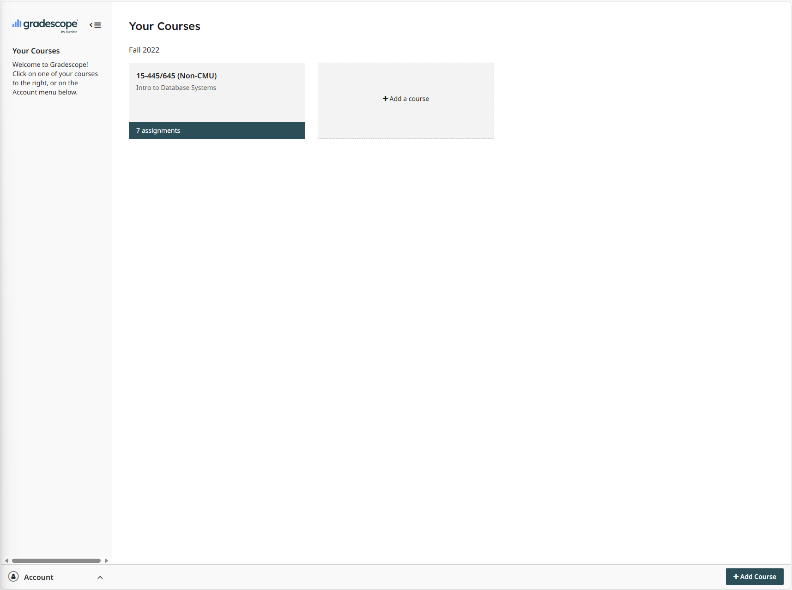
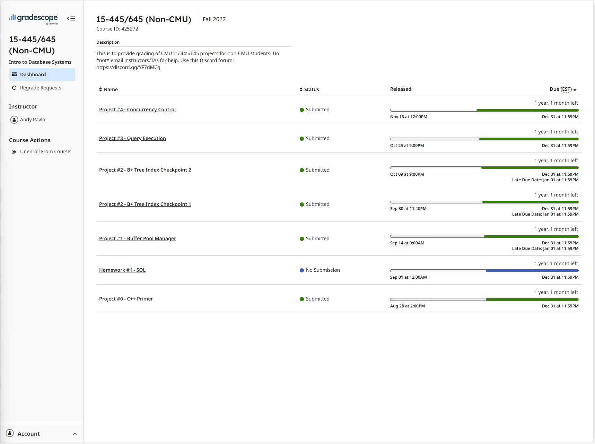
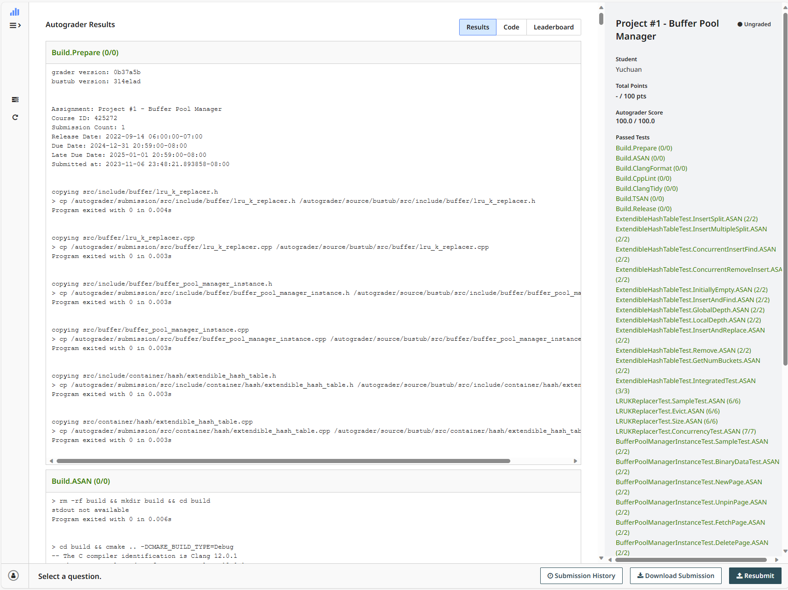

# 概述
本实验框架参考CMU-15445 BusTub框架和MiniSql进行改写，在保留了缓冲池、索引、记录模块的一些核心设计理念的基础上，做了一些修改和扩展，并
1. 进行了测试代码的修改，增加更多本地评测样例。
2. 性能上的优化，在此不做赘述。
注意：为了避免代码抄袭，请不要将自己的代码发布到任何公共平台中。
# 参考资料
1. 课程官网：[https://15445.courses.cs.cmu.edu/fall2022/](https://15445.courses.cs.cmu.edu/fall2022/)
2. Bustub Github Repo:[https://github.com/cmu-db/bustub](https://github.com/cmu-db/bustub) 
3. 课程视频：[CMU Intro to Database Systems (15-445/645 Fall 2022) ](https://www.youtube.com/playlist?list=PLSE8ODhjZXjaKScG3l0nuOiDTTqpfnWFf)
4. 自动测评网站 GradeScope：[Your Courses | Gradescope](https://www.gradescope.com/)，课程代码是PXWVR5，学校要选择CMU.
5. Discord 交流平台：[https://discord.gg/YF7dMCg](https://discord.gg/YF7dMCg)
6. 课程中文讲解：[CMU-15445 数据库内核](https://www.bilibili.com/video/BV1bQ4y1Y7iT/)
# 环境准备
本次实验环境需要在Unix环境下进行，这里推荐您使用Ubuntu 20.04, Ubuntu 22.04或者MacOS (M1/M2/Intel)。
## Linux双系统安装
最推荐的使用是安装64位Linux系统，这里分别给出官方参考教程和中文教材
- [官方教程](https://ubuntu.com/tutorials/install-ubuntu-desktop#1-overview)
- [中文参考](https://zhuanlan.zhihu.com/p/569347838)
## Windows下WSL安装
对于Windows系统，目前该代码暂不支持在Windows平台上的编译。但在Win10及以上的系统中，可以通过安装WSL（Windows的Linux子系统）来进行开发和构建。[WSL安装](https://learn.microsoft.com/zh-cn/windows/wsl/install)请选择Ubuntu子系统（推荐Ubuntu20及以上）。如果你使用Clion作为IDE，可以在Clion中配置WSL从而进行调试，具体请参考[Clion with WSL](https://blog.jetbrains.com/clion/2018/01/clion-and-linux-toolchain-on-windows-are-now-friends/)
具体的WSL安装建议参考[官方教程](https://learn.microsoft.com/zh-cn/windows/wsl/install)，以下安装过程仅供参考
### 安装 wsl 2
1.  以管理员身份运行Windows 命令提示符
2. 输入
```shell
wsl --install
```
默认下装的Ubuntu-22.04，如果未能安装成功可以指定
```shell
wsl --list --online
wsl --install -d Ubuntu-22.04
```
这里d是指distribution 发行版
3.  重启电脑继续安装
4.  输入linux 用户名和密码
用户名和密码不一定和Windows用户名密码相同，它两属于不同的体系
### wsl2 相关配置
1. 查看所有WSL 
```shell
wsl -l --all -v
```
2. 导出WSL
```shell
wsl --export Ubuntu-22.04 F:\ubuntu.tar
```
3. 注销WSL 
```shell
wsl --unregister Ubuntu-22.04
```
4. 导入WSL 
```shell
wsl --import Ubuntu-22.04 F:\Ubuntu\ F:\ubuntu.tar --version 2
```
5. Ubuntu修改默认登陆用户
```shell
ubuntu2204.exe config --default-user {$Username}
```
更多命令请参考[WSL文档](https://learn.microsoft.com/zh-cn/windows/wsl/)
## Docker 容器构建(Optional，Not Guaranteed to Work)
请注意，Docker不是必须的，如果你的WSL/unix环境可以正常运行编译，可以不安装Docker。
### WSL/MacOS下Docker Desktop安装
进入[页面](https://www.docker.com/products/docker-desktop/),下载docker desktop，点击安装，安装完毕后重启。
如果出现WSL Version不匹配，在管理员模式下打开 PowerShell 或 Windows 命令提示符，输入
```shell
wsl --update
```
然后输入
```shell
wsl --shutdown
```
重启docker desktop
### Linux下Docker安装
请注意，这个针对的是原生Linux！！！参考[官网](https://docs.docker.com/engine/install/ubuntu/)
```shell
# Add Docker's official GPG key:
sudo apt-get update
sudo apt-get install ca-certificates curl gnupg
sudo install -m 0755 -d /etc/apt/keyrings
curl -fsSL https://download.docker.com/linux/ubuntu/gpg | sudo gpg --dearmor -o /etc/apt/keyrings/docker.gpg
sudo chmod a+r /etc/apt/keyrings/docker.gpg

# Add the repository to Apt sources:
echo \
  "deb [arch="$(dpkg --print-architecture)" signed-by=/etc/apt/keyrings/docker.gpg] https://download.docker.com/linux/ubuntu \
  "$(. /etc/os-release && echo "$VERSION_CODENAME")" stable" | \
  sudo tee /etc/apt/sources.list.d/docker.list > /dev/null
sudo apt-get update

sudo apt-get install docker-ce docker-ce-cli containerd.io docker-buildx-plugin docker-compose-plugin
```
#### 额外设置
```shell
# Install docker-compose
sudo ln -s /usr/libexec/docker/cli-plugins/docker-compose /usr/bin/docker-compose
# 加入docker组
sudo usermod -aG docker $USER
#退出bash
exit
# 重启
sudo systemctl restart docker
sudo systemctl start docker
```
#### GPU依赖
```bash
# Optional，安装GPU依赖
distribution=$(. /etc/os-release;echo $ID$VERSION_ID) \
      && curl -fsSL https://nvidia.github.io/libnvidia-container/gpgkey | sudo gpg --dearmor -o /usr/share/keyrings/nvidia-container-toolkit-keyring.gpg \
      && curl -s -L https://nvidia.github.io/libnvidia-container/experimental/$distribution/libnvidia-container.list | \
         sed 's#deb https://#deb [signed-by=/usr/share/keyrings/nvidia-container-toolkit-keyring.gpg] https://#g' | \
         sudo tee /etc/apt/sources.list.d/nvidia-container-toolkit.list
sudo apt-get update
sudo apt-get install -y nvidia-container-toolkit
sudo nvidia-ctk runtime configure --runtime=docker
##重启一下docker
sudo systemctl restart docker

docker run --rm -it --gpus=all nvcr.io/nvidia/k8s/cuda-sample:nbody nbody -gpu -benchmark
```
### Docker网络配置
如果你没有配置VPN，请打开settings,替换成下面的文字
```json
{  
  "builder": {  
    "gc": {  
      "defaultKeepStorage": "20GB",  
      "enabled": true  
    }  
  },  
  "debug": false,  
  "experimental": false,  
  "features": {  
    "buildkit": false  
  },  
  "insecure-registries": [],  
  "registry-mirrors": [  
  https://docker.mirrors.ustc.edu.cn/",  
  https://hub-mirror.c.163.com",  
  https://registry.docker-cn.com"  
  ]  
}
```
换源完成之后重启，打开终端
```shell
docker run hello-world
```
若输出 hellow world即为正常运行。若权限不足，可能需要`sudo`再运行
### 创建Docker容器
首先我们要生成镜像，然后创建容器。（容器就是我们最终需要的！）在存储库目录中，运行以下命令来创建Docker映像和容器：
```shell
docker build . -t bustub
docker create -t -i --name bustub -v $(pwd):/bustub bustub bash
```
这将创建一个Docker映像和容器。要运行它，请键入：
```shell
docker start -a -i bustub
```
您可以在“/Bustub”中找到Bustub的代码，并像往常一样运行上面提到的命令。
## 软件包安装
要确保您的计算机上有正确的软件包，请进入目录运行以下脚本在命令行自动安装它们：
```shell
# Linux
sudo build_support/packages.sh
# macOS
build_support/packages.sh
```
如果出现无法运行的问题，请运行后再运行上面的命令
```shell
chmod +x build_support/packages.sh
```
如出现
```shell
Package clang-14 is not available, but is referred to by another package.
This may mean that the package is missing, has been obsoleted, or is only available from another source
E: Package 'clang-14' has no installation candidate
E: Unable to locate package clang-format-14
E: Unable to locate package clang-tidy-14
```
则
```shell
wget https://apt.llvm.org/llvm.sh
chmod +x llvm.sh
sudo ./llvm.sh 14
```
建议参考：[在Ubuntu上配置clang-14的环境](https://blog.csdn.net/weixin_50749380/article/details/128319851)改成clang-14作为编译器。
# 构建
## 基本的构建命令
进入目录后的基本构建命令
```shell
mkdir build
cd build
cmake ..
make -j
```
若不涉及到`CMakeLists`相关文件的变动且没有新增或删除`.cpp`代码（通俗来说，就是只是对现有代码做了修改）
则无需重新执行`cmake..`命令，直接执行`make -j`编译即可。
默认以`release`模式进行编译，如果你需要使用`debug`模式进行编译：
```shell
cmake -DCMAKE_BUILD_TYPE=Debug ..
make -j`nproc`
```
如果你想使用其他的调试器（sanitizers）
```shell
$ cmake -DCMAKE_BUILD_TYPE=Debug -DBUSTUB_SANITIZER=thread ..
$ make -j`nproc`
```
如果在构建过程中遇到问题
```shell
python
command 'python' not found, did you mean:
command 'python3' from deb python3
command 'python' from deb python-is-python3
```
或者
```shell
`/usr/bin/env: ‘python3\r’: No such file or directory`
```
则vim打开要跑的文件
1. `: set ff `查看
2. 然后`:set ff=unix`修改成`unix`类型。
3. 然后`:wq`保存退出即可

开发debug时不推荐一堆printf，而是用`common/logger.h`中的log宏函数，或者使用gdb或lldb进行debug。
## 测试
测试代码使用了 [GTest](https://github.com/google/googletest)
```shell
cd build
make check-tests
```
如果需要运行单个测试，例如，想要运行`lru_replacer_test.cpp`对应的测试文件，可以通过`make lru_replacer_test`命令进行构建。
请注意对单个文件测试的时候需要移除`DISABLED_`前缀,否则测试不会进行。
具体而言，需要你打开`test`文件夹对应的测试CPP文件，打开，删除掉如图所示的位置内容:

## 格式调整
代码建议使用 [Google C++](https://google.github.io/styleguide/cppguide.html)，项目使用 [Clang](https://clang.llvm.org/) 来自动检查源代码的质量。执行以下命令以检查语法。目标将自动更正您的代码和打印错误，您可以手动修复这些错误以符合我们的样式指南。
```shell
make format
make check-lint
make check-clang-tidy-p1
```
## 备注
#### 编译器要求
如果您在编译时遇到问题，请确保您的编译器符合以下要求：
- Apple clang 版本：11.0+ (MacOS)，使用`gcc --version`和`g++ --version`进行检查
- gcc & g++ 版本：8.0+ (Linux)，使用`gcc --version`和`g++ --version`进行检查
- cmake 版本：3.20+ (两者都适用)，使用`cmake --version`进行检查
- gdb 版本：7.0+ (可选)，使用`gdb --version`进行检查
#### Linux发行版指南
1. 如果您已经拥有GNU/Linux发行版，并且希望将其用作开发环境，请放心使用！但是，如果因平台差异遇到问题，请在网上搜索解决方案。
2. 您也可以使用虚拟机，比如VMWare或VirtualBox。如果您选择此方法但没有GNU/Linux发行版，请在虚拟机中安装Ubuntu发行版。此外，如果您在虚拟机方面遇到任何问题，请在互联网上搜索故障排除方法。
3. 选择其他版本的Ubuntu吗？可以。但不同版本的Ubuntu中工具的版本略有差异，尤其是编译器GCC。如果您选择其他版本，可能会遇到一些问题，不过这不会对实验内容产生重大影响。
4. 本地Linux语言选择：在选择语言时，请选择英语，而不是中文。使用中文系统环境可能会给一些命令行操作带来不便，甚至会增加故障排除的难度。
# 评测网站（Optional）
进入[评测网站](https://www.gradescope.com/)拉到最低,选择student进行注册,其中Course Entry Code选择PXWVR5，School选择Carnegie Mellon University，然后输入你的姓名与Email Address进行确认。之后进行邮箱验证即可进入系统主界面。


进入后的界面如下

选择15-445/645(Non-CMU)进入，可以看到如下页面（我这里因为是进行提交过代码的，所以我的status是Submitted)，点选完成的项目提交项目所需的压缩文件即可进行评测。

评测结束后将会在右侧显示评测得分。评测完毕后会显示如下截图，右侧会显示评测分数。


# 附录
附录中会给出一些项目相关的知识讲解
## Docker介绍
### Docker基本概念
- Dockerr是一个用于开发、配置、运行的开放平台。Docker将应用与环境相隔离，让应用程序可以得到快速交付。
- 通俗地讲，Docker是一个虚拟环境容器，可以将你的开发环境、代码、配置文件一并打包放到这个容器中，并发布和应用到任意平台中。
### Why Docker
1. 隔离性: Docker容器提供了隔离的环境，避免了应用程序之间的冲突，也可以保证应用程序的稳定性。
2. 可移植性: Docker容器可以在任何平台上运行，包括云、物理服务器、虚拟机等。
3. 快速部署: Docker容器可以快速地创建和部署，可以避免复杂的配置和安装流程。
4. 资源利用率: Docker容器可以共享操作系统内核，因此它们相对于虚拟机来说更轻量级，更节省资源。
5. 版本控制: Docker容器可以使用版本控制来管理应用程序的变更和升级，方便进行回滚和管理。
### Docker的基本组成
- Docker主要由镜像（image）、容器（container）、仓库（repository）这三个部分组成
-  一个类比：仓库是大家上传镜像、分享镜像的地方，相当于github。dockerhub上面有一些重要的镜像
- 镜像（image）：利用docker将程序和程序运行所需的环境打包，得到的就是镜像。镜像本身包含了程序运行所需要的一切依赖。镜像是只读的，作为创建容器的模板存在——类比C++中的类模板，用于创造容器（container）。
- 容器（container）：镜像运行在容器中，每个容器都是一个独立化的实例。正如在C艹我们可以通过一个class类实例化得到很多对象一样，我们可用同一个镜像运行多个容器。容器和容器之间相互独立，互不干扰，保证运行的安全性——类比于C++中的对象，是大家写好的类模板（镜像）的实例化。
### Docker 常用命令
- docker的基本命令
```shell
docker build <image>：将源代码打包形成镜像并存放在本地
docker pull <image> : 从docker hub上拉取镜像并存放在本地
docker run <image>: 运行镜像image，如果在本地找到了该镜像就直接启动；否则从docker hub上拉去image并启动
参数-d：后台运行
参数-p：端口映射
```
示例：
```shell
docker run hello-world
docker run ubuntu
docker run -it ubuntu:latest /bin/bash
```
扩展命令
```shell
docker info: 查看docker信息，如占用空间、版本等
docker --help: 获取docker的帮助信息
docker <具体命令> --help ：获取docker <具体命令>更详细的信息
docker images: 列出所有本地镜像&详细信息
docker pull <image>[:tag]: 拉取镜像
docker ps ：查看运行中的容器
docker rmi <imageID or imageName> [options]：删除镜像
docker rm [Options] <ID or Names>: 删除容器
docker exec [OPTIONS] CONTAINER COMMAND: 进入容器内部进行调试
docker save: 将镜像打包成tar包
example: docker save demo > demo.tar
docker load：从tar包加载一个镜像
example: docker load < backend.tar>
```
## C++语法准备
C++语法需要一些准备，主要涉及到了以下C++知识：
* 类、继承、多态
* 模板
* 移动语义，如左值右值、std::move
* 智能指针，如unique_ptr
* stl基础，如string
代码需要满足编码规范（如必须使用尾置返回类型），不然提交会判0分，并且不能有内存泄露。开发debug时不推荐一堆printf，而是用`common/logger.h`中的log宏函数，或者使用gdb或lldb进行debug。
一些简要的[参考](https://www.thegeekstuff.com/2016/02/c-plus-plus-11/)
### auto类型说明符 c++11
- **auto**类型说明符：让编译器**自动推断类型**。
- 一条声明语句只能有一个数据类型，所以一个auto声明多个变量时只能相同的变量类型(包括复杂类型&和*)。`auto sz = 0, pi =3.14//错误`
- `int i = 0, &r = i; auto a = r;` 推断`a`的类型是`int`。
- 会忽略`顶层const`。
- `const int ci = 1; const auto f = ci;`推断类型是`int`，如果希望是顶层const需要自己加`const`
### decltype类型指示符
- 从表达式的类型推断出要定义的变量的类型。
- **decltype**：选择并返回操作数的**数据类型**。
- `decltype(f()) sum = x;` 推断`sum`的类型是函数`f`的返回类型。
- 不会忽略`顶层const`。
- 如果对变量加括号，编译器会将其认为是一个表达式，如int i-->(i),则decltype((i))得到结果为int&引用。
- 赋值是会产生引用的一类典型表达式，引用的类型就是左值的类型。也就是说，如果 i 是 int，则表达式 i=x 的类型是 int&。
- `C++11`
## 编辑器的选择
这里推荐大家使用Vim，Vscode，Clion进行代码的编辑
1. 对于Vscode，可以[参考](https://learn.microsoft.com/zh-cn/windows/wsl/tutorials/wsl-vscode)进行WSL内部开发
```shell
# 安装Vscode
sudo apt-get install wget ca-certificates
code .
```
2. 对于Vim，推荐使用NeoVim与[这一个配置](https://github.com/ayamir/nvimdots)
3. Vim的介绍可以看[这一篇](https://nju-projectn.github.io/ics-pa-gitbook/ics2021/0.4.html)
## Linux简要介绍
南京大学的计组[参考](https://nju-projectn.github.io/ics-pa-gitbook/ics2021/linux.html)，Linux初学者也可以参考这一个[文档](https://learn.microsoft.com/zh-cn/windows/wsl/tutorials/linux)进行简要入门，以下是一些常用命令列举
###  文件与目录的基本操作
####  1. ls
列出文件或者目录的信息，目录的信息就是其中包含的文件。
```shell
## ls [-aAdfFhilnrRSt] file|dir
-a : 列出全部的文件
-d : 仅列出目录本身
-l : 以长数据串行列出，包含文件的属性与权限等等数据
```
####  2. cd 更换当前目录。
```shell
cd [相对路径或绝对路径]
```
####  3. mkdir 创建目录。
```shell
## mkdir [-mp] 目录名称
-m : 配置目录权限
-p : 递归创建目录
```
####  4. rmdir 删除目录，目录必须为空。
```shell
rmdir [-p] 目录名称
-p : 递归删除目录
```
####  5. touch 更新文件时间或者建立新文件。
```shell
## touch [-acdmt] filename
-a :  更新 atime
-c :  更新 ctime，若该文件不存在则不建立新文件
-m :  更新 mtime
-t :  后面可以接更新时间而不使用当前时间，格式为[YYYYMMDDhhmm]
```
####  6. cp
复制文件。 如果源文件有两个以上，则目的文件一定要是目录才行。
```shell
cp [-adfilprsu] source destination
-a : 相当于 -dr --preserve=all 的意思，至于 dr 请参考下列说明
-d : 若来源文件为链接文件，则复制链接文件属性而非文件本身
-i : 若目标文件已经存在时，在覆盖前会先询问
-p : 连同文件的属性一起复制过去
-r : 递归持续复制
-u : destination 比 source 旧才更新 destination，或 destination 不存在的情况下才复制
--preserve=all : 除了 -p 的权限相关参数外，还加入 SELinux 的属性, links, xattr 等也复制了
```
####  7. rm 删除文件。
```shell
## rm [-fir] 文件或目录
-r : 递归删除
```
####  8. mv
移动文件。
``` shell
## mv [-fiu] source destination
-f :  force 强制的意思，如果目标文件已经存在，不会询问而直接覆盖
```
### 压缩与打包
#### 压缩文件名
Linux 底下有很多压缩文件名，常见的如下:

| 扩展名    | 压缩程序                              |
|-----------|---------------------------------------|
| .Z       | compress                              |
| .zip     | zip                                   |
| .gz      | gzip                                  |
| .bz2     | bzip2                                 |
| .xz      | xz                                    |
| .tar     | tar 程序打包的数据，没有经过压缩      |
| .tar.gz  | tar 程序打包的文件，经过 gzip 的压缩  |
| .tar.bz2 | tar 程序打包的文件，经过 bzip2 的压缩 |
| .tar.xz  | tar 程序打包的文件，经过 xz 的压缩    |
#### 压缩指令
##### 1. gzip
gzip 是 Linux 使用最广的压缩指令，可以解开 compress、zip 与 gzip 所压缩的文件。
经过 gzip 压缩过，源文件就不存在了。 有 9 个不同的压缩等级可以使用。 可以使用 zcat、zmore、zless 来读取压缩文件的内容。
``` shell
$ gzip [-cdtv#] filename
-c : 将压缩的数据输出到屏幕上
-d : 解压缩
-t : 检验压缩文件是否出错
-v : 显示压缩比等信息
-## :  ## 为数字的意思，代表压缩等级，数字越大压缩比越高，默认为 6
```
##### 2. bzip2
提供比 gzip 更高的压缩比。 查看命令: bzcat、bzmore、bzless、bzgrep。
``` shell
$ bzip2 [-cdkzv#] filename
-k : 保留源文件
```
##### 3. xz
提供比 bzip2 更佳的压缩比。 可以看到，gzip、bzip2、xz 的压缩比不断优化。不过要注意的是，压缩比越高，压缩的时间也越长。
查看命令: xzcat、xzmore、xzless、xzgrep。
``` shell
$ xz [-dtlkc#] filename
```
#### 打包
压缩指令只能对一个文件进行压缩，而打包能够将多个文件打包成一个大文件。tar 不仅可以用于打包，也可以使用 gip、bzip2、xz 将打包文件进行压缩。
``` shell
$ tar [-z|-j|-J] [cv] [-f 新建的 tar 文件] filename...  
# 打包压缩
$ tar [-z|-j|-J] [tv] [-f 已有的 tar 文件]              
# 查看
$ tar [-z|-j|-J] [xv] [-f 已有的 tar 文件] [-C 目录]    
# 解压缩
-z : 使用 zip；
-j : 使用 bzip2；
-J : 使用 xz；
-c : 新建打包文件；
-t : 查看打包文件里面有哪些文件；
-x : 解打包或解压缩的功能；
-v : 在压缩/解压缩的过程中，显示正在处理的文件名；
-f : filename: 要处理的文件；
-C 目录 :  在特定目录解压缩。
```

| 使用方式 | 命令                                                  |
|----------|-------------------------------------------------------|
| 打包压缩 | tar -jcv -f filename.tar.bz2 要被压缩的文件或目录名称 |
| 查 看    | tar -jtv -f filename.tar.bz2                          |
| 解压缩   | tar -jxv -f filename.tar.bz2 -C 要解压缩的目录        |

## CMake简介
### 重要指令
```cmake
# CMake最小版本要求为2.8.3
cmake_minimum_required(VERSION 2.8.3)
# 指定工程名为HELLOWORLD
project(HELLOWORLD)
# 定义SRC变量，其值为sayhello.cpp hello.cpp
set(SRC sayhello.cpp hello.cpp)
# 将/usr/include/myincludefolder 和 ./include 添加到头文件搜索路径
include_directories(/usr/include/myincludefolder ./include)
# 将/usr/lib/mylibfolder 和 ./lib 添加到库文件搜索路径
link_directories(/usr/lib/mylibfolder ./lib)
# 通过变量 SRC 生成 libhello.so 共享库
add_library(hello SHARED ${SRC})
# 添加编译参数 -Wall -std=c++11 -O2
add_compile_options(-Wall -std=c++11 -O2)
# 编译main.cpp生成可执行文件main
add_executable(main main.cpp)
# 将hello动态库文件链接到可执行文件main
target_link_libraries(main hello)
# 添加src子目录，src中需有一个CMakeLists.txt
add_subdirectory(src)
# 定义SRC变量，其值为当前目录下所有的源代码文件
aux_source_directory(. SRC)
# 编译SRC变量所代表的源代码文件，生成main可执行文件
add_executable(main ${SRC})
# 在CMAKE_CXX_FLAGS编译选项后追加-std=c++11
set( CMAKE_CXX_FLAGS "${CMAKE_CXX_FLAGS} -std=c++11")
# 设定编译类型为debug，调试时需要选择debug
set(CMAKE_BUILD_TYPE Debug)
# 设定编译类型为release，发布时需要选择release
set(CMAKE_BUILD_TYPE Release)
```
### 构建方法
```shell
## 内部构建
# 在当前目录下，编译本目录的CMakeLists.txt，生成Makefile和其他文件
cmake .
# 执行make命令，生成target
make
```

```shell
## 外部构建
# 1. 在当前目录下，创建build文件夹
mkdir build
# 2. 进入到build文件夹
cd build
# 3. 编译上级目录的CMakeLists.txt，生成Makefile和其他文件
cmake ..
# 4. 执行make命令，生成target
make
```
### CMake代码实践举例
### 最小CMake工程
```cmake
# Set the minimum version of CMake that can be used
cmake_minimum_required(VERSION 3.0)
# Set the project name
project (HELLO)
# Add an executable
add_executable(hello_cmake main.cpp)
```
### 多目录工程 - 直接编译
```cmake
# Set the minimum version of CMake that can be used
cmake_minimum_required(VERSION 3.0)
#project name
project(SWAP)
#head file pat
include_directories( include )
  
#source directory files to var
add_subdirectory( src DIR_SRCS )
  
#add executable file  
add_executable(swap_02 ${TEST_MATH})
  
#add link library 
target_link_libraries(${FS_BUILD_BINARY_PREFIX}sqrt ${LIBRARIES})
```
### 多目录工程 - 生成库编译
```cmake
# Set the minimum version of CMake that can be used
cmake_minimum_required(VERSION 3.0)
#project name  
project(SWAP_LIBRARY)
#add compile options
add_compile_options("-Wall -std=c++11")
#set CMAKE_BUILD_TYPE
set( CMAKE_BUILD_TYPE Debug )
# set output binary path  
set(EXECUTABLE_OUTPUT_PATH ${PROJECT_BINARY_DIR}/bin)
############################################################
# Create a library
############################################################
#Generate the static library from the library sources
add_library( swap_library STATIC src/Swap.cpp )
target_include_directories( swap_lib PUBLIC ${PROJECT_SOURCE_DIR}/include )
############################################################
# Create an executable
############################################################
# Add an executable with the above sources
add_executable( swap_01 main.cpp )
# link the new swap_01 target with the swap_lib target
target_link_libraries( swap_01 swap_liby )
```
## Git
```shell
# 在当前目录新建一个Git代码库 
$ git init 
# 新建一个目录，将其初始化为Git代码库 
$ git init [project-name] 
# 下载远程仓库
$ git clone xxxxxxx 
# 显示当前的Git配置
$ git config --list
# 编辑Git配置文件
$ git config -e [--global]
# 设置提交代码时的用户信息
$ git config [--global] user.name "[name]"
$ git config [--global] user.email "[email address]"
# Config表示告诉git系统你是谁
# 因为系统可能有多个用户，需要区分开

# 添加所有文件
# 添加当前目录的所有文件到暂存区
$ git add .
# 添加指定文件到暂存区
$ git add [file1] [file2] ...  
# 添加指定目录到暂存区，包括子目录
$ git add [dir]
# 添加每个变化前，都会要求确认 对于同一个文件的多处变化，可以实现分次提交
$ git add -p
# 删除工作区文件，并且将这次删除放入暂存区
$ git rm [file1] [file2] ...
# 停止追踪指定文件，但该文件会保留在工作区
$ git rm --cached [file]
# 改名文件，并且将这个改名放入暂存区
$ git mv [file-original] [file-renamed]
# Add 是非常重要的，git默认不会上传你的任何文件
# Add相当于告诉git系统你哪些文件需要版本管理和上传
# 提交暂存区到仓库区 
$ git commit -m [message] 
# 提交暂存区的指定文件到仓库区 
$ git commit [file1] [file2] ... -m [message] 
# 提交工作区自上次commit之后的变化，直接到仓库区 
$ git commit -a # 提交时显示所有diff信息 
$ git commit -v # 使用一次新的commit，替代上一次提交 
# 如果代码没有任何新变化，则用来改写上一次commit的提交信息 
$ git commit --amend -m [message] 
# 重做上一次commit，并包括指定文件的新变化 
$ git commit --amend [file1] [file2] ... 
# Commit的含义是保存一份文件的备份
# 提交到版本管理系统，但是此时文件还在本地

# 下载远程仓库的所有变动
$ git fetch [remote]
# 显示所有远程仓库
$ git remote -v
# 显示某个远程仓库的信息
$ git remote show [remote]
# 增加一个新的远程仓库，并命名
$ git remote add [shortname] [url]
# 取回远程仓库的变化，并与本地分支合并
$ git pull [remote] [branch]
# 上传本地指定分支到远程仓库
$ git push [remote] [branch]
# 强行推送当前分支到远程仓库，即使有冲突
$ git push [remote] --force
# 推送所有分支到远程仓库
$ git push [remote] --all
Pull = fetch + merge

# Push就是推送到远程
# Commit之后，数据还只是在你电脑上
# Push之后才会存到云端
# 如果不push，电脑坏了代码就GG

# 每天打开电脑，最先做的事情就是pull
# 因为你push之后别人可能push过
# 如果有冲突则必须新建分支然后merge（合并代码）

# 牢记Git使用流程：
# 上班---pull---改代码---add---commit/merge—push—下班

# 恢复暂存区的指定文件到工作区 
$ git checkout [file] 
# 恢复某个commit的指定文件到暂存区和工作区 
$ git checkout [commit] [file] 

# 恢复暂存区的所有文件到工作区 $ git checkout . 
# 重置暂存区的指定文件，与上一次commit保持一致，但工作区不变 
$ git reset [file] 
# 重置暂存区与工作区，与上一次commit保持一致 
$ git reset --hard

# 重置当前分支的指针为指定commit，同时重置暂存区，但工作区不变 
$ git reset [commit] 

# 重置当前分支的HEAD为指定commit，同时重置暂存区和工作区，与指定commit一致 
$ git reset --hard [commit] 

# 重置当前HEAD为指定commit，但保持暂存区和工作区不变 
$ git reset --keep [commit] 

# 新建一个commit，用来撤销指定commit 
# 后者的所有变化都将被前者抵消，并且应用到当前分支 
$ git revert [commit] 

# 查看所有分支：
$ git branch –a

创建分支命令：
$ git branch (branchname)

切换分支命令:
git checkout (branchname)

开启lfs功能
$ git lfs install
追踪大文件
$ git lfs track xxx
      
# 例如追踪所有后缀为png的文件
$ git lfs track "*.png“

# 提交文件
$ git commit -m "xxx"
$ git push

# 查看现有的文件追踪模式
$ git lfs track
# 显示当前跟踪的文件列表
$ git lfs ls-files
```