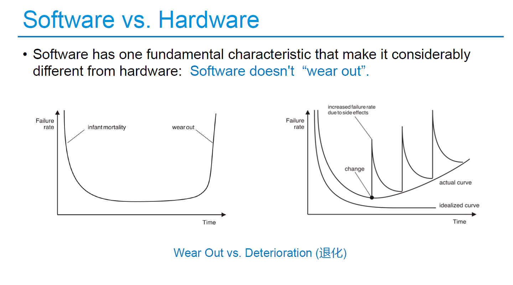
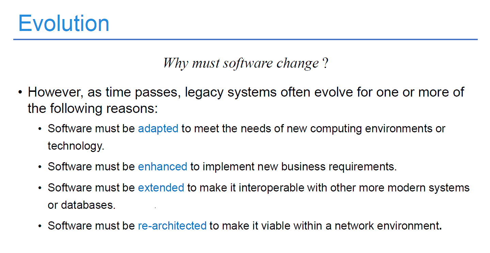
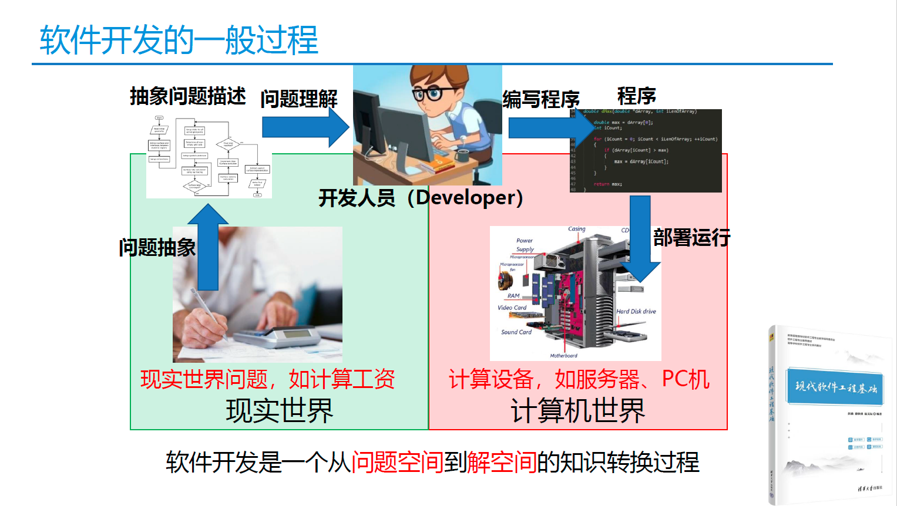

# Question1
How do software characteristics differ from hardware characteristics?
## Answer
Hardware characteristics are the physical parts of a computer system, like the processor, memory, and storage. Software characteristics are the instructions and programs that run on the hardware.
1. Hardware is tangible and can be touched, while software is intangible and cannot be physically touched.
2. Hardware determines the capabilities and performance of the computer, while software defines what tasks the computer can perform.
3. Hardware is difficult to change, while software can be easily updated or modified.
4. Hardware and software depend on each other for the computer system to function properly.
5. Software doesn‘t “waer out”.

1. 软件是开发的，而不是制造的
2. 软件不会磨损，但是会变质
3. 大多数软件是定制的，而不是由不见组装而成的
# Question2
Explain what is wrong with the notion that computer software does not need to evolve over time.
## Answer
1. Bugs and security: Software can have errors and vulnerabilities that need to be fixed through updates to ensure it works properly and remains secure.
2. New features: Technology advances and user needs change, so software must add new features and functions to stay relevant and meet user expectations.
3. Compatibility: As hardware and operating systems change, software must adapt to work smoothly with them. Otherwise, it may encounter issues or not run at all.
4. User experience: Software should continually improve its design, performance, and ease of use to provide a better experience for users.
5. Industry and regulations: Industries and regulations evolve, and software must comply with new standards and requirements to stay legal and competitive.

1. 软件需要进行适应性调整，从而满足新的计算环境或者技术的需求。
2. 软件必须省级从而实现新的商业需求
3. 软件必须扩展以具有更多的系统和数据库协同工作的能力
4. 软件体系结构必须进行改建以使之适应不断演化的计算环境
# Question3
How does software team choose the task set for a particular project?
## Answer
1. Project goals and requirements: They identify what the software needs to achieve.  
2. Stakeholder input: They listen to clients or users for their specific needs and priorities.
3. Scope and timeline: They evaluate the project's size, deadlines, and available resources.
4. Risks: They assess potential challenges or uncertainties and prioritize tasks accordingly.
5. Technical dependencies: They consider tasks that depend on others and plan accordingly.
6. Team expertise and capacity: They assign tasks based on team members' skills and availability.
7. Iterative approach: They break the project into stages and select tasks for each stage based on feedback and adjustment.
# Question4
Describe the phases of the prototyping model for software development?
## Answer
1. Requirements gathering: This phase involves identifying customer needs and project requirements. The team clarifies the functionality, performance, and constraints of the software.
2. Quick design: In this phase, the team creates an initial design and develops a basic prototype. The prototype may not be functional but gives an idea of how the software will look and feel. This helps to identify design flaws and missing requirements early in the development process.
3. Prototype Refinement: Once the basic prototype is created, it undergoes several iterations based on feedback from users and stakeholders. The team refines the prototype until the desired functionality and performance are achieved.
4. Implementation: When the prototype is finalized, the team begins the implementation phase. They use the refined prototype as a blueprint for developing the actual software.
5. Testing: Before delivering the final product, the software must go through rigorous testing. The team ensures it meets all specified requirements and is stable, secure, and reliable. Any defects found during testing are fixed, and the software is retested.

