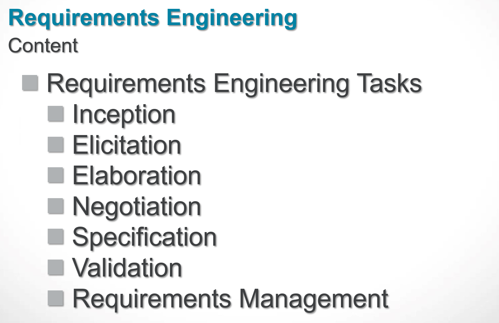
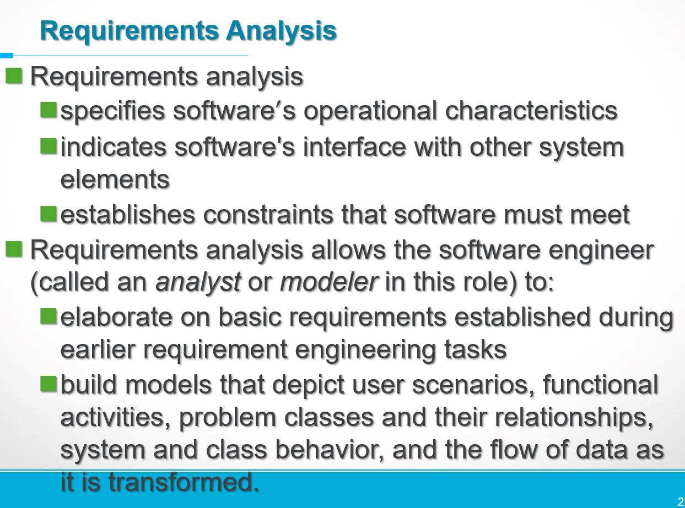
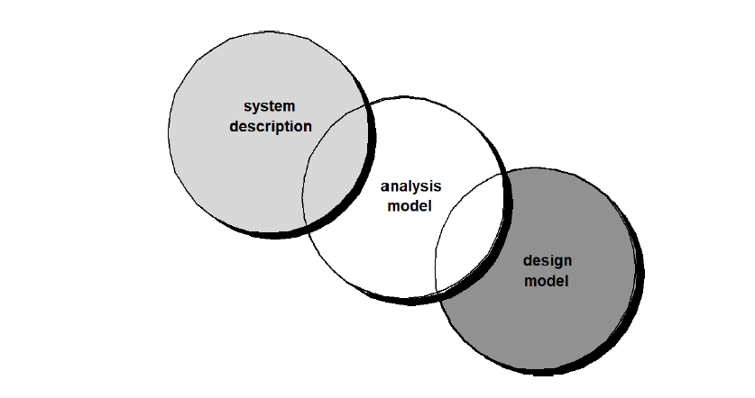
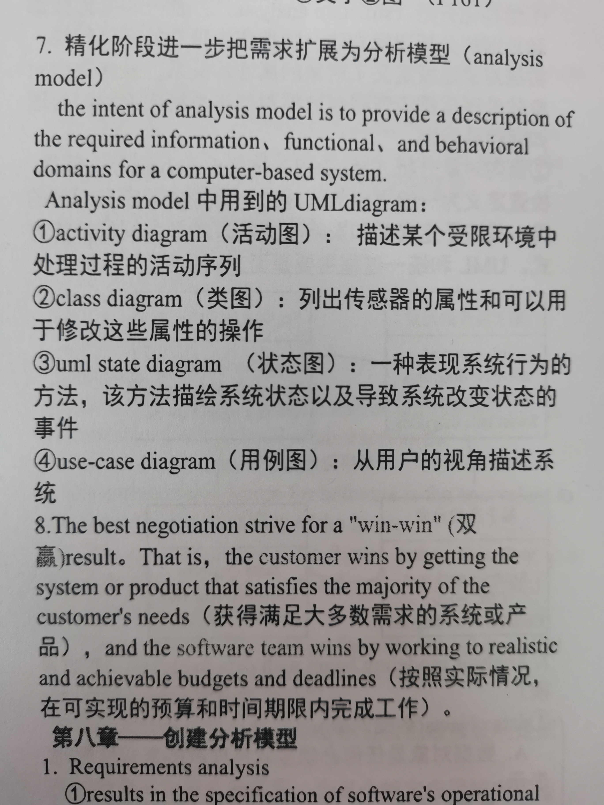
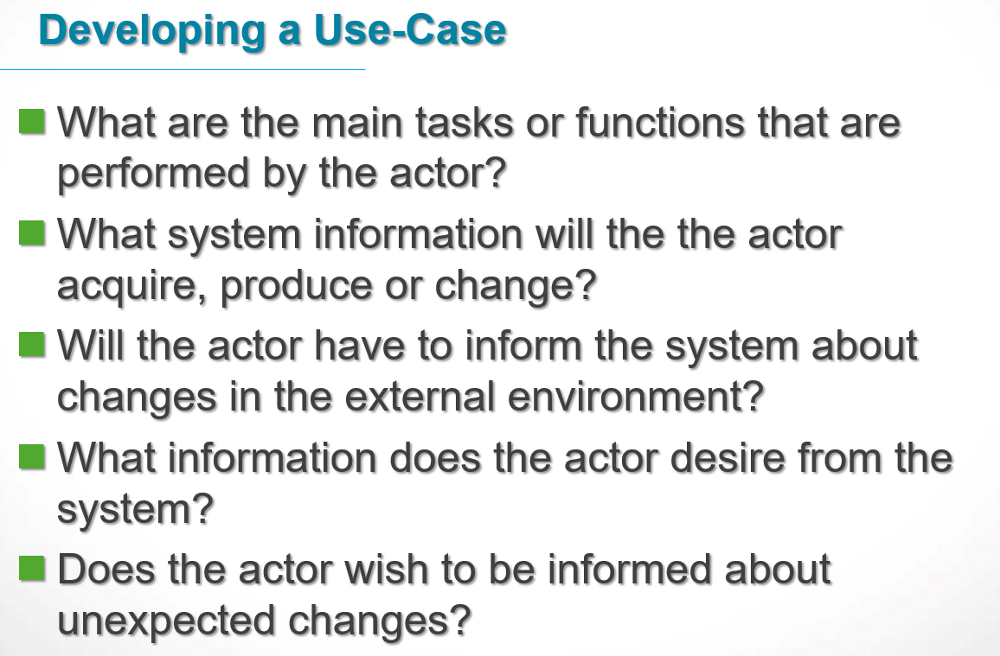
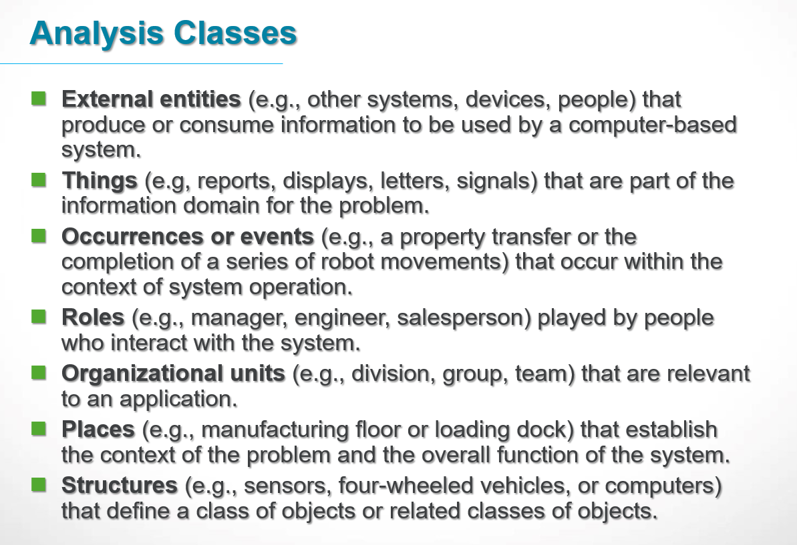

# Question1
What are the six steps for requirements engineering?
## Anser1

1. 起始（Inception）
2. 获取（Elicitation）
3. 细化（Elaboration）
4. 协商（Negotiation）
5. 规格说明（Specification）
6. 确认（Validation）
7. 管理（Management）
## Note
我认为说成6步是不合适的，应该是7步比较合适。
1. Inception—ask a set of questions that establish 
2. Elicitation—elicit requirements from all stakeholders
3. Elaboration—create an analysis model that identifies data,
4. Negotiation—agree on a deliverable system that is realistic for developers and customers
5. Specification — 需求规格说明是一系列的技术需求，SRS 描述了系统的功能，接口和限制
6. Validation—a review mechanism that looks for developers and customers
7. Requirements management
# Question2
What are the benefits of using analysis patterns during the analysis modeling process?
## Anser2

分析模型在系统描述和设计模型之间建立了桥梁，通常难以清楚地区分出设计和分析模型，有些设计总是作为分析的一部分进行，有些分析将在设计中进行。

# Question3
What work products result from the requirements engineering process?
## Anser3
1. 需求文档：这是整个需求工程的核心产品，包含了对系统功能、性能、界面等方面的详细描述和规范。
2. 用户故事和用例：这些是以用户的视角来描述系统需求和场景的工作产品，帮助开发团队理解用户需求和预期功能。
3. 可行性研究报告：在需求工程的早期阶段，可能需要进行一项可行性研究，以评估系统的可行性和经济效益，并生成相应的报告。
4. 原型和模型：为了更好地理解和验证需求，可以使用原型和模型来形象化地展示系统的功能和交互流程。
5. 变更请求和变更控制文档：在需求工程过程中，可能会出现需求变更或修订，相关的变更请求和变更控制文档记录了这些变更的内容和决策。
6. 验收标准和测试用例：为了验证系统是否满足需求，需定义验收标准和相应的测试用例，以便在后续的测试和验收阶段使用。
7. 完整的需求跟踪矩阵：通过需求跟踪矩阵，可以追踪需求的实现情况，确保每个需求都得到满足和验证。
# Question4
List the types of models that might be used in requirements modeling and explain the role of each type of model
## Anser4
往年考卷我看的答案是这一份：

## Note
清华教材是这一份答案：
1. 用例图（Use Case Diagram）：用例图是一种图形化的模型，用于捕捉系统的功能需求。它展示了系统的不同角色（actors）与系统之间的交互，以及这些交互所实现的具体用例（use cases）。用例图帮助识别和理解系统的主要功能以及各个角色之间的关系。 
2. 领域模型（Domain Model）：领域模型是一种概念性模型，用于描绘问题领域中的实体和它们之间的关系。它用于捕捉系统所涉及的重要概念、对象和类，以及它们之间的属性和关联。领域模型帮助分析人员和设计师更好地理解问题领域，并在需求分析和设计过程中提供共享的概念视图。
3. 状态图（State Diagram）：状态图用于描述系统中对象或类的状态和状态转换。它展示了对象在不同状态之间的转换条件和触发事件。状态图可以帮助理解系统的行为和顺序，以及对象或类在不同状态下的响应和动作。
4. 活动图（Activity Diagram）：活动图描述了系统中的流程和行为。它展示了不同活动、操作和决策之间的流程关系，以及它们之间的并发和并行性。活动图帮助分析人员识别和描述系统中的业务流程、用例场景或算法逻辑。
5. 时序图（Sequence Diagram）：时序图用于描述系统中的对象之间的交互和消息传递顺序。它展示了对象之间的时间顺序、消息的发送和接收，以及对象之间的协作关系。时序图有助于理解系统的交互过程，特别是在多个对象之间的场景中。
6. 协作图（Collaboration Diagram）：协作图描述了系统中对象之间的合作关系和结构。它展示了对象之间的通信和协作路径，以及各个对象的角色和职责。协作图帮助分析人员理解对象之间的合作方式和交互模式。
# Question5
Which UML (unified modeling language) diagrams are useful in scenario-based modeling?
## Anser5
Use-case diagram
# Question6
What questions should be asked to help refine a preliminary use case?
## Anser6
1. What are the main tasks or functions that are performed by the actor?
2. What system information will the the actor acquire, produce or change?
3. Will the actor have to inform the system about changes in the external environment?
4. What information does the actor desire from the system?
5. Does the actor wish to be informed about unexpected changes?

# Question7
List the characteristics that should be considered when considering potential classes for inclusion in an analysis model
## Anser7
1. External entities (e.g., other systems, devices, people) that produce or consume information to be used by a computer-based system.
2. Things (e.g, reports, displays, letters, signals) that are part of the information domain for the problem.
3. Occurrences or events (e.g., a property transfer or the completion of a series of robot movements) that occur within the context of system operation.
4. Roles (e.g., manager, engineer, salesperson) played by people who interact with the system.
5. Organizational units (e.g., division, group, team) that are relevant to an application.
6. Places (e.g., manufacturing floor or loading dock) that establish the context of the problem and the overall function of the system.
7. Structures (e.g., sensors, four-wheeled vehicles, or computers) that define a class of objects or related classes of objects.
8. 