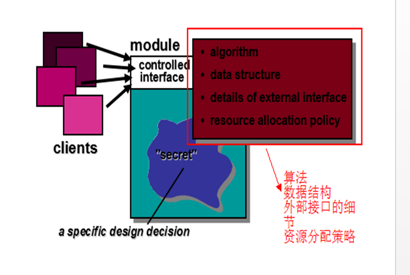

# 1
## Question
List three characteristics that can serve as a guide to evaluate design quality.
## Answer
Three characteristics that can serve as a guide to evaluate design quality are:
    a. Cohesion: This refers to how closely related and focused the elements within a module or component are. High cohesion indicates that the elements within a module are strongly related and work towards a common purpose, while low cohesion suggests that the elements are more loosely connected. High cohesion is desirable as it promotes better organization and maintainability of the design.
    b. Coupling: Coupling measures the level of interdependence between modules or components. Low coupling means that modules are independent and have minimal reliance on each other, making them easier to modify, test, and maintain. On the other hand, high coupling implies strong interconnections, which can lead to increased complexity and difficulties in making changes without affecting other parts of the system.
    c. Reusability: A design that promotes reusability allows for the reuse of components or modules in different contexts or projects. Reusable designs save time and effort by leveraging existing solutions, reducing redundancy and improving overall productivity. Evaluating the reusability of design components helps assess their flexibility and potential for future use.

设计是一项有意义的工程，用于表示我们将要构建的某个事物。
它可以追溯到客户的具体要求是什么，同时根据一组预定义好的标准进行评估该项设计是否为好的设计。
在软件工程方面，设计侧重于四个主要关注领域：数据;架构;接口;组件;
当我们评估一个设计的好坏时，主要考虑以下方面：
1、设计必须实现分析模型中包含的所有明确要求，并且必须满足客户所需的所有隐含需求。
2、设计对于生成代码的人员以及测试和随后支持软件的用户来说是可读的，可理解的指南。
3、设计应从实施的角度提供软件的完整图片，数据，功能和行为领域。
# 2
## Question
Explain how effective modular design is achieved through functional independence of the individual modules?
## Answer
Effective modular design is achieved through functional independence of individual modules by ensuring that each module has a well-defined, specific function or responsibility. Functional independence means that the modules are designed to perform their tasks without relying heavily on other modules. This allows for greater flexibility, modifiability, and maintainability of the system. When modules are functionally independent, changes or updates made to one module are less likely to impact others, reducing the risk of unintended side effects and making the system easier to understand, test, and debug.

# 3
## Question
Describe the principle of information hiding as it applies to software design.
## Answer
The principle of information hiding, also known as encapsulation, emphasizes the idea of concealing internal details and exposing only essential information or interfaces to other parts of the system. In software design, this means that modules or components should provide well-defined interfaces to interact with other components, while keeping their internal implementation hidden. By hiding implementation details, the principle of information hiding enhances modularity, reduces dependencies, and promotes abstraction and separation of concerns. It also allows for easier maintenance and modification of code since changes made within a module do not affect other modules that rely on it.

# 4
## Question
What is design refactoring?
## Answer 
Design refactoring refers to the process of restructuring and improving the design of existing code or software without changing its external behavior. It involves making changes to the design to enhance clarity, maintainability, extensibility, or performance, while preserving the same functionality. Design refactoring aims to simplify code, remove redundancies, improve readability, and align the design with best practices or design patterns. It is an iterative process that helps to improve the quality and maintainability of software over time.
# 5
## Question
List the design models required for a complete specification of a software design and the role of each.
## Answer  
The design models required for a complete specification of software design include:
a. Structural Model: This model represents the static structure of the software system, including the organization of components, their relationships, and dependencies. It typically includes class diagrams, package diagrams, and component diagrams.
b. Behavioral Model: This model captures the dynamic behavior of the software system, illustrating how components interact and respond to events or stimuli. Behavioral models include use case diagrams, activity diagrams, sequence diagrams, and state machine diagrams.
c. Interaction Model: This model focuses on the detailed interactions between different components or objects within the system. It includes sequence diagrams and communication diagrams that show the flow of messages and collaborations between components during specific scenarios.
d. Implementation Model: This model provides a representation of the software system from an implementation perspective. It may include deployment diagrams, module diagrams, or physical architecture diagrams that depict the allocation of software components to hardware or infrastructure.