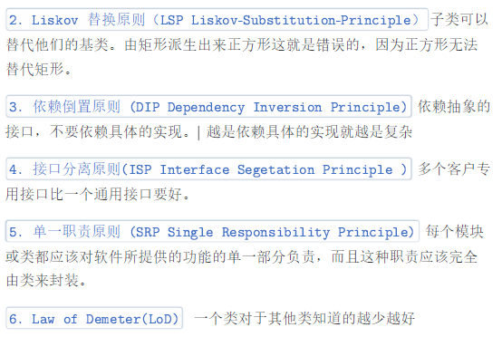
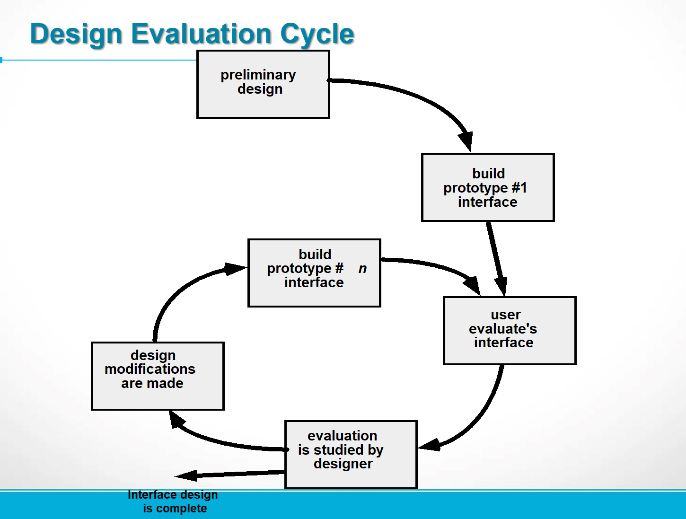

# 1 
## Question

Why is architecture important?

## Answer

1. 提供了一种有助于促进所有利益相关者之间交流的表达形式
2. 突出了可能会对所有后续软件工程工作产生重要影响的早期设计决策
3. 提供了一个相对较小的描述软件不同构件之间如何组织和交互的模型
# 2

 ## Question

How does the object-oriented view of component-level design differ from the traditional view?

## Answer

# 3

## Question

Describe the differences between the software engineering terms coupling and cohesion?

## Answer

内聚性就是构建的“专一性”。在 OO view 中，意味着构件或者类只封装哪
些互相关联密切，以及与构建或类自身有密切关系的属性和操作。以下三
种是良性内聚

1. 功能内聚（Functional）：当一个模块完成一组且只有一组操作并返
回结果时，就称此模块是功能内聚的。
2. 层次内聚（Layer）：由包、构件和类来体现，高层能够访问低层的
服务，但低层不能访问高层的服务。
3. 通信内聚（Communicational）：访问相同数据的所有操作被定义在
一个类中。

耦合是类与类之间彼此联系程度的一种定量度量。前三种是恶性耦合应该
避免，后续耦合程度逐渐降低：
1. 内容耦合（Content）：一个构建可以暗中修改其他构件的内部数
据，这违反了信息隐蔽原则
2. 控制耦合（Control）：A 向 B 发送控制信号并控制 B 完成相应操
作，但是如果该控制信号发生改变了，那就完了
3. 外部耦合（Common）：构件的基础设施构件进行通信或协作时产生
4. Stamp
5. Data
6. Routine call
7. Type use
8. Inclusion or import
9. External
# 4 

## Question

What are the steps used to complete the component-level design for a software development project?

## Answer

Step 1.  Identify all design classes that correspond to the problem domain.
Step 2.  Identify all design classes that correspond to the infrastructure domain.
Step 3.  Elaborate all design classes that are not acquired as reusable components.
Step 3a.  Specify message details when classes or component collaborate.
Step 3b.  Identify appropriate interfaces for each component.
Step 3c.  Elaborate attributes and define data types and data structures required to implement them.
Step 3d.  Describe processing flow within each operation in detail.
Step 4.  Describe persistent data sources (databases and files) and identify the classes required to manage them.
Step 5.  Develop and elaborate behavioral representations for a class or component.
Step 6.  Elaborate deployment diagrams to provide additional implementation detail.
Step 7.  Factor every component-level design representation and always consider alternatives.

# 5 

## Question

List three principles that should be applied when building any user interface.
（1）Place the user in control

（2）Reduce the user’s memory load

（3）Make the interface consistent
# 6 

## Question

What framework activities are completed when following an evolutionary (or spiral) user interface development process?

## Answer

The evolutionary or spiral user interface development process typically involves several framework activities that occur in iterative cycles. These activities aim to create, refine, and enhance the user interface over multiple iterations. Here are the key framework activities commonly completed in this approach:

### 1. **Planning:**
- **Objective Setting:** Define the goals, scope, and objectives for the user interface.
- **Risk Analysis:** Identify potential risks and establish strategies to mitigate them.
### 2. **Risk Analysis and Engineering:**

- **Risk Identification:** Identify potential risks associated with the user interface design.
- **Risk Mitigation:** Develop strategies to address and minimize identified risks.
### 3. **Prototyping:**

- **Prototyping Iteration:** Build and refine prototypes of the user interface.
- **User Feedback:** Gather feedback from users and stakeholders based on prototypes.
### 4. **Engineering:**

- **Design and Development:** Implement the user interface based on the refined prototypes and feedback.
- **Code Refinement:** Continuously refine the code and features based on iterations.
### 5. **Evaluation:**

- **User Testing:** Conduct usability testing to assess the effectiveness and user-friendliness of the interface.
- **Feedback Incorporation:** Integrate user feedback into the design for improvements.

### 6. **Deployment:**

- **Release:** Launch the interface or new features to a subset of users or in a controlled environment.
- **Monitoring:** Gather data on user interactions and monitor performance post-release.
### 7. **Review and Planning:**

- **Evaluation of Process:** Reflect on the development process and its effectiveness.
- **Planning Next Iteration:** Plan for the next cycle of enhancements based on feedback and evaluation.
# 7 

## Question

List four things you need to do in user experience analysis if you seek to “understand the problem before you attempt to design a solution.

## Answer

### 1. **User Research:**

- **User Interviews & Surveys:** Engage with potential users to gather insights, pain points, and requirements.
- **Contextual Inquiry:** Observe users in their natural environment to understand their behaviors and needs.
- **Persona Development:** Create representative user personas based on gathered data to embody different user types.
### 2. **Usability Testing:**

- **Task Analysis:** Break down user tasks to understand how they interact with the system or interface.
- **Heuristic Evaluation:** Assess the interface against established usability principles to identify design flaws.
- **User Testing & Observation:** Conduct tests with users to observe their interactions and challenges with the current system.
### 3. **Data Analysis:**

- **Quantitative Data Examination:** Analyze usage data, metrics, and patterns to identify areas of improvement.
- **Qualitative Data Interpretation:** Review user feedback, comments, and support tickets to understand user frustrations or issues.
- **Competitive Analysis:** Assess competitors’ solutions to identify industry standards and potential areas for innovation.
### 4. **Problem Framing & Synthesis:**

- **Problem Definition:** Clearly define and articulate the issues and pain points faced by users.
- **Synthesizing Insights:** Consolidate research findings into actionable insights and problem statements.
- **Identifying Patterns:** Look for recurring themes or patterns across user feedback and data analysis.