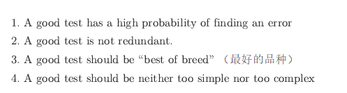
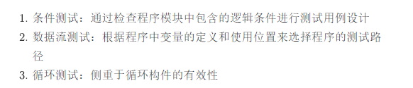
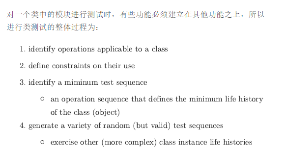

# 1 

## Question

What are the attributes of a good software test?

## Answer

一个好的软件测试具有全面性、准确性、可重复性和适应性等属性。

# 2

## Question

How does depth-first integration testing differ from breadth-first integration testing when using a top-down integration strategy?

## Answer

深度优先集成测试和广度优先集成测试在使用自顶向下集成策略时的区别在于，深度优先集成测试会首先集成顶层模块及其下层模块，而广度优先集成测试会先集成同一层级的各个模块。

# 3

## Question

Why is regression testing an important part of any integration testing procedure?

## Answer

回归测试是集成测试程序中重要的一部分，因为它可以确保新的更改没有破坏现有的功能和模块。
![[asset/Pasted image 20231205115440.png]]

# 4 

## Question

What are the key differences between validation testing goals and acceptance testing goals?

## Answer

验证测试的目标是确认软件是否符合规格说明书中的规格，而验收测试的目标是确认软件是否满足用户的需求和期望。

# 5 

## Question

Describe the differences between black-box testing and white-box testing.

## Answer

黑盒测试是基于软件外部功能和规格进行测试，而白盒测试是基于软件内部结构和逻辑进行测试。

# 6 

## Question

Describe three control structure testing strategies.

## Answer

控制结构测试策略包括语句覆盖测试、分支覆盖测试和路径覆盖测试。

# 7 

## Question

What is equivalence partitioning as it applies to software testing?

## Answer

在软件测试中，等价类划分是将输入数据划分为多个等价类，以便在每个等价类中选择代表性的测试用例进行测试

# 8

## Question

Describe object-oriented unit testing.

## Answer

面向对象的单元测试是针对对象的方法、属性和行为进行测试，以确保其符合预期的功能和规格。
