# 一、名词解释
## 1. ISA
指令集架构是计算机体系结构中与程序设计有关的部分，包含了基本数据类型、指令集、寄存器、寻址模式、存储体系、中断异常处理以及外部I/O的定义。

## 2.RISC和CISC
RISC是精简指令集计算机，CISC是复杂指令集计算机。

## 3.SIMD和MIMD
SIMD是单指令多数据流机器，以同步的方式在同一时间内执行同时执行同一条指令，可以同时复制多个操作数，并把它们包在大型寄存器的一组指令集。MIMD是多指令流多数据流机器，以并行的方式在同一时间内执行多条指令并且每条指令都可以操作多个操作数。

## 4.Amdahl定律
加快某部件执行速度所能获得的系统性能加速比，受限于该部件的执行时间占系统中总执行时间的百分百比。如果仅仅对计算任务重的一部分做性能改进，则改进得越多，所得到的总体性能的提升就越有限。
$$
加速比 = \frac{总执行时间_{改进前}}{总执行时间_{改进后}} = \frac{1}{(1 - 可改进比例) + \frac{可改进比例}{部件加速比}}
$$

**如果针对整个任务的一部分进行改进和优化，则获得的加速比将不超过：**
$$
\frac{1}{1-可改进比例}
$$

## 5.平均CPI
$$
CPI = \frac{执行程序所需的时钟周期数}{所执行的指令数IC}
$$
$$
CPU时间 = 执行程序所需要的时钟周期数 \times 时钟周期时间 = \sum_{i=1}^{n} (I_i \times \text{CPI}_i)
$$

## 6.时间重叠、资源重复、资源共享
**时间重叠**：引入时间因素，让多个处理过程在时间上相互错开，**轮流重叠**地使用同一套硬件设备的各个部分，以加快硬件周转而赢得速度。（流水线）

**资源重复**：引入空间因素，通过**重复设置硬件资源**，大幅度地提高计算机系统的性能。

**资源共享**：使多个任务按一定时间顺序轮流使用同一套硬件设备。

## 7.加速比，吞吐率，效率
**加速比**：针对同一个任务，未使用流水线技术执行所需的时间与使用流水线技术执行所需的时间之比。

**吞吐率**：单位时间内流水线完成或输出结果的任务的数量。

**效率**：流水线中设备实际使用时间占整个运行时间的比值。

## 8.单功能流水线、多功能流水线
**单功能流水线**：流水线中不同的段只能按照**一种连接方式**进行连接。

**多功能流水线**：流水线中不同的段可以进行**不同连接**实现不同功能的流水线。多功能流水线又可以进一步分为静态流水线和动态流水线。

## 9.静态和动态流水线
**静态流水线**：在同一时间内，多功能流水线中的各段 **只能按同一功能的连接方式** 工作。只有当输入的是一串 **相同的运算任务** 时，效率才能得到充分发挥。

**动态流水线**：在同一时间内，多功能流水线中的各段能够 **按不同的方式连接**，**同时执行多种功能**。

## 10.名相关、数据相关、控制相关
**名相关**：两条指令使用的寄存器有相同的名（指令所访问的寄存器或存储器单元的名称），但他们之间没有数据流通。

**数据相关**：指令j的执行需要指令i的计算结果。

**控制相关**：由分支指令引起的逻辑依赖冲突。

## 11.结构冲突、数据冲突、控制冲突 （流水线中的三种冲突类型）
**结构冲突**：因为硬件资源无法满足指令重叠执行的要求而发生的冲突。

**数据冲突**：当指令在流水线中重叠执行时，执行后面指令需要前面执行指令的计算结果而引发的冲突。

**控制冲突**：因分支指令或其他改变PC值的指令而造成的冲突。

## 12.定向技术
**定向技术**是将指令的计算结果直接送到其他指令需要它的地方来减少流水线数据冲突的技术。

需要注意的是，**链接技术**是指存在写后读的两条指令，在不存在功能部件冲突和源向量冲突的情况下可以将功能部件链接起来进行流水线处理，以达到加快处理的目的。

## 13.寄存器换名技术
**寄存器换名技术**通过改变操作数的名称来解决名相关。

## 14.指令的静态调度和动态调度
**静态调度**：依靠编译器对代码进行调度和优化以减少冲突和相关。
**动态调度**：依靠流水线中专门的硬件对代码进行调度和优化

## 15.Tomasulo算法
一种指令动态调度算法，通过保留站、寄存器换名和结果转发解决数据冲突，支持乱序执行。记录和检测指令相关，操作数⼀旦就绪就⽴即执⾏，把发⽣RAW冲突的可能性减⼩到最少。

## 16.分支历史表BHT
用于记录分支指令的历史行为，帮助进行分支预测。

## 17.BTB分支目标缓冲器
存储分支成功的分支指令的目标地址，预测时直接跳转，加速分支预测过程。

## 18.ROB技术（re-order-buffer ）
用于在乱序执行中记录指令的结果，一条指令在执行完毕之后不会立刻写回，而是先在Buffer中等待，待确认后再写回，确保指令按程序顺序提交结果。

## 19.超标量处理机
每个时钟周期发射多条指令，依赖多功能单元和动态调度实现并行的处理机。

## 20.时间并行和空间并行
**时间并行**：流水线技术，时间上重叠执行。

**空间并行**：复制硬件资源并行处理。

## 21.循环展开技术
编译器将**循环体复制多次**，减少分支次数，提高指令集并行度。

## 22.向量处理机
在流水线中设置向量数据表示和处理相应的向量指令的处理机。

## 23.链接技术
存在写后读的两条指令，在不出现部件功能冲突和源向量冲突的情况下，可以把功能部件链接起来进行流水线处理，以达到加快处理的目的。

## 24.时间局部性和空间局部性
**时间局部性**：一个数据（或指令）被访问，则它在不久的将来很可能再次被访问。

**空间局部性**：一个数据（或指令）被访问，则它附近的数据（或指令）在不久的将来很可能被访问。

## 25.平均访存时间
CPU执行一条指令时平均每次访问内存所花费的时间。

## 26.强制性不命中、容量不命中、冲突不命中
**强制不命中**：当第一次访问一个块时，该块不在内存中，需要从下一级存储器调入到内存中。

**容量不命中**：如果程序不能在执行的过程中将所有块加载到内存中，则某些块被替换后又会被重新访问。

**冲突不命中**：在组相联或直接映象中，若太多的块被映象到同一个位置，则会出现某一个块被替换后（即使其他组或块中有空位）又被重新访问的情况。

## 27.直接映像、全相联映像、组相联映像
**直接映象**：每一个存储的块只能被映射到内存中的唯一位置。

**全相联映象**：任何一个存储的块都能被映射到内存中的任意位置。

**组相联映象**：存储的块能被映射到内存中唯一一个组组内的任意位置。

## 28.Victim（“牺牲”） Cache
在Cache和主存之间放一个全相联的存储空间，用于临时存放被替换出去的块，以便备用。

## 29.伪相联映像
在逻辑上将直接相联的Cache分为上下两个半区。在访问数据时首先按照正常访问直接相联去读取数据。如果没有找到数据则到下半区响应位置去读取数据。若再次失败则到主存中访问数据。

## 30.非阻塞CACHE技术
允许流水线在Cache缺失的时候继续执行其他指令，而不是阻塞等待数据从存储中返回。

## 31.TLB
TLB是CPU内部一个专用高速缓存，用于加速虚拟地址到物理地址的转换过程。

# 二、简答题

## 1.计算机系统结构、计算机组成和计算机实现的概念与关系。
**计算机系统结构**：是指计算机系统的软、硬件的界面，即机器语言程序员所看到的传统机器级所具有的属性。

**计算机组成**： 是指计算机系统结构的逻辑实现，包含物理机器级中的数据流和控制流的组成以及逻辑设计等，着眼于物理机器级内各事务的排序方式、各部件的功能以及各部件之间的联系。

**计算机实现**： 是指计算机组成的物理实现，包括处理机、主存等部件的物理结构，着眼于器件技术和微封装技术。

一种体系结构可以包括多种组成，一种组成可以有多种实现。

## 2.陈述RISC与的CISC技术；讨论RISC从哪些方面提高了指令的执行效率，并举例说明。

**RISC**：将复杂指令实现的功能用简单指令进行实现。通常指令长度固定，指令格式和寻址方式种类少，只允许Loard/Store指令访问存储器。

**CISC**: 增强指令功能，把越来越多的功能交由硬件来实现。通常指令长度不固定，指令格式和寻址方式种类多，可以访存的指令不受限；各个指令执行时间相差较大，多数指令需要多个时钟周期才能执行完毕。

**举例**: 采用RISC的MIPS指令长度固定为32位，因此在译码时无需先判断指令的长度；基于RISC设计的处理器通常有更多的通用寄存器，减少了函数调用时的寄存器溢出和内存访问次数。

## 3.给出一段有相关性的指令序列，分析相关性并请重新设计指令顺序（编译器方式），消除相关性。
具有相关性的指令序列：
```
ADD R1, R2, R3
SUB R2, R4, R5
```
其可以采用换名技术来消除名相关：
```
ADD, R1, R2, R3
SUB S, R4, R5
```

## 4.Tomasulo分别采取了什么方法避免RAW冲突、WAR冲突和WAW冲突？
**避免RAW冲突**：通过保留站和公共数据总线，允许在产生结果的同时将其广播给所有需要该值的保留站或寄存器。

**避免WAR冲突**：通过寄存器换名技术，确保读操作数总是获取到正确的值，即使后续有写操作也要等到读操作完成后才更新寄存器。

**避免WAW冲突**：借助寄存器换名技术，确保最终写入寄存器的是最新的正确值，而不是过期的数据。

## 5.多指令流出技术中，超标量、超长指令字与超流水线的核心差异是什么？
**超标量**：在单个时钟周期内同时发出多条指令。这意味着处理器内部有多个执行单元，并且可以在同一时刻处理不同的指令。

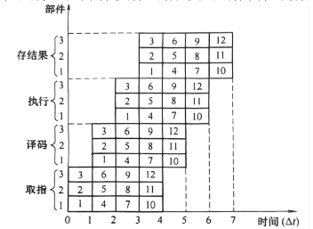

**超长指令字**：通过将多个操作组合成一个指令包来提高指令集并行性，用一条长指令来实现多个操作的并行执行。时空图特点是取指译码都普通，但是执行时可以垂直地执行多条指令。

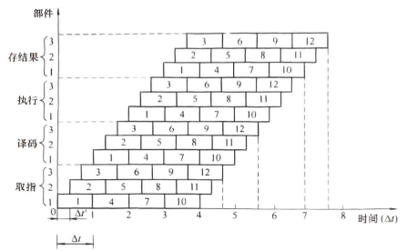

**超流水线**：将传统的几段流水线进一步细分，以减少每一段流水线所需的时间，从而允许更高的时钟频率。

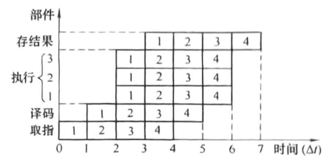

## 6.简要画出经典5段流水流水线的数据通路图；说明load和store在每个周期的表现。
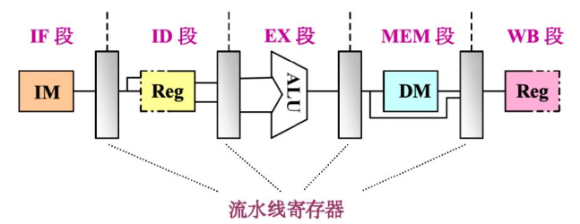

**对于load指令**：
- 取值IF：从程序计数器PC中获取当前指令的地址，并从指令寄存器中取出对应的指令。
- 译码ID：解析指令的操作码、寄存器操作数以及立即数信息。
- 执行EX：计算出需要访问的内存地址。
- 访存MEM：根据上一阶段计算出的内存地址，从数据存储器中读取数据。
- 写回WB：将访存阶段从内存中读取的数据写回到目标寄存器。

**对于store指令**：
- 取值IF：从程序计数器PC中获取当前指令的地址，并从指令寄存器中取出对应的指令。
- 译码ID：解析指令的操作码、寄存器操作数以及立即数信息。
- 执行EX：计算出需要访问的内存地址。
- 访存MEM：根据上一阶段计算出的内存地址，将数据存储器对应地址的数据更新为源寄存器的内存。
- 写回WB：在此阶段无操作。

## 7.流水线冲突有哪三种？请简述每种流水线冲突，并针对每一种冲突提供一种解决办法。
流水线冲突主要有**结构冲突，数据冲突和控制冲突**。针对结构冲突可以通过引入重复的硬件部件资源来解决冲突；数据冲突可以通过定向技术将指令的计算结果送到需要它进行计算的指令处或插入空转指令；控制冲突可以通过分支预测（静态/动态预测）、延迟分支（编译器调度）、冻结流水线（遇到分支就停，也称冲刷）来解决。

## 8.计算机系统中，实现并行性主要有哪三大途径？请分别举例说明。
**时间重叠**：通过引入时间因素，将让多个处理过程相互错开，轮流重叠的使用同一套功能部件。即流水线的实现方式。

**资源重复**：通过引入空间因素，设置多个重复硬件资源允许更多的操作同时进行。

**资源共享**：通过调度安排，允许多个任务共享有限的资源。

## 9.GPU采用了哪种处理器设计方式作为原型，请简述并画出这种处理器的体系结构原理图。
GPU主要采用了向量处理机的设计方式作为原型。
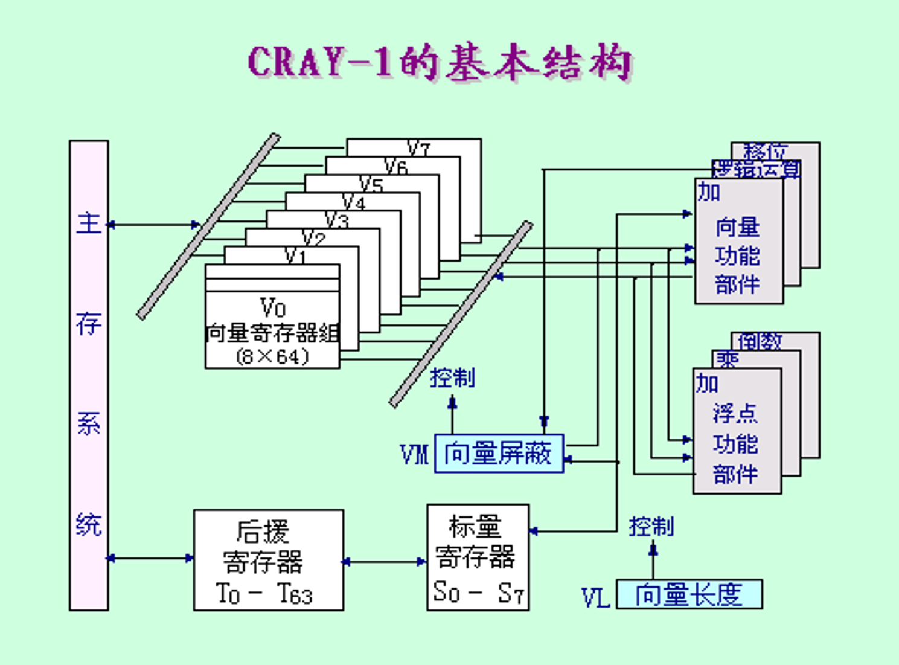

## 10.名相关和数据相关会产生RAW冲突、WAR冲突和WAW冲突。简述这三种冲突，并举例说明是如何造成的。
RAW是写后读冲突，即指令i在写入数据之前指令j去读取数据；WAR是读后写冲突，即指令i在读取数据之前指令j写入数据；WAE是写后写冲突，即指令i写入之前指令j先去写

## 11.层次化存储系统存在的理论依据是什么？简要阐述这个依据中的原理。
层次化存储系统存在的理论依据是程序的局部性原理——时间局部性原理和空间局部性原理。其中，时间局部性原理是指一个数据或指令被访问，则其在不久的将来很可能被再次访问；空间局部性原理是指一个数据或指令被访问，则其地址相邻的数据或指令在不久的将来很可能被访问。

## 12.写出平均访存时间的公式，从公式的三个变量出发，分别举出一个优化（减少）平均访存时间的技术方案。
公式如下：
$$
平均访存时间 = 访问Cache时间 + （1 - 命中率） \times 访问主存时间
$$

针对命中率，可以增大Cache容量；针对访问Cache时间，可以采用直接相联或组相联的方式来优化；针对访问主存时间，可以通过采用Victim Cache方式将被替换的数据暂时存在一个缓冲器中，以便被快速访问。

## 13.CACHE的地址映像规则有三种：全相联、直接映像与组相联。阐述这三种规则，并用图示法说明三种规则的优缺点。
**全相联**允许主存中任意块的数据被放到内存的任意位置。优点是对内存的空间使用率高，命中概率高。缺点是设计复杂。

**直接映象**使主存中的每个块被唯一的放到内存中的特定位置。优点是结构简单。缺点是对内存空间的使用率低且命中率较低。

**组相联**：使主存中的每个块被唯一的影响到内存的一个组的任意一个块中。优点是命中率高于直接相联和成本优于全相联。缺点是增加一定命中时间和成本。

## 14.计算机系统设计中经常使用的四个设计原则和定量原理是什么？请说出它们的含义？
1. 程序局部性原理——程序在执行过程中，会在一段时间内反复访问一小部分地址空间（时间局部性），或访问相邻的地址（空间局部性）。
2. Amdahl定律——系统性能提升幅度，受限于该改进所涉及的原有执行时间占总执行时间的比例。
3. 性能和价格权衡——性能的提升通常不是线性的，但成本往往随着性能的提升而指数增长。因此需要在一个可接受的成本约束下尽可能的追求高的性能。
4. 缩短常见情况执行时间——把最频繁发生的事件处理得尽可能快。

## 15.在降低Cache不命中的方法中，对于给定的Cache容量，当块大小增加时，失效率开始是下降，后来反而上升了。解释Cache失效率为什么出现这样的变化?
在下降阶段时因为空间局部性原理发挥了作用：当块大小小时，每次从主存加载的数据量较小。增大块的大小一次缺失会把相邻的多个数据一并加载，有效利用空间局部性原理，从而减少因访问连续数据而产生的容量缺失和强制性缺失。

在上升阶段时因为Cache块数减少导致映射到同一组的块数变多，冲突缺失显著增加并其主导作用。

## 16.写出三种降低CACHE不命中率的方法并举例说明。
1. 编译器优化：通过在编译时将数组合并、内外循环交换或循环融合的方式降低失效率。
2. Victim Cache：在Cache和主存之间放一个全相联的存储空间，用于临时存放被替换出去的块，以便备用。
3. 增大Cache块大小：在一定程度内提高Cache块的大小会降低强制性失效和容量失效率。

## 17.多级Cache设计如何减少不命中开销？
多级Cache通过在L1缺失后优先访问速度更快的L2/L3，而非直接访问慢速主存，从而大幅降低了每次缺失的惩罚和主存访问频率，减少了平均访存时间。

## 18.流水线的额外开销包括哪两种？讨论其对流水线性能的影响和解决方法。
- 流水寄存器的延迟：每级流水线之间都需要寄存器来暂存中间结果，这些寄存器本身存在建立时间和传播延迟会使信号通过通过寄存器花费额外时间。可以选用高性能的寄存器来解决问题。
- 时钟偏移：因为同一时钟的上升沿到达不同寄存器和功能部件的时间差异，流水线需要留出余量容忍时钟偏移。可以通过优化流水线硬件设计来解决问题。

## 19.解决流水线的瓶颈有哪两种常见方法，举例说明并比较其效果。
- 段内并行：将一个原本较慢的流水段内部进一步拆分为多个并行的运算单元，使得该段能够在一个时钟周期内处理更多工作。
- 段间并行：将一个原本较慢的流水段进一步拆分成多个子段，从而增加流水线的级数。

# 三、综合题
1.用TI－ASC计算机的多功能动态流水线计算两个向量的点积：Z＝AB＋CD＋EF＋GH。要求：（1）请列出运算顺序安排。（2）画出对应的流水线时空图。（3）计算流水线的实际吞吐率、加速比和效率。

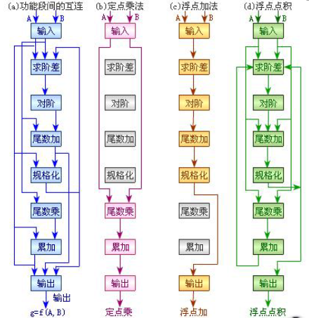

解：
(1)运算排序安排为：
```
A1 = A * B
A2 = C * D
A3 = E * F
A4 = G * H
B1 = A1 + A2
B2 = A3 + A4
Z = B1 + B2
```
(2)对应的时空图如下：

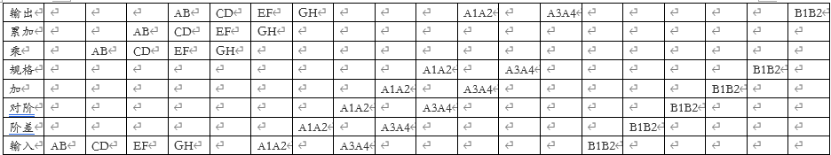

2.某台主频为1000MHz的计算机执行标准测试程序，程序中指令类型、执行数量和平均时钟周期数如下：

| 指令类型 | 指令执行数量 | 平均时钟周期数 |
| :--- | :---: | :---: |
| 整数 | 45000 | 1 |
| 数据传送 | 75000 | 2 |
| 浮点 | 8000 | 5 |
| 分支 | 2000 | 2 |

求该计算机的**平均CPI**、**MIPS**和**程序执行时间**（单位：μs）。

解：

$
平均CPI = \frac{45000 * 1 + 75000 * 2 + 8000 * 5 + 2000 * 2}{45000 + 75000 + 8000 + 2000} = 1.84
$

$
MIPS = \frac{指令条数}{执行时间 \times 10^6} = \frac{时钟频率}{CPI \times 10^6} = \frac{1000 \times 10^6 Hz}{1.84 * 10^6} = 543.48
$

$
\begin{aligned}
\text{执行时间} &= \text{CPU时间} \times \text{指令执行需要的时钟数} \\
&= \frac{\text{指令执行需要的时钟数}}{\text{CPU频率}} \\
&= 239\ \mu s
\end{aligned}
$

3.如果某计算机系统有3个部件可以同时改进，则这3个部件经改进后达到的加速比分别为：S1=30, S2=20, S3=10。如果部件1和部件2改进前的执行时间占整个系统执行时间的比例都为30%，那么，部件3改进前的执行时间占整个系统执行时间的比例为多少，才能使3个部件都改进后的整个系统的加速比Sn达到10？

解：由题意有如下方程式：
$$
10 = \frac{1}{(1 - 0.3 - 0.3 - 占比) + \frac{0.3}{30} + \frac{0.3}{20} + \frac{占比}{10}}
$$
$$
占比 ≈ 36.11\%
$$

4.在一台服务器上运行一段I/O密集型基准测试程序，该测试程序共有3,000,000条指令，运行时间为5毫秒，其中CPU时间占20%，I/O时间占80%。为提高性能，将服务器CPU从1.5GHz升级为3GHz，服务器内存和磁盘升级为访问速度更快的内存和固态硬盘，使得I/O访问速度提高至原来的4倍；升级后，该服务器运行同一段基准测试程序的执行时间为多少毫秒？

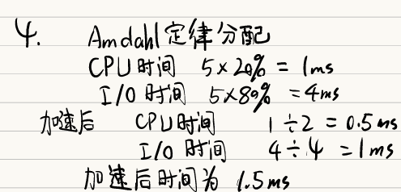

5、假设某程序中循环代码段 p:“for(int i=0;i<N;i++) sum+=A[i];” 对应的汇编代码如下：
```
I1:  loop: sll R4,R2,2
I2:        add R4,R4,R3
I3:        load R5,0(R4)
I4:        add R1,R1,R5
I5:        add R2,R2,1
I6:        bne R2,R6,loop
```
若采用 “按序发射、按序完成”的5级流水线：IF（取值）、ID（译码及取数）、EXE（执行）、MEM（访存）、WB（写回寄存器），且硬件不采取任何措施，分支指令的执行均引起3个时钟周期的阻塞，则：
（1）	以上指令序列中哪些指令的执行会由于数据相关而发生流水线冲突？
（2）	哪条指令的执行会发生控制冲突？
（3）	为什么指令1的执行不会因为与指令5的数据相关而发生冲突？

解：(1) I1和I2，I2和I3，I3和I4以及I5和I6。
（2）I6
（3）因为根据五段流水线的执行顺序，执行I5时I1已经将数据写入I4。

6.一条有4个流水段的非线性流水线，每一段的延迟时间相等，预约表如下：

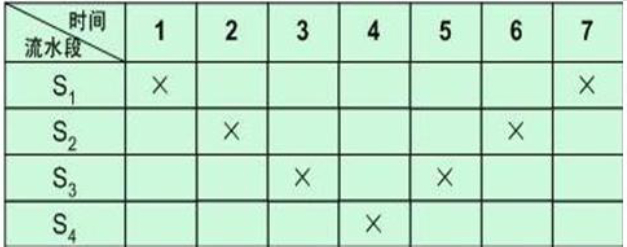

（1）写出禁止向量和冲突向量
（2）画出调度状态图
（3）求出最大吞吐量
（4）按最优调度连续输入8个任务，实际吞吐量，加速比和效率各为多少？

解：(1)禁止向量F = {2, 4, 6}，冲突向量是C = 101010

(2)针对101010，有：
```
101010 >> 1 = 010101 | 101010 = 111111
101010 >> 3 = 000101 | 101010 = 101111
101010 >> 5 = 000001 | 101010 = 101011
```
针对101111，有：
```
101111 >> 5 = 000001 | 101010 = 101011
```
针对101011，有：
```
101011 >> 3 = 000101 | 101010 = 101111
101011 >> 5 = 000001 | 101010 = 101011
```

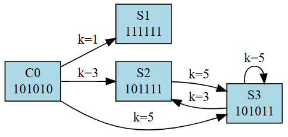

(3)由题意，可以构成如下调度方案：
```
（3,5） = 4
（5,3） = 4
（5） = 5
(5, 5, 3) = 4.1333...
```
则最大的吞吐效率是1 / 4 = 25%

7.超标量机的相关性问题以及调度。计算机运行以下指令：
```
    I1：LOAD  R1,   A     ；R1←(A)
    I2：FADD  R2,   R1    ；R2←(R2)＋(R1)
    I3：FMUL  R3,   R4    ；R3←(R3)×(R4)
    I4：FADD  R4,   R5    ；R4←(R4)＋(R5)
    I5：DEC    R6         ；R6←(R6)－1
    I6：FMUL  R6,   R7    ；R6←(R6)×(R7)
```
（1）请列出程序代码中可能出现的数据相关及相关类型。
（2）当程序通过下图的双发射超标量机时，请采用顺序发射乱序完成的方式画出指令流水时空图（流水线没有使用定向技术）。

解:(1) I1和I2之间存在写后读冲突；I3和I4之间存在读后写冲突；I5和I6之间存在写后写与写后读冲突。

(2)需要在ID段完成读，在WR处完成写

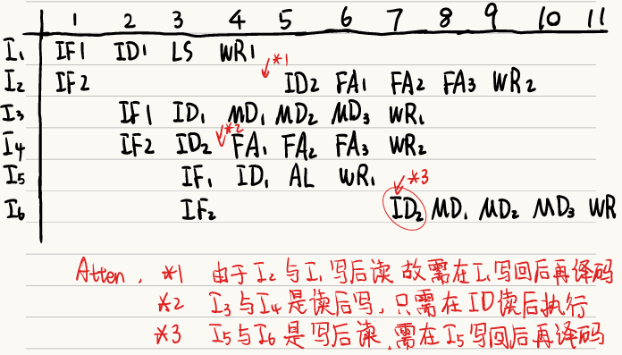

8.CACHE映像算法
有一个Cache存储器，主存有8块(0-7)，Cache有4块(0-3)，采用组相联映像，组内块数为2块。采用LRU（近期最久未使用）替换算法。
(1)指出主存各块与Cache各块之间的映像关系。
(2)某程序运行过程中，访存的主存块地址流为：
2， 3，  4，  1，  0，  7，  5，  3，  6，  1，   5， 2，  3，  7，  1
说明该程序访存对Cache的块位置的使用情况，指出发生块失效且块争用的时刻，计算Cache命中率。

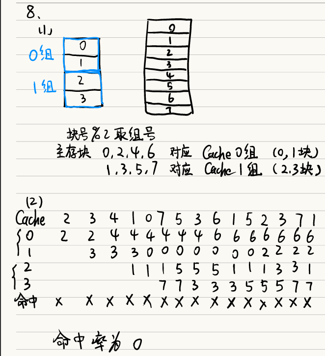


10.在流水线分支预测时经常采用历史分支表的方式，采用两位编码历史分支表的状态图如下：当预测状态转换，如从01分支预测不成功转换成11分支预测成功后，需要经过连续两次不成功才能回到不成功预测状态。（如下图），反之亦然。

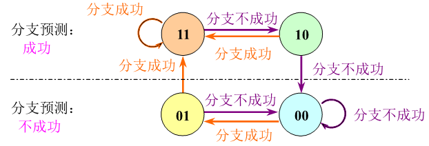

试着设计一种三位编码的历史分支表，实现当分支预测状态转移后，需要经过4次连续成功预测或不成功预测才能实现状态转移。

解：

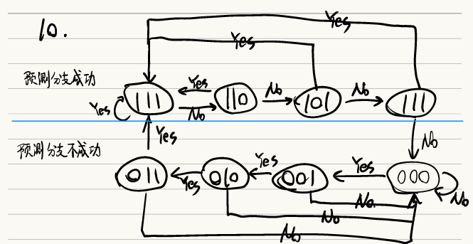

11、考虑考虑某两级cache，第一级为L1，第二级为L2，两级cache的全局不命中率分别是5%和2%，假设L2的命中时间是5个时钟周期，L2的不命中开销是100时钟周期，L1的命中时间是1个时钟周期，平均每条指令访存1.4次，不考虑写操作的影响。求：
（1）计算L2的局部不命中率
（2）计算L1的不命中开销是多少个时钟周期
（3）每次访存的平均访存时间是多少个时钟周期 
（4）每次访存的平均停顿时间是多少个时钟周期 
（5）每条指令的平均停顿时间是多少个时钟周期 

解：（1）L2的局部不命中率为40%

（2）L1的不命中开销为：$5 +  0.4 * 100 = 45$个时钟周期

（3）每次访存的平均访存时间是$1 + 0.05 * (5 + 0.4 * 100) = 3.25$个时钟周期

（4）每次访存的平均停顿时间是$0.05 * (5 + 0.4 * 100) = 2.25$个时钟周期

（5）每条指令的平均停顿时间是$1.4 * 2.25 = 3.15$个时钟周期