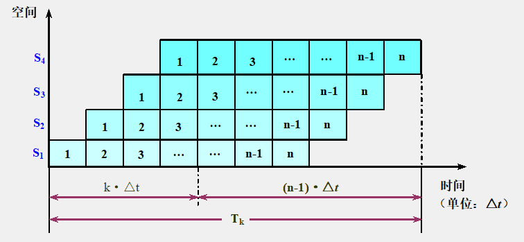
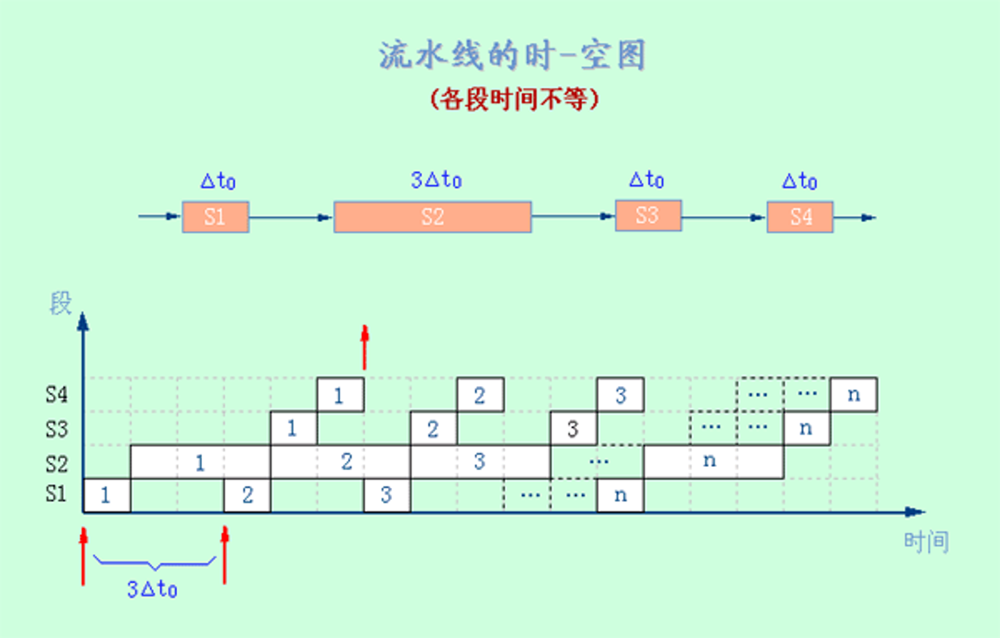

# 3.2 流水线的性能指标

## 3.2.1 吞吐率
**吞吐率**： 在单位时间内流水线所完成的任务数量或输出结果的数量。

$$
吞吐率TP = \frac{任务数n}{处理完成n个任务所用的时间T_k}
$$

### 1.各段时间相等$\Delta t$的流水线

$$
TP = \frac{n}{(k + n -1)\Delta t}
$$

$$
TP_{\text{max}} = \lim_{n \to \infty} \frac{n}{(k + n - 1)\Delta t} = \frac{1}{\Delta t}
$$

### 2.各段时间不完全相等的流水线

$$ TP = \frac{n}{\sum\limits_{i=1}^k \Delta t_i + (n-1) \times \max(\Delta t_1, \Delta t_2, \cdots, \Delta t_k)} $$

$$
TP_{max} = \frac{1}{\max(\Delta t_1, \Delta t_2, \cdots, \Delta t_k)}
$$

## 3.2.2 加速比
**加速比**：完成同样一批任务，不使用流水线所用的时间与使用流水线所用的时间之比。

$$
加速比S = \frac{不使用流水线所用时间T_s}{使用流水线后所用时间T_k}
$$

### 1.各段时间相等$\Delta t$的流水线
$$
S = \frac{nk}{k + n - 1}
$$

$$
S_{max} = \lim_{n \to \infty} \frac{nk}{(k + n - 1)} = k
$$

### 2.各段时间不完全相等的流水线
$$
S = \frac{n\sum\limits_{i=1}^k \Delta t_i}{\sum\limits_{i=1}^k \Delta t_i + (n-1) \times \max(\Delta t_1, \Delta t_2, \cdots, \Delta t_k)}
$$

### 3.2.3 效率
**效率**：流水线中的设备实际使用时间与整个运行时间的比值，即流水线设备的利用率。

### 1.各段时间相等$\Delta t$的流水线
$$
E = e_1 = e_2 = ... = e_k = \frac{n}{k + n - 1}
$$

$$
E_{max} = \lim_{n \to \infty}\frac{n}{n + k - 1} = 1
$$

### 2.各段时间不完全相等的流水线
$$
E = \frac{n\sum\limits_{i=1}^k \Delta t_i}{k[\sum\limits_{i=1}^k \Delta t_i + (n-1) \times \max(\Delta t_1, \Delta t_2, \cdots, \Delta t_k)]}
$$