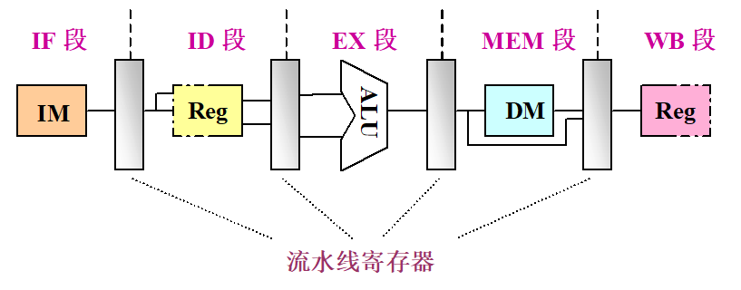
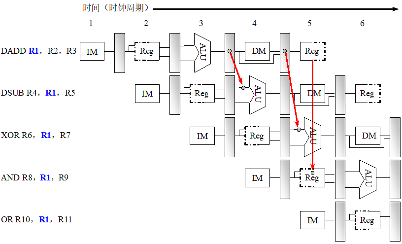
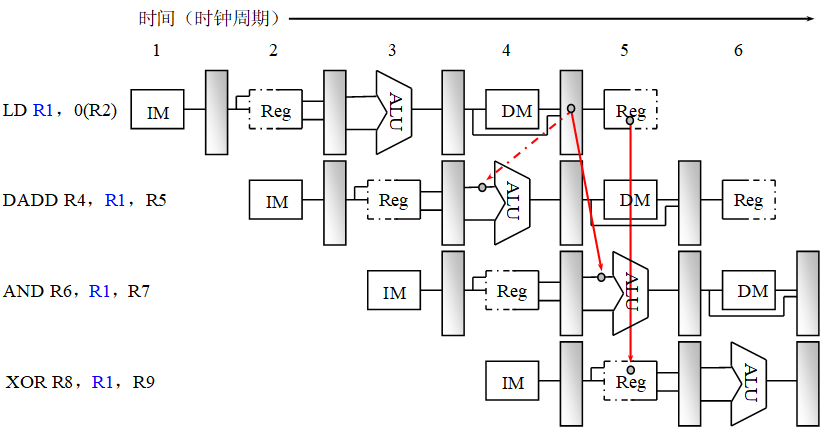
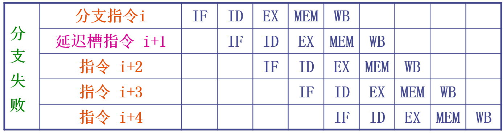
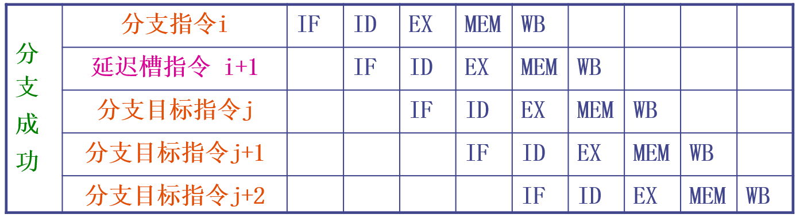
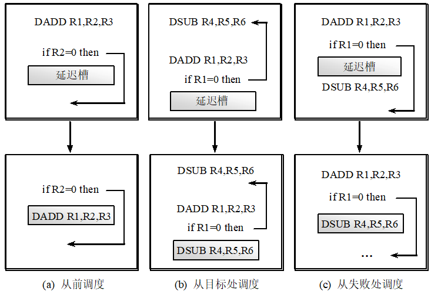

# 3.3 流水线的相关和冲突
## 3.3.1 经典5段流水线

一条指令的执行分为以下5个周期：


1.取指令周期（IF）
- IR <- Mem[PC]
- PC += 4

----

2.指令译码/读寄存器周期（ID）

- 译码
- 使用IR中的寄存器编号去访问通用寄存器组，读出所需的操作数

---

3.执行/有效地址计算周期（EX）

- 存储器访问指令： ALU把所指定的寄存器的内容与偏移量相加，形成用于访存的有效地址
- 寄存器-寄存器ALU指令：ALU按照操作码指定的操作对从通用寄存器中读出的数据进行运算。
- 寄存器-立即数ALU指令：ALU按照操作码指定的操作对从通用寄存器组中读取的第一操作数额立即数进行运算。
- 分支指令：ALU把偏移量和PC值相加，形成转移目标的地址。同时对在前一个周期读出的操作数进行判断，确定分支是否成功。
---

4.存储器访问/分支完成周期（MEM）

- 该周期只有load、store和分支指令
- load指令用上一个周期计算出的有效地址从存储器中读出响应的数据
- store指令把指定的数据写入这个有效地址所指示的存储器单元
- 分支指令“成功”将转移目标地址送入PC
---

5.写回周期（WB）

- ALU运算指令将数据写入通用寄存器组
- load指令将从存储器读取的数据写入通用寄存器组

## 3.3.2 相关与冲突
### 1.相关
**相关**是指两条指令之间存在某种依赖关系。如果两条指令相关，则它们就有可能不能在流水线中重叠执行或者只能部分重叠执行。

**(1)数据相关**：对于两条指令i和j，若指令j使用指令i产生的结果。数据相关具有传递性i->j->k。

**(2)名相关**：如果两条指令使用相同的**名**（指令所访问的寄存器或存储器单元的名称），但是他们之间并没有数据流动。
    
- 反相关：如果指令j写的 = 指令i读的名相同
- 输出相关：如果指令j写的名 = 指令i写的名
- 名相关的两条指令之间没有数据的传送，因此一条指令中的名改变了并不会影响另外一条指令的执行，因此可以采用**换名技术**改变指令中的操作数的名来消除名相关。
```
// 原代码
DIV.D F2, F6, F4
ADD.D F6, F0, F12 // DIV.D和ADD.D存在反相关
SUB.D F8, F6, F14

// 寄存器换名后代码
DIV.D F2, F6, F4
ADD.D S, F0, F12
SUB.D F8, S, F14
```

**(3)控制相关**：由分支指令引起
```
if p1 {
       S1；
      }；
S；
if p2 {
       S2；
      }；

```
- 与一条分支指令控制相关的指令不能被移到该分支之前，否则这些指令就不受该分支控制了。（对于上述的例子，then 部分中的指令不能移到if语句之前。）
- 如果一条指令与某分支指令不存在控制相关，就不能把该指令移到该分支之后。（对于上述的例子，不能把S移到if语句的then部分中。）

### 2.冲突
流水线冲突是指对于具体的流水线来说，由于相关的存在，使得指令流中的下一条指令不能在指定的时钟周期执行。

**(1)结构冲突**：因硬件资源满足不了指令重叠执行的要求而发生的冲突。
- 冲突发生原因：功能部件不完全流水；资源份数不够
- 解决方案：插入暂停周期；重复设置部件份数

**(2)数据冲突**：当指令在流水线中重叠执行时，因需要用到前面指令的执行结果而发生的冲突。
- 写后读冲突：在i写入之前j先去读。
- 写后写冲突：在i写入之前j先写，最后的写入结果是i的。
写后写冲突只发生在：A.流水线中不只一个段可以进行写操作。B.当先前某条指令停顿时，允许其后续指令继续前进。C.5段流水线不会发生写后写冲突。
- 读后写冲突：在i读之前，j先写，i读出的内容是错误的。
读后写冲突只发生在：A.有些指令的写结果操作提前了，而某些指令的读操作滞后了。B.指令被重新排序了。C.5段流水线不会发生写后写冲突。
- 可以通过**定向技术**（将计算结果直接送到其他指令需要它的地方）来减少数据冲突引起的停顿。


但是如下的代码无法通过定向技术解决：


```
LD    R1，0（R2）
DADD  R4，R1，R5 // 当LD指令还没将数据从DM中取出来时DADD指令的ALU已经需要数据进行计算
AND   R6，R1，R7
XOR   R8，R1，R9
```


**(3)控制冲突**：流水线遇到分支指令和其他会改变PC值的指令所引起的冲突。
- 执行分支指令的两种情况——成功（PC值改变为分支转移的目标地址）和不成功（PC值保持正常递增指向顺序的下一条指令）
- 处理分支指令的办法——给流水线主动带入3个始终周期的**分支延迟**（最简单的办法）

\\/

- 降低分支延迟的3种办法（通过编译器实现）：
```
   A.假定预测分支失败：允许分支指令后的指令继续在流水线中流动——若确定分支失败则将分支指令看做是普通指令，流水线正常流动；若确定分支成功则流水线把分支指令后执行的指令转换为空操作，并按照分支目地重新取指令执行。
   B.假定预测分支成功：假设分支转移成功，并从分支目标地址处取指令执行。前述5段流水线中，这种方法没有任何好处。这是因为等待分支目标地址时还需要等待3个周期，因此和计算完后再跳转没有任何区别。
   C.延迟分支：借助分支延迟槽中的指令“掩盖”流水线原来必须插入的暂停周期。
```



\\/

- 分支延迟指令的调度：



```
(a) 从前调度————在编译时将跳转语句提前进行计算。
(b) 从目标处调度————（有点类似于预测分支成功的思想，但是是通过编译器将目标地址的代码提前移动到分支延迟槽处等待被调度）
(c) 从失败处调度————（有点类似于预测分支失败的思想，但是是通过编译器将顺序的下一条指令移动到分支延迟槽处等待被调度）
```