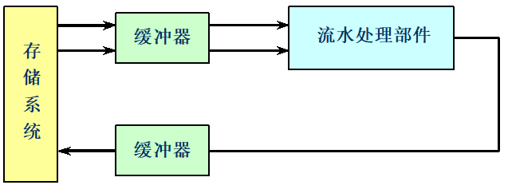
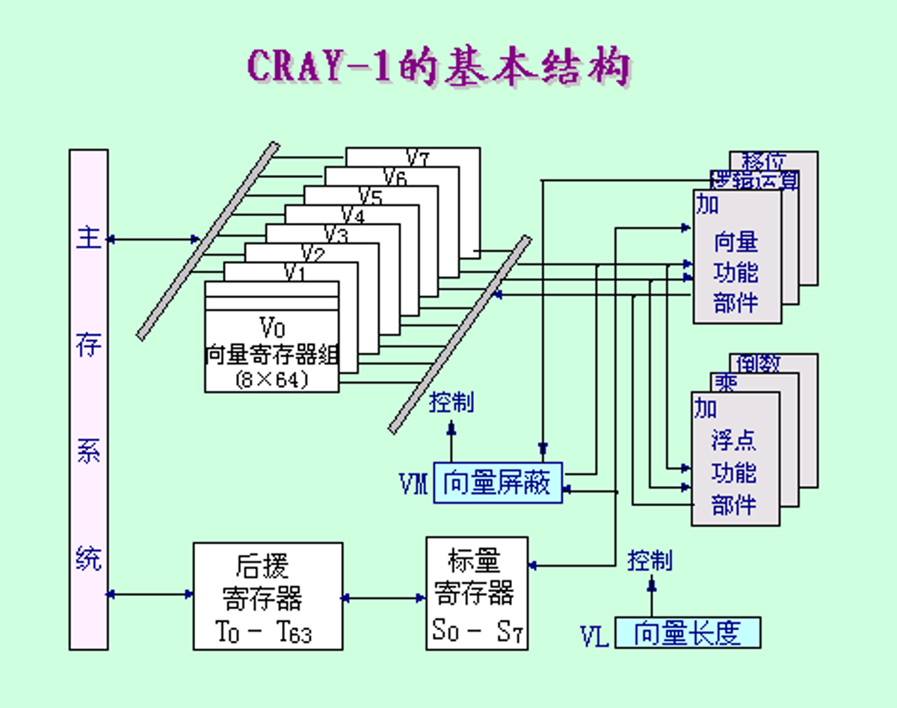
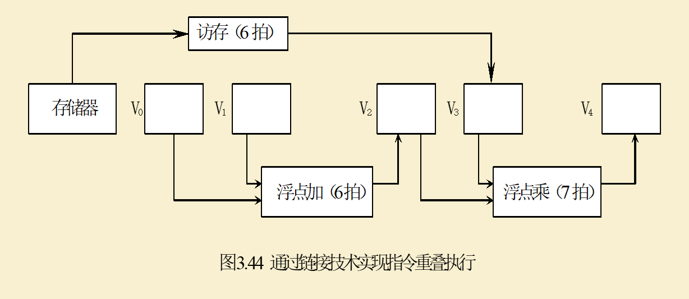

# 3.5 向量处理机
## 3.5.1 向量处理方式
**1.横向（水平）处理方式**：向量计算是按行的方式从左到右横向地进行。（一行一行的计算，并不适合并行处理）

**2.纵向（垂直）处理方式**：向量计算是按列的方式从上到下纵向地进行。这种计算方式要求处理机有**存储器-存储器结构**


**纵横（分组）处理方式：将向量分成若干组，组内按纵向方式处理，依次处理各组。


## 3.5.2 提高向量处理机性能的方法
### 1.设置多个功能部件，使它们并行工作
（如上图CRAY-1处理机所示，设置了4组12个单功能流水部件）

### 2.采用链接技术，加快一串向量指令的执行
具有**先写后读相关**的两条指令，在不出现功能部件冲突和源向量冲突的情况下，可以把功能部件链接起来进行流水处理，以达到加快执行的目的。

```
在CRAY-1上用链接技术进行向量运算: D=A×（B+C）。假设向量长度N≤64，向量元素为浮点数，且向量B、C已存放在V0和V1中。把向量数据元素送往向量功能部件以及把结果存入向量寄存器需要一拍时间，从存储器中把数据送入访存功能部件需要一拍时间。
解：指令可以被写为：
V3 <- 存储器    // 访存取向量A
V2 <- v0 + v1   // 向量B和向量C进行浮点加
V4 <- V2 * V3   // 浮点乘，结果存入V4
```

```
在采用串行的方式计算，则需要花的节拍数为：
    (1+6+1+n-1)+(1+6+1+n-1)+(1+7+1+n-1) = 3n+22
前两条指令并行执行，然后再串行执行第3条指令，则执行时间为：
    (1+6+1+n-1)+(1+7+1+n-1) = 2n+15
第1、2条向量指令并行执行，并与第3条指令链接执行:
    (1+6+1)+(1+7+1)+n-1 = n+16
```

### 3.采用循环开采技术，加快循环的处理
假设一个向量处理机能够同时处理的向量长度为L，而需要处理的一个向量长度为N，则需要将这个向量分为$\left\lceil \frac{N}{L} \right\rceil$组进行循环计算。
### 4.采用多处理机系统，进一步提高性能