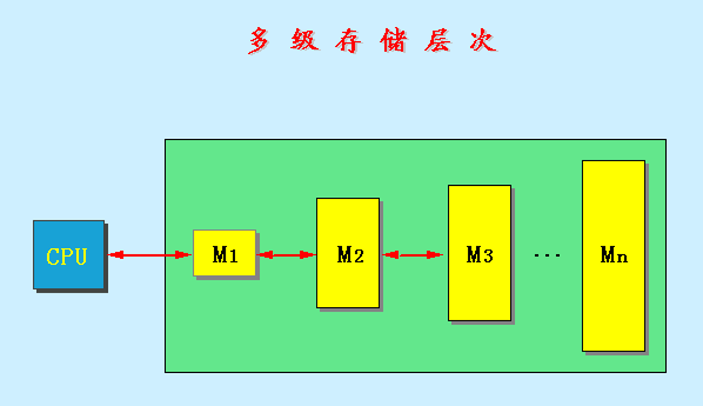

# 5.1 存储器的层次结构
## 5.1.1 存储器的分层结构

## 5.1.2 存储器的层次的性能参数
### 1.命中率H和失效率F
假设一个存储器系统分为Cache和Memory两级存储结构，则CPU访问存储系统时对于Cache的命中率为：
$$
H = \frac{N_C}{N_C + N_M}
$$
其中$N_C$代表访问Cache的次数，$N_M$代表访问Memory的次数。则失效率为：
$$
F = 1 - H
$$

### 2.平均访问时间$T_A$
- 当直接在Cache命中时，则访问时间为$T_{A}$就是访问Cache时所耗的时间$T_{A1}$。
- 当未在Cache命中，需要到Memory访问内容时，则访问时间为$T_{A} = T_{A1} + T_M$。

综合命中率H，则平均访问时间为：
$$
T_A = H \times T_{A1} + (1 - H) \times (T_{A1} + T_M) 
$$
即：
$$
T_A = T_{A1} + (1 - H) \times T_M
$$
