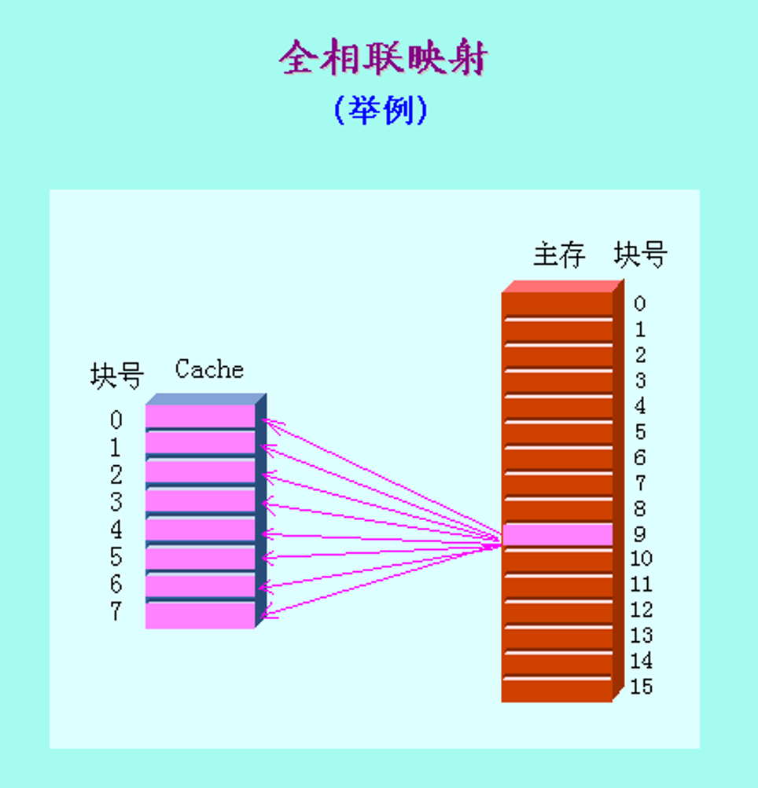
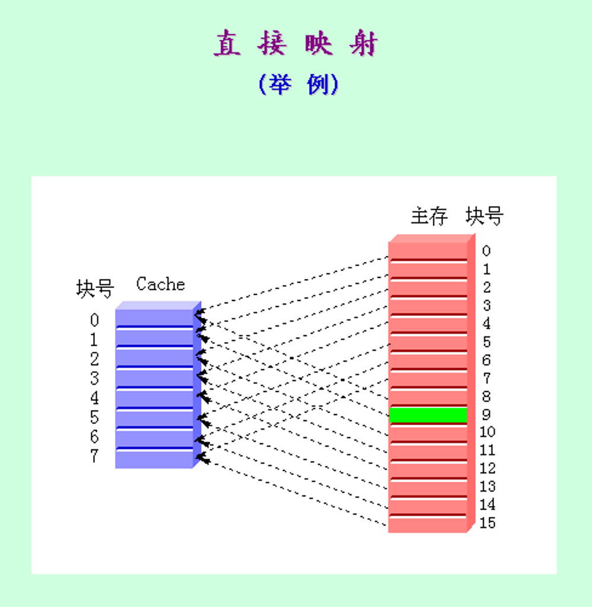
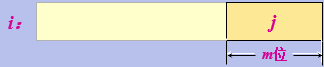
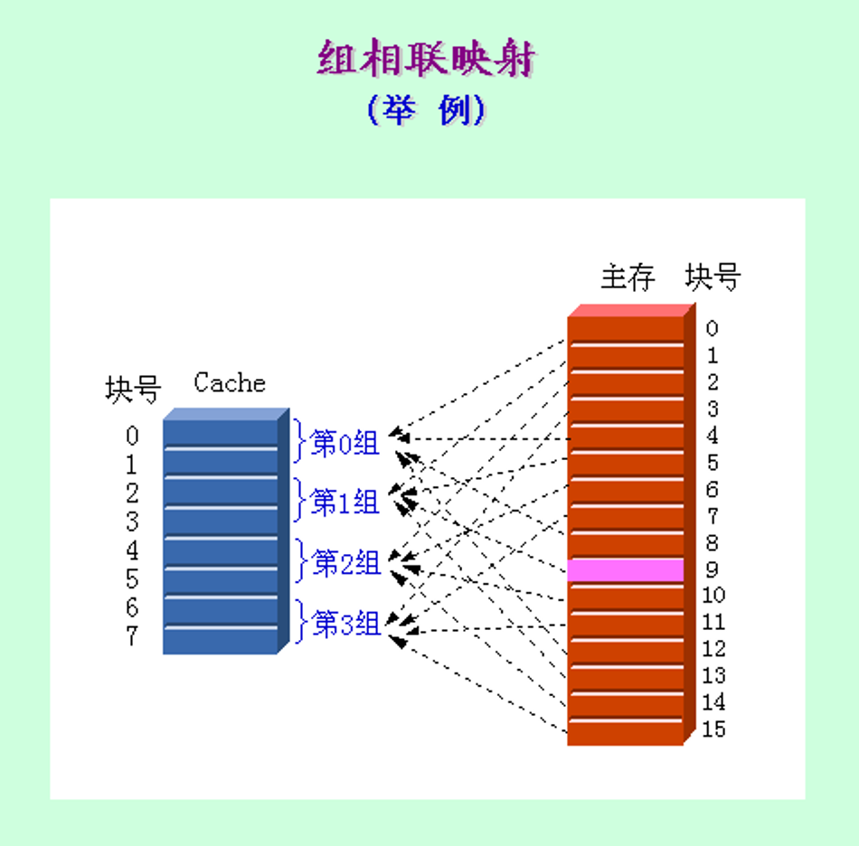
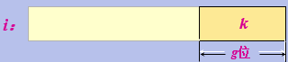

# 5.2 Cache的基本知识
## 5.2.1 映象规则
### 1. 全相联映象
- 主存中的任意一块可以放置到Cache中的任意一个位置。
- 特点：空间利用率最高，冲突概率最低，实现最复杂。

### 2. 直接映象

- 主存中的每一块只能被放置到Cache中唯一的一个位置。
- 特点：空间利用率最低，冲突概率最高，实现最简单。
- 对于主存(M是Cache的块数)的第i块，若它映象到Cache的第j块，则：
$$
j = i mod (M)   
$$
设$M = 2^m$，则当表示为二进制数时，j实际上就是i的低m位：

### 3. 组相联映象

- 主存中的每一块可以被放置到Cache中唯一的一个组中的任何一个位置。
- 组相联是直接映象和全相联的一种折中。
- 对于Cache的第i块，若它映象到第k组，则：
$$
k = i mod (G)
$$
设$G = 2^g$，则当表示为二进制数时，k实际就是i的第g位：

## 5.2.3 替换算法
### 1.随机法
### 2.先进先出FIFO
### 3.最近最少使用法LRU

## 5.2.4 写回策略
### 1. 写直达法
- 执行写操作时不仅写入Cache，也同步写入下一级存储器。
- **优点**：易于实现，一致性好。
- **缺点**：在进行写操作时CPU必须等待，直到写操作结束，这种现象称之为**CPU写停顿**。减少CPU写停顿的优化技术——写缓冲器。
- 采用**写分配（写时取）**——写失效时，先把所写单元所在的块调入Cache，再行写入。

### 2. 写回法
- 执行写操作时，只写入Cache。当且仅当Cache中相应的块被替换时才写回主存。
- 需要设置修改位来标志是否被修改。
- **优点**：速度快，所使用的存储器带宽较低。
- 采用**不按写分配（绕写法）**——写失效时，直接写入下一级存储器而不调块。