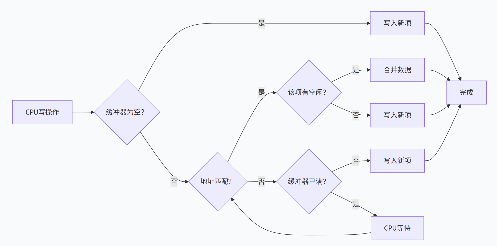

# 5.4 减少Cache失效开销
## 5.4.1 采用两级Cache
1. 第一级Cache小二快，第二级Cache容量大。
2. 性能分析：
$$
平均访存时间 ＝ 命中时间L_1＋失效率L_1×失效开销L_1
$$
$$
失效开销L_1 = 命中时间L_2+失效率L2\times失效开销L_2
$$
3. 局部失效率 = 该级Cache的失效次数 / 到达该级Cache的访问次数
4. 全局失效率 = 该级Cache的失效次数 / CPU发出的访存的总次数

5. 对于L1的全局失效率，有：
$$
全局失效率_{L_1} = 局部失效率_{L_1}
$$

$$
全局失效率_{L_2} = 局部失效率_{L_1} \times 局部失效率_{L_2}
$$

6. 对于第二级Cache，有：
```
    A.在第二级Cache比第一季Cache大得多的情况下，两极Cache的全局失效率和容量与第二级Cache相同的单级Cache的失效率非常接近。
    B.评价第二级Cache需要使用全局失效率。
```

## 5.4.2 让读失效优先于写
- **核心思想**：CPU执行写操作时，可以现将写回的数据放入写缓冲器，再慢慢写入存储中。CPU就无需等待写操作的完成才去执行下一条指令。
1. **后行写数缓冲器**：写缓冲器进行的写入操作是滞后进行的。
```
1）SW  R3, 512（R0）     ；M[512]←R3   （Cache索引为0）
2）LW  R1, 1024（R0）    ；R1←M[1024]  （Cache索引为0）可优先于1）
3）LW  R2, 512（R0）     ；R2←M[512]   （Cache索引为0）不可优先于1）
```
2. 针对读失效的处理——推迟对读失效的处理（缺点是增加开销）和检查写缓冲区内容

## 5.4.3 写缓冲合并
- 依靠写缓冲来减少对下一级存储器写操作的时间。
- 如果写缓冲器为空，就把数据和响应地址写入该缓冲器。从CPU的角度来讲该写操作就完成了。
- 如果写缓冲器中已经有了待写入的数据，就把这次要写入的数据和写缓冲器中已有的所有地址进行匹配。若有匹配且对应的位置是空闲的，则将这次要写入的数据与该项进行合并，即**写缓冲合并**。
- 如果写缓冲器满且又无能进行合并的项，则等待。



## 5.4.4 请求字处理技术
- **核心思想**：当CPU需要的数据不在Cache中（即发生“Cache缺失”）时，系统会从主存中调入一个包含所需数据的数据块。在这个数据块里，只有一个字是CPU当前立刻就要用到的，这个字就是**请求字**。
- 应尽早把请求字发送给CPU：**尽早重启动**：一旦所需请求从主存到达Cache，就立刻把它发给CPU，让CPU先执行。与此同时，系统继续传输数据块中剩余的其他字。**请求字优先**：在传输数据块时，调整传输顺序，强制把包含“请求字”的那部分数据排在第一位发送。

## 5.4.5 非阻塞Cache技术
- **核心思想**：允许CPU在Cache缺失期间继续执行其他指令，而不是让流水线完全停顿等待数据返回。