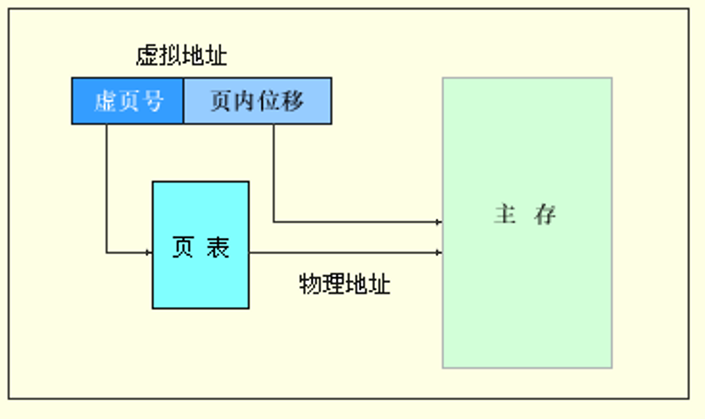
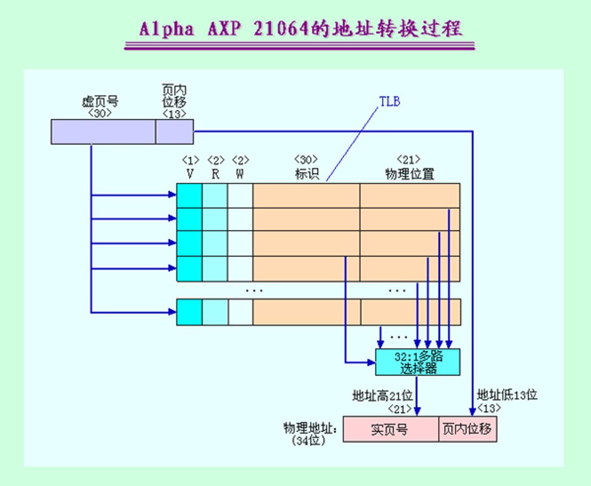

# 5.7 虚拟存储器
1. **核心思想**：虚拟存储器是一种计算机内存管理技术，它将计算机系统中的物理内存和磁盘空间结合起来，形成一个虚拟的内存空间，使得应用程序可以访问比物理内存更大的内存空间。

2. **页表**：通过页表先找到页，在使用页内偏移地址找到最终对应的实际物理内存。


3. **快表**——地址变换缓冲器TLB：本质上是一个专门用于缓存虚拟地址到物理地址转换关系的小型、高速硬件缓存，其缓存的正是频繁被访问的页表项。TLB的设计完全建立在程序运行的局部性原理之上（时间局部性和空间局部性）。TLB将最近最常使用的页表项保存在容量虽小但访问速度极快的硬件结构中，从而使得绝大多数地址转换可以直接在TLB中完成，避免了每次访存都去查询存放在内存中的页表。


4. 页表是存储在内存中的完整地址映射表，快表是页表的一个高速缓存，存储在CPU内部用于加速地址转换。

5. 
```
CPU 发出虚拟地址
       ↓
  ① 先查 TLB（快表）
       ↓
    ┌─────────────┐
    │ TLB 命中？   │
    └─────────────┘
       ↓          ↓
      是          否
       ↓          ↓
  直接获得    ② 查页表（内存）
  物理地址     （需要访问内存）
       ↓          ↓
       ↓     获得物理地址
       ↓          ↓
       ↓     ③ 更新 TLB（装入新页表项）
       ↓          ↓
       └──────┬───┘
              ↓
         访问 Cache/主存
```