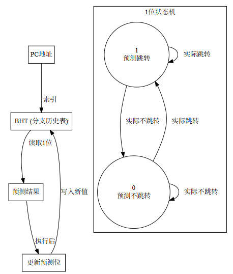
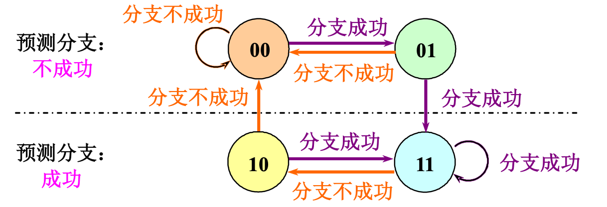
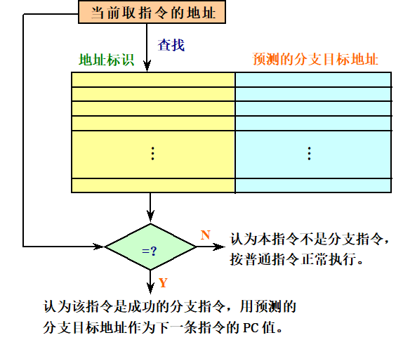
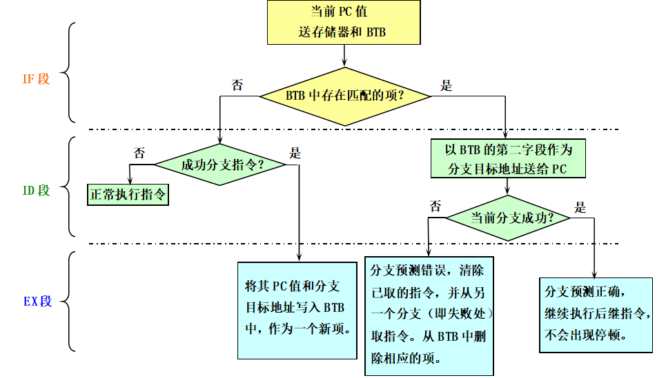
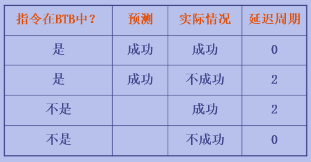

# 4.3 动态分支预测技术
1.**动态分支预测**：在程序运行时，根据分支指令过去的表现来预测其姜来的行为。

2.采用动态分支预测技术的目的：
- 预测分支是否成功
- 尽快找到分支目标地址（或指令），以避免控制相关造成流水线停顿

## 4.3.1 采用分支历史表BHT
- 最简单的动态分支预测方法
- 使用BHT来记录分支指令最近一次或几次的执行情况，并依据此进行预测。
- 采用1个预测位的分支预测：在BHT中使用1位二进制位来记录分支指令最近一次的历史。效果较差

- 采用2个预测位的分支预测：在BHT中使用2位二进制位来记录分支指令最近一次的历史。**两位分支预测的性能与n位（n>2）分支预测的性能差不多。**

- BHT方法有效的场景：1.判定分支是否成功所需的时间大于确定分支目标地址所需的时间。2.对于之前5段流水线，由于判定分支是否成功和计算分支目标地址都是在ID段完成，所以BHT不会给该流水线带来好处。

## 4.3.2 采用分支目标缓冲器BTB
- 专门的硬件实现的一张表格，左边放当前取值指令的地址，右边放该条指令预测的分支目标地址。

## 4.3.3 基于硬件的前瞻执行
1.前瞻执行的基本思想：
- 对分支指令的结果进行猜测，并且假设这个猜测**总是对的**，然后按这个猜测结果取、流出和执行后续的指令。
- 执行指令的结果不直接写回寄存器或者存储器，而是西二**再定序缓冲器ROB**。
- 等到相关指令得到“确认”（即确认应该执行的）之后，将结果写入寄存器或存储器。
- 允许指令乱序执行，但必须顺序确认；在指令被确认之前，不允许它进行不可恢复的操作。

2.基于硬件的前瞻执行结合了3种思想：
- **动态分支预测**：用来选择后续执行的指令。
- 在控制相关的结果尚未出来之前，**前瞻性地执行后续指令**。
- 用**动态调度**对基本块的各种组合进行跨基本块的调度。

3.ROB的组成：
- **指令类型**：用于表明该指令是分支指令、store指令还是寄存器操作指令。
- **目标地址**：给出指令执行结果应该写入的目标寄存器号或者存储器单元位置。
- **数据值字段**：用来保存指令前瞻执行的结果，直到指令得到确认。
- **就绪字段**：指出指令是否已经完成执行并且数据已就绪。

4.Tomasulo算法中保留站的换名功能是由ROB完成的。