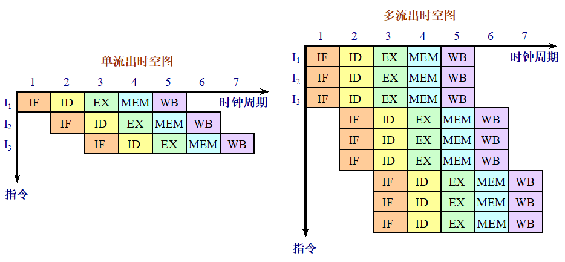
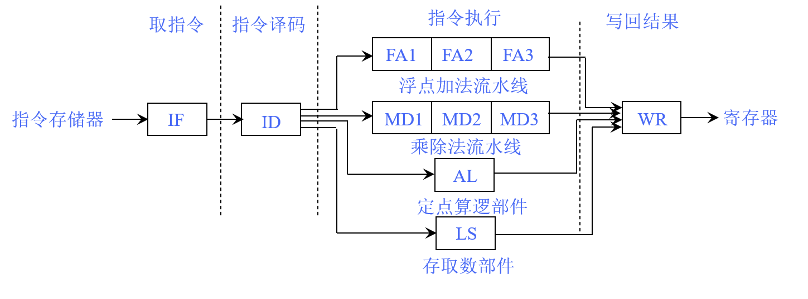
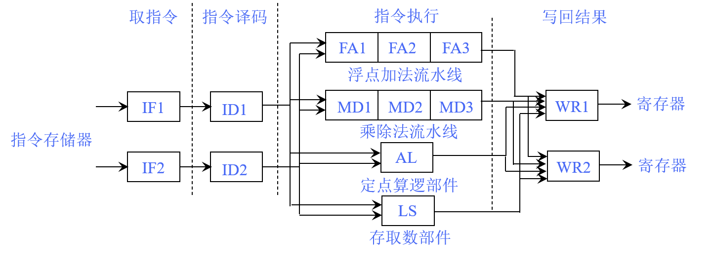

# 4.4 多指令流出技术

单发射指令流水线：

双发射指令流水线：

## 4.4.1 两种多流出处理机

### 1.超标量流水机
- 在每个时钟周期流出的指令条数不固定，依据代码的具体情况而定。
- 设这个上限为n，就称该处理机为n流出。
- 可以通过编译器进行静态调度，也可以基于Tomasulo算法进行动态调度。

### 2.超长指令字VLIW
- **在每个时钟周期流出的指令条数是固定的**，这些指令构成一条长指令或者一个指令包。
- 指令包中，指令之间的并行性是通过指令显示地表示出来的。
- **指令调度是由编译器静态完成的**。

### 3.超标量处理机与VLIW处理机相比有两个优点
- 超标量结构对程序员透明，因此处理机能够自己检测出下一条指令能否流出，从而不需要重新排列指令来满足指令的流出。
- 即使没有经过编译器针对超标量结构进行调度优化的代码或者旧的编译器生成的代码也可以运行。

## 4.4.2 基于静态调度的多流出技术
### 1.流出包和冲突检测
通过**将指令流出过程分段，以流水线的方式**使用流出部件检测流出的指令是否存在结构冲突或数据冲突。

### 2.超标量处理机的性能瓶颈
随着指令流出速率的提高，流出段可能成为指令流水线的瓶颈。

### 3.指令执行和冲突逻辑
在简单的超标量处理机中，冲突检测相对简单。然而，当整数型指令是浮点load、store或move指令时，可能会出现新的冲突，如浮点寄存器 端口争用或新的RAW冲突。这要求增加额外的硬件和逻辑电路来处理这些情况。

## 4.4.3 基于动态调度的多流出技术
### 1.动态调度的工作原理
动态调度技术利用硬件机制，如Tomasulo算法，来实现指令的乱序执行和动态冲突检测。这种方法允许处理器在每个时钟周期内流出多条指令，即使这些指令之间存在潜在的数据依赖关系。关键在于动态地管理保留站（Reservation Stations）和重排序缓冲区（Reorder Buffers）来维护指令的正确执行顺序和数据一致性。

### 2.双流出超标量流水线
**在双流出超标量流水线的设计中，可以同时流出一条整数指令和一条浮点指令**。这种设计通过将整数和浮点操作的表结构分离，实现了对两种类型指令的并行处理，从而在不增加硬件复杂度的前提下提高了性能。

### 3.性能考量
动态调度的多流出技术虽然提高了指令流出率，但实际的执行效率受到多种因素的限制，包括：
- 工作负载不平衡：整数和浮点部件之间可能存在工作负载的不平衡，导致资源未被充分利用。
- 控制开销：循环控制指令和辅助指令可能占据过多的指令流出带宽，降低了有效指令的流出率。
- 控制相关性：分支指令的存在可能导致流水线暂停，等待分支预测的确认，从而影响后续指令的流出和执行。

### 4.优化策略
- 增加硬件资源：通过增加浮点加法器等硬件资源，分离ALU功能和地址计算功能，减少资源竞争。
- 减少控制开销：优化循环控制结构，减少辅助指令的数量，以提高指令流出的有效性。
- 采用前瞻执行技术：利用前瞻执行技术来减少控制相关性的影响，提前处理分支指令，减少因分支预测错误导致的性能损失。